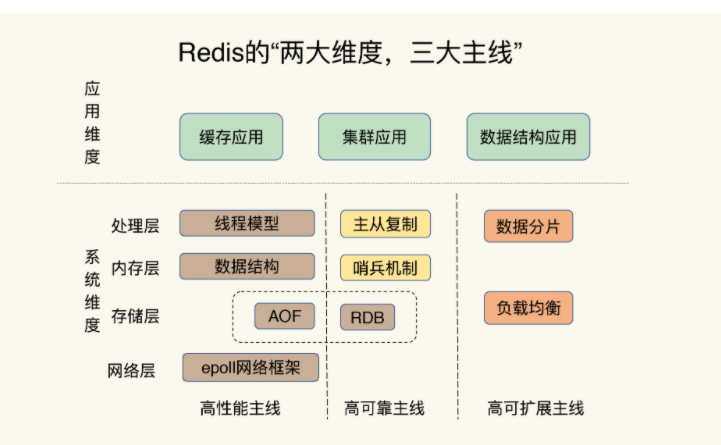
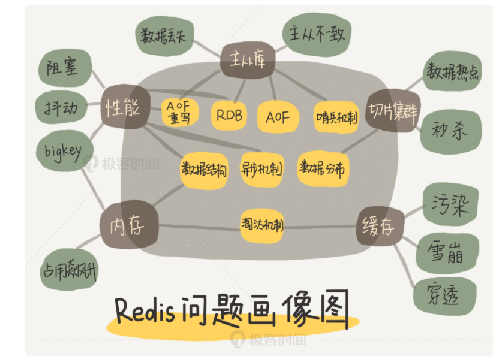

# **第一节 Redis 不得不去掌握的关键**

## **1、为什么要学习Redis**

作为键值数据库，Redis 的应用非常广泛, 如果你是后端工程师，我猜你出去面试，八成都会被问到与它**相关的性能问题**。

比如说，为了保证数据的可靠性，Redis 需要在磁盘上读写 AOF 和 RDB，但在高并发场景里，这就会直接带来两个新问题：

* **一个是写 AOF 和 RDB 会造成 Redis 性能抖动**，
* **一个是 Redis 集群数据同步和实例恢复时，读 RDB 比较慢，限制了同步和恢复速度**。

> **RDB：Redis Database 默认开启，指定时间内执行指定次数写操作，将内存中的数据写入磁盘**。
> 
>  **AOF：Append Only File 需要手动开启，完整性更高，默认每秒将写操作日志追加写入到磁盘**。

对于Redis 不同公司的“玩法”却不太一样，比如说，**有做缓存的，有做数据库的，也有用做分布式锁的**。不过，他们遇见的“坑”，总体来说集中在四个方面：

* CPU 使用上的“坑”，例如数据结构的复杂度、跨 CPU 核的访问；
* 内存使用上的“坑”，例如主从同步和 AOF 的内存竞争；
* 存储持久化上的“坑”，例如在 SSD 上做快照的性能抖动；
* 网络通信上的“坑”，例如多实例时的异常网络丢包。

## **2、怎样学习Redis**

**两大维度，三大主线**

* **两大维度**： 系统维度和应用维度
* **三大主线**： 也就是指高性能、高可靠和高可扩展（可以简称为“三高”）。

### **2-1 三大主线**

* **高性能主线，包括线程模型、数据结构、持久化、网络框架；**
* **高可靠主线，包括主从复制、哨兵机制；**
* **高可扩展主线，包括数据分片、负载均衡**。

### **2-2 Redis 的问题画像图**

举个例子，如果你遇到了 Redis 的响应变慢问题

对照着这张图，你就可以发现，这个问题和 Redis 的性能主线相关，而性能主线又和数据结构、异步机制、RDB、AOF 重写相关。找到了影响的因素，解决起来也就很容易了。