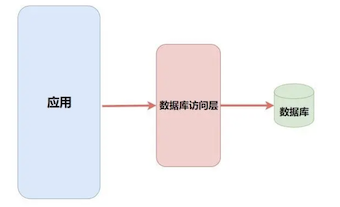
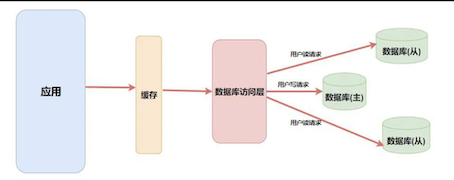
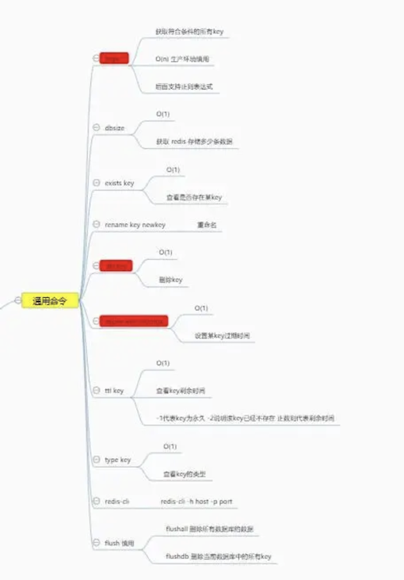
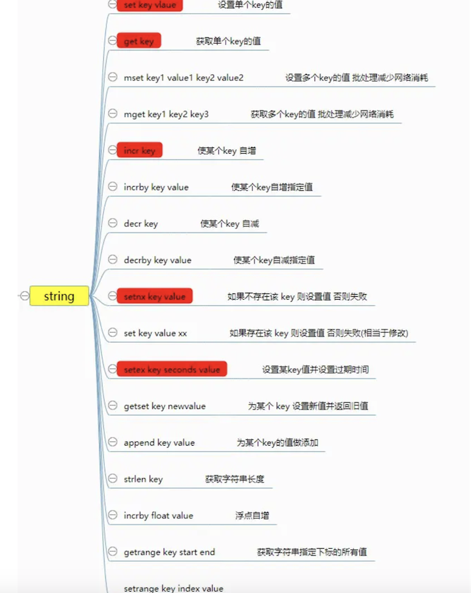
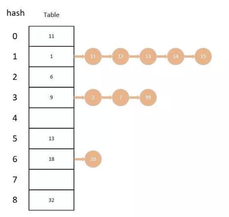
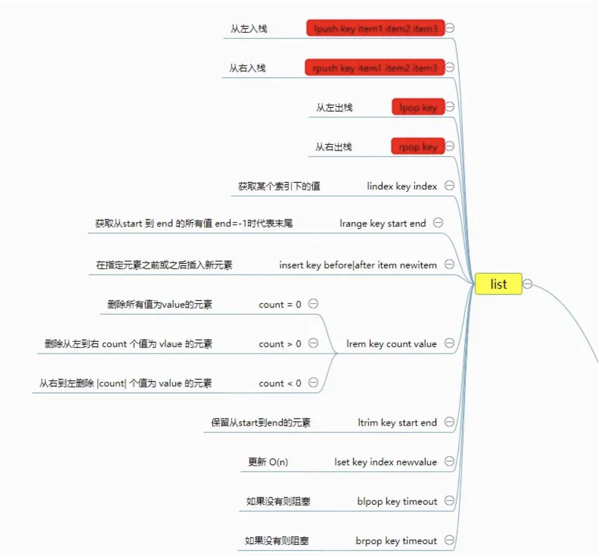
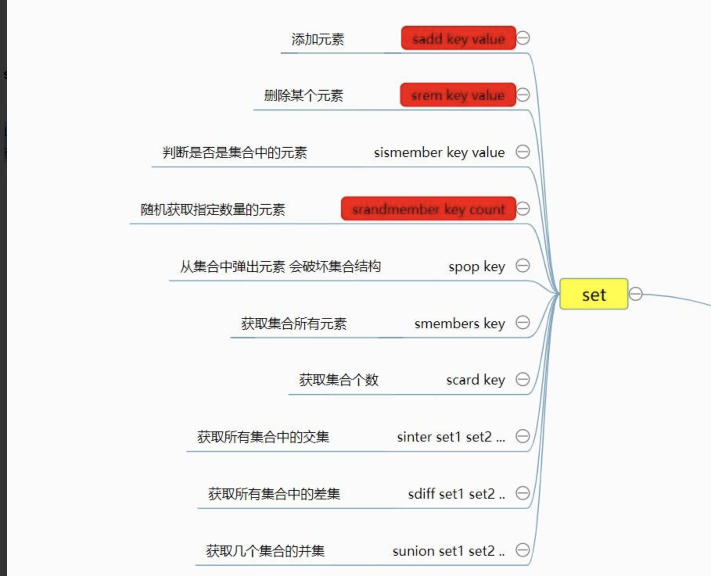
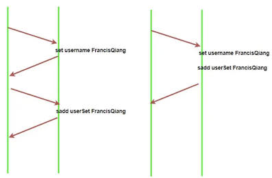
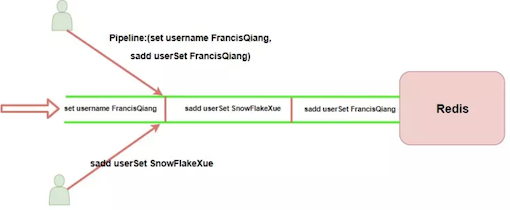

# **Redis 基础你掌握多少了？来个查漏补缺**


`Redis` 是开源，内存中的数据结构存储系统，它可以用**作数据库、缓存和消息中间件**。

它支持多种类型的数据结构，如字符串 `strings`，散列` hashes`，列表 `lists`，集合 `sets`，有序集合 `sorted sets` 与范围查询， `bitmaps`，`hyperloglogs` 和 地理空间（geospatial）索引半径查询。

**<span style="color:red">Redis 还内置了复制（`replication`），LUA脚本（`Lua scripting`）， LRU驱动事件（`LRU eviction`），事务（`transactions`）和不同级别的磁盘持久化（`persistence`），并通过 `Redis` 哨兵（`Sentinel`）和自动分区（`Cluster`）提供高可用性（`high availability`）</span>**。

## **NoSQL 是什么**

我们知道 Redis 是一种非关系型数据库 NoSQL。而为什么出现 NoSQL？NoSQL 又是什么呢？

单机数据库的年代

在一个网站访问量不大的时候，我们使用一个数据库就足以应对流量请求。



**缓存 + 拆分**

随着访问量的上升，一个数据库已经不能满足我们的需求了。为了更高的性能，我们在中间加上了一个缓存层并且将数据库做了**集群、结构优化和读写分离**。



而这里的缓存就是 `NoSQL`，当然做缓存也只是 `NoSQL` 的一种功能，就像 `Redis` 并不仅仅有缓存这一种功能。

比如它还能实现 简单的消息队列，解决 `Session` 共享，计数器，排行榜，好友关系处理 等等功能，可见 `Redis` 是一个非常强大工具，让我们来学习它吧！

### **Redis 通用命令**

首先我们抛开数据类型来讲关于 Redis 的通用命令。



**操作 `key` 和` value`**

`Redis` 是一种 `key value` 存储的缓存数据库，所有的数据都有一个自己唯一的`key`。

这里为了方便演示，我使用了字符串相关的设置命令。

* `keys [pattern]` 获取符合要求的所有`key`。时间复杂度为 `O(n)`，一般在生产环境中不使用，因为**`Redis` 是单线程**的，**执行耗时的任务会阻塞其他任务**。一般会使用 `scan` 命令替代（非阻塞）。

```
$ kubectl exec -it redis redis-cli -n redis
127.0.0.1:6379> keys *
(empty list or set)
127.0.0.1:6379> set username jxi
OK
127.0.0.1:6379> keys *
1) "username"
127.0.0.1:6379> set username1 jane
OK
127.0.0.1:6379> keys *
1) "username1"
2) "username"
127.0.0.1:6379> keys u*
1) "username1"
2) "username"
127.0.0.1:6379> keys username1*
1) "username1"
```

* `dbsize` 获取当前存储数据个数。
* `exists key` 判断是否存在该key
* `del key` 删除指定数据
* `type key` 获取指定key的数据类型
* `rename key newkey` 重命名

```
127.0.0.1:6379> dbsize
(integer) 2
127.0.0.1:6379> exists username
(integer) 1
127.0.0.1:6379> exists user
(integer) 0
127.0.0.1:6379> del username
(integer) 1
127.0.0.1:6379> keys *
1) "username1"
127.0.0.1:6379> type username1
string
127.0.0.1:6379> rename username1 username
OK
127.0.0.1:6379> keys *
1) "username"
```

### **过期时间**

`Redis` 中很多数据都是用来作为**缓存数据**的，而作为缓存就需要有过期时间，在 `Redis` 中提供了很强大的**过期时间**设置功能。

* `expire key seconds` 为某个 `key` 设置过期时间。
* `ttl key` 查看某个 key 的剩余时间，返回正数代表剩余的时间，**<span style="color:red">`-1`代表永久，`-2`代表已过期或不存在。</span>**

```
127.0.0.1:6379> expire username 10
(integer) 1
127.0.0.1:6379> ttl username
(integer) 6
127.0.0.1:6379> ttl username
(integer) 4
127.0.0.1:6379> ttl username
(integer) 3
127.0.0.1:6379> ttl username
(integer) 2
127.0.0.1:6379> ttl username
(integer) 1
127.0.0.1:6379> ttl username
(integer) -2

127.0.0.1:6379> set ttl 123
OK
127.0.0.1:6379> ttl ttl
(integer) -1
```

## **Redis 的五种基本数据类型**

在上面我说到了很多 `Redis` 作为缓存能实现的其他功能，比如计数器，排行榜，好友关系等，这些实现的依据就是靠着 `Redis` 的数据结构。在整个 `Redis` 中一共有五种基本的数据结构(还有些高级数据结构以后会讲)，他们分别是 **字符串`strings`， 散列 `hashes`， 列表 `lists`， 集合 `sets`， 有序集合` sorted sets`**。

### **字符串 string**

在绝大部分编程语言中都有 `String` 字符串类型，对于作为数据库的 `Redis` 也是必不可少的。




* `set key value` 设置值
* `get key` 获取某个`key`的值
* `mset key1 value1 key2 value2` 批量设置并且是**原子**的，可以用来减少网络时间消耗
* `mget key1 key2 `批量获取并且是原子的，可以用来减少网络时间消耗

```
127.0.0.1:6379> set username1 Jane
OK
127.0.0.1:6379> set username2 Jacob
OK
127.0.0.1:6379> del username2
(integer) 1
127.0.0.1:6379> mset username2 Jacob username3 Jason
OK
127.0.0.1:6379> get username1
"Jane"

127.0.0.1:6379> mget username1 username2 username3
1) "Jane"
2) "Jacob"
3) "Jason"
```

* `incr key` 自增指定key的值
* `decr key` 自减指定key的值
* `incrby key value `自增指定数值
* `decrby key value` 自减指定数值
* `incrbyfloat key floatvalue` 增加指定浮点数,前面几个操作就可以用来实现**计数器**的功能。

```
127.0.0.1:6379> set counter 1
OK
127.0.0.1:6379> incr counter
(integer) 2
127.0.0.1:6379> decr counter
(integer) 1
127.0.0.1:6379> get counter
"1"
127.0.0.1:6379> incrby counter 99
(integer) 100
127.0.0.1:6379> get counter
"100"
127.0.0.1:6379> decrby counter 100
(integer) 0
127.0.0.1:6379> get counter
"0"
127.0.0.1:6379> incrbyfloat counter 0.5
"0.5"
127.0.0.1:6379> get counter
"0.5"
```

* `setnx key value` **如果不存在该`key`则可以设置成功，否则会失败**，<span style="color:red">**加上过期时间限制，则是redis实现分布式锁的一种方式**（后面会提到）</span>。
* **`set key value xx` 与前面相反，如果存在则设置成功**，否则失败(相当于更新操作)

```
27.0.0.1:6379> keys *
1) "username2"
2) "counter"
3) "ttl"
4) "username3"
5) "username1"
127.0.0.1:6379> setnx username1 tt
(integer) 0
127.0.0.1:6379> get username1
"Jane"

127.0.0.1:6379> setnx username4 john
(integer) 1
127.0.0.1:6379> get username4
"john"

127.0.0.1:6379> set username5 jack xx
(nil)
127.0.0.1:6379> get username5
(nil)
127.0.0.1:6379> set username4 jack xx
OK
127.0.0.1:6379> get username4
"jack"
```

* `getset key newvalue` 设置新值并返回旧值
* `append key value` 为原本内容追加内容
* `strlen key` 获取字符串长度
* `getrange key start end` 获取指定范围的内容
* `setrange key index value` 设置指定范围的内容

```
127.0.0.1:6379> keys *
1) "username4"
2) "username2"
3) "counter"
4) "ttl"
5) "username3"
6) "username1"

127.0.0.1:6379> get username1
"Jane"

127.0.0.1:6379> getset username1 JaneDoe
"Jane"
127.0.0.1:6379> get username1
"JaneDoe"

127.0.0.1:6379> append username1 love
(integer) 11
127.0.0.1:6379> get username1
"JaneDoelove"

127.0.0.1:6379> strlen username1
(integer) 11

127.0.0.1:6379> getrange username1 0 5
"JaneDo"
127.0.0.1:6379> setrange username1 5 s
(integer) 11
127.0.0.1:6379> get username1
"JaneDselove"
```

* `setex key seconds value `设置值且设置过期时间
* `set key value ex seconds nx` 为不存在的`key`设置值且设置过期时间，**分布式锁的实现方式**。

```
127.0.0.1:6379> keys *
1) "username4"
2) "username2"
3) "counter"
4) "ttl"
5) "username3"
6) "username1"
127.0.0.1:6379> setex user 10 jac
OK

127.0.0.1:6379> ttl user
(integer) 6

127.0.0.1:6379> ttl user
(integer) 2

127.0.0.1:6379> set user1 snow ex seconds nx
OK
127.0.0.1:6379> ttl user1
(integer) 5
127.0.0.1:6379> ttl user1
(integer) 2

127.0.0.1:6379> set username1 snow ex 10 nx
(nil)
```

### **hash**


其实我们可以理解 `hash` 为 **小型Redis **，`Redis `在底层实现上和 `Java` 中的` HashMap `差不多，都是使用 **数组 + 链表** 的二维结构实现的。



不同的是，在` Redis` 中字典的值**只能是字符串**，而且他们 `rehash` 的方式不一样，在 `Redis` 中使用的是 **渐进式rehash**。

> 在 `rehash` 的时候会保留新旧两个 `hash` 字典，在数据迁移的时候会将旧字典中的内容一点一点迁移到新字典中，查询的同时会查询两个 `hash` 字典，等数据全部迁移完成才会将新字典代替就字典。

下面我们来看一下关于 `hash` 的基本操作。

* `hset key field value` 设置字典中某个`key`的值
* `hsetnx key field value` 设置字典中某个`key`的值(不存在的)
* `hmset key field1 value1 field2 value2` ... 批量设置
* `hget key field `获取字典中某个key的值
* `hmget key field1 field2` 批量获取
* `hgetall key` 获取全部

```
$ kubectl exec -it redis redis-cli -n redis 
127.0.0.1:6379> hset userInfo name jacob
(integer) 1
127.0.0.1:6379> hset userInfo name jane
(integer) 0

127.0.0.1:6379> hsetnx userInfo name jane
(integer) 0

127.0.0.1:6379> hsetnx userInfo qq 11111
(integer) 1
127.0.0.1:6379> hmset userInfo wecht we111 email 111@qq.com
OK

127.0.0.1:6379> hget userInfo wecht
"we111"
127.0.0.1:6379> hmget userInfo qq email
1) "11111"
2) "111@qq.com"

127.0.0.1:6379> hgetall userInfo
1) "name"
2) "jane"
3) "qq"
4) "11111"
5) "wecht"
6) "we111"
7) "email"
8) "111@qq.com"
```

* `hdel key field` 删除某个`key`
* `hexists key field` 判断是否存在
* `hlen key` 获取指定key对应的字典中的存储个数
* `hvals key` 返回所有的`value`
* `hkeys key` 返回所有的key

```
127.0.0.1:6379> hkeys userInfo
1) "name"
2) "qq"
3) "wecht"
4) "email"
127.0.0.1:6379> hdel userInfo name
(integer) 1

127.0.0.1:6379> hkeys userInfo
1) "qq"
2) "wecht"
3) "email"

127.0.0.1:6379> hexists userInfo qq
(integer) 1

127.0.0.1:6379> hlen userInfo
(integer) 3
127.0.0.1:6379> hvals hvals
(empty list or set)

127.0.0.1:6379> hvals userInfo
1) "11111"
2) "we111"
3) "111@qq.com"
```

* `hincrby key field increValue` 增加某个value的值(也可以增加负数)
* `hincrbyfloat key field floatValue` 增加某个value的值(浮点数)

```
127.0.0.1:6379> hset userInfo age 29
(integer) 1
127.0.0.1:6379> hincrby userInfo age 1
(integer) 30
127.0.0.1:6379> hget userInfo age
"30"


127.0.0.1:6379> hincrbyfloat userInfo age 0.1
"30.1"

127.0.0.1:6379> hget userInfo age
"30.1"
```

### **list**

`Redis` 中的列表相当于 `Java` 中的 `LinkedList`(双向链表) ，也就是底层是通过 **链表** 来实现的，所以对于 `list` 来说 **插入删除操作很快，但 索引定位非常慢**。


`Redis` 提供了许多对于  `list ` 的操作，如**出，入**等操作，你可以充分利用它们来实现一个**栈** 或者 **队列**。



下面我们来看一下关于 list 的基本操作。

* `lpush key item1 item2 item3`... 从左入栈
* `rpush key item1 item2 item3`... 从右入栈
* `lpop key` 从左出栈
* `rpop key` 从右出栈
* `lindex key index` 获取指定索引的元素 `O(n)`谨慎使用
* `lrange key start end` 获取指定范围的元素 `O(n)`谨慎使用

```
127.0.0.1:6379> lpush userlist jacob
(integer) 1
127.0.0.1:6379> lpush userlist jane john
(integer) 3
127.0.0.1:6379> lrange userlist 0 -1  # -1 代表末尾
1) "john"
2) "jane"
3) "jacob"
127.0.0.1:6379> rpush userlist jake
(integer) 4
127.0.0.1:6379> lrange userlist 0 -1
1) "john"
2) "jane"
3) "jacob"
4) "jake"
127.0.0.1:6379> lpop userlist
"john"
127.0.0.1:6379> rpop userlist
"jake"
127.0.0.1:6379> lrange userlist 0 -1
1) "jane"
2) "jacob"
127.0.0.1:6379> lindex userlist 1
"jacob"
127.0.0.1:6379> 
```

* `linsert key before|after item newitem` 在指定元素的前面或者后面添加新元素
* `lrem key count value` 删除指定个数值为`value`的元素
	* `count = 0` :删除所有值为`value`的元素
	* `count > 0` :从左到右删除`count` 个值为 `value` 的元素
	* `count < 0` :从右到做删除 `|count| `个值为` value` 的元素
* `ltrim key start end` 保留指定范围的元素
* `lset key index newValue` 更新某个索引的值

```
127.0.0.1:6379> lrange userlist 0 -1
1) "jane"
2) "jacob"


127.0.0.1:6379> linsert userlist before jacob jake
(integer) 3
127.0.0.1:6379> lrange userlist 0 -1
1) "jane"
2) "jake"
3) "jacob"

127.0.0.1:6379> linsert userlist after jacob john
(integer) 4
127.0.0.1:6379> lrange userlist 0 -1
1) "jane"
2) "jake"
3) "jacob"
4) "john"

127.0.0.1:6379> lrem userlist 0 jacob
(integer) 1
127.0.0.1:6379> lrange userlist 0 -1
1) "jane"
2) "jake"
3) "john"

127.0.0.1:6379> lpush userlist jacob
(integer) 4
127.0.0.1:6379> lrange userlist 0 -1
1) "jacob"
2) "jane"
3) "jake"
4) "john"
127.0.0.1:6379> lrange userlist 2 jane
(error) ERR value is not an integer or out of range
127.0.0.1:6379> lrem userlist 2 jane
(integer) 1
127.0.0.1:6379> lrange userlist 0 -1
1) "jacob"
2) "jake"
3) "john"


127.0.0.1:6379> lpush userlist jacob
(integer) 4
127.0.0.1:6379> lrange userlist 0 -1
1) "jacob"
2) "jacob"
3) "jake"
4) "john"
127.0.0.1:6379> lrem userlist 2 jacob
(integer) 2
127.0.0.1:6379> lrange userlist 0 -1
1) "jake"
2) "john"

127.0.0.1:6379> ltrim userlist 0 1
OK
127.0.0.1:6379> lrange userlist 0 -1
1) "jake"
2) "john"

127.0.0.1:6379> lset userlist 0 jason
OK
127.0.0.1:6379> lrange userlist 0 -1
1) "jason"
2) "john"
```

* `blpop key timeout` 没有则阻塞(`timeout`指定阻塞时间 为`0`代表永久)
* `brpop key timeout `没有则阻塞(`timeout`指定阻塞时间 为`0`代表永久) 这两个可以用来实现消费者生产者

```
127.0.0.1:6379> lpush messagelist message1  #生产者存入消息
(integer) 1
127.0.0.1:6379> lpush messagelist message2
(integer) 2

127.0.0.1:6379> rpop messagelist  #消费者获得消息
"message1"

127.0.0.1:6379> brpop messagelist 0 #消费者获得消息（此时为空阻塞）
1) "messagelist"							# 此时监听到有消息返回
2) "message2"
```
总结来说我们可以使用 **左入又出或者右入左出 来实现队列，左入左出或者右入右出 来实现栈**。

* lpush + lpop = Stack
* rpush + rpop = Stack**
* lpush + rpop = Queue
* rpush + lpop = Queue
* lpush/rpush + ltrim = Capped List (定长列表)
* lpush + brpop = Message Queue (消息队列)
* rpush + blpop = Message Queue (消息队列)

### **set**

`Redis` 中的` set` 相当于 `Java` 中的 `HashSet(无序集合`)，其中里面的元素**不可以重复**，我们可以利用它实现一些去重的功能。我们还有对几个集合进行**取交集，取并集**等操作，这些操作就可以获取不同用户之间的共同好友，共同爱好等等。



下面我们就来看一下关于 set 的一些基本操作。

* `sadd key value` 添加元素
* `sdel key value` 删除某个元素
* `sismember key value` 判断是否是集合中的元素
* `srandmember key count` 随机获取指定个数的元素(不会影响集合结构)
* `spop key count` 从集合中随机弹出元素(会破坏结合结构)
* `smembers key` 获取集合所有元素` O(n)`复杂度
* `scard key` 获取集合个数


```
127.0.0.1:6379> sadd userset jacob
(integer) 1
127.0.0.1:6379> sadd userset jacob
(integer) 0
127.0.0.1:6379> sadd userset jane
(integer) 1
127.0.0.1:6379> sismember userset john
(integer) 0
127.0.0.1:6379> sismember userset jacob
(integer) 1
127.0.0.1:6379> sismember userset 1
(integer) 0
127.0.0.1:6379> srandmember userset 1
1) "jacob"
127.0.0.1:6379> smembers userset
1) "jacob"
2) "jane"
127.0.0.1:6379> spop userset 1
1) "jane"
127.0.0.1:6379> smembers userset
1) "jacob"
127.0.0.1:6379> scard userset
(integer) 1
```

* `sinter set1 set2` ... 获取所有集合中的交集
* `sdiff set1 set2` ... 获取所有集合中的差集
* `sunion set1 set2` ... 获取所有集合中的并集

```
127.0.0.1:6379> sadd set1 jacob jane john
(integer) 3
127.0.0.1:6379> sadd set2 jason jake jane
(integer) 3

127.0.0.1:6379> sdiff set1 set2
1) "jacob"
2) "john"

127.0.0.1:6379> sunion set1 set2
1) "jane"
2) "john"
3) "jake"
4) "jacob"
5) "jason"
```

### **zset**

`Redis `中的 `zset` 是一个 **有序集合**，通过它可以实现很多有意思的功能，比如学生成绩排行榜，视频播放量排行榜等等。


`zset` 中是使用 **跳表** 来实现的，我们知道只有数组这种连续的空间才能使用**二分查找**进行快速的定位，而链表是不可以的。跳表帮助链表查找的时候节省了很多时间(使用跳的方式来遍历索引来进行有序插入)，如果不了解跳表的同学可以补习一下。


下面我们来看一下关于 `zset` 的一些基本操作。

* `zadd key score element` 添加，score用于排序，value需要唯一，由于使用的跳表，时间复杂度为 O(logn)。
* `zrem key element` 删除某元素 O(1)时间复杂度
* `zscore key element` 获取某个元素的分数
* `zincrby key incrScore element` 增加某个元素的分数
* `zrange key start end [withscores]` 获取指定索引范围的元素 加上`withscores`则返回分数 **O(logn + m)时间复杂度**
* `zrangebyscore key minScore maxScore [withscores] `获取指定分数范围的元素 加上withscores则返回分数，**O(logn + m)时间复杂度**
* `zcard key` 获取有序集合长度

```
127.0.0.1:6379> zadd mathTest 88 mike
(integer) 1
127.0.0.1:6379> zadd mathTest 99 tony
(integer) 1
127.0.0.1:6379> zadd mathTest 66 zend
(integer) 1
127.0.0.1:6379> zadd mathTest 77 yake
(integer) 1

127.0.0.1:6379> zrange mathTest 0 -1
1) "zend"
2) "yake"
3) "mike"
4) "tony"

127.0.0.1:6379> zrangebyscore mathTest 0 100
1) "zend"
2) "yake"
3) "mike"
4) "tony"

127.0.0.1:6379> zincrby mathTest 10 yake
"87"
127.0.0.1:6379> zrange mathTest 0 -1
1) "zend"
2) "yake"
3) "mike"
4) "tony"

127.0.0.1:6379> zrange mathTest 0 -1 withscores
1) "zend"
2) "66"
3) "yake"
4) "87"
5) "mike"
6) "88"
7) "tony"
8) "99"

127.0.0.1:6379> zrem mathTest zend
(integer) 1
127.0.0.1:6379> zcard mathTest
(integer) 3
```

## **Redis 中的事务和管道**

### **管道 Pipeline**

在某些场景下我们在**一次操作中可能需要执行多个命令**，而如果我们只是一个命令一个命令去执行则会浪费很多网络消耗时间，如果将命令一次性传输到 `Redis` 中去再执行，则会减少很多开销时间。

但是需要注意的是 `pipeline `中的命令并不是原子性执行的，也就是说管道中的命令到达 `Redis `服务器的时候可能会被其他的命令穿插。





### **事务**

关系型数据库具有 `ACID` 特性，`Redis` 能保证`A（原子性）和I（隔离性）`，D（持久性）看是否有配置 `RDB`或者 `AOF` **持久化操作**，但无法保证一致性，因为 **`Redis` 事务不支持回滚**。

我们可以简单理解为 `Redis` 中的事务只是比 `Pipeline` 多了个原子性操作，也就是不会被其他命令给分割，如上图。

* `multi` 事务开始的标志

* `exec` 事务执行

```
127.0.0.1:6379> multi                             #开始执行
OK
127.0.0.1:6379> zadd userset 88 jake     # 添加操作
QUEUED
127.0.0.1:6379> zrange userset 0 -1       #提交
QUEUED
127.0.0.1:6379>  exec
```

* `discard` 清除在这个事务中放入队列的所有命令，即解除整个事务。
* `watch key` 在事务开始前监控某个元素，如果在提交事务的时候发现这个元素的值被其他客户端更改了则事务会运行失败。
* `unwatch key` 解除监控

