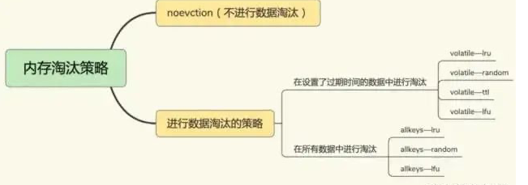
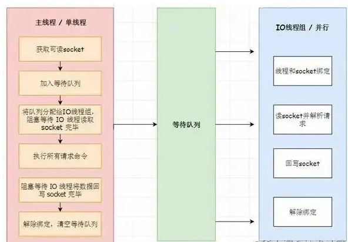

# **第五章 Redis6.0与缓存大全基础面试**

### **1 问题：什么是redis?**

Redis 是一个基于**内存的高性能key-value数据库**。

### **2 问题：redis可以用在哪些业务上？**

答：redis可以做很多事情，比如：

**缓存 / 分布式锁 （setnx） / 简易的消息队列（List/Streams） / 简易订阅通知（Pub/Sub） / 延时通知（键过期事件通知） / 附近的人（GEO）**

以下是具体业务场景：

* 记录帖子的点赞数、评论数和点击数 (hash)。
* 记录用户的帖子 ID 列表 (排序)，便于快速显示用户的帖子列表 (zset)。
* 记录帖子的标题、摘要、作者和封面信息，用于列表页展示 (hash)。
* 记录帖子的点赞用户 ID 列表，评论 ID 列表，用于显示和去重计数 (zset)。
* 缓存近期热帖内容 (帖子内容空间占用比较大)，减少数据库压力 (hash)。
* 记录帖子的相关文章 ID，根据内容推荐相关帖子 (list)。
* 如果帖子 ID 是整数自增的，可以使用 Redis 来分配帖子 ID(计数器)。
* 收藏集和帖子之间的关系 (zset)。
* 记录热榜帖子 ID 列表，总热榜和分类热榜 (zset)。
* 缓存用户行为历史，进行恶意行为过滤 (zset,hash)。

### **3 问题：Redis有哪些数据结构？**

答：Redis是一种`Key-Value`的模型，key是字符串类型，而常说的数据结构一般是指value的数据结构，一般包含以下类型。

* 最普通常见的，字符串(String)，字典(Hash)，列表(List)，集合(Set)，有序集合(SortedSet)。
* 高级数据结构，HyperLogLog，Geo，bitmap
* 更高级用户可能还知道Redis Module，像 BloomFilter，RedisSearch，Redis-ML。

### **4 问题：使用Redis有哪些好处？**

* **速度快，因为数据存在内存中**，类似于HashMap，HashMap的优势就是查找和操作的时间复杂度都是O(1)
* **支持丰富数据类型**，支持string，list，set，sorted set，hash
* **支持事务，操作都是原子性**，所谓的原子性就是对数据的更改要么全部执行，要么全部不执行
* **丰富的特性**：可用于缓存，消息，按key设置过期时间，过期后将会自动删除。

### **5 问题：redis相比memcached有哪些优势？**

* **memcached所有的值均是简单的字符串，redis作为其替代者，支持更为丰富的数据类型**
* redis的速度比memcached快很多
* **redis可以持久化其数据**

### **6 使用redis有什么缺点？**

答：主要有以下四点缺点：

* 缓存和数据库双写一致性问题
	* 当一个数据需要更新时，因为不可能做到同时更新数据库和缓存，那么此时读取数据的时候就一定会发生数据不一致问题，而数据不一致问题在金融交易领域的系统中是肯定不允许的。
	* 解决办法：读的时候先读缓存，缓存没有的话，就读数据库，然后取出数据后放入缓存，同时返回响应。更新的时候，先更新数据库，然后再删除缓存。
* **缓存雪崩问题**
	* 缓存雪崩是指当大量缓存失效时，大量的请求访问直接请求数据库，导致数据库服务器无法抗住请求或挂掉的情况。这时网站常常会出现 502 错误，导致网站不可用问题。
		* **合理规划缓存的失效时间，可以给缓存时间加一个随机数，防止统一时间过期**
* 缓存击穿问题
	* 缓存击穿是指，针对某个访问非常频繁的热点数据的请求，无法在缓存中进行处理，紧接着，访问该数据的大量请求，**一下子都发送到了后端数据库，导致了数据库压力激增，会影响数据库处理其他请求**
		* 对于访问特别频繁的热点数据，我们就不设置过期时间了
* **缓存穿透问题**
	* 缓存穿透是指要访问的数据既不在 Redis 缓存中，也不在数据库中，导致请求在访问缓存时，发生缓存缺失，再去访问数据库时，发现数据库中也没有要访问的数据
		* 业务层误操作：**缓存中的数据和数据库中的数据被误删除了，所以缓存和数据库中都没有数据；**
		* 恶意攻击：**专门访问数据库中没有的数据**。

		
### **7 问题：Redis提供了几种数据淘汰策略？该怎么选择？**

* `volatile-lru(Least Recently Used)`：从已经设置过期时间的数据集中，挑选最近最少使用的数据淘汰。
* `volatile-ttl`：从已经设置过期时间的数据集中，挑选即将要过期的数据淘汰。
* `volatile-random`：从已经设置过期时间的数据集中，随机挑选数据淘汰。
* `volatile-lfu(Least Frequently Used)`：从已经设置过期时间的数据集中，会使用LFU算法选择设置了过期时间的键值对。
* `allkeys-lru`：从所有的数据集中，挑选最近最少使用的数据淘汰。
* `allkeys-random`：从所有的数据集中，随机挑选数据淘汰。
* `no-eviction`：禁止淘汰数据，如果redis写满了将不提供写请求，直接返回错误。

注意这里的6种机制，volatile和allkeys规定了是对已设置过期时间的数据集淘汰数据还是从全部数据集淘汰数据，后面的lru、ttl以及random是三种不同的淘汰策略，再加上一种`no-eviction`永不回收的策略。

使用策略规则：

* 如果数据呈现幂律分布，也就是一部分数据访问频率高，一部分数据访问频率低，则使用`allkeys-lru`
* 如果数据呈现平等分布，也就是所有的数据访问频率都相同，则使用`allkeys-random`

### **8 问题：为什么redis需要把所有数据放到内存中？**

答：`Redi`为了达到最快的读写速度将数据都读到内存中，并通过异步的方式将数据写入磁盘。所以redis具有快速和数据持久化的特征。**如果不将数据放在内存中，磁盘`I/O`速度为严重影响`redis`的性能。**

在内存越来越便宜的今天，redis将会越来越受欢迎。

### **9 问题：Redis是单线程的吗？**

答：Redis是单线程的，**主要是指Redis的网络IO和键值对读写是由一个线程来完成的**，这也是Redis对外提供键值存储服务的主要流程。

**但Redis的其他功能，比如持久化、异步删除、集群数据同步等，其实是由额外的线程执行的。**

### **10 问题：Redis6.0为什么要引入多线程呢？**

答：Redis将所有数据放在内存中，内存的响应时长大约为100纳秒，对于小数据包，Redis服务器可以处理8万到10万QPS，这也是Redis处理的极限了，对于80%的公司来说，单线程的Redis已经足够使用了。

从Redis自身角度来说，因为读写网络的read/write系统调用占用了Redis执行期间大部分CPU时间，瓶颈主要在于网络的 IO 消耗, 优化主要有两个方向:

* 提高网络 IO 性能，典型的实现比如使用 DPDK 来替代内核网络栈的方式
* 使用多线程充分利用多核，典型的实现比如 Memcached。

协议栈优化的这种方式跟 Redis 关系不大，支持多线程是一种最有效最便捷的操作方式。所以总结起来，redis支持多线程主要就是两个原因：

* 可以充分利用服务器 CPU 资源，目前主线程只能利用一个核
* 多线程任务可以分摊 Redis 同步 IO 读写负荷

### **11 问题：Redis6.0默认是否开启了多线程？**

答：**Redis6.0的多线程默认是禁用的，只使用主线程**。如需开启需要修改redis.conf配置文件：`io-threads-do-reads yes`

### **12 问题：Redis6.0多线程开启时，线程数如何设置？**

答：开启多线程后，还需要设置线程数，否则是不生效的。同样修改`redis.conf`配置文件 关于线程数的设置，官方有一个建议：**4核的机器建议设置为2或3个线程，8核的建议设置为6个线程，线程数一定要小于机器核数**。**还需要注意的是，线程数并不是越大越好，官方认为超过了8个基本就没什么意义了**。

### **13 问题：Redis6.0多线程的实现机制？**

流程简述如下：

* 主线程负责接收建立连接请求，获取 socket 放入全局等待读处理队列
* 主线程处理完读事件之后，通过 RR(Round Robin) 将这些连接分配给这些 IO 线程
* 主线程阻塞等待 IO 线程读取 socket 完毕
* 主线程通过单线程的方式执行请求命令，请求数据读取并解析完成，但并不执行
* 主线程阻塞等待 IO 线程将数据回写 socket 完毕
* 解除绑定，清空等待队列

### **14 问题：redis如何做到高可用？**

答：redis具备的高可用，其实包含两层含义：**一是数据尽量少丢失，二是服务尽量少中断。对于前者redis使用AOF和RDB两种持久化方式保证，对于后者Redis的做法就是增加副本冗余量，将一份数据同时保存在多个实例上。**

