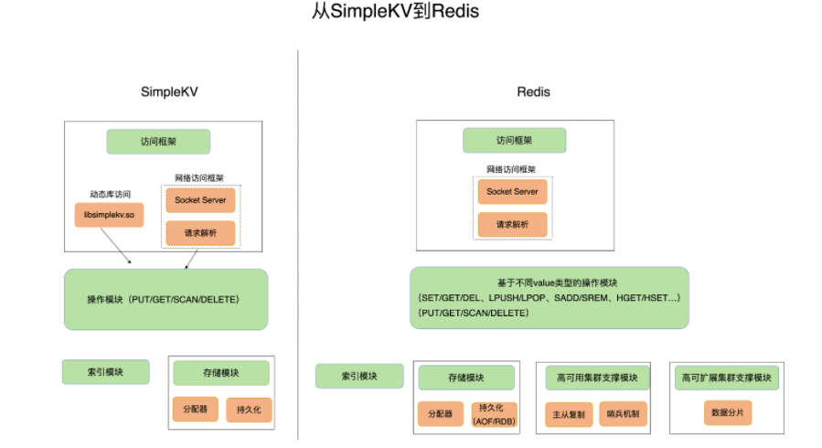
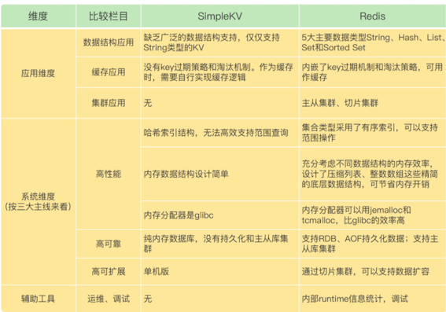
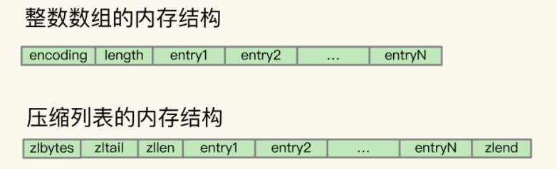
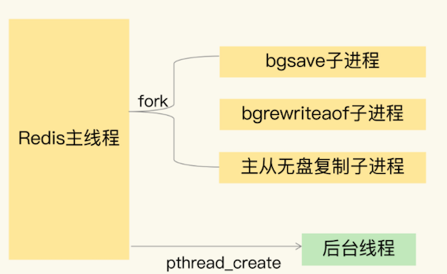
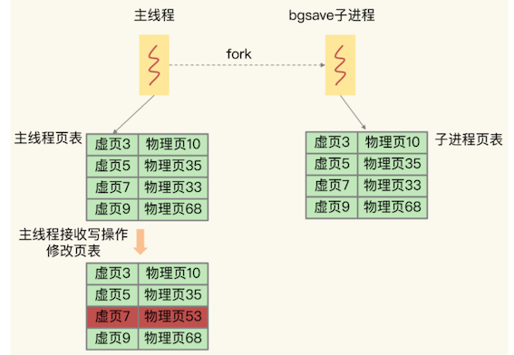
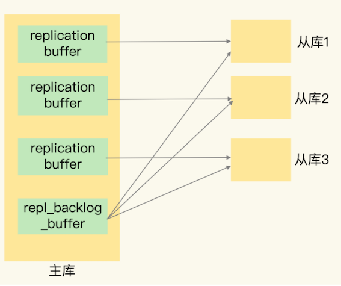

# **第二章 Redis核心技术基础总结篇**

## **1、Redis 基础知识总结**

### **第一节 基本架构： 键值数据库**

为了支持更加丰富的业务场景，Redis 对这些组件或者功能进行了扩展，或者说是进行了精细优化，从而满足了功能和性能等方面的要求。



从这张对比图中，我们可以看到，从 SimpleKV 演进到 Redis，有以下几个重要变化：

* **Redis 主要通过网络框架进行访问，而不再是动态库了**，这也使得 Redis 可以作为一个基础性的网络服务进行访问，扩大了 Redis 的应用范围。
* Redis 数据模型中的 value 类型很丰富，因此也带来了更多的操作接口，例如面向列表的 LPUSH/LPOP，面向集合的 SADD/SREM 等。
* **Redis 的持久化模块能支持两种方式：日志（AOF）和快照（RDB）**，这两种持久化方式具有不同的优劣势，影响到 Redis 的访问性能和可靠性。
* SimpleKV 是个简单的单机键值数据库，但是，Redis 支持高可靠集群和高可扩展集群，因此，Redis 中包含了相应的集群功能支撑模块。

### **第二节 数据结构：Redis为什么那么快？**

Redis 之所以能快速操作键值对，**一方面是因为 O(1) 复杂度的哈希表被广泛使用，包括 String、Hash 和 Set，它们的操作复杂度基本由哈希表决定，另一方面，Sorted Set 也采用了 `O(logN) `复杂度的跳表。**


不过，集合类型的范围操作，因为要遍历底层数据结构，复杂度通常是 `O(N)`。

这里，我的建议是：**用其他命令来替代，例如可以用 SCAN 来代替，避免在 Redis 内部产生费时的全集合遍历操作。**


当然，我们不能忘了复杂度较高的 List 类型，它的两种底层实现结构：双向链表和压缩列表的操作复杂度都是 O(N)。因此，我的建议是：**因地制宜地使用 List 类型**。例如，既然它的 POP/PUSH 效率很高，那么就将它主要用于 FIFO 队列场景，而不是作为一个可以随机读写的集合。

**讲了什么？**

* Redis的底层数据结构
* Redis的数据结构：数据的保存形式与底层数据结构
* 由数据结构的异同点，引出数据操作的快慢原因

**要点知识**

* **string，list，set，hast, sortset都只是数据的保存形式**
* **底层的数据结构是：简单动态字符串，双向链表，压缩列表，哈希表，跳表，整数数组**
* Redis使用了一个哈希表保存所有的键值对
* 五种数据形式的底层实现
	* string：简单动态字符串
	* list：双向链表，压缩列表
	* hash：压缩列表，哈希表
	* Sorted Set：压缩列表，跳表
	* set：哈希表，整数数组
* List ,hash，set ,sorted set 被统称为集合类型，一个键对应了一个集合的数据
* 集合类型的键和值之间的结构组织
	* redis使用一个哈希表保存所有键值对，一个哈希表实则是一个数组，数组的每个元素称为哈希桶。
	* 哈希桶中的元素保存的不是值的本身，而是指向具体值的指针
* 哈希冲突解决
	* Redis的hash表是全局的，所以当写入大量的key时，将会带来哈希冲突，已经rehash可能带来的操作阻塞
	*  Redis解决hash冲突的方式，是链式哈希：同一个哈希桶中的多个元素用一个链表来保存
	*  当哈希冲突链过长时，Redis会对hash表进行rehash操作。rehash就是增加现有的hash桶数量，分散entry元素。
* rehash机制
	* 了使rehash操作更高效，Redis默认使用了两个全局哈希表：哈希表1和哈希表2，起始时hash2没有分配空间
	* 随着数据增多，Redis执行分三步执行rehash;
		* 给hash2分配更大的内存空间，如是hash1的两倍
		* 把hash1中的数据重新映射并拷贝到哈希表2中
		* 释放hash1的空间
* 渐进式rehash
	*  由于步骤2重新映射非常耗时，会阻塞redis
	* 讲集中迁移数据，改成每处理一个请求时，就从hash1中的第一个索引位置，顺带将这个索引位置上的所有entries拷贝到hash2中。

* 压缩列表，跳表的特点
	* 压缩列表类似于一个数组，不同的是:压缩列表在表头有三个字段zlbytes,zltail和zllen分别表示长度，列表尾的偏移量和列表中的entry的个数，压缩列表尾部还有一个zlend，表示列表结束所以压缩列表定位第一个和最后一个是O(1),但其他就是O(n)
	* 跳表：是在链表的基础上增加了多级索引，通过索引的几次跳转，实现数据快速定位

### **第三节 高性能IO模型：Redis为什么那么快？**

Redis 单线程是指它对网络 IO 和数据读写的操作采用了一个线程，而采用单线程的一个核心原因是避免多线程开发的并发控制问题。

**单线程的 Redis 也能获得高性能，跟多路复用的 IO 模型密切相关，因为这避免了 accept() 和 send()/recv() 潜在的网络 IO 操作阻塞点。**

本章首先从简单的网络通信socket讲起，引出了非阻塞socket，由此谈到了著名的I/O多路复用，Linux内核的select/epoll机制

本章的关键在于关键点在于accpet和recv时可能会阻塞线程，使用IO多路复用技术可以让线程先处理其他事情，等需要的资源到位后epoll会调用回调函数通知线程，然后线程再去处理存/取数据；这样一个redis服务端线程就可以同时处理多个客户端请求了。

### **第四节 Redis宕机，如何避免数据丢失：AOF(Append Only File)日志**

Redis 用于避免数据丢失的 AOF 方法。这个方法通过逐一记录操作命令，在恢复时再逐一执行命令的方式，保证了数据的可靠性

总结来说，它提供了 AOF 日志的三种写回策略，分别是 Always、Everysec 和 No，这三种策略在可靠性上是从高到低，而在性能上则是从低到高。

此外，为了避免日志文件过大，Redis 还提供了 AOF 重写机制，直接根据数据库里数据的最新状态，生成这些数据的插入命令，作为新日志。这个过程通过后台线程完成，避免了对主线程的阻塞。

* AOF 日志重写的时候，是由 bgrewriteaof 子进程来完成的，不用主线程参与，我们今天说的非阻塞也是指子进程的执行不阻塞主线程。但是，你觉得，这个重写过程有没有其他潜在的阻塞风险呢？如果有的话，会在哪里阻塞？

**潜在的阻塞风险包括：fork子进程 和 AOF重写过程中父进程产生写入**


### **第五节 Redis宕机，Redis如何实现快速恢复RDB**

* 我们学习了 Redis 用于避免数据丢失的内存快照方法。这个方法的优势在于，可以快速恢复数据库，也就是只需要把 RDB 文件直接读入内存，这就避免了 AOF 需要顺序、逐一重新执行操作命令带来的低效性能问题。
* Redis 设计了 bgsave 和写时复制方式，尽可能减少了内存快照对正常读写的影响，但是，频繁快照仍然是不太能接受的。而混合使用 RDB 和 AOF，以较小的性能开销保证数据可靠性和性能。

**关于 AOF 和 RDB 的选择问题**

三点建议：

* 数据不能丢失时，内存快照和 AOF 的混合使用是一个很好的选择；
* 如果允许分钟级别的数据丢失，可以只使用 RDB；
* 如果只用 AOF，优先使用 everysec 的配置选项，因为它在可靠性和性能之间取了一个平衡。

**到底是主进程还是主线程**

**Redis启动后本身是一个进程，它的主体工作（接收请求、服务请求读写数据）也是在这个进程中完成的，称Redis为主进程是可以的**。

同时，**Redis这个进程属于单线程的进程，也就是说进程主体工作没有用多个线程来运行，所以我一般把它也称为主线程，突显它的单线程模式**。

有的程序启动后，会在进程中启动多个线程来处理工作，这个时候我就不会称它为主线程了，因为没有一个线程是单独做主要工作的


### **第六节 数据同步：主从库数据一致**

Redis 的主从库同步的基本原理，总结来说，有三种模式：**全量复制、基于长连接的命令传播，以及增量复制**

全量复制虽然耗时，但是对于从库来说，如果是第一次同步，全量复制是无法避免的

* **<span style="color:red">一个 Redis 实例的数据库不要太大，一个实例大小在几 GB 级别比较合适，这样可以减少 RDB 文件生成、传输和重新加载的开销</span>**
* 为了避免多个从库同时和主库进行全量复制，给主库过大的同步压力，我们也可以采用“主 - 从 - 从”这一级联模式，来缓解主库的压力。
* 长连接复制是主从库正常运行后的常规同步阶段。在这个阶段中，主从库之间通过命令传播实现同步。
* 期间如果遇到了网络断连，增量复制就派上用场了。
* 留意一下 `repl_backlog_size` 这个配置参数。
	* **如果它配置得过小，在增量复制阶段，可能会导致从库的复制进度赶不上主库，进而导致从库重新进行全量复制**。
	* 所以，通过调大这个参数，可以减少从库在网络断连时全量复制的风险。

本节亮点：

* Redis采用读写分离的好处：避免了加锁，实例间协商是否完成修改等复杂操作
* 全量同步的发生时机：首次上线 和 从库的环形缓冲区位置标识被覆盖
* 增量同步保障机制依赖于一个特殊的数据结构：环形缓冲区
* 首次同步分为三个阶段，①：建立连接，②：同步RDB文件，③：同步增量数据
* 全量同步需要主机fork子进程，产生全量RDB文件，并发送，为了减轻主机的压力，从机之间也可用互相同步
* 增量同步可以缓解主机全量同步的压力，它需要特殊机制保障：`replication buffer`，环形缓冲区，`master_repl_offset`，`slave_repl_offset`
* 从机的同步位置标识，在环形缓冲区被覆盖后，会触发新的一轮全量同步，所`repl_backlog_buffer`的大小是redis重要的调优参数
* 主从同步有三种机制：全量同步，基于长链接的命令传播，增量同步

### **第七节	哨兵机制：主库不间断服务**

哨兵机制，它是实现 Redis 不间断服务的重要保证。**具体来说，主从集群的数据同步，是数据可靠的基础保证；而在主库发生故障时，自动的主从切换是服务不间断的关键支撑。**

Redis 的哨兵机制自动完成了以下三大功能，从而实现了主从库的自动切换，可以降低 Redis 集群的运维开销：

* 监控主库运行状态，并判断主库是否客观下线；
* 在主库客观下线后，选取新主库；
* 选出新主库后，通知从库和客户端。

为了降低误判率，在实际应用时，哨兵机制通常采用多实例的方式进行部署，多个哨兵实例通过“少数服从多数”的原则，来判断主库是否客观下线


**亮点**

* 哨兵的本质：是一个redis实例，要做三件事：监控主库，选举新主库，通知客户端和从机
* 哨兵是通过心跳检测，监控主库状态，主库下线被分为：主观下线和客观下线、
* 哨兵监控是可能误判的，所以哨兵一般是集群部署，采取投票的形式减少误判
* 选定新主库规则是先筛选在打分，得分高的会被选为新主库
* 筛选规则：从库当前的网络连接状况，以及之前的网络连接状况，筛选中断次数标准可以配置
* 打分规则：从库的优先级，数据同步状况，Id号大小，可以分为三轮，只要有一轮出现得分高的，就能选出
* 判断哪个从库的数据同步最接近主库，不是拿从库与主库比较，而是从库之间互相比较，谁大谁就是最接近的


### **第八节	哨兵集群：哨兵挂了，主从库切换**


* 为了实现主从切换，我们引入了哨兵；
* 为了避免单个哨兵故障后无法进行主从切换，以及为了减少误判率，又引入了哨兵集群；
* 哨兵集群又需要有一些机制来支撑它的正常运行。

这节课上，我就向你介绍了支持哨兵集群的这些关键机制，包括：

* 基于 pub/sub 机制的哨兵集群组成过程；
* 基于 INFO 命令的从库列表，这可以帮助哨兵和从库建立连接；
* 基于哨兵自身的 pub/sub 功能，这实现了客户端和哨兵之间的事件通知。

对于主从切换，当然不是哪个哨兵想执行就可以执行的，否则就乱套了。所以，这就需要哨兵集群在判断了主库“客观下线”后，经过投票仲裁，选举一个 Leader 出来，由它负责实际的主从切换，即由它来完成新主库的选择以及通知从库与客户端。

**<span style="color:red">要保证所有哨兵实例的配置是一致的，尤其是主观下线的判断值 down-after-milliseconds。</span>**

> `down-after-milliseconds` 是我们认定主从库断连的最大连接超时时间

因为这个值在不同的哨兵实例上配置不一致，导致哨兵集群一直没有对有故障的主库形成共识，也就没有及时切换主库，最终的结果就是集群服务不稳定。


**哨兵集群的工作机制**

* 哨兵之间互通机制：基于pub/sub机制，在主库中有一个`"__sentinel__:hello"`的频道，哨兵之间互相发现通信
* 哨兵与主从库互通机制：哨兵向主库发送INFO指令，可以获取所有从库的信息，实现对主库，从库的监控
* 哨兵判定主库异常机制：**哨兵集群中任意一个实例都可以发起主库异常“投票仲裁”流程**
* 哨兵之间的互动是通过发布订阅机制完成的，利用自身的特性来实现。
* 哨兵之间通信不是哨兵之间之间联系，而是通过订阅主库的同一频道来获取彼此的信息
* 哨兵是通过INFO指令，从主库获取从库信息，并与每个从库建立连接，监控所有主从库状态
* 哨兵是一个特殊的redis实例，所以客户端可以订阅哨兵的指定频道获得redis主从库的信息
* 哨兵集群执行主从切换机制：谁发现，谁就发起投票流程，谁获得多数票，谁就是哨兵Leader，由Leader负责主从库切换
* 哨兵集群Leader选举成功与否，依赖于网络通信状况，网络拥塞会导致选举失败，重新进行新一轮选举


###  **第九节 切片集群：数据增多了，是该加内存还是加实例**

切片集群在保存大量数据方面的优势，以及基于哈希槽的数据分布机制和客户端定位键值对的方法。

* 在应对数据量扩容时，虽然增加内存这种纵向扩展的方法简单直接，但是会造成数据库的内存过大，导致性能变慢。
* **Redis 切片集群提供了横向扩展的模式，也就是使用多个实例，并给每个实例配置一定数量的哈希槽，数据可以通过键的哈希值映射到哈希槽，再通过哈希槽分散保存到不同的实例上。**
* 集群的实例增减，或者是为了实现负载均衡而进行的数据重新分布，会导致哈希槽和实例的映射关系发生变化，客户端发送请求时，会收到命令执行报错信息。

**本节亮点**

* 这一课我更加清晰的明白了之前别人聊Redis扩容中的纵向扩容和横向扩容的真实含义和区别
* 数据分片和实例的对应关系建立：按照CRC16算法计算一个key的16bit的值，在将这值对16384取模
* 一个切片集群的槽位是固定的16384个，可手动分配每个实例的槽位，但必须将槽位全部分完
* 客户端如何确定要访问那个实例获取数据：
	* 从任意个实例获取并缓存在自己本地，
	* 重定向机制
* 重定向机制：客户端访问的实例没有数据，被访问实例响应move命令，告诉客户端指向新的实例地址
* ASK命令：1，表明数据正在迁移 2，告知客户端数据所在的实例
* ASK命令和MOVE命令的区别：
	* move命令是在数据迁移完毕后被响应，客户端会更新本地缓存。
	* ASK命令是在数据迁移中被响应，不会让客户端更新缓存

	
## **2、课后思考题答案**

### **2-1 问题：和跟 Redis 相比，SimpleKV 还缺少什么？**


* 数据结构：缺乏广泛的数据结构支持，比如支持范围查询的 SkipList 和 Stream 等数据结构。
* 高可用：缺乏哨兵或者 master-slave 模式的高可用设计；
* 横向扩展：缺乏集群和分片功能；内存安全性：缺乏内存过载时的 key 淘汰算法的支持；
* 内存利用率：没有充分对数据结构进行优化，提高内存利用率，例如使用压缩性的数据结构；
* 功能扩展：需要具备后续功能的拓展；
* 不具备事务性：无法保证多个操作的原子性。



### **2-2 问题：整数数组和压缩列表作为底层数据结构的优势是什么？**

整数数组和压缩列表的设计，充分体现了 Redis“又快又省”特点中的“省”，也就是节省内存空间。整数数组和压缩列表都是在内存中分配一块地址连续的空间，然后把集合中的元素一个接一个地放在这块空间内，非常紧凑。因为元素是挨个连续放置的，我们不用再通过额外的指针把元素串接起来，这就避免了额外指针带来的空间开销。

整数数组和压缩列表中的 entry 都是实际的集合元素，它们一个挨一个保存，非常节省内存空间。



**Redis 之所以采用不同的数据结构，其实是在性能和内存使用效率之间进行的平衡。**

### **2-3 问题：Redis 基本 IO 模型中还有哪些潜在的性能瓶颈？**

在 Redis 基本 IO 模型中，主要是主线程在执行操作，任何耗时的操作，例如 bigkey、全量返回等操作，都是潜在的性能瓶颈。


### **2-4 问题 1：AOF 重写过程中有没有其他潜在的阻塞风险？**

这里有两个风险。

**风险一：Redis 主线程 fork 创建 `bgrewriteaof` 子进程时，内核需要创建用于管理子进程的相关数据结构**，这些数据结构在操作系统中通常叫作进程控制块（`Process Control Block`，简称为 PCB）。内核要把主线程的 PCB 内容拷贝给子进程。这个创建和拷贝过程由内核执行，是会阻塞主线程的。而且，在拷贝过程中，子进程要拷贝父进程的页表，这个过程的耗时和 Redis 实例的内存大小有关。如果 Redis 实例内存大，页表就会大，fork 执行时间就会长，这就会给主线程带来阻塞风险。


**风险二：`bgrewriteaof` 子进程会和主线程共享内存**。当主线程收到新写或修改的操作时，主线程会申请新的内存空间，用来保存新写或修改的数据，如果操作的是 bigkey，也就是数据量大的集合类型数据，那么，主线程会因为申请大空间而面临阻塞风险。因为操作系统在分配内存空间时，有查找和锁的开销，这就会导致阻塞。


### **2-4  问题 2：AOF 重写为什么不共享使用 AOF 本身的日志？**

如果都用 AOF 日志的话，主线程要写，`bgrewriteaof` 子进程也要写，这两者会竞争文件系统的锁，这就会对 Redis 主线程的性能造成影响。

### **2-5**

问题：使用一个 2 核 CPU、4GB 内存、500GB 磁盘的云主机运行 Redis，Redis 数据库的数据量大小差不多是 2GB。当时 Redis 主要以修改操作为主，写读比例差不多在 `8:2 `左右，也就是说，如果有 100 个请求，80 个请求执行的是修改操作。在这个场景下，用 RDB 做持久化有什么风险吗？

**内存不足的风险：**	Redis fork 一个 bgsave 子进程进行 RDB 写入，如果主线程再接收到写操作，就会采用写时复制。写时复制需要给写操作的数据分配新的内存空间。本问题中写的比例为 80%，那么，在持久化过程中，为了保存 80% 写操作涉及的数据，写时复制机制会在实例内存中，为这些数据再分配新内存空间，分配的内存量相当于整个实例数据量的 80%，大约是 1.6GB，这样一来，整个系统内存的使用量就接近饱和了。此时，如果实例还有大量的新 key 写入或 key 修改，云主机内存很快就会被吃光。如果云主机开启了 Swap 机制，就会有一部分数据被换到磁盘上，当访问磁盘上的这部分数据时，性能会急剧下降。如果云主机没有开启 Swap，会直接触发 OOM，整个 Redis 实例会面临被系统 kill 掉的风险。


**主线程和子进程竞争使用 CPU 的风险**：生成 RDB 的子进程需要 CPU 核运行，主线程本身也需要 CPU 核运行，而且，如果 Redis 还启用了后台线程，此时，主线程、子进程和后台线程都会竞争 CPU 资源。由于云主机只有 2 核 CPU，这就会影响到主线程处理请求的速度。


### **2-6 为什么主从库间的复制不使用 AOF？**

答案：有两个原因。

1. RDB 文件是二进制文件，无论是要把 RDB 写入磁盘，还是要通过网络传输 RDB，IO 效率都比记录和传输 AOF 的高。
2. 在从库端进行恢复时，用 RDB 的恢复效率要高于用 AOF。


### **2-7 ：在主从切换过程中，客户端能否正常地进行请求操作呢？**

主从集群一般是采用读写分离模式，当主库故障后，客户端仍然可以把读请求发送给从库，让从库服务。但是，对于写请求操作，客户端就无法执行了。

**如果想要应用程序不感知服务的中断，还需要哨兵或客户端再做些什么吗？**

* 一方面，客户端需要能缓存应用发送的写请求。只要不是同步写操作（Redis 应用场景一般也没有同步写），写请求通常不会在应用程序的关键路径上，所以，客户端缓存写请求后，给应用程序返回一个确认就行。
* 另一方面，主从切换完成后，客户端要能和新主库重新建立连接，哨兵需要提供订阅频道，让客户端能够订阅到新主库的信息。同时，客户端也需要能主动和哨兵通信，询问新主库的信息。

### **2-8**

**5 个哨兵实例的集群，quorum 值设为 2。在运行过程中，如果有 3 个哨兵实例都发生故障了，此时，Redis 主库如果有故障，还能正确地判断主库“客观下线”吗？如果可以的话，还能进行主从库自动切换吗？**

因为判定主库“客观下线”的依据是，认为主库“主观下线”的哨兵个数要大于等于 quorum 值，现在还剩 2 个哨兵实例，个数正好等于 quorum 值，所以还能正常判断主库是否处于“客观下线”状态。如果一个哨兵想要执行主从切换，就要获到半数以上的哨兵投票赞成，也就是至少需要 3 个哨兵投票赞成。但是，现在只有 2 个哨兵了，所以就无法进行主从切换了。

**哨兵实例是不是越多越好呢？如果同时调大 down-after-milliseconds 值，对减少误判是不是也有好处？**

哨兵实例越多，误判率会越低，但是在判定主库下线和选举 Leader 时，实例需要拿到的赞成票数也越多，等待所有哨兵投完票的时间可能也会相应增加，主从库切换的时间也会变长，客户端容易堆积较多的请求操作，可能会导致客户端请求溢出，从而造成请求丢失。如果业务层对 Redis 的操作有响应时间要求，就可能会因为新主库一直没有选定，新操作无法执行而发生超时报警。

调大 `down-after-milliseconds` 后，可能会导致这样的情况：**主库实际已经发生故障了，但是哨兵过了很长时间才判断出来，这就会影响到 Redis 对业务的可用性。**

### **2-9**

**为什么 Redis 不直接用一个表，把键值对和实例的对应关系记录下来？**

如果使用表记录键值对和实例的对应关系，一旦键值对和实例的对应关系发生了变化（例如实例有增减或者数据重新分布），就要修改表。如果是单线程操作表，那么所有操作都要串行执行，性能慢；如果是多线程操作表，就涉及到加锁开销。此外，如果数据量非常大，使用表记录键值对和实例的对应关系，需要的额外存储空间也会增加。

基于哈希槽计算时，虽然也要记录哈希槽和实例的对应关系，但是哈希槽的个数要比键值对的个数少很多，无论是修改哈希槽和实例的对应关系，还是使用额外空间存储哈希槽和实例的对应关系，都比直接记录键值对和实例的关系的开销小得多。


## **3、典型问题讲解**

### **3-1 rehash 的触发时机和渐进式执行机制**

**1.Redis 什么时候做 rehash？**

Redis 会使用装载因子（load factor）来判断是否需要做 rehash。装载因子的计算方式是，哈希表中所有 entry 的个数除以哈希表的哈希桶个数。Redis 会根据装载因子的两种情况，来触发 rehash 操作：

* 装载因子`≥1`，同时，哈希表被允许进行 `rehash`；
* 装载因子`≥5`。

在第一种情况下，如果装载因子等于 1，同时我们假设，所有键值对是平均分布在哈希表的各个桶中的，那么，此时，哈希表可以不用链式哈希，因为一个哈希桶正好保存了一个键值对。

但是，如果此时再有新的数据写入，哈希表就要使用链式哈希了，这会对查询性能产生影响。在进行 RDB 生成和 AOF 重写时，哈希表的 rehash 是被禁止的，这是为了避免对 RDB 和 AOF 重写造成影响。如果此时，Redis 没有在生成 RDB 和重写 AOF，那么，就可以进行 rehash。否则的话，再有数据写入时，哈希表就要开始使用查询较慢的链式哈希了。

在第二种情况下，也就是装载因子大于等于 5 时，就表明当前保存的数据量已经远远大于哈希桶的个数，哈希桶里会有大量的链式哈希存在，性能会受到严重影响，此时，就立马开始做 rehash。

刚刚说的是触发 rehash 的情况，如果装载因子小于 1，或者装载因子大于 1 但是小于 5，同时哈希表暂时不被允许进行 rehash（例如，实例正在生成 RDB 或者重写 AOF），此时，哈希表是不会进行 rehash 操作的。


**2. 采用渐进式 hash 时，如果实例暂时没有收到新请求，是不是就不做 rehash 了？**

其实不是的。Redis 会执行定时任务，定时任务中就包含了 rehash 操作。所谓的定时任务，就是按照一定频率（例如每 100ms/ 次）执行的任务。

在 rehash 被触发后，即使没有收到新请求，Redis 也会定时执行一次 rehash 操作，而且，每次执行时长不会超过 1ms，以免对其他任务造成影响。


### **3-2 主线程、子进程和后台线程的联系与区别**

首先，我来解释一下进程和线程的区别。

* **<span style="color:red">从操作系统的角度来看，进程一般是指资源分配单元，例如一个进程拥有自己的堆、栈、虚存空间（页表）、文件描述符等；</span>**
* **<span style="color:red">线程一般是指 CPU 进行调度和执行的实体。</span>**

如果一个进程启动后，没有再创建额外的线程，那么，**这样的进程一般称为主进程或主线程**。

举个例子，下面是我写的一个 C 程序片段，main 函数会直接调用一个 worker 函数，函数 worker 就是执行一个 for 循环计算。下面这个程序运行后，**它自己就是一个主进程，同时也是个主线程**。

```
int counter = 0;
void *worker() {  
   for (int i=0;i<10;i++) {
      counter++;
   }  
   return NULL;
}

int main(int argc, char *argv[]) {
   worker();
}
```

和这段代码类似，Redis 启动以后，本身就是一个进程，它会接收客户端发送的请求，并处理读写操作请求。而且，接收请求和处理请求操作是 Redis 的主要工作，Redis 没有再依赖于其他线程，所以，我一般把完成这个主要工作的 Redis 进程，称为主进程或主线程。

在主线程中，我们还可以使用 fork 创建子进程，或是使用 `pthread_create` 创建线程。下面我先介绍下 Redis 中用 fork 创建的子进程有哪些。

* 创建 RDB 的后台子进程，同时由它负责在主从同步时传输 RDB 给从库；
* 通过无盘复制方式传输 RDB 的子进程；
* bgrewriteaof 子进程。

然后，我们再看下 Redis 使用的线程。从 4.0 版本开始，Redis 也开始使用 `pthread_create` 创建线程，这些线程在创建后，一般会自行执行一些任务，例如执行异步删除任务。相对于完成主要工作的主线程来说，我们一般可以称这些线程为后台线程。




### **3-3 写时复制的底层实现机制**

Redis 在使用 RDB 方式进行持久化时，会用到写时复制机制。

**bgsave 子进程相当于复制了原始数据，而主线程仍然可以修改原来的数据。**

* 对 Redis 来说，主线程 fork 出 bgsave 子进程后，bgsave 子进程实际是复制了主线程的页表。
* 这些页表中，就保存了在执行 bgsave 命令时，主线程的所有数据块在内存中的物理地址。
* 这样一来，bgsave 子进程生成 RDB 时，就可以根据页表读取这些数据，再写入磁盘中。
* 如果此时，主线程接收到了新写或修改操作，那么，主线程会使用写时复制机制。
* 具体来说，写时复制就是指，主线程在有写操作时，才会把这个新写或修改后的数据写入到一个新的物理地址中，并修改自己的页表映射。



* bgsave 子进程复制主线程的页表以后，假如主线程需要修改虚页 7 里的数据，那么，主线程就需要新分配一个物理页（假设是物理页 53），**然后把修改后的虚页 7 里的数据写到物理页 53 上，而虚页 7 里原来的数据仍然保存在物理页 33 上**
* 这个时候，虚页 7 到物理页 33 的映射关系，仍然保留在 bgsave 子进程中。
* bgsave 子进程可以无误地把虚页 7 的原始数据写入 RDB 文件。

### **3-4 replication buffer 和 `repl_backlog_buffer` 的区别**

在进行主从复制时，Redis 会使用 replication buffer 和 `repl_backlog_buffer`

* **`replication buffer `是主从库在进行全量复制时，主库上用于和从库连接的客户端的 buffer**，
* **而` repl_backlog_buffer` 是为了支持从库增量复制，主库上用于持续保存写操作的一块专用 buffer。**


Redis 主从库在进行复制时，当主库要把全量复制期间的写操作命令发给从库时，**主库会先创建一个客户端，用来连接从库，然后通过这个客户端，把写操作命令发给从库。**

* 在内存中，主库上的客户端就会对应一个 buffer，这个 buffer 就被称为 replication buffer。
* Redis 通过 client_buffer 配置项来控制这个 buffer 的大小。
* 主库会给每个从库建立一个客户端，所以 replication buffer 不是共享的，而是每个从库都有一个对应的客户端


`repl_backlog_buffer` 是一块专用 buffer，在 Redis 服务器启动后，开始一直接收写操作命令，这是所有从库共享的。主库和从库会各自记录自己的复制进度，所以，不同的从库在进行恢复时，会把自己的复制进度（`slave_repl_offset`）发给主库，主库就可以和它独立同步。


