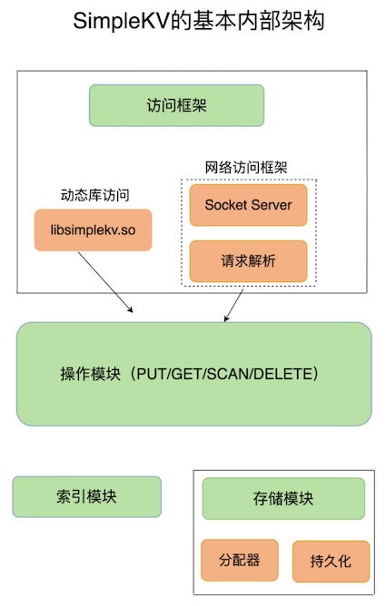

# **第一节 基本架构： 键值数据库**

## **1、构建简单的键值数据库称 SimpleKV**

构造 SimpleKV 时，

* 首先就要考虑里面可以存什么样的数据，**对数据可以做什么样的操作，也就是数据模型和操作接口**
* 实际上却是我们理解 Redis 经常被用于缓存、秒杀、分布式锁等场景的重要基础。

但是，如果你要对多个用户的年龄计算均值，键值数据库就无法完成了。因为它只提供简单的操作接口，无法支持复杂的聚合计算

## **2、可以存哪些数据？**

对于键值数据库而言，基本的数据模型是 key-value 模型。 例如，“hello”: “world”就是一个基本的 KV 对，其中，“hello”是 key，“world”是 value。SimpleKV 也不例外。

在 SimpleKV 中，key 是 String 类型，而 value 是基本数据类型，例如 String、整型等。但是，SimpleKV 毕竟是一个简单的键值数据库，对于实际生产环境中的键值数据库来说，value 类型还可以是复杂类型。

不同键值数据库支持的 key 类型一般差异不大，而 value 类型则有较大差别。我们在对键值数据库进行选型时，**一个重要的考虑因素是它支持的 value 类型。**

例如，`Memcached` 支持的 `value` 类型仅为 `String` 类型，而 `Redis` 支持的 `value` 类型包括了 **String、哈希表、列表、集合等**。**Redis 能够在实际业务场景中得到广泛的应用，就是得益于支持多样化类型的 value。**


## **3、可以对数据做什么操作？**

### **3-1 SimpleKV的操作**

SimpleKV 需要支持的 3 种基本操作，即 PUT、GET 和 DELETE。

* PUT：新写入或更新一个 `key-value` 对；
* GET：根据一个 key 读取相应的 value 值；
* DELETE：根据一个 key 删除整个 `key-value` 对。


**有些键值数据库的新写 / 更新操作叫 SET** 

新写入和更新虽然是用一个操作接口，但在实际执行时，会根据 key 是否存在而执行相应的新写或更新流程。

在实际的业务场景中. 查询一个用户在一段时间内的访问记录。这种操作在键值数据库中属于 `SCAN` 操作，即根据一段 key 的范围返回相应的 value 值。因此，`PUT/GET/DELETE/SCAN` 是一个键值数据库的基本操作集合。

实际业务场景通常还有更加丰富的需求，例如，**在黑白名单应用中，需要判断某个用户是否存在。如果将该用户的 ID 作为 key，那么，可以增加 `EXISTS` 操作接口，用于判断某个 key 是否存在**

当一个键值数据库的 value 类型多样化时，就需要包含相应的操作接口。**例如，Redis 的 value 有列表类型，因此它的接口就要包括对列表 value 的操作。**


### **3-2 键值对保存在内存还是外存**

* 保存在内存的好处是读写很快，毕竟内存的访问速度一般都在百 ns 级别。但是，潜在的风险是一旦掉电，所有的数据都会丢失。
* 保存在外存，虽然可以避免数据丢失，但是受限于磁盘的慢速读写（通常在几 ms 级别），键值数据库的整体性能会被拉低。

> 看需要场景；作为缓存，能够接收数据丢失，则用内存；不能接受数据丢失，性能要求不要，用外存。

**如何进行设计选择，我们通常需要考虑键值数据库的主要应用场景**

缓存场景下的数据需要能快速访问但允许丢失，那么，用于此场景的键值数据库通常采用内存保存键值数据。Memcached 和 Redis 都是属于内存键值数据库。对于 Redis 而言，缓存是非常重要的一个应用场景。

大体来说，一个键值数据库包括了**访问框架、索引模块、操作模块和存储模块**四部分（见下图）




## **4、采用什么访问模式？**

访问模式通常有两种：

* 一种是通过**函数库调用的方式供外部应用使用**，比如，上图中的 `libsimplekv.so`，就是以**动态链接库的形式链接到我们自己的程序中**，提供键值存储功能；
* 一种是通过**网络框架以 Socket 通信的形式对外提供键值对操作**，这种形式可以提供广泛的键值存储服务。网络框架中包括 Socket Server 和协议解析。

实际的键值数据库也基本采用上述两种方式，例如，RocksDB 以动态链接库的形式使用，而 Memcached 和 Redis 则是通过网络框架访问

通过网络框架提供键值存储服务，一方面扩大了键值数据库的受用面，但另一方面，也给键值数据库的性能、运行模型提供了不同的设计选择，带来了一些潜在的问题。

举个例子，当客户端发送一个如下的命令后，该命令会被封装在网络包中发送给键值数据库：

```
PUT hello world
```

## **5、如何定位键值对的位置？**

当 SimpleKV 解析了客户端发来的请求，知道了要进行的键值对操作，此时，SimpleKV 需要查找所要操作的键值对是否存在，这依赖于键值数据库的索引模块。

**索引的作用是让键值数据库根据 key 找到相应 value 的存储位置，进而执行操作。**

索引的类型有很多，常见的有哈希表、B+ 树、字典树等。不同的索引结构在性能、空间消耗、并发控制等方面具有不同的特征。

**不同键值数据库采用的索引并不相同**，例如，Memcached 和 Redis 采用哈希表作为 key-value 索引，而 RocksDB 则采用跳表作为内存中 key-value 的索引。

内存键值数据库（例如 Redis）采用哈希表作为索引，很大一部分原因在于，**其键值数据基本都是保存在内存中的，而内存的高性能随机访问特性可以很好地与哈希表 O(1) 的操作复杂度相匹配。**

## **6、不同操作的具体逻辑是怎样的？**


SimpleKV 的索引模块负责根据 key 找到相应的 value 的存储位置。对于不同的操作来说，找到存储位置之后，需要进一步执行的操作的具体逻辑会有所差异。

SimpleKV 的操作模块就实现了不同操作的具体逻辑：

* 对于 GET/SCAN 操作而言，此时根据 value 的存储位置返回 value 值即可；
* 对于 PUT 一个新的键值对数据而言，SimpleKV 需要为该键值对分配内存空间；
* 对于 DELETE 操作，SimpleKV 需要删除键值对，并释放相应的内存空间，这个过程由分配器完成。

## **7、如何实现重启后快速提供服务？**


SimpleKV 采用了常用的**内存分配器 glibc 的 malloc 和 free**，因此，SimpleKV 并不需要特别考虑内存空间的管理问题。

但是，键值数据库的键值对通常大小不一，glibc 的分配器在处理随机的大小内存块分配时，表现并不好。一旦保存的键值对数据规模过大，就可能会造成较严重的内存碎片问题。

> `malloc()`在运行期动态分配分配内存,	`free()`释放由其分配的内存。

**分配器是键值数据库中的一个关键因素** 对于以内存存储为主的 Redis 而言，这点尤为重要。

SimpleKV 虽然依赖于内存保存数据，提供快速访问，但是，我也希望 SimpleKV 重启后能快速重新提供服务，所以，我在 SimpleKV 的存储模块中增加了持久化功能。

**SimpleKV 直接采用了文件形式，将键值数据通过调用本地文件系统的操作接口保存在磁盘上。此时，SimpleKV 只需要考虑何时将内存中的键值数据保存到文件中，就可以了。**

* 一种方式是，对于每一个键值对，SimpleKV 都对其进行落盘保存，这虽然让 SimpleKV 的数据更加可靠，但是，因为每次都要写盘，SimpleKV 的性能会受到很大影响。
* 另一种方式是，SimpleKV 只是周期性地把内存中的键值数据保存到文件中，这样可以避免频繁写盘操作的性能影响。但是，一个潜在的代价是 SimpleKV 的数据仍然有丢失的风险。

## **7、本节小结**

至此，我们构造了一个简单的键值数据库 SimpleKV。

为了支持更加丰富的业务场景，Redis 对这些组件或者功能进行了扩展，或者说是进行了精细优化，从而满足了功能和性能等方面的要求。


从这张对比图中，我们可以看到，从 SimpleKV 演进到 Redis，有以下几个重要变化：

* **Redis 主要通过网络框架进行访问，而不再是动态库了**，这也使得 Redis 可以作为一个基础性的网络服务进行访问，扩大了 Redis 的应用范围。
* Redis 数据模型中的 value 类型很丰富，因此也带来了更多的操作接口，例如面向列表的 LPUSH/LPOP，面向集合的 SADD/SREM 等。
* **Redis 的持久化模块能支持两种方式：日志（AOF）和快照（RDB）**，这两种持久化方式具有不同的优劣势，影响到 Redis 的访问性能和可靠性。
* SimpleKV 是个简单的单机键值数据库，但是，Redis 支持高可靠集群和高可扩展集群，因此，Redis 中包含了相应的集群功能支撑模块。