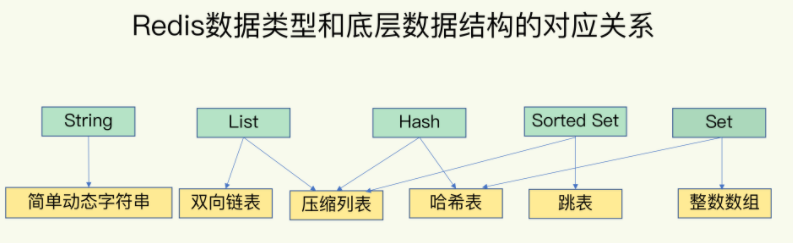
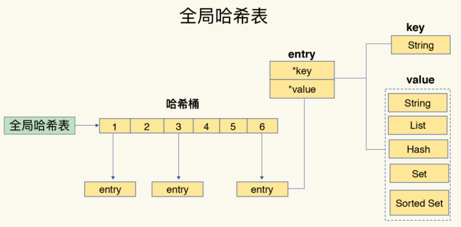
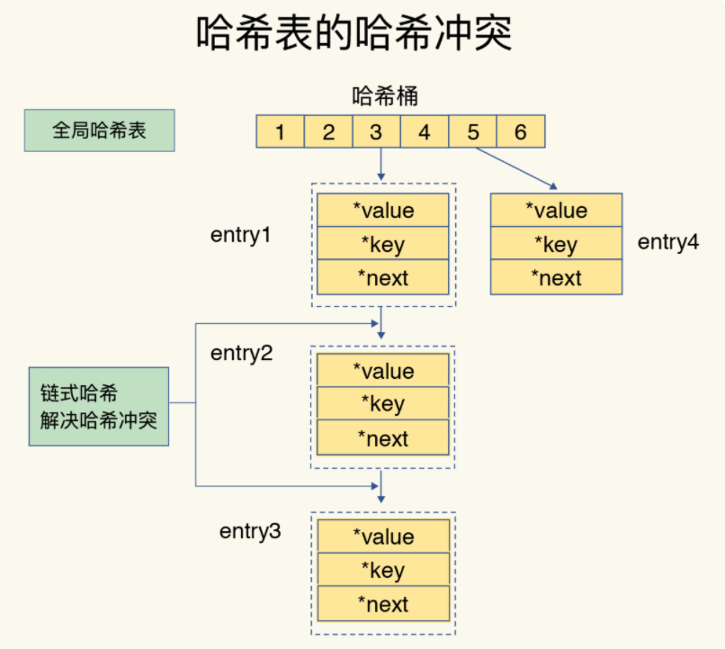
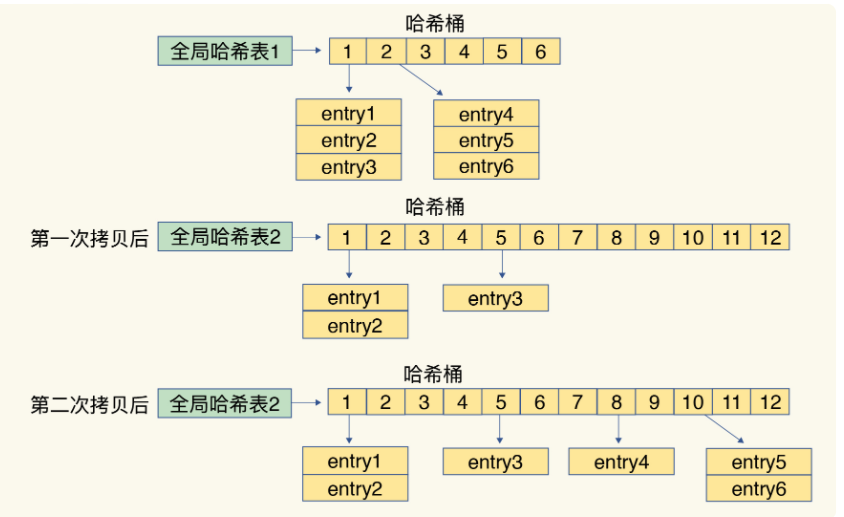
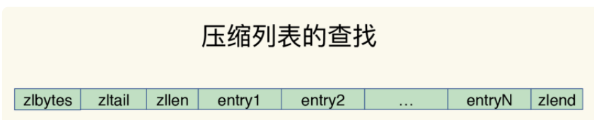
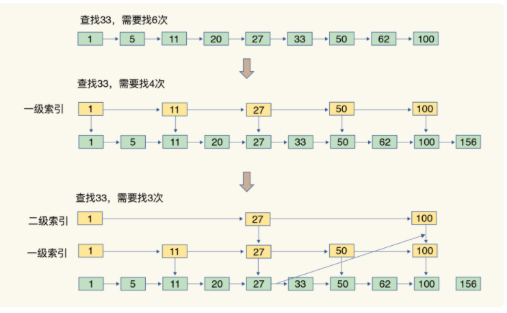
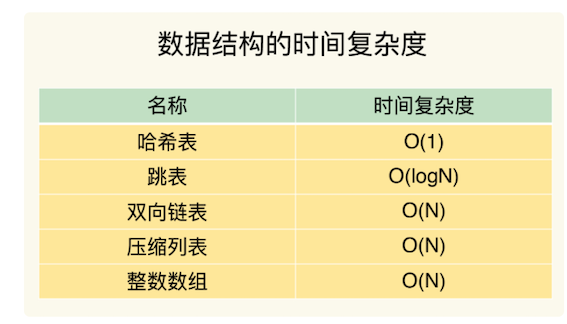

# **第二节 数据结构：Redis为什么那么快？**

Redis 的快，到底是快在哪里呢？实际上，这里有一个重要的表现：**它接收到一个键值对操作后，能以微秒级别的速度找到数据，并快速完成操作。**

> redis表现突出的原因： 1、在内存中进行操作 2、高效的数据结构

这是因为，键值对是按一定的数据结构来组织的，操作键值对最终就是对数据结构进行增删改查操作，所以高效的数据结构是 Redis 快速处理数据的基础

Redis 键值对中值的数据类型包含：**String（字符串）、List（列表）、Hash（哈希）、Set（集合）和 Sorted Set（有序集合）**

简单来说，底层数据结构一共有 6 种，分别是简**单动态字符串、双向链表、压缩列表、哈希表、跳表和整数数组**

* String 类型的底层实现只有一种数据结构，也就是简单动态字符串。
* 而 List、Hash、Set 和 Sorted Set 这四种数据类型，都有两种底层实现结构。
* 通常情况下，**我们会把这四种类型称为集合类型，它们的特点是一个键对应了一个集合的数据**。

## **1、键和值用什么结构组织？**

为了实现从键到值的快速访问，**Redis 使用了一个哈希表来保存所有键值对**。

* **一个哈希表，其实就是一个数组，数组的每个元素称为一个哈希桶**
* 一个哈希表是由多个哈希桶组成的，**每个哈希桶中保存了键值对数据。**
* 其实，哈希桶中的元素保存的并不是值本身，而是**指向具体值的指针**。
* 不管值是 String，还是集合类型，**哈希桶中的元素都是指向它们的指针**。

哈希桶中的 `entry` 元素中保存了`*key`和`*value`指针，**分别指向了实际的键和值**，这样一来，即使值是一个集合，也可以通过`*value`指针被查找到。

这个哈希表保存了所有的键值对，所以，我也把它称为**全局哈希表。**

哈希表的最大好处很明显，就是让我们可以用 O(1) 的时间复杂度来快速查找到键值对——**我们只需要计算键的哈希值，就可以知道它所对应的哈希桶位置，然后就可以访问相应的 `entry` 元素。**

个查找过程主要依赖于哈希计算，和数据量的多少并没有直接关系。也就是说，不管哈希表里有 10 万个键还是 100 万个键，我们只需要一次计算就能找到相应的键。

但是，当你往 Redis 中写入大量数据后，就可能发现操作有时候会突然变慢了，这其实是因为你忽略了一个潜在的风险点，**那就是哈希表的冲突问题和 rehash 可能带来的操作阻塞**。

## **2、如何解决哈希冲突等问题**

你往哈希表中写入更多数据时，哈希冲突是不可避免的问题。**这里的哈希冲突，也就是指，两个 key 的哈希值和哈希桶计算对应关系时，正好落在了同一个哈希桶中**。

**毕竟，哈希桶的个数通常要少于 key 的数量，这也就是说，难免会有一些 key 的哈希值对应到了同一个哈希桶中。**

### **2-1 链式哈希**

**Redis 解决哈希冲突的方式，就是链式哈希**。

**链式哈希也很容易理解，就是指同一个哈希桶中的多个元素用一个链表来保存，它们之间依次用指针连接。**

如下图所示：entry1、entry2 和 entry3 都需要保存在哈希桶 3 中，导致了哈希冲突。

此时，`entry1` 元素会通过一个`*next`指针指向 `entry2`，同样，`entry2` 也会通过`*next`指针指向 entry3。

这样一来，即使哈希桶 3 中的元素有 100 个，我们也可以通过 entry 元素中的指针，把它们连起来。这就形成了一个链表，也叫作哈希冲突链。

但是，这里依然存在一个问题，哈希冲突链上的元素只能通过指针逐一查找再操作。如果哈希表里写入的数据越来越多，哈希冲突可能也会越来越多，这就会导致某些哈希冲突链过长，进而导致这个链上的元素查找耗时长，效率降低。

### **2-2 Rehash**

所以，Redis 会对哈希表做 `rehash` 操作。

**rehash 也就是增加现有的哈希桶数量，让逐渐增多的 entry 元素能在更多的桶之间分散保存，减少单个桶中的元素数量，从而减少单个桶中的冲突。**

为了使 rehash 操作更高效，Redis 默认使用了两个全局哈希表：哈希表 1 和哈希表 2。一开始，当你刚插入数据时，默认使用哈希表 1，此时的哈希表 2 并没有被分配空间。随着数据逐步增多，Redis 开始执行 rehash，这个过程分为三步：

1. 给哈希表 2 分配更大的空间，例如是当前哈希表 1 大小的两倍；
2. 把哈希表 1 中的数据重新映射并拷贝到哈希表 2 中；
3. 释放哈希表 1 的空间。

**到此，我们就可以从哈希表 1 切换到哈希表 2，用增大的哈希表 2 保存更多数据，而原来的哈希表 1 留作下一次 rehash 扩容备用。**

### **2-3 渐进式 rehash** 

这个过程看似简单，但是第二步涉及大量的数据拷贝，**如果一次性把哈希表 1 中的数据都迁移完，会造成 Redis 线程阻塞，无法服务其他请求**。此时，Redis 就无法快速访问数据了。

为了避免这个问题，Redis 采用了渐进式 rehash。

* 简单来说就是在第二步拷贝数据时，Redis 仍然正常处理客户端请求，每处理一个请求时，从哈希表 1 中的第一个索引位置开始，顺带着将这个索引位置上的所有 entries 拷贝到哈希表 2 中；
* 等处理下一个请求时，再顺带拷贝哈希表 1 中的下一个索引位置的 entries。

如下图所示：

**这样就巧妙地把一次性大量拷贝的开销，分摊到了多次处理请求的过程中，避免了耗时操作，保证了数据的快速访问。**

对于 String 类型来说，找到哈希桶就能直接增删改查了，**所以，哈希表的 O(1) 操作复杂度也就是它的复杂度了。**

但是，对于集合类型来说，即使找到哈希桶了，还要在集合中再进一步操作。接下来，我们来看集合类型的操作效率又是怎样的。

## **3、集合数据操作效率**

**和 String 类型不同，一个集合类型的值**，

* 第一步是通过全局哈希表找到对应的哈希桶位置，
* 第二步是在集合中再增删改查。

集合的操作效率和哪些因素相关呢？

* 首先，与集合的底层数据结构有关。例如，使用哈希表实现的集合，要比使用链表实现的集合访问效率更高。
* 其次，操作效率和这些操作本身的执行特点有关，比如读写一个元素的操作要比读写所有元素的效率高。

## **4、有哪些底层数据结构？**

集合类型的底层数据结构主要有 5 种：整数数组、双向链表、哈希表、压缩列表和跳表。

整数数组和双向链表也很常见，它们的操作特征都是顺序读写，也就是通过数组下标或者链表的指针逐个元素访问，**操作复杂度基本是 O(N)，操作效率比较低**

### **4-1 压缩列表**

压缩列表实际上类似于一个数组，数组中的每一个元素都对应保存一个数据。

和数组不同的是，压缩列表在表头有三个字段 zlbytes、zltail 和 zllen，分别表示列表长度、列表尾的偏移量和列表中的 entry 个数；压缩列表在表尾还有一个 zlend，表示列表结束。

* zlbytes： 列表长度
* zltail： 列表尾的偏移量
* zllen： 列表中的 entry 个数
* 压缩列表在表尾还有一个 zlend： 表结束

* 在压缩列表中，如果我们要查找定位第一个元素和最后一个元素，可以通过表头三个字段的长度直接定位，复杂度是 O(1)
* 而查找其他元素时，就没有这么高效了，只能逐个查找，此时的复杂度就是 O(N) 了。

### **4-2 跳表**

有序链表只能逐一查找元素，导致操作起来非常缓慢，于是就出现了跳表。**具体来说，跳表在链表的基础上，增加了多级索引，通过索引位置的几个跳转，实现数据的快速定位**

* 如果我们要在链表中查找 33 这个元素，只能从头开始遍历链表，查找 6 次，直到找到 33 为止。此时，复杂度是 O(N)，查找效率很低。

**为了提高查找速度，我们来增加一级索引**

从第一个元素开始，每两个元素选一个出来作为索引。这些索引再通过指针指向原始的链表。

例如，从前两个元素中抽取元素 1 作为一级索引，从第三、四个元素中抽取元素 11 作为一级索引。此时，我们只需要 4 次查找就能定位到元素 33 了。

**如果我们还想再快，可以再增加二级索引**

从一级索引中，再抽取部分元素作为二级索引。

例如，从一级索引中抽取 1、27、100 作为二级索引，二级索引指向一级索引。这样，我们只需要 3 次查找，就能定位到元素 33 了。

当数据量很大时，跳表的查找复杂度就是 O(logN)。

## **5、不同操作的复杂度**

* 集合类型的操作类型很多，有读写单个集合元素的，例如 HGET、HSET，
* 也有操作多个元素的，例如 SADD，还有对整个集合进行遍历操作的，例如 SMEMBERS。

这么多操作，它们的复杂度也各不相同。而复杂度的高低又是我们选择集合类型的重要依据。

* 单元素操作是基础；
* 范围操作非常耗时；
* 统计操作通常高效；
* 例外情况只有几个。

**第一，单元素操作，是指每一种集合类型对单个数据实现的增删改查操作。**

例如，Hash 类型的 HGET、HSET 和 HDEL，Set 类型的 SADD、SREM、SRANDMEMBER 等。这些操作的复杂度由集合采用的数据结构决定，

例如，HGET、HSET 和 HDEL 是对哈希表做操作，所以它们的复杂度都是 O(1)；

Set 类型用哈希表作为底层数据结构时，它的 SADD、SREM、SRANDMEMBER 复杂度也是 O(1)。

集合类型支持同时对多个元素进行增删改查，例如 Hash 类型的 HMGET 和 HMSET，Set 类型的 SADD 也支持同时增加多个元素。

**此时，这些操作的复杂度，就是由单个元素操作复杂度和元素个数决定的。例如，HMSET 增加 M 个元素时，复杂度就从 O(1) 变成 O(M) 了。**

**第二，范围操作，是指集合类型中的遍历操作，可以返回集合中的所有数据**

比如 Hash 类型的 `HGETALL` 和 Set 类型的 `SMEMBERS`，或者返回一个范围内的部分数据，比如 List 类型的 `LRANGE` 和 `ZSet` 类型的 `ZRANGE`。

这类操作的复杂度一般是 O(N)，比较耗时，我们应该尽量避免。

Redis 从 2.8 版本开始提供了 SCAN 系列操作（包括 `HSCAN`，`SSCAN` 和 `ZSCAN`），这类操作实现了渐进式遍历，每次只返回有限数量的数据。

**这样一来，相比于 HGETALL、SMEMBERS 这类操作来说，就避免了一次性返回所有元素而导致的 Redis 阻塞。**

**第三，统计操作，是指集合类型对集合中所有元素个数的记录**

例如 LLEN 和 SCARD。**这类操作复杂度只有 O(1)**，这是因为当集合类型采用压缩列表、双向链表、整数数组这些数据结构时，这些结构中专门记录了元素的个数统计，因此可以高效地完成相关操作。

**第四，例外情况，是指某些数据结构的特殊记录，例如压缩列表和双向链表都会记录表头和表尾的偏移量。**

这样一来，对于 List 类型的 LPOP、RPOP、LPUSH、RPUSH 这四个操作来说，它们是在列表的头尾增删元素，这就可以通过偏移量直接定位，所以它们的复杂度也只有 `O(1)`，可以实现快速操作。

## **6、本节小结**

Redis 之所以能快速操作键值对，**一方面是因为 O(1) 复杂度的哈希表被广泛使用，包括 String、Hash 和 Set，它们的操作复杂度基本由哈希表决定，另一方面，Sorted Set 也采用了 `O(logN) `复杂度的跳表。**

不过，集合类型的范围操作，因为要遍历底层数据结构，复杂度通常是 `O(N)`。

这里，我的建议是：**用其他命令来替代，例如可以用 SCAN 来代替，避免在 Redis 内部产生费时的全集合遍历操作。**

当然，我们不能忘了复杂度较高的 List 类型，它的两种底层实现结构：双向链表和压缩列表的操作复杂度都是 O(N)。因此，我的建议是：**因地制宜地使用 List 类型**。例如，既然它的 POP/PUSH 效率很高，那么就将它主要用于 FIFO 队列场景，而不是作为一个可以随机读写的集合。

### **6-1 讲了什么？**

* Redis的底层数据结构
* Redis的数据结构：数据的保存形式与底层数据结构
* 由数据结构的异同点，引出数据操作的快慢原因

### **6-1 要点知识**

* **string，list，set，hast, sortset都只是数据的保存形式**
* **底层的数据结构是：简单动态字符串，双向链表，压缩列表，哈希表，跳表，整数数组**
* Redis使用了一个哈希表保存所有的键值对
* 五种数据形式的底层实现
	* string：简单动态字符串
	* list：双向链表，压缩列表
	* hash：压缩列表，哈希表
	* Sorted Set：压缩列表，跳表
	* set：哈希表，整数数组
* List ,hash，set ,sorted set 被统称为集合类型，一个键对应了一个集合的数据
* 集合类型的键和值之间的结构组织
	* redis使用一个哈希表保存所有键值对，一个哈希表实则是一个数组，数组的每个元素称为哈希桶。
	* 哈希桶中的元素保存的不是值的本身，而是指向具体值的指针
* 哈希冲突解决
	* Redis的hash表是全局的，所以当写入大量的key时，将会带来哈希冲突，已经rehash可能带来的操作阻塞
	*  Redis解决hash冲突的方式，是链式哈希：同一个哈希桶中的多个元素用一个链表来保存
	*  当哈希冲突链过长时，Redis会对hash表进行rehash操作。rehash就是增加现有的hash桶数量，分散entry元素。
* rehash机制
	* 了使rehash操作更高效，Redis默认使用了两个全局哈希表：哈希表1和哈希表2，起始时hash2没有分配空间
	* 随着数据增多，Redis执行分三步执行rehash;
		* 给hash2分配更大的内存空间，如是hash1的两倍
		* 把hash1中的数据重新映射并拷贝到哈希表2中
		* 释放hash1的空间
* 渐进式rehash
	*  由于步骤2重新映射非常耗时，会阻塞redis
	* 讲集中迁移数据，改成每处理一个请求时，就从hash1中的第一个索引位置，顺带将这个索引位置上的所有entries拷贝到hash2中。

* 压缩列表，跳表的特点
	* 压缩列表类似于一个数组，不同的是:压缩列表在表头有三个字段zlbytes,zltail和zllen分别表示长度，列表尾的偏移量和列表中的entry的个数，压缩列表尾部还有一个zlend，表示列表结束所以压缩列表定位第一个和最后一个是O(1),但其他就是O(n)
	* 跳表：是在链表的基础上增加了多级索引，通过索引的几次跳转，实现数据快速定位

**提问**： 整数数组和压缩列表在查找时间复杂度方面并没有很大的优势，那为什么 Redis 还会把它们作为底层数据结构呢？

1. 内存利用率，数组和压缩列表都是非常紧凑的数据结构，它比链表占用的内存要更少。Redis是内存数据库，大量数据存到内存中，此时需要做尽可能的优化，提高内存的利用率。

2. 数组对CPU高速缓存支持更友好，所以Redis在设计时，集合数据元素较少情况下，默认采用内存紧凑排列的方式存储，同时利用CPU高速缓存不会降低访问速度。当数据元素超过设定阈值后，避免查询时间复杂度太高，转为哈希和跳表数据结构存储，保证查询效率。
