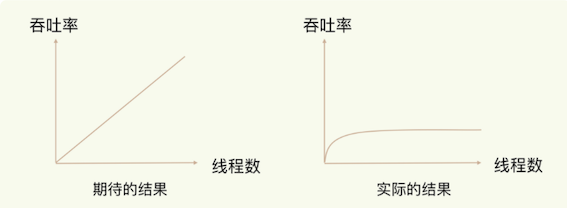
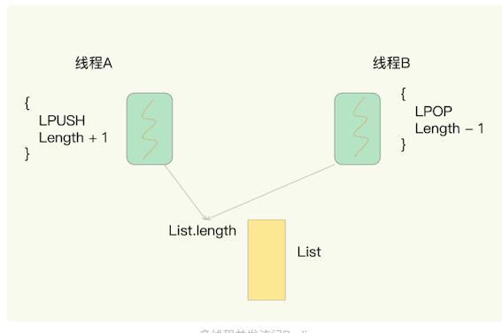
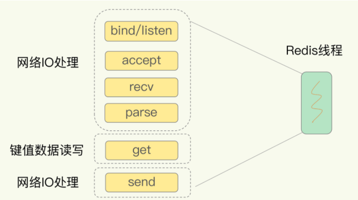
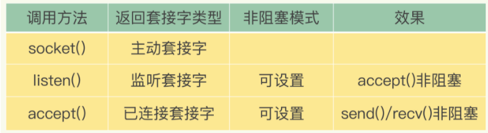
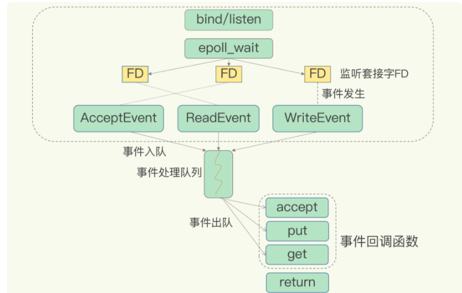

# **第三节 高性能IO模型：Redis为什么那么快？**

Redis 是单线程，**主要是指 Redis 的网络 IO 和键值对读写是由一个线程来完成的，这也是 Redis 对外提供键值存储服务的主要流程。**

但 Redis 的其他功能，比如持久化、异步删除、集群数据同步等，其实是由额外的线程执行的。

> 网络IO和键值对读写是单线程，其余操作则可能会有子进程或子线程

**所以，严格来说，Redis 并不是单线程**

## **1、Redis 为什么用单线程？**

### **1-1 多线程的开销**

**使用多线程，可以增加系统吞吐率，或是可以增加系统扩展性。**

的确，对于一个多线程的系统来说，在有合理的资源分配的情况下，可以增加系统中处理请求操作的资源实体，进而提升系统能够同时处理的请求数，**即吞吐率**。

但是，采用多线程后，如果没有良好的系统设计，实际得到的结果，其实是右图所展示的那样。**我们刚开始增加线程数时，系统吞吐率会增加，但是，再进一步增加线程时，系统吞吐率就增长迟缓了，有时甚至还会出现下降的情况。**

> 提高并发度，并不一定非得采用多线程的方式；采用多路复用、事件驱动的方式也可以。

一个关键的瓶颈在于，**系统中通常会存在被多线程同时访问的共享资源，比如一个共享的数据结构**。

**当有多个线程要修改这个共享资源时，为了保证共享资源的正确性，就需要有额外的机制进行保证，而这个额外的机制，就会带来额外的开销。**

拿 Redis 来说，在上节，提到过，**Redis 有 List 的数据类型，并提供出队（LPOP）和入队（LPUSH）操作**。

假设 Redis 采用多线程设计，现在有两个线程 A 和 B，

* 线程 A 对一个 List 做 LPUSH 操作，并对队列长度加 1。
* 同时，线程 B 对该 List 执行 LPOP 操作，并对队列长度减 1。
* 为了保证队列长度的正确性，Redis 需要让线程 A 和 B 的 LPUSH 和 LPOP 串行执行，这样一来，Redis 可以无误地记录它们对 List 长度的修改。
* 否则，我们可能就会得到错误的长度结果。
* **这就是多线程编程模式面临的共享资源的并发访问控制问题。**

> 多线程并发访问Redis

并发访问控制一直是多线程开发中的一个难点问题，如果没有精细的设计，比如说，**只是简单地采用一个粗粒度互斥锁，就会出现不理想的结果**：**即使增加了线程，大部分线程也在等待获取访问共享资源的互斥锁，并行变串行，系统吞吐率并没有随着线程的增加而增加。**

为了避免这些问题，Redis 直接采用了单线程模式。

## **2、单线程 Redis 为什么那么快？**

* 一方面，**Redis 的大部分操作在内存上完成，再加上它采用了高效的数据结构，例如哈希表和跳表，这是它实现高性能的一个重要原因。**
* 另一方面，**就是 Redis 采用了**多路复用机制**，使其在网络 IO 操作中能并发处理大量的客户端请求，实现高吞吐率。**

### **2-1 基本 IO 模型与阻塞点**

首先，**我们要弄明白网络操作的基本 IO 模型和潜在的阻塞点**。毕竟，Redis 采用单线程进行 IO，如果线程被阻塞了，就无法进行多路复用了。

例如，网络框架的 SimpleKV

以 Get 请求为例，SimpleKV 为了处理一个 Get 请求，

* 需要监听客户端请求（bind/listen）
* 和客户端建立连接（accept）
* 从 socket 中读取请求（recv）
* 解析客户端发送请求（parse）
* 根据请求类型读取键值数据（get）
* 最后给客户端返回结果，即向 socket 中写回数据（send）。

**其中，bind/listen、accept、recv、parse 和 send 属于网络 IO 处理，而 get 属于键值数据操作**。

既然 Redis 是单线程，那么，最基本的一种实现是在一个线程中依次执行上面说的这些操作。

**但是，在这里的网络 IO 操作中，有潜在的阻塞点，分别是 accept() 和 recv()。**

* 当 Redis 监听到一个客户端有连接请求，但一直未能成功建立起连接时，会阻塞在 `accept()` 函数这里，导致其他客户端无法和 Redis 建立连接。
* 类似的，当 Redis 通过 recv() 从一个客户端读取数据时，如果数据一直没有到达，Redis 也会一直阻塞在 recv()。

导致 Redis 整个线程阻塞，无法处理其他客户端请求，效率很低。**不过，幸运的是，socket 网络模型本身支持非阻塞模式。**

### **2-2 非阻塞模式**

Socket 网络模型的非阻塞模式设置，主要体现在三个关键的函数调用上

在 socket 模型中，不同操作调用后会返回不同的套接字类型。

* **`socket()` 方法会返回主动套接字，然后调用 `listen()` 方法，将主动套接字转化为监听套接字**，此时，可以监听来自客户端的连接请求。
* 最后，调用 `accept()` 方法接收到达的客户端连接，并返回已连接套接字。

### **2-3 监听套接字 - 非阻塞模式**

* 针对监听套接字，我们可以设置非阻塞模式：**当 Redis 调用 accept() 但一直未有连接请求到达时，Redis 线程可以返回处理其他操作，而不用一直等待**。

> 调用 accept() 时，已经存在监听套接字了。

**虽然 Redis 线程可以不用继续等待，但是总得有机制继续在监听套接字上等待后续连接请求，并在有请求时通知 Redis。**

> Linux中Socket网络模型的非阻塞模式的设置

### **2-4 连接套接字 - 非阻塞模式**

类似的，我们也可以针对已连接套接字设置非阻塞模式：Redis 调用 `recv()` 后，如果已连接套接字上一直没有数据到达，Redis 线程同样可以返回处理其他操作。

**也需要有机制继续监听该已连接套接字，并在有数据达到时通知 Redis。**

这样才能保证 Redis 线程，既不会像基本 IO 模型中一直在阻塞点等待，也不会导致 Redis 无法处理实际到达的连接请求或数据。

**Linux 中的 IO 多路复用机制就要登场了。**

## **3、基于多路复用的高性能 I/O 模型**

Linux 中的 IO 多路复用机制是指**一个线程处理多个 IO 流**，**就是我们经常听到的 select/epoll 机制**。

简单来说，**在 Redis 只运行单线程的情况下，该机制允许内核中，同时存在多个监听套接字和已连接套接字。**

内核会一直监听这些套接字上的连接请求或数据请求。一旦有请求到达，就会交给 Redis 线程处理，这就实现了一个 Redis 线程处理多个 IO 流的效果。

**图中的多个 FD 就是刚才所说的多个套接字。Redis 网络框架调用 epoll 机制，让内核监听这些套接字。**

此时，Redis 线程不会阻塞在某一个特定的监听或已连接套接字上，也就是说，不会阻塞在某一个特定的客户端请求处理上。

正因为此，Redis 可以同时和多个客户端连接并处理请求，从而提升并发性。

为了在请求到达时能通知到 Redis 线程，`select/epoll` 提供了基于事件的回调机制，即针对不同事件的发生，调用相应的处理函数。

> 所有添加到epoll中的事件都会与设备(网卡)驱动程序建立回调关系，也就是说，当相应的事件发生时会调用这个回调方法。
> 
> 这个回调方法在内核中叫`ep_poll_callback`,它会将发生的事件添加到rdlist双链表中。

### **3-1 回调机制的工作原理**

其实，select/epoll 一旦监测到 FD 上有请求到达时，就会触发相应的事件。

* **这些事件会被放进一个事件队列，Redis 单线程对该事件队列不断进行处理。这样一来，Redis 无需一直轮询是否有请求实际发生，这就可以避免造成 CPU 资源浪费**
* 同时，Redis 在对事件队列中的事件进行处理时，会调用相应的处理函数，这就实现了基于事件的回调。
* 因为 Redis 一直在对事件队列进行处理，所以能及时响应客户端请求，提升 Redis 的响应性能。

例如，请求和读数据：

1.  这两个请求分别对应 Accept 事件和 Read 事件，Redis 分别对这两个事件注册 accept 和 get 回调函数。
2. 当 Linux 内核监听到有连接请求或读数据请求时，就会触发 Accept 事件和 Read 事件，此时，内核就会回调 Redis 相应的 accept 和 get 函数进行处理。

这就像病人去医院瞧病。在医生实际诊断前，每个病人（等同于请求）都需要先分诊、测体温、登记等。如果这些工作都由医生来完成，医生的工作效率就会很低。所以，医院都设置了分诊台，分诊台会一直处理这些诊断前的工作（类似于 Linux 内核监听请求），然后再转交给医生做实际诊断。这样即使一个医生（相当于 Redis 单线程），效率也能提升。

不过，需要注意的是，即使你的应用场景中部署了不同的操作系统，多路复用机制也是适用的。因为这个机制的实现有很多种，**既有基于 Linux 系统下的 select 和 epoll 实现，也有基于 FreeBSD 的 kqueue 实现，以及基于 Solaris 的 evport 实现**

**不过，需要注意的是，即使你的应用场景中部署了不同的操作系统，多路复用机制也是适用的。因为这个机制的实现有很多种，既有基于 Linux 系统下的 select 和 epoll 实现，也有基于 FreeBSD 的 kqueue 实现，以及基于 Solaris 的 evport 实现**

## **4、本节小节**

Redis 单线程是指它对网络 IO 和数据读写的操作采用了一个线程，而采用单线程的一个核心原因是避免多线程开发的并发控制问题。

**单线程的 Redis 也能获得高性能，跟多路复用的 IO 模型密切相关，因为这避免了 accept() 和 send()/recv() 潜在的网络 IO 操作阻塞点。**

本章首先从简单的网络通信socket讲起，引出了非阻塞socket，由此谈到了著名的I/O多路复用，Linux内核的select/epoll机制

本章的关键在于关键点在于accpet和recv时可能会阻塞线程，使用IO多路复用技术可以让线程先处理其他事情，等需要的资源到位后epoll会调用回调函数通知线程，然后线程再去处理存/取数据；这样一个redis服务端线程就可以同时处理多个客户端请求了。

