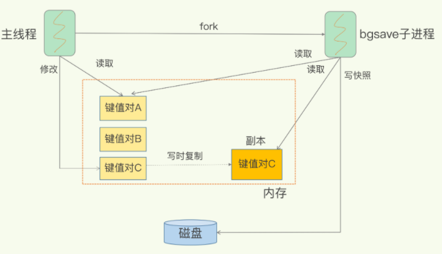
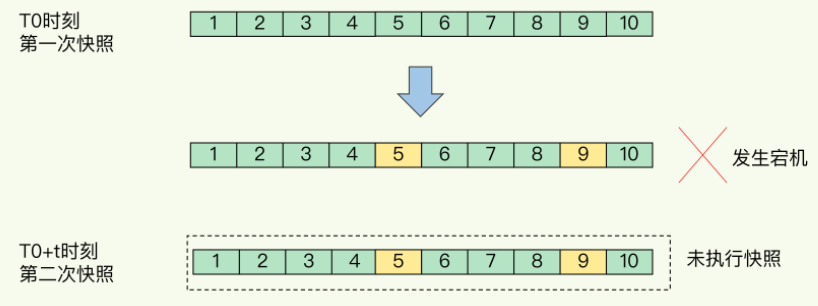
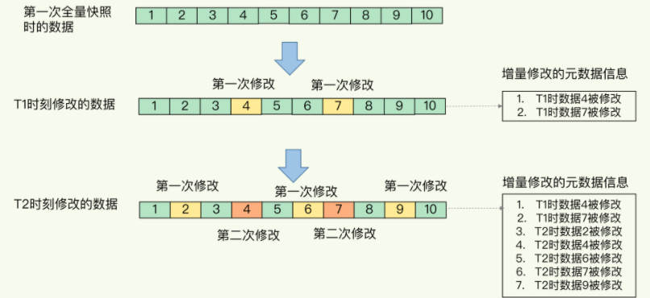
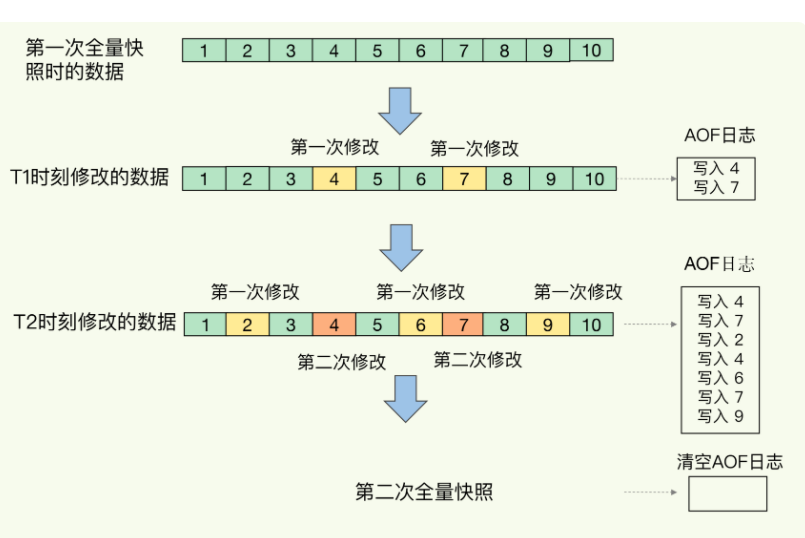

# **第五节 Redis宕机，Redis如何实现快速恢复RDB**

## **1、什么是内存快照**

Redis 避免数据丢失的 AOF 方法。这个方法的好处，是每次执行只需要记录操作命令，需要持久化的数据量不大。一般而言，只要你采用的不是 always 的持久化策略，就不会对性能造成太大影响。

但是，也正因为记录的是操作命令，而不是实际的数据，

* **所以，用 AOF 方法进行故障恢复的时候，需要逐一把操作日志都执行一遍。如果操作日志非常多，Redis 就会恢复得很缓慢，影响到正常使用**。

还有没有既可以保证可靠性，还能在宕机时实现快速恢复的其他方法呢？ **内存快照**

**对 Redis 来说，它实现类似照片记录效果的方式，就是把某一时刻的状态以文件的形式写到磁盘上，也就是快照。**

**这样一来，即使宕机，快照文件也不会丢失，数据的可靠性也就得到了保证。这个快照文件就称为 RDB 文件，其中，RDB 就是 Redis DataBase 的缩写**

和 AOF 相比，RDB 记录的是某一时刻的数据，并不是操作，所以，在做数据恢复时，我们可以直接把 RDB 文件读入内存，很快地完成恢复。

我们还要考虑两个关键问题：

* 对哪些数据做快照？这关系到快照的执行效率问题；
* 做快照时，数据还能被增删改吗？这关系到 Redis 是否被阻塞，能否同时正常处理请求。

## **2、给哪些内存数据做快照？**

Redis 的数据都在内存中，为了提供所有数据的可靠性保证，**它执行的是全量快照**，也就是说，把内存中的所有数据都记录到磁盘中，这样做的好处是，一次性记录了所有数据，一个都不少

给内存的全量数据做快照，把它们全部写入磁盘也会花费很多时间。**而且，全量数据越多，RDB 文件就越大，往磁盘上写数据的时间开销就越大。**

对于 Redis 而言，它的单线程模型就决定了，我们要尽量避免所有会阻塞主线程的操作

### **2-1 RDB 文件的生成是否会阻塞主线程？**

Redis 提供了两个命令来生成 RDB 文件，分别是 `save` 和 `bgsave`。

* save：在主线程中执行，会导致阻塞；
* bgsave：**创建一个子进程，专门用于写入 RDB 文件，避免了主线程的阻塞，这也是 Redis RDB 文件生成的默认配置。**

我们就可以通过 bgsave 命令来执行全量快照，这既提供了数据的可靠性保证，也避免了对 Redis 的性能影响

## **3、快照时数据能修改吗?**

对于内存快照而言，我们不希望数据“动”。

举个例子。我们在时刻 t 给内存做快照，假设内存数据量是 4GB，磁盘的写入带宽是 0.2GB/s，简单来说，至少需要 `20s（4/0.2 = 20）`才能做完。

如果在时刻` t+5s` 时，一个还没有被写入磁盘的内存数据 A，被修改成了` A’`，那么就会破坏快照的完整性，因为 A’不是时刻 t 时的状态。因此，和拍照类似，我们在做快照时也不希望数据“动”，也就是不能被修改。

但是，如果快照执行期间数据不能被修改，是会有潜在问题的。对于刚刚的例子来说，在做快照的 20s 时间里，如果这 4GB 的数据都不能被修改，Redis 就不能处理对这些数据的写操作，那无疑就会给业务服务造成巨大的影响。

**你可能会想到，可以用 bgsave 避免阻塞啊**:

**避免阻塞和正常处理写操作并不是一回事**。此时，主线程的确没有阻塞，可以正常接收请求，但是，为了保证快照完整性，它只能处理读操作，因为不能修改正在执行快照的数据。

> RDB采用写时复制（COW，copy on write）策略。
> 
> **主线程如果都是读取操作，那么子线程不需要复制数据块。**
> 
> **如果主线程的某块数据有修改， 那么子线程需要复制数据块，从而不会影响主线程的修改操作。**

快照而暂停写操作，肯定是不能接受的。所以这个时候，**Redis 就会借助操作系统提供的写时复制技术（Copy-On-Write, COW），在执行快照的同时，正常处理写操作**。

**bgsave 子进程是由主线程 fork 生成的，可以共享主线程的所有内存数据。bgsave 子进程运行后，开始读取主线程的内存数据，并把它们写入 RDB 文件。**

* **如果主线程对这些数据也都是读操作**（例如图中的键值对 A），那么，主线程和 bgsave 子进程相互不影响。
* 如果主线程要修改一块数据（例如图中的键值对 C），那么，这块数据就会被复制一份，生成该数据的副本。**然后，bgsave 子进程会把这个副本数据写入 RDB 文件，而在这个过程中，主线程仍然可以直接修改原来的数据**。

这既保证了快照的完整性，也允许主线程同时对数据进行修改，避免了对正常业务的影响。

## **4、多久做一次快照**

### **4-1 连拍全量快照带来的问题**

对于快照来说，所谓“连拍”就是指连续地做快照。这样一来，快照的间隔时间变得很短，即使某一时刻发生宕机了，因为上一时刻快照刚执行，丢失的数据也不会太多。但是，这其中的快照间隔时间就很关键了。

如下图所示，我们先在 T0 时刻做了一次快照，然后又在 `T0+t `时刻做了一次快照，在这期间，数据块` 5` 和` 9 `被修改了。如果在 `t` 这段时间内，机器宕机了，那么，只能按照 T0 时刻的快照进行恢复。

此时，数据块 5 和 9 的修改值因为没有快照记录，就无法恢复了。

要想尽可能恢复数据，t 值就要尽可能小，t 越小，就越像“连拍”

虽然 bgsave 执行时不阻塞主线程，但是，**如果频繁地执行全量快照，也会带来两方面的开销。**

* 一方面，频繁将全量数据写入磁盘，会给磁盘带来很大压力，多个快照竞争有限的磁盘带宽，前一个快照还没有做完，后一个又开始做了，容易造成恶性循环。
* 另一方面，`bgsave` 子进程需要通过 `fork` 操作从主线程创建出来。**虽然，子进程在创建后不会再阻塞主线程，但是，fork 这个创建过程本身会阻塞主线程，而且主线程的内存越大，阻塞时间越长**。**如果频繁 fork 出 bgsave 子进程，这就会频繁阻塞主线程了**

> fork操作执行时，内核需要给子进程拷贝主线程的页表。如果主线程的内存大，页表也相应大，拷贝页表耗时长，会阻塞主线程。

### **4-2 增量快照**

我们可以做增量快照，所谓增量快照，就是指，**做了一次全量快照后，后续的快照只对修改的数据进行快照记录，这样可以避免每次全量快照的开销。**

* 在第一次做完全量快照后，T1 和 T2 时刻如果再做快照，我们只需要将被修改的数据写入快照文件就行。
* **但是，这么做的前提是，我们需要记住哪些数据被修改了**
* “记住”功能，它需要我们使用额外的元数据信息去记录哪些数据被修改了，这会带来额外的空间开销问题

**增量快照带来的问题**

* 如果我们对每一个键值对的修改，都做个记录，那么，如果有 1 万个被修改的键值对，我们就需要有 1 万条额外的记录。
* 而且，有的时候，键值对非常小，比如只有 32 字节，而记录它被修改的元数据信息，可能就需要 8 字节，这样的画，为了“记住”修改，引入的额外空间开销比较大。这对于内存资源宝贵的 Redis 来说，有些得不偿失。

**虽然跟 AOF 相比，快照的恢复速度快，但是，快照的频率不好把握，如果频率太低，两次快照间一旦宕机，就可能有比较多的数据丢失。如果频率太高，又会产生额外开销**

## **5、混合使用 AOF 日志和内存快照**

Redis 4.0 中提出了一个混合使用 AOF 日志和内存快照的方法。

**简单来说，内存快照以一定的频率执行，在两次快照之间，使用 AOF 日志记录这期间的所有命令操作。**

快照不用很频繁地执行，这就避免了频繁 fork 对主线程的影响。而且，AOF 日志也只用记录两次快照间的操作，也就是说，不需要记录所有操作了，因此，就不会出现文件过大的情况了，也可以避免重写开销。

T1 和 T2 时刻的修改，用 AOF 日志记录，等到第二次做全量快照时，就可以清空 AOF 日志，因为此时的修改都已经记录到快照中了，恢复时就不再用日志了。

## **6、本节小结**

* 们学习了 Redis 用于避免数据丢失的内存快照方法。这个方法的优势在于，可以快速恢复数据库，也就是只需要把 RDB 文件直接读入内存，这就避免了 AOF 需要顺序、逐一重新执行操作命令带来的低效性能问题。
* Redis 设计了 bgsave 和写时复制方式，尽可能减少了内存快照对正常读写的影响，但是，频繁快照仍然是不太能接受的。而混合使用 RDB 和 AOF，以较小的性能开销保证数据可靠性和性能。

### **6-1 关于 AOF 和 RDB 的选择问题，**

三点建议：

* 数据不能丢失时，内存快照和 AOF 的混合使用是一个很好的选择；
* 如果允许分钟级别的数据丢失，可以只使用 RDB；
* 如果只用 AOF，优先使用 everysec 的配置选项，因为它在可靠性和性能之间取了一个平衡。

### **6-2 每节一问**

使用一个 2 核 CPU、4GB 内存、500GB 磁盘的云主机运行 Redis，Redis 数据库的数据量大小差不多是 2GB，我们使用了 RDB 做持久化保证。

当时 Redis 的运行负载以修改操作为主，写读比例差不多在 8:2 左右，也就是说，如果有 100 个请求，80 个请求执行的是修改操作。你觉得，在这个场景下，用 RDB 做持久化有什么风险吗？你能帮着一起分析分析吗？

答案

1. 内存资源风险：Redis fork子进程做RDB持久化，由于写的比例为80%，那么在持久化过程中，“写实复制”会重新分配整个实例80%的内存副本，大约需要重新分配1.6GB内存空间，这样整个系统的内存使用接近饱和，如果此时父进程又有大量新key写入，很快机器内存就会被吃光，如果机器开启了Swap机制，那么Redis会有一部分数据被换到磁盘上，当Redis访问这部分在磁盘上的数据时，性能会急剧下降，已经达不到高性能的标准（可以理解为武功被废）。如果机器没有开启Swap，会直接触发OOM，父子进程会面临被系统kill掉的风险。
2. CPU资源风险：虽然子进程在做RDB持久化，但生成RDB快照过程会消耗大量的CPU资源，虽然Redis处理处理请求是单线程的，但Redis Server还有其他线程在后台工作，例如AOF每秒刷盘、异步关闭文件描述符这些操作。由于机器只有2核CPU，这也就意味着父进程占用了超过一半的CPU资源，此时子进程做RDB持久化，可能会产生CPU竞争，导致的结果就是父进程处理请求延迟增大，子进程生成RDB快照的时间也会变长，整个Redis Server性能下降。

### **6-3 到底是主进程还是主线程**

**Redis启动后本身是一个进程，它的主体工作（接收请求、服务请求读写数据）也是在这个进程中完成的，称Redis为主进程是可以的**。

同时，**Redis这个进程属于单线程的进程，也就是说进程主体工作没有用多个线程来运行，所以我一般把它也称为主线程，突显它的单线程模式**。

有的程序启动后，会在进程中启动多个线程来处理工作，这个时候我就不会称它为主线程了，因为没有一个线程是单独做主要工作的。