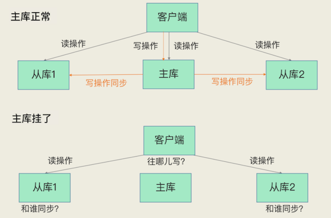
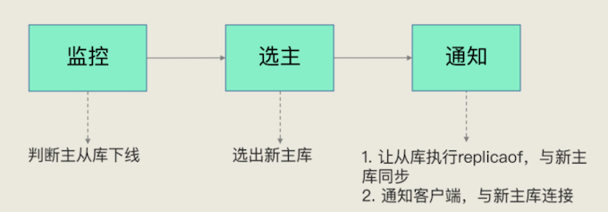
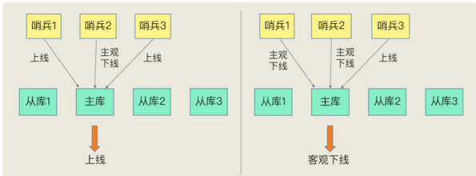
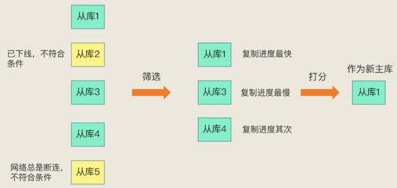
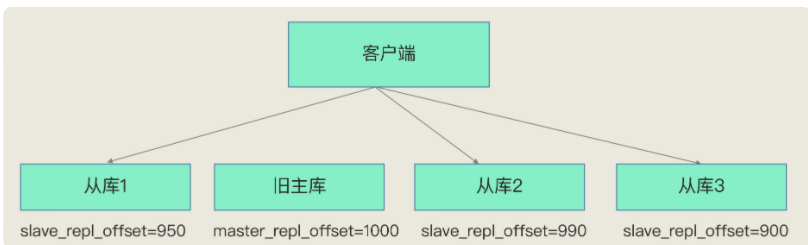

# **第七节	哨兵机制：主库不间断服务**

主从库集群模式下，如果从库发生故障了，客户端可以继续向主库或其他从库发送请求，进行相关的操作，但是如果主库发生故障了，那就直接会影响到从库的同步，因为从库没有相应的主库可以进行数据复制操作了。

* 如果客户端发送的都是读操作请求，那还可以由从库继续提供服务，这在纯读的业务场景下还能被接受
* **一旦有写操作请求了，按照主从库模式下的读写分离要求，需要由主库来完成写操作**，此时，也没有实例可以来服务客户端的写操作请求了

**无论是写服务中断，还是从库无法进行数据同步，都是不能接受的。**

**如果主库挂了，我们就需要运行一个新主库，比如说把一个从库切换为主库，把它当成主库**

1. 主库真的挂了吗？
2. 该选择哪个从库作为主库？
3. 怎么把新主库的相关信息通知给从库和客户端呢？

这就要提到哨兵机制了。在 Redis 主从集群中，**哨兵机制是实现主从库自动切换的关键机制**，它有效地解决了主从复制模式下故障转移的这三个问题。

## **1、哨兵机制的基本流程**

哨兵其实就是一个运行在特殊模式下的 Redis 进程，主从库实例运行的同时，它也在运行。哨兵主要负责的就是三个任务：监控、选主（选择主库）和通知。

哨兵的主要职责： 

1. 监控：通过PING来监控主从 
2. 选主：主库挂了，从从库中按一定的机制选择一个新主库 
3. 通知：通知其他从库和客户端新的主库信息

### **1-1 监控**

**监控是指哨兵进程在运行时，周期性地给所有的主从库发送 `PING` 命令，检测它们是否仍然在线运行。**

* 如果**从库没有在规定时间内响应哨兵的 PING 命令**，哨兵就会把它标记为“下线状态”；
* 如果主库也没有在规定时间内响应哨兵的 PING 命令，哨兵就会判定主库下线，然后开始自动切换主库的流程。

这个流程首先是执行哨兵的第二个任务，选主

### **1-2 选主**

主库挂了以后，哨兵就需要从很多个从库里，按照一定的规则选择一个从库实例，把它作为新的主库。

这一步完成后，现在的集群里就有了新主库。

### **1-3 通知**

* 在执行通知任务时，哨兵会把新主库的连接信息发给其他从库，让它们执行 `replicaof` 命令，和新主库建立连接，并进行数据复制
* **同时，哨兵会把新主库的连接信息通知给客户端，让它们把请求操作发到新主库上**。

通知任务相对来说比较简单，哨兵只需要把新主库信息发给从库和客户端，让它们和新主库建立连接就行，并不涉及决策的逻辑。

**但是，在监控和选主这两个任务中，哨兵需要做出两个决策：**

* 在监控任务中，哨兵需要判断主库是否处于下线状态；
* 在选主任务中，哨兵也要决定选择哪个从库实例作为主库。

**哨兵对主库的下线判断有“主观下线”和“客观下线”两种**

## **2、主观下线和客观下线**

### **2-1 主观下线**

**哨兵进程会使用 PING 命令检测它自己和主、从库的网络连接情况，用来判断实例的状态。**

如果哨兵发现主库或从库对 PING 命令的响应超时了，那么，哨兵就会先把它标记为“主观下线”

**哨兵进程会使用 PING 命令检测它自己和主、从库的网络连接情况，用来判断实例的状态。**

* 果哨兵发现主库或从库对 PING 命令的响应超时了，那么**，哨兵就会先把它标记为“主观下线”**。
* 如果检测的是从库，那么，哨兵简单地把它标记为“主观下线”就行了，因为从库的下线影响一般不太大，集群的对外服务不会间断。

如果检测的是主库，那么，哨兵还不能简单地把它标记为“主观下线”，开启主从切换。**因为很有可能存在这么一个情况：那就是哨兵误判了，其实主库并没有故障。**

**一旦启动了主从切换，后续的选主和通知操作都会带来额外的计算和通信开销。**

首先，我们要知道啥叫误判。很简单，就是主库实际并没有下线，但是哨兵误以为它下线了。**误判一般会发生在集群网络压力较大、网络拥塞，或者是主库本身压力较大的情况下**。

一旦哨兵判断主库下线了，就会开始选择新主库，并让从库和新主库进行数据同步，这个过程本身就会有开销，例如，哨兵要花时间选出新主库，从库也需要花时间和新主库同步。

**那怎么减少误判呢？**

### **2-2 哨兵集群**

**哨兵机制通常会采用多实例组成的集群模式进行部署，这也被称为哨兵集群。**

引入多个哨兵实例一起来判断，就可以避免单个哨兵因为自身网络状况不好，而误判主库下线的情况。

**同时，多个哨兵的网络同时不稳定的概率较小，由它们一起做决策，误判率也能降低。**

### **2-3 客观下线**

**在判断主库是否下线时，不能由一个哨兵说了算，只有大多数的哨兵实例，都判断主库已经“主观下线”了，主库才会被标记为“客观下线”**，这个叫法也是表明主库下线成为一个客观事实了

**判断原则就是：少数服从多数。同时，这会进一步触发哨兵开始主从切换流程。**

* Redis 主从集群有一个主库、三个从库，还有三个哨兵实例。在图片的左边，哨兵 2 判断主库为“主观下线”，但哨兵 1 和 3 却判定主库是上线状态，此时，主库仍然被判断为处于上线状态。
* 哨兵 1 和 2 都判断主库为“主观下线”，此时，即使哨兵 3 仍然判断主库为上线状态，主库也被标记为“客观下线”了。

简单来说，“客观下线”的标准就是，**当有 N 个哨兵实例时，最好要有 N/2 + 1 个实例判断主库为“主观下线”，才能最终判定主库为“客观下线”**，就可以减少误判的概率，也能避免误判带来的无谓的主从库切换。（当然，有多少个实例做出“主观下线”的判断才可以，可以由 Redis 管理员自行设定）。

## **3、如何选定新主库？**

哨兵选择新主库的过程称为“筛选 + 打分”

* 我们在多个从库中，**先按照一定的筛选条件**，把不符合条件的从库去掉。
* 然后，**我们再按照一定的规则**，给剩下的从库逐个打分，将得分最高的从库选为新主库

### **3-1 筛选**

**在选主时，除了要检查从库的当前在线状态，还要判断它之前的网络连接状态。**

如果从库总是和主库断连，而且断连次数超出了一定的阈值，我们就有理由相信，这个从库的网络状况并不是太好，就可以把这个从库筛掉了。

具体怎么判断呢？你使用配置项 `down-after-milliseconds * 10`。

**其中，`down-after-milliseconds` 是我们认定主从库断连的最大连接超时时间。**

**如果在 `down-after-milliseconds` 毫秒内，主从节点都没有通过网络联系上，我们就可以认为主从节点断连了。**

如果发生断连的次数超过了` 10 `次，就说明这个从库的网络状况不好，不适合作为新主库。

> 新建 `sentinal.conf` 文件进行配置，不在 `redis.conf ` 中

### **3-2 打分**

我们可以分别按照三个规则依次进行三轮打分，这三个规则分别是从**库优先级、从库复制进度以及从库 ID 号**。

只要在某一轮中，有从库得分最高，那么它就是主库了，选主过程到此结束。如果没有出现得分最高的从库，那么就继续进行下一轮。

***第一轮：优先级最高的从库得分高。***

用户可以通过 `slave-priority` 配置项，给不同的从库设置不同优先级。

你有两个从库，它们的内存大小不一样，你可以手动给内存大的实例设置一个高优先级。在选主时，哨兵会给优先级高的从库打高分，如果有一个从库优先级最高，那么它就是新主库了。如果从库的优先级都一样，那么哨兵开始第二轮打分。

***第二轮：和旧主库同步程度最接近的从库得分高。***

如果选择和旧主库同步最接近的那个从库作为主库，那么，这个新主库上就有最新的数据。

主从库同步时有个命令传播的过程。在这个过程中，**主库会用 `master_repl_offset `记录当前的最新写操作在 `repl_backlog_buffer` 中的位置，而从库会用 `slave_repl_offset` 这个值记录当前的复制进度。**

我们想要找的从库，它的 `slave_repl_offset` 需要最接近 `master_repl_offset`。

如果在所有从库中，有从库的 `slave_repl_offset` 最接近 `master_repl_offset`，那么它的得分就最高，可以作为新主库。

`master_repl_offset`是单调增加的，它的值可以大于`repl_backlog_size`。Redis会用一个名为`repl_backlog_idx`的值记录在环形缓冲区中的最新写入位置。

举个例子，例如写入len的数据，那么

* `master_repl_offset += len`
* `repl_backlog_idx += len`
* 如果`repl_backlog_idx`等于`repl_backlog_size`时，`repl_backlog_idx`会被置为0，表示从环形缓冲区开始位置继续写入。

而在实际的选主代码层面，sentinel是直接比较从库的`slave_repl_offset`，来选择和主库最接近的从库。

旧主库的 `master_repl_offset` 是 1000，从库 1、2 和 3 的 `slave_repl_offset` 分别是 950、990 和 900，那么，**从库 2 就应该被选为新主库**。

当然，如果有两个从库的 `slave_repl_offset` 值大小是一样的（例如，从库 1 和从库 2 的 `slave_repl_offset` 值都是 990），我们就需要给它们进行第三轮打分了。

***第三轮：ID 号小的从库得分高。***

每个实例都会有一个 ID，这个 ID 就类似于这里的从库的编号。目前，Redis 在选主库时，有一个默认的规定：

**在优先级和复制进度都相同的情况下，ID 号最小的从库得分最高，会被选为新主库。**

* 首先，**哨兵会按照在线状态、网络状态，筛选过滤掉一部分不符合要求的从库**，
* 然后，**依次按照优先级、复制进度、ID 号大小再对剩余的从库进行打分**，只要有得分最高的从库出现，就把它选为新主库。

## **4、本节小结**

哨兵机制，它是实现 Redis 不间断服务的重要保证。**具体来说，主从集群的数据同步，是数据可靠的基础保证；而在主库发生故障时，自动的主从切换是服务不间断的关键支撑。**

Redis 的哨兵机制自动完成了以下三大功能，从而实现了主从库的自动切换，可以降低 Redis 集群的运维开销：

* 监控主库运行状态，并判断主库是否客观下线；
* 在主库客观下线后，选取新主库；
* 选出新主库后，通知从库和客户端。

为了降低误判率，在实际应用时，哨兵机制通常采用多实例的方式进行部署，多个哨兵实例通过“少数服从多数”的原则，来判断主库是否客观下线

**亮点**

* 哨兵的本质：是一个redis实例，要做三件事：监控主库，选举新主库，通知客户端和从机
* 哨兵是通过心跳检测，监控主库状态，主库下线被分为：主观下线和客观下线、
* 哨兵监控是可能误判的，所以哨兵一般是集群部署，采取投票的形式减少误判
* 选定新主库规则是先筛选在打分，得分高的会被选为新主库
* 筛选规则：从库当前的网络连接状况，以及之前的网络连接状况，筛选中断次数标准可以配置
* 打分规则：从库的优先级，数据同步状况，Id号大小，可以分为三轮，只要有一轮出现得分高的，就能选出
* 判断哪个从库的数据同步最接近主库，不是拿从库与主库比较，而是从库之间互相比较，谁大谁就是最接近的

**本节一问**

**主从库切换是需要一定时间的**。所以，在这个切换过程中，客户端能否正常地进行请求操作呢？如果想要应用程序不感知服务的中断，还需要哨兵或需要客户端再做些什么吗

* 绝大部分的读请求，可以响应。由于主库实例挂掉，肯定有小部分数据未被同步至从实例，而这部分数据的读请求是失败的。
* 如果这小部分数据是新写数据，且未同步的话，发往从库的读请求是会失败的。但如果是更新的数据，且未同步的话，那么从库的读请求会返回旧值
* 由于主从机制实现了读写分离，主实例挂掉，无法响应写请求。

