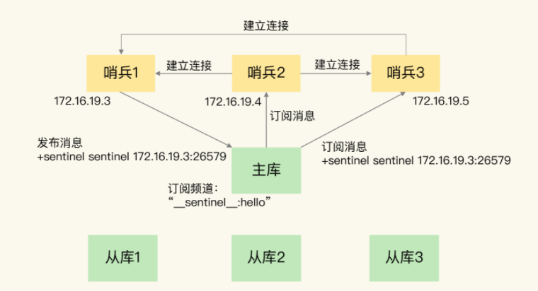
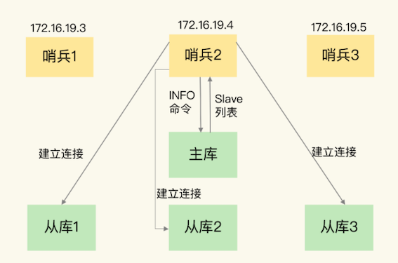
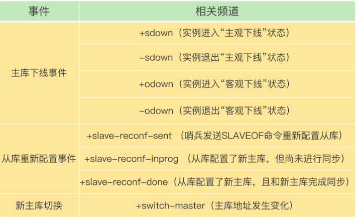
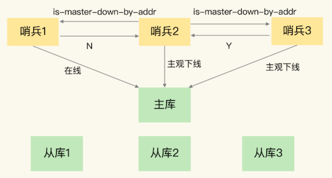
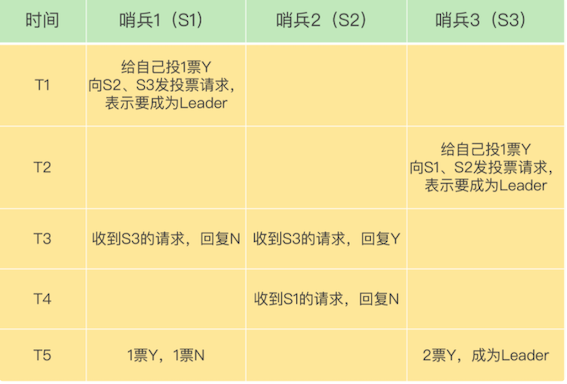

# **第八节	哨兵集群：哨兵挂了，主从库切换**

主从库的自动切换。通过部署多个实例，就形成了一个哨兵集群。哨兵集群中的多个实例共同判断，可以降低对主库下线的误判率。

**如果有哨兵实例在运行时发生了故障，主从库还能正常切换吗？**

一旦多个实例组成了**哨兵集群**，即使有哨兵实例出现故障挂掉了，其他哨兵还能继续协作完成主从库切换的工作，包括判定主库是不是处于下线状态，选择新主库，以及通知从库和客户端。


署过哨兵集群，配置哨兵的信息，**设置主库的 IP 和端口**，并没有配置其他哨兵的连接信息。

```
sentinel monitor <master-name> <ip> <redis-port> <quorum> 
```

## **1、基于 pub/sub 机制的哨兵集群组成**

哨兵实例之间可以相互发现，要归功于 Redis 提供的 pub/sub 机制，也就是发布 / 订阅机制。

### **1-1 哨兵只要和主/从库建立起了连接**

* **哨兵只要和主库建立起了连接，就可以在主库上发布消息了，比如说发布它自己的连接信息（IP 和端口）。**
* **它也可以从主库上订阅消息，获得其他哨兵发布的连接信息**。
* **当多个哨兵实例都在主库上做了发布和订阅操作后，它们之间就能知道彼此的 IP 地址和端口。**

除了哨兵实例，我们自己编写的应用程序也可以通过 Redis 进行消息的发布和订阅。为了区分不同应用的消息，**Redis 会以频道的形式，对这些消息进行分门别类的管理**。

<span style="color:red">所谓的频道，实际上就是消息的类别。当消息类别相同时，它们就属于同一个频道。</span>

**只有订阅了同一个频道的应用，才能通过发布的消息进行信息交换。**

在主从集群中，主库上有一个名为`“__sentinel__:hello”`的频道，不同哨兵就是通过它来相互发现，实现互相通信的。

**<span style="color:red">哨兵 1 把自己的 IP（172.16.19.3）和端口（26579）发布到`“__sentinel__:hello”`频道上，哨兵 2 和 3 订阅了该频道。那么此时，哨兵 2 和 3 就可以从这个频道直接获取哨兵 1 的 IP 地址和端口号。</span>**

* 哨兵 2、3 可以和哨兵 1 建立网络连接。
* 通过这个方式，哨兵 2 和 3 也可以建立网络连接，这样一来，哨兵集群就形成了。

它们相互间可以通过网络连接进行通信，比如说对主库有没有下线这件事儿进行判断和协商。



* 哨兵除了彼此之间建立起连接形成集群外，还需要和从库建立连接。
* 这是因为，在哨兵的监控任务中，它需要对主从库都进行心跳判断，而且在主从库切换完成后，它还需要通知从库，让它们和新主库进行同步。


### **1-2 哨兵是如何知道从库的 IP 地址和端口**

**<span style="color:red">这是由哨兵向主库发送 INFO 命令来完成的</span>**



* 哨兵 2 给主库发送 INFO 命令，主库接受到这个命令后，**就会把从库列表返回给哨兵**。
* 哨兵就可以根据从库列表中的连接信息，和每个从库建立连接，并在这个连接上持续地对从库进行监控。
* 哨兵 1 和 3 可以通过相同的方法和从库建立连接


**<span style="color:red">通过 pub/sub 机制，哨兵之间可以组成集群，同时，哨兵又通过 INFO 命令，获得了从库连接信息，也能和从库建立连接，并进行监控了。</span>**

哨兵不能只和主、从库连接。因为，主从库切换后，客户端也需要知道新主库的连接信息，才能向新主库发送请求操作。所以，**哨兵还需要完成把新主库的信息告诉客户端这个任务**。

**客户端能够获取到哨兵集群在监控、选主、切换**这个过程中发生的各种事件仍然可以依赖 pub/sub 机制，来帮助我们完成哨兵和客户端间的信息同步。

## **2、基于 pub/sub 机制的客户端事件通知**

* **<span style="color:red">从本质上说，哨兵就是一个运行在特定模式下的 Redis 实例，只不过它并不服务请求操作，只是完成监控、选主和通知的任务。</span>**
* **所以，每个哨兵实例也提供 pub/sub 机制，客户端可以从哨兵订阅消息。**
* 哨兵提供的消息订阅频道有很多，不同频道包含了主从库切换过程中的不同关键事件。

关键事件包括主库下线判断、新主库选定、从库重新配置。



**让客户端从哨兵这里订阅消息了。**

具体的操作步骤是，**客户端读取哨兵的配置文件后，可以获得哨兵的地址和端口，和哨兵建立网络连接。**

然后，我们可以在客户端执行订阅命令，来获取不同的事件消息。

举个例子，你可以执行如下命令，来订阅“所有实例进入客观下线状态的事件”：

```
SUBSCRIBE +odown
```

当然，你也可以执行如下命令，订阅所有的事件：

```
PSUBSCRIBE  *
```

**当哨兵把新主库选择出来后，客户端就会看到下面的 `switch-master`**

这个事件表示主库已经切换了，新主库的 IP 地址和端口信息已经有了。这个时候，客户端就可以用这里面的新主库地址和端口进行通信了。

```
switch-master <master name> <oldip> <oldport> <newip> <newport>
```

有了这些事件通知，客户端不仅可以在主从切换后得到新主库的连接信息，还可以监控到主从库切换过程中发生的各个重要事件。


 **<span style="color:red">有了 pub/sub 机制，哨兵和哨兵之间、哨兵和从库之间、哨兵和客户端之间就都能建立起连接了</span>**
 
 还需要考虑一个问题：主库故障以后，哨兵集群有多个实例，那怎么确定由哪个哨兵来进行实际的主从切换呢？
 

## **3、由哪个哨兵执行主从切换？**

确定由哪个哨兵执行主从切换的过程，和主库“客观下线”的判断过程类似，也是一个“投票仲裁”的过程

**哨兵集群要判定主库“客观下线”，需要有一定数量的实例都认为该主库已经“主观下线”了。**

* **任何一个实例只要自身判断主库“主观下线”后**，就会给其他实例发送` is-master-down-by-addr`命令。
* 其他实例会根据自己和主库的连接情况，做出 Y 或 N 的响应，Y 相当于赞成票，N 相当于反对票。



**主库为“客观下线”:**

一个哨兵获得了仲裁所需的赞成票数后，就可以标记主库为“客观下线”。

**这个所需的赞成票数是通过哨兵配置文件中的 quorum 配置项设定的**。例如，现在有 5 个哨兵，quorum 配置的是 3，那么，一个哨兵需要 3 张赞成票，就可以标记主库为“客观下线”了。这 3 张赞成票包括哨兵自己的一张赞成票和另外两个哨兵的赞成票。
 
**投票过程确定 Leader:**
 
这个个哨兵就可以再给其他哨兵发送命令，表明希望由自己来执行主从切换，并让所有其他哨兵进行投票。这个投票过程称为“Leader 选举”。因为最终执行主从切换的哨兵称为 Leader，投票过程就是确定 Leader。

在投票过程中，任何一个想成为 Leader 的哨兵，要满足两个条件：

* 第一，拿到半数以上的赞成票；
* 第二，**拿到的票数同时还需要大于等于哨兵配置文件中的 quorum 值**。
* 以 3 个哨兵为例，假设此时的 quorum 设置为 2，那么，任何一个想成为 Leader 的哨兵只要拿到 2 张赞成票，就可以了。


 
 * 在 T1 时刻，S1 判断主库为“客观下线”，它想成为 Leader，就先给自己投一张赞成票，然后分别向 S2 和 S3 发送命令，表示要成为 Leader。
 * 在 T2 时刻，S3 判断主库为“客观下线”，它也想成为 Leader，所以也先给自己投一张赞成票，再分别向 S1 和 S2 发送命令，表示要成为 Leader。
 * 在 T3 时刻，S1 收到了 S3 的 Leader 投票请求。因为 S1 已经给自己投了一票 Y，所以它不能再给其他哨兵投赞成票了，所以 S1 回复 N 表示不同意。同时，S2 收到了 T2 时 S3 发送的 Leader 投票请求。因为 S2 之前没有投过票，它会给第一个向它发送投票请求的哨兵回复 Y，给后续再发送投票请求的哨兵回复 N，所以，在 T3 时，S2 回复 S3，同意 S3 成为 Leader。
 * 在 T4 时刻，S2 才收到 T1 时 S1 发送的投票命令。因为 S2 已经在 T3 时同意了 S3 的投票请求，此时，S2 给 S1 回复 N，表示不同意 S1 成为 Leader。发生这种情况，是因为 S3 和 S2 之间的网络传输正常，**而 S1 和 S2 之间的网络传输可能正好拥塞了，导致投票请求传输慢了**。
 * 在 T5 时刻，S1 得到的票数是来自它自己的一票 Y 和来自 S2 的一票 N。而 S3 除了自己的赞成票 Y 以外，还收到了来自 S2 的一票 Y。此时，S3 不仅获得了半数以上的 Leader 赞成票，也达到预设的 quorum 值（quorum 为 2），所以它最终成为了 Leader
 * S3 会开始执行选主操作，而且在选定新主库后，会给其他从库和客户端通知新主库的信息。


**如果 S3 没有拿到 2 票 Y，那么这轮投票就不会产生 Leader。**

* **哨兵集群会等待一段时间（也就是哨兵故障转移超时时间的 2 倍），再重新选举**。
* 这是因为，哨兵集群能够进行成功投票，很大程度上依赖于选举命令的正常网络传播。
* 如果网络压力较大或有短时堵塞，就可能导致没有一个哨兵能拿到半数以上的赞成票。所以，等到网络拥塞好转之后，再进行投票选举，成功的概率就会增加。


**需要注意的是**

如果哨兵集群只有 2 个实例，此时，一个哨兵要想成为 Leader，必须获得 2 票，而不是 1 票。所以，如果有个哨兵挂掉了，那么，此时的集群是无法进行主从库切换的。 **<span style="color:red">因此，通常我们至少会配置 3 个哨兵实例</span>**


## **4、本节小结**

* 为了实现主从切换，我们引入了哨兵；
* 为了避免单个哨兵故障后无法进行主从切换，以及为了减少误判率，又引入了哨兵集群；
* 哨兵集群又需要有一些机制来支撑它的正常运行。

这节课上，我就向你介绍了支持哨兵集群的这些关键机制，包括：

* 基于 pub/sub 机制的哨兵集群组成过程；
* 基于 INFO 命令的从库列表，这可以帮助哨兵和从库建立连接；
* 基于哨兵自身的 pub/sub 功能，这实现了客户端和哨兵之间的事件通知。

对于主从切换，当然不是哪个哨兵想执行就可以执行的，否则就乱套了。所以，这就需要哨兵集群在判断了主库“客观下线”后，经过投票仲裁，选举一个 Leader 出来，由它负责实际的主从切换，即由它来完成新主库的选择以及通知从库与客户端。

**<span style="color:red">要保证所有哨兵实例的配置是一致的，尤其是主观下线的判断值 down-after-milliseconds。</span>**

> `down-after-milliseconds` 是我们认定主从库断连的最大连接超时时间

因为这个值在不同的哨兵实例上配置不一致，导致哨兵集群一直没有对有故障的主库形成共识，也就没有及时切换主库，最终的结果就是集群服务不稳定。


**哨兵集群的工作机制**

* 哨兵之间互通机制：基于pub/sub机制，在主库中有一个`"__sentinel__:hello"`的频道，哨兵之间互相发现通信
* 哨兵与主从库互通机制：哨兵向主库发送INFO指令，可以获取所有从库的信息，实现对主库，从库的监控
* 哨兵判定主库异常机制：**哨兵集群中任意一个实例都可以发起主库异常“投票仲裁”流程**
* 哨兵之间的互动是通过发布订阅机制完成的，利用自身的特性来实现。
* 哨兵之间通信不是哨兵之间之间联系，而是通过订阅主库的同一频道来获取彼此的信息
* 哨兵是通过INFO指令，从主库获取从库信息，并与每个从库建立连接，监控所有主从库状态
* 哨兵是一个特殊的redis实例，所以客户端可以订阅哨兵的指定频道获得redis主从库的信息
* 哨兵集群执行主从切换机制：谁发现，谁就发起投票流程，谁获得多数票，谁就是哨兵Leader，由Leader负责主从库切换
* 哨兵集群Leader选举成功与否，依赖于网络通信状况，网络拥塞会导致选举失败，重新进行新一轮选举


**本节一问**

假设有一个 Redis 集群，是“一主四从”，同时配置了包含 5 个哨兵实例的集群，quorum 值设为 2。在运行过程中，如果有 3 个哨兵实例都发生故障了，此时，Redis 主库如果有故障，还能正确地判断主库“客观下线”吗？如果可以的话，还能进行主从库自动切换吗？

此外，哨兵实例是不是越多越好呢，如果同时调大 `down-after-milliseconds` 值，对减少误判是不是也有好处呢？

**哨兵实例是不是越多越好？**

并不是，我们也看到了，哨兵在判定“主观下线”和选举“哨兵领导者”时，都需要和其他节点进行通信，交换信息，哨兵实例越多，通信的次数也就越多，而且部署多个哨兵时，会分布在不同机器上，节点越多带来的机器故障风险也会越大，这些问题都会影响到哨兵的通信和选举，出问题时也就意味着选举时间会变长，切换主从的时间变久。

**调大down-after-milliseconds值，对减少误判是不是有好处**？

是有好处的，适当调大down-after-milliseconds值，当哨兵与主库之间网络存在短时波动时，可以降低误判的概率。但是调大down-after-milliseconds值也意味着主从切换的时间会变长，对业务的影响时间越久，我们需要根据实际场景进行权衡，设置合理的阈值。