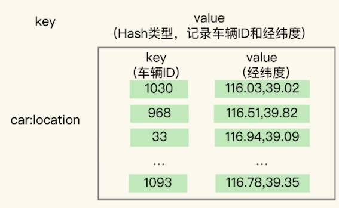
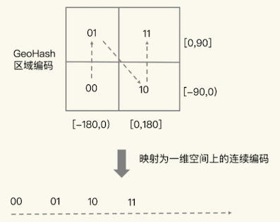
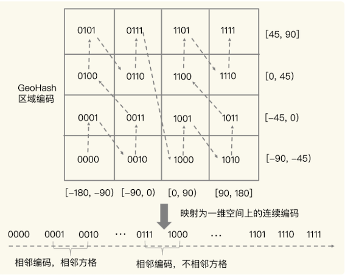
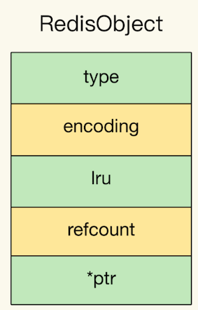

# **第三节 GEO，一种可以实现LBS服务的数据结构**

上一节讲了 5 大基本数据类型：**String、List、Hash、Set 和 Sorted Set，它们可以满足大多数的数据存储需求，但是在面对海量数据统计时，它们的内存开销很大**，而且对于一些特殊的场景，它们是无法支持的。

**Redis 还提供了 3 种扩展数据类型，分别是 Bitmap、HyperLogLog 和 GEO**

## **1、面向 LBS 应用的 GEO 数据类型**

基于位置信息服务（Location-Based Service，LBS）的应用。LBS 应用访问的数据是和人或物关联的一组经纬度信息，而且要能查询相邻的经纬度范围，GEO 就非常适合应用在 LBS 服务的场景中，我们来看一下它的底层结构。

## **2、GEO 的底层结构**

### **2-1 LBS 应用纬度的存取特点**

**一般来说，在设计一个数据类型的底层结构时，我们首先需要知道，要处理的数据有什么访问特点。**所以，我们需要先搞清楚位置信息到底是怎么被存取的。

以叫车服务为例，来分析下 LBS 应用中经纬度的存取特点。

* 每一辆网约车都有一个编号（例如 33），网约车需要将自己的经度信息（例如 116.034579）和纬度信息（例如 39.000452 ）发给叫车应用。
* 用户在叫车的时候，叫车应用会根据用户的经纬度位置（例如经度 116.054579，纬度 39.030452），查找用户的附近车辆，并进行匹配。
* 等把位置相近的用户和车辆匹配上以后，叫车应用就会根据车辆的编号，获取车辆的信息，并返回给用户。

**一辆车（或一个用户）对应一组经纬度，并且随着车（或用户）的位置移动，相应的经纬度也会变化。**

数据记录模式属于一个 key（例如车 ID）对应一个 value（一组经纬度）。当有很多车辆信息要保存时，就需要有一个集合来保存一系列的 key 和 value。

**Hash 集合类型可以快速存取一系列的 key 和 value**，**正好可以用来记录一系列车辆 ID 和经纬度的对应关系**，所以，我们可以把不同车辆的 ID 和它们对应的经纬度信息存在 Hash 集合中



**Hash 类型的 HSET 操作命令，会根据 key 来设置相应的 value 值**，所以，我们可以用它来快速地更新车辆变化的经纬度信息。

### **2-2 Sorted Set 类型**

Sorted Set 类型也支持一个 key 对应一个 value 的记录模式，其中，key 就是 Sorted Set 中的元素，而 value 则是元素的权重分数。更重要的是，Sorted Set 可以根据元素的权重分数排序，支持范围查询。

**实际上，GEO 类型的底层数据结构就是用 Sorted Set 来实现的**

用 Sorted Set 来保存车辆的经纬度信息时，Sorted Set 的元素是车辆 ID，元素的权重分数是经纬度信息，如下图所示：


Sorted Set 元素的权重分数是一个浮点数（float 类型），而一组经纬度包含的是经度和纬度两个值，是没法直接保存为一个浮点数的，那具体该怎么进行保存呢？

这就要用到 GEO 类型中的 GeoHash 编码了。

## **3、GeoHash 的编码方法**

为了能高效地对经纬度进行比较，Redis 采用了业界广泛使用的 GeoHash 编码方法，这个方法的基本原理就是“二分区间，区间编码”。

**对一组经纬度进行 GeoHash 编码时，我们要先对经度和纬度分别编码，然后再把经纬度各自的编码组合成一个最终编码。**

### **3-1 经度和纬度的单独编码过程**

对于一个地理位置信息来说，它的经度范围是`[-180,180]`。GeoHash 编码会把一个经度值编码成一个 N 位的二进制值，我们来对经度范围`[-180,180]`做 N 次的二分区操作，其中 N 可以自定义。

在进行第一次二分区时，经度范围[-180,180]会被分成两个子区间：`[-180,0)` 和`[0,180]`（我称之为左、右分区）。

此时，我们可以查看一下要编码的经度值落在了左分区还是右分区。

**<span style="color:red">如果是落在左分区，我们就用 0 表示；如果落在右分区，就用 1 表示。这样一来，每做完一次二分区，我们就可以得到 1 位编码值。</span>**

我们再对经度值所属的分区再做一次二分区，**同时再次查看经度值落在了二分区后的左分区还是右分区，按照刚才的规则再做 1 位编码。当做完 N 次的二分区后，经度值就可以用一个 N bit 的数来表示了。**

举个例子，假设我们要编码的经度值是 116.37，我们用 5 位编码值（也就是 N=5，做 5 次分区）。

* 我们先做第一次二分区操作，把经度区间`[-180,180]`分成了左分区`[-180,0) `和右分区`[0,180]`，此时，经度值 `116.37` 是属于右分区`[0,180]`，所以，我们用 1 表示第一次二分区后的编码值。
*** 第二次二分区：把经度值 `116.37` 所属的`[0,180]`区间，分成`[0,90)` 和`[90, 180]`。**
* 此时，经度值 `116.37` 还是属于右分区`[90,180]`，所以，第二次分区后的编码值仍然为 `1`。
* 等到第三次对`[90,180]`进行二分区，经度值` 116.37` 落在了分区后的左分区`[90, 135) `中，所以，第三次分区后的编码值就是 0。

按照这种方法，做完 5 次分区后，我们把经度值 116.37 定位在`[112.5, 123.75]`这个区间，并且得到了经度值的 5 位编码值，即 11010。


对纬度的编码方式，和对经度的一样，只是纬度的范围是[-90，90]，下面这张表显示了对纬度值 39.86 的编码过程。


当一组经纬度值都编完码后，我们再把它们的各自编码值组合在一起，组合的规则是：**最终编码值的偶数位上依次是经度的编码值，奇数位上依次是纬度的编码值，其中，偶数位从 0 开始，奇数位从 1 开始。**


计算的经纬度`（116.37，39.86）`的各自编码值是 `11010 `和 `10111`，组合之后，第 0 位是经度的第 0 位 1，第 1 位是纬度的第 0 位 1，第 2 位是经度的第 1 位 1，第 3 位是纬度的第 1 位 0，以此类推，就能得到最终编码值 `1110011101`，如下图所示：


用了 GeoHash 编码后，原来无法用一个权重分数表示的一组经纬度（116.37，39.86）就可以用 1110011101 这一个值来表示，就可以保存为 Sorted Set 的权重分数了。

### **3-2 GeoHash 编码分区**

当然，使用 GeoHash 编码后，我们相当于把整个地理空间划分成了一个个方格，每个方格对应了 GeoHash 中的一个分区。

**举个例子。我们把经度区间`[-180,180]`做一次二分区，把纬度区间`[-90,90]`做一次二分区，就会得到 4 个分区。**我们来看下它们的经度和纬度范围以及对应的 GeoHash 组合编码。

* 分区一：`[-180,0)` 和`[-90,0)`，编码 00；
* 分区二：`[-180,0)` 和`[0,90]`，编码 01；
* 分区三：`[0,180]`和`[-90,0)`，编码 10；
* 分区四：`[0,180]`和`[0,90]`，编码 11。

这 4 个分区对应了 4 个方格，每个方格覆盖了一定范围内的经纬度值，分区越多，每个方格能覆盖到的地理空间就越小，也就越精准。我们把所有方格的编码值映射到一维空间时，相邻方格的 GeoHash 编码值基本也是接近的，



我们使用 Sorted Set 范围查询得到的相近编码值，在实际的地理空间上，也是相邻的方格，这就可以实现 LBS 应用“搜索附近的人或物”的功能了。

有的编码值虽然在大小上接近，但实际对应的方格却距离比较远。例如，我们用 4 位来做 GeoHash 编码，把经度区间`[-180,180]`和纬度区间`[-90,90]`各分成了 4 个分区，一共 `16` 个分区，对应了 16 个方格。编码值为 `0111` 和 `1000` 的两个方格就离得比较远，如下图所示：



所以，为了避免查询不准确问题，我们可以同时查询给定经纬度所在的方格周围的 `4` 个或 `8 `个方格。

GEO 类型是把经纬度所在的区间编码作为 `Sorted Set` 中元素的权重分数，把和经纬度相关的车辆 ID 作为 Sorted Set 中元素本身的值保存下来，这样相邻经纬度的查询就可以通过编码值的大小范围查询来实现了


## **4、如何操作 GEO 类型？**

在使用 GEO 类型时，我们经常会用到两个命令，分别是 GEOADD 和 GEORADIUS。

* `GEOADD `命令：用于把一组经纬度信息和相对应的一个 ID 记录到 GEO 类型集合中；
* `GEORADIUS` 命令：会根据输入的经纬度位置，查找以这个经纬度为中心的一定范围内的其他元素。当然，我们可以自己定义这个范围。

我还是以叫车应用的车辆匹配场景为例，介绍下具体如何使用这两个命令。

假设车辆 ID 是 33，经纬度位置是`（116.034579，39.030452）`，我们可以用一个 GEO 集合保存所有车辆的经纬度，集合 key 是 `cars:locations`。

执行下面的这个命令，**就可以把 ID 号为 33 的车辆的当前经纬度位置存入 GEO 集合中**：

```
GEOADD cars:locations 116.034579 39.030452 33
```

**基本的写法：`geoadd key longitude latitude member` 注： `latitude [ˈlætɪtjuːd]` 纬度 `longtitude` 经度**

当用户想要寻找自己附近的网约车时，LBS 应用就可以使用 GEORADIUS 命令。


例如，LBS 应用执行下面的命令时，Redis 会根据输入的用户的经纬度信息（116.054579，39.030452 ），**查找以这个经纬度为中心的 5 公里内的车辆信息，并返回给 LBS 应用。当然， 你可以修改“5”这个参数，来返回更大或更小范围内的车辆信息。**

```
GEORADIUS cars:locations 116.054579 39.030452 5 km ASC COUNT 10
```

**我们还可以进一步限定返回的车辆信息。**

比如，我们可以使用 `ASC` 选项，让返回的车辆信息按照距离这个中心位置**从近到远的方式来排序，以方便选择最近的车辆；**


## **5、如何自定义数据类型？**

但是有些场景下，我们对数据类型会有特殊需求，例如，我们需要一个数据类型既能像 Hash 那样支持快速的单键查询，又能像 Sorted Set 那样支持范围查询，此时，我们之前学习的这些数据类型就无法满足需求了。

为了实现自定义数据类型，**首先，我们需要了解 Redis 的基本对象结构 RedisObject，因为 Redis 键值对中的每一个值都是用 RedisObject 保存的**。

**RedisObject 包括元数据和指针：**

* **元数据的一个功能就是用来区分不同的数据类型**
* **指针用来指向具体的数据类型的值**

### **5-1 Redis 的基本对象结构**

**RedisObject** 的内部组成包括了 `type`、`encoding`、`lru `和 `refcount` 4 个元数据，以及 1 个`*ptr`指针。


* type：**表示值的类型**，涵盖了我们前面学习的五大基本类型；
* `encoding`：是值的编码方式，用来表示 Redis 中实现各个基本类型的底层数据结构，例如 SDS、压缩列表、哈希表、跳表等；
* `lru`：记录了这个对象最后一次被访问的时间，用于淘汰过期的键值对；
* `refcount`：记录了对象的引用计数；
* `*ptr`：是指向数据的指针。




**`RedisObject `结构借助`*ptr`指针，就可以指向不同的数据类型**

例如，`*ptr`指向一个 SDS 或一个跳表，就表示键值对中的值是 `String `类型或 `Sorted Set` 类型。

所以，我们在定义了新的数据类型后，也只要在 `RedisObject` 中设置好新类型的 `type` 和 `encoding`，再用`*ptr`指向新类型的实现，就行了。


## **6、开发一个新的数据类型**

了解了 RedisObject 结构后，定义一个新的数据类型也就不难了。

首先，我们需要为新数据类型定义好它的底层结构、type 和 encoding 属性值，然后再实现新数据类型的创建、释放函数和基本命令。

接下来，我以开发一个名字叫作 `NewTypeObject` 的新数据类型为例，来解释下具体的 4 个操作步骤。


### **6-1 第一步：定义新数据类型的底层结构**

我们用 `newtype.h ` 文件来保存这个新类型的定义，具体定义的代码如下所示：

```
struct NewTypeObject {
    struct NewTypeNode *head; 
    size_t len; 
}NewTypeObject;
```

其中，`NewTypeNode` 结构就是我们自定义的新类型的底层结构。我们为底层结构设计两个成员变量：一个是 Long 类型的 value 值，用来保存实际数据；一个是`*next`指针，指向下一个 `NewTypeNode`  结构。

```
struct NewTypeNode {
    long value;
    struct NewTypeNode *next;
};
```

从代码中可以看到，`NewTypeObject` 类型的底层结构其实就是一个 `Long` 类型的单向链表。当然，你还可以根据自己的需求，把 `NewTypeObject` 的底层结构定义为其他类型。

例如，如果我们想要 `NewTypeObject` 的查询效率比链表高，就可以把它的底层结构设计成一颗 `B+` 树。

### **6-2 第二步：在 RedisObject 的 type 属性中，增加这个新类型的定义**

这个定义是在 Redis 的 server.h 文件中。比如，我们增加一个叫作 `OBJ_NEWTYPE` 的宏定义，用来在代码中指代 `NewTypeObject` 这个新类型。

```
#define OBJ_STRING 0    /* String object. */
#define OBJ_LIST 1      /* List object. */
#define OBJ_SET 2       /* Set object. */
#define OBJ_ZSET 3      /* Sorted set object. */
…
#define OBJ_NEWTYPE 7
```

### **6-3 第三步：开发新类型的创建和释放函数**

Redis 把数据类型的创建和释放函数都定义在了 `object.c` 文件中。所以，我们可以在这个文件中增加 `NewTypeObject` 的创建函数 `createNewTypeObject`，如下所示：

```
robj *createNewTypeObject(void){
   NewTypeObject *h = newtypeNew(); 
   robj *o = createObject(OBJ_NEWTYPE,h);
   return o;
}
```

`createNewTypeObject` 分别调用了 `newtypeNew` 和 `createObject` 两个函数，我分别来介绍下。

先说 `newtypeNew` 函数。它是用来为新数据类型初始化内存结构的。这个初始化过程主要是用 `zmalloc` 做底层结构分配空间，以便写入数据。

```
NewTypeObject *newtypeNew(void){
    NewTypeObject *n = zmalloc(sizeof(*n));
    n->head = NULL;
    n->len = 0;
    return n;
}
```

`newtypeNew` 函数涉及到新数据类型的具体创建，而 Redis 默认会为每个数据类型定义一个单独文件，实现这个类型的创建和命令操作，例如，`t_string.c` 和 `t_list.c` 分别对应 `String` 和` List` 类型。

按照 Redis 的惯例，我们就把 `newtypeNew` 函数定义在名为 `t_newtype.c` 的文件中。

`createObject` 是 `Redis` 本身提供的 `RedisObject` 创建函数，它的参数是数据类型的 `type` 和指向数据类型实现的指针`*ptr`。

我们给 createObject 函数中传入了两个参数，分别是新类型的 type 值 `OBJ_NEWTYPE`，以及指向一个初始化过的 `NewTypeObject` 的指针。这样一来，创建的 `RedisObject` 就能指向我们自定义的新数据类型了。

```
robj *createObject(int type, void *ptr) {
    robj *o = zmalloc(sizeof(*o));
    o->type = type;
    o->ptr = ptr;
    ...
    return o;
}
```

对于释放函数来说，它是创建函数的反过程，是用 zfree 命令把新结构的内存空间释放掉。

### **6-4 第四步：开发新类型的命令操作**

简单来说，增加相应的命令操作的过程可以分成三小步：

1.在 `t_newtype.c `文件中增加命令操作的实现。比如说，我们定义 `ntinsertCommand` 函数，由它实现对 `NewTypeObject` 单向链表的插入操作：

```
void ntinsertCommand(client *c){
  //基于客户端传递的参数，实现在NewTypeObject链表头插入元素
}
```

2.在 server.h 文件中，声明我们已经实现的命令，以便在 server.c 文件引用这个命令，例如：

```
void ntinsertCommand(client *c)
```

3.在 `server.c` 文件中的 `redisCommandTable` 里面，把新增命令和实现函数关联起来。例如，新增的 ntinsert 命令由 `ntinsertCommand` 函数实现，我们就可以用 `ntinsert` 命令给 `NewTypeObject` 数据类型插入元素了。

```
struct redisCommand redisCommandTable[] = { 
...
{"ntinsert",ntinsertCommand,2,"m",...}
}
```

此时，我们就完成了一个自定义的 `NewTypeObject` 数据类型，可以实现基本的命令操作了。当然，如果你还希望新的数据类型能被持久化保存，我们还需要在 Redis 的 `RDB` 和 `AOF` 模块中增加对新数据类型进行持久化保存的代码，

## **7、本节小结**

GEO 本身并没有设计新的底层数据结构，而是直接使用了 Sorted Set 集合类型。

* `GEO` 类型使用 `GeoHash` 编码方法实现了经纬度到 `Sorted Set` 中元素权重分数的转换，这其中的两个关键机制就是对二维地图做区间划分，以及对区间进行编码。
* 一组经纬度落在某个区间后，就用区间的编码值来表示，并把编码值作为 `Sorted Se` 元素的权重分数。
* 这样一来，我们就可以把经纬度保存到 `Sorted Set` 中，利用 `Sorted Set` 提供的“按权重进行有序范围查找”的特性，实现 LBS 服务中频繁使用的“搜索附近”的需求。

GEO 属于 Redis 提供的扩展数据类型。扩展数据类型有两种实现途径：

* 一种是基于现有的数据类型，通过数据编码或是实现新的操作的方式，来实现扩展数据类型，例如基于 Sorted Set 和 GeoHash 编码实现 GEO，以及基于 String 和位操作实现 Bitmap；
* 另一种就是开发自定义的数据类型，具体的操作是增加新数据类型的定义，实现创建和释放函数，实现新数据类型支持的命令操作

### **7-1 要点&亮点？**

* GEO的原理，这个是我之前所不知道的，学完后对GEO有了一些认知
* Redis居然支持自定义数据存储结构，这打开了我的眼界
* **GEO的底层实现，是sortSet，元素是车辆信息，权重是车辆经纬度转换过来的float值**
* **GEOHash编码，基本原理“二分区间，区间编码”（二分法的应用，将一个值编码成N位的二进制值）**
* **GEO使用GEOHash编码后，将经纬度，按照纬奇经偶位分别填充组合，得到一个车辆的经纬度编码值**
* GEOHash编码实现的效果是将一个空间分割成为一个个方块，可以实现LBS服务（但编码值相近，不一定位置相近）


### **7-2 每课一问**

Redis 的 5 大基本数据类型和 3 个扩展数据类型


