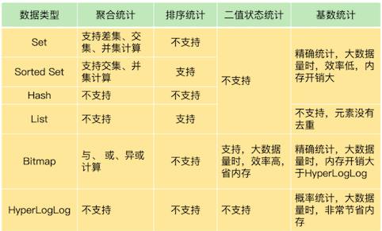
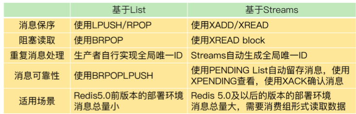

# **第六节 Redis 的数据结构**

## **1、章节小结**

### **1-1 Redis的String类型数据结构，及其底层实现**

* String 在保存的键值对本身占用的内存空间不大时，String 类型的元数据开销就占据主导了，**这里面包括了 RedisObject 结构、SDS 结构、dictEntry 结构的内存开销**。
* 使用压缩列表保存数据。当然，使用 Hash 这种集合类型保存单值键值对的数据时，我们需要将单值数据拆分成两部分，分别作为 Hash 集合的键和值，就像刚才案例中用二级编码来表示图片 ID
* 如果你想知道键值对采用不同类型保存时的内存开销，可以在**[这个网址](http://www.redis.cn/redis_memory/)**里输入你的键值对长度和使用的数据类型，这样就能知道实际消耗的内存大小了


**Redis的String类型数据结构，及其底层实现**

*  Redis的String类型数据结构，及其底层实现
*  可以巧妙的利用Redis的底层数据结构特性，降低资源消耗
*  Simple Dynamic String结构
	* `buf`：字节数组，保存实际数据。为了表示字节数组的结束，Redis 会自动在数组最后加一个`“\0”`，这就会额外占用 1 个字节的开销。
	* len：占 4 个字节，**表示 buf 的已用长度**。
	* alloc：也占个 4 字节，**表示 buf 的实际分配长度，一般大于 len。**           
* dicEntry 结构体
	* key：8个字节指针，指向key
	* value：8个字节指针，指向value
	* next：指向下一个dicEntry
* ziplist(压缩列表)（ zlbytes：在表头，表示列表长度  zltail：在表头，表示列尾偏移量 zllen：在表头，表示列表中 entry：保存数据对象模型  zlend：在表尾，表示列表结束）
* entry：
	* `prev_len`：表示一个entry的长度，有两种取值方式：1字节或5字节。
	* 1字节表示一个entry小于254字节，255是zlend的默认值，所以不使用。
	* len：表示自身长度，4字节
	* encodeing：表示编码方式，1字节
	* content：保存实际数据
* String类型的内存空间消耗
	* 保存Long类型时，指针直接保存整数数据值，可以节省空间开销（被称为：int编码）
	* 保存字符串，且不大于44字节时，RedisObject的元数据，指针和SDS是连续的，可以避免内存碎片（被称为：embstr编码）
	* 当保存的字符串大于44字节时，SDS的数据量变多，Redis会给SDS分配独立的空间，并用指针指向SDS结构（被称为：raw编码）
	* Redis使用一个全局哈希表保存所以键值对，哈希表的每一项都是一个dicEntry，每个dicEntry占用32字节空间
	* dicEntry自身24字节，但会占用32字节空间，是因为Redis使用了内存分配库jemalloc。
	* jemalloc在分配内存时，会根据申请的字节数N，找一个比N大，但最接近N的2的幂次数作为分配空间，这样可以减少频繁分配内存的次数
* 使用什么数据结构可以节省内存？
	* 压缩列表，是一种非常节省内存的数据结构，因为他使用连续的内存空间保存数据，不需要额外的指针进行连接
	* Redis基于压缩列表实现List，Hash，Sorted Set集合类型，最大的好处是节省了dicEntry开销
* 如何使用集合类型保存键值对？
	* Hash类型设置了用压缩列表保存数据时的两个阀值，一旦超过就会将压缩列表转为哈希表，且不可回退
	* `hash-max-ziplist-entries`：表示用压缩列表保存哈希集合中的最大元素个数
	* `hash-max-ziplist-value`：表示用压缩列表保存时，哈希集合中单个元素的最大长度

### **1-2 Redis有那些数据结构适合做统计**



* Set 和 Sorted Set 都支持多种聚合统计，不过，对于差集计算来说，只有 Set 支持。Bitmap 也能做多个 Bitmap 间的聚合计算，包括与、或和异或操作。
* **当需要进行排序统计时**，List 中的元素虽然有序，但是一旦有新元素插入，原来的元素在 List 中的位置就会移动，那么，按位置读取的排序结果可能就不准确了。而 Sorted Set 本身是按照集合元素的权重排序，可以准确地按序获取结果，所以建议你优先使用它。
* 记录的数据只有 0 和 1 两个值的状态，Bitmap 会是一个很好的选择，这主要归功于 Bitmap 对于一个数据只用 1 个 bit 记录，可以节省内存。
* 对于基数统计来说，如果集合元素量达到亿级别而且不需要精确统计时，我建议你使用 HyperLogLog。

**重点及亮点**

* 日常的统计需求可以分为四类：聚合，排序，二值状态，基数，选用适合的数据类型可以实现即快速又节省内存
* 聚合统计，可以选用Set类型完成，但Set的差，并，交集操作复杂度高，在数据量大的时候会阻塞主进程
*  排序统计，可以选用List和Sorted Set
*  二值状态统计：Bitmap本身是用String类型作为底层数据结构实现，String类型会保存为二进制字节数组，所以可以看作是一个bit数组
*  基数统计：HyperLogLog ,计算基数所需空间总是固定的，而且很小。但要注意，HyperLogLog是统计规则是基于概率完成的，不是非常准确

### **1-3 GEO，一种可以实现LBS服务的数据结构**

GEO 本身并没有设计新的底层数据结构，而是直接使用了 Sorted Set 集合类型。

* `GEO` 类型使用 `GeoHash` 编码方法实现了经纬度到 `Sorted Set` 中元素权重分数的转换，这其中的两个关键机制就是对二维地图做区间划分，以及对区间进行编码。
* 一组经纬度落在某个区间后，就用区间的编码值来表示，并把编码值作为 `Sorted Se` 元素的权重分数。
* 这样一来，我们就可以把经纬度保存到 `Sorted Set` 中，利用 `Sorted Set` 提供的“按权重进行有序范围查找”的特性，实现 LBS 服务中频繁使用的“搜索附近”的需求。

GEO 属于 Redis 提供的扩展数据类型。扩展数据类型有两种实现途径：

* 一种是基于现有的数据类型，通过数据编码或是实现新的操作的方式，来实现扩展数据类型，例如基于 Sorted Set 和 GeoHash 编码实现 GEO，以及基于 String 和位操作实现 Bitmap；
* 另一种就是开发自定义的数据类型，具体的操作是增加新数据类型的定义，实现创建和释放函数，实现新数据类型支持的命令操作

**要点&亮点？**

* GEO的原理，这个是我之前所不知道的，学完后对GEO有了一些认知
* Redis居然支持自定义数据存储结构，这打开了我的眼界
* **GEO的底层实现，是sortSet，元素是车辆信息，权重是车辆经纬度转换过来的float值**
* **GEOHash编码，基本原理“二分区间，区间编码”（二分法的应用，将一个值编码成N位的二进制值）**
* **GEO使用GEOHash编码后，将经纬度，按照纬奇经偶位分别填充组合，得到一个车辆的经纬度编码值**
* GEOHash编码实现的效果是将一个空间分割成为一个个方块，可以实现LBS服务（但编码值相近，不一定位置相近）


### **1-4 根据时间序列数据的特点，选择合适的存储方案**

* 点查询，根据一个时间戳，查询相应时间的数据；
* 范围查询，查询起始和截止时间戳范围内的数据；
* 聚合计算，针对起始和截止时间戳范围内的所有数据进行计算，例如求最大 / 最小值，求均值等。


Redis 的高性能写特性足以应对了；而针对多样化的查询需求，Redis 提供了两种方案。


第一种方案是，组合使用 Redis 内置的 Hash 和 Sorted Set 类型，把数据同时保存在 Hash 集合和 Sorted Set 集合中。

**这种方案既可以利用 `Hash` 类型实现对单键的快速查询，还能利用 `Sorted Set` 实现对范围查询的高效支持，一下子满足了时间序列数据的两大查询需求。**

**第一种方案也有两个不足**

* 在执行聚合计算时，我们需要把数据读取到客户端再进行聚合，当有大量数据要聚合时，数据传输开销大；
* 所有的数据会在两个数据类型中各保存一份，内存开销不小。**不过，我们可以通过设置适当的数据过期时间，释放内存，减小内存压力**。


**RedisTimeSeries 模块**

这是专门为存取时间序列数据而设计的扩展模块。和第一种方案相比，`RedisTimeSeries `能支持直接在 Redis 实例上进行多种数据聚合计算，避免了大量数据在实例和客户端间传输。

不过，`RedisTimeSeries` 的底层数据结构使用了链表，它的范围查询的复杂度是 O(N) 级别的，同时，它的 `TS.GET` 查询只能返回最新的数据，没有办法像第一种方案的 `Hash` 类型一样，可以返回任一时间点的数据。

**组合使用 Hash 和 Sorted Set，或者使用 RedisTimeSeries，在支持时间序列数据存取上各有优劣势**


* **如果你的部署环境中网络带宽高、Redis 实例内存大，可以优先考虑第一种方案；**
* **如果你的部署环境中网络、内存资源有限，而且数据量大，聚合计算频繁，需要按数据集合属性查询，可以优先考虑第二种方案。**


使用 `Sorted Set` 保存时间序列数据，把时间戳作为 `score`，把实际的数据作为 member，你觉得这样保存数据有没有潜在的风险？另外，如果你是 `Redis` 的开发维护者，你会把聚合计算也设计为 `Sorted Set` 的一个内在功能吗？

**存在member重复的问题，会对member覆盖**

### **1-5 如何使用redis实现消息队列的需求**

分布式系统组件使用消息队列时的三大需求：**消息保序、重复消息处理和消息可靠性保证**，这三大需求可以进一步转换为对消息队列的三大要求：**消息数据有序存取，消息数据具有全局唯一编号，以及消息数据在消费完成后被删除。**



其实，关于 Redis 是否适合做消息队列，业界一直是有争论的。很多人认为，要使用消息队列，就应该采用 Kafka、RabbitMQ 这些专门面向消息队列场景的软件，而 Redis 更加适合做缓存。

Redis 是一个非常轻量级的键值数据库，部署一个 Redis 实例就是启动一个进程，部署 Redis 集群，也就是部署多个 Redis 实例。而 Kafka、RabbitMQ 部署时，涉及额外的组件，例如 Kafka 的运行就需要再部署 ZooKeeper。**相比 Redis 来说，Kafka 和 RabbitMQ 一般被认为是重量级的消息队列。**

如果分布式系统中的组件消息通信量不大，那么，Redis 只需要使用有限的内存空间就能满足消息存储的需求，而且，**Redis 的高性能特性能支持快速的消息读写，不失为消息队列的一个好的解决方案。**

## **2、本章操作总结**


### **1-1 Redis的String类型数据结构，及其底层实现**

```
127.0.0.1:6379> info memory
# Memory
used_memory:1039120
127.0.0.1:6379> hset 1101000 060 3302000080
(integer) 1
127.0.0.1:6379> info memory
# Memory
used_memory:1039136
```

### **1-2 Redis有那些数据结构适合做统计**

我们计算累计用户 Set 和 `user:id:20200803 Set` 的并集结果，结果保存在 `user:id ` 这个累计用户 Set 

> **统计多个集合的所有元素（并集统计）。**

```
SUNIONSTORE  user:id  user:id  user:id:20200803 
```

此时，`user:id` 这个累计用户 Set 中就有了 8 月 3 日的用户 ID。等到 8 月 4 日再统计时，我们把 8 月 4 日登录的用户 ID 记录到 `user:id:20200804` 的 Set 中。接下来，我们执行 `SDIFFSTORE` 命令计算累计用户 `Set` 和 `user:id:20200804 Set` 的差集，结果保存在 key 为 `user:new` 的 Set 中，如下所示：

> **把两个集合相比，统计其中一个集合独有的元素（差集统计）；**

```
SDIFFSTORE  user:new  user:id:20200804 user:id  
```

以看到，这个差集中的用户 ID 在 `user:id:20200804` 的 Set 中存在，但是不在累计用户 Set 中。所以，`user:new` 这个 Set 中记录的就是 8 月 4 日的新增用户。

当要计算 8 月 4 日的留存用户时，我们只需要再计算 `user:id:20200803` 和 `user:id:20200804` 两个 Set 的交集，就可以得到同时在这两个集合中的用户 ID 了，这些就是在 8 月 3 日登录，并且在 8 月 4 日留存的用户。

> **统计多个集合的共有元素（交集统计）**

```
SINTERSTORE user:id:rem user:id:20200803 user:id:20200804
```

当你需要对多个集合进行聚合计算时，Set 类型会是一个非常不错的选择

set类型适合做聚合统计： 

* `SUNIONSTORE`:并集 
* `SDIFFSTORE`:差集 
* `SINTERSTORE`:交集

用 LPUSH 命令把它插入 List 的队头。

假设当前的评论 List 是{A, B, C, D, E, F}（其中，A 是最新的评论，以此类推，F 是最早的评论），在展示第一页的 3 个评论时，我们可以用下面的命令，得到最新的三条评论 A、B、C：

```
LRANGE product1 0 2
1) "A"
2) "B"
3) "C"
```
然后，再用下面的命令获取第二页的 3 个评论，也就是 D、E、F。

```
LRANGE product1 3 5
1) "D"
2) "E"
3) "F"
```

**Sorted Set**


```
ZRANGEBYSCORE comments N-9 N
```

**Bitmap**

* Bitmap 提供了 `GETBIT/SETBIT` 操作，使用一个偏移值 offset 对 bit 数组的某一个 bit 位进行读和写。
* 不过，需要注意的是，Bitmap 的偏移量是从 0 开始算的，也就是说 offset 的最小值是 0。
* 当使用 SETBIT 对一个 bit 位进行写操作时，这个 bit 位会被设置为 1。Bitmap 还提供了 BITCOUNT 操作，用来统计这个 bit 数组中所有“1”的个数。

假设我们要统计 ID 3000 的用户在 2020 年 8 月份的签到情况，就可以按照下面的步骤进行操作。

第一步，执行下面的命令，记录该用户 8 月 3 号已签到。

```
SETBIT uid:sign:3000:202008 2 1 
```

**`setbit key offset value`**


第二步，检查该用户 8 月 3 日是否签到。

```
GETBIT uid:sign:3000:202008 2 
```

第三步，统计该用户在 8 月份的签到次数。

```
BITCOUNT uid:sign:3000:202008
```

第三步，统计该用户在 8 月份的签到次数。

```
BITCOUNT uid:sign:3000:202008
```

**SADD**

有一个用户 user1 访问 page1 时，你把这个信息加到 Set 中：

```
SADD page1:uv user1
```
当你需要统计 UV 时，可以直接用 SCARD 命令，这个命令会返回一个集合中的元素个数。

**Hash => HSET**

例如，你可以把用户 ID 作为 Hash 集合的 key，当用户访问页面时，就用 HSET 命令（用于设置 Hash 集合元素的值），对这个用户 ID 记录一个值“1”，表示一个独立访客，用户 1 访问 page1 后，我们就记录为 1 个独立访客，如下所示：


```
HSET page1:uv user1 1
```

* 即使用户 1 多次访问页面，重复执行这个 `HSET` 命令，也只会把 user1 的值设置为 1，仍然只记为 1 个独立访客。
* 当要统计 UV 时，我们可以用 `HLEN` 命令统计 Hash 集合中的所有元素个数。


在统计 UV 时，你可以用 `PFADD` 命令（用于向 `HyperLogLog` 中添加新元素）把访问页面的每个用户都添加到 `HyperLogLog` 中。

```
PFADD page1:uv user1 user2 user3 user4 user5
```

**就可以用 `PFCOUNT` 命令直接获得 `page1` 的 `UV` 值了，这个命令的作用就是返回 `HyperLogLog` 的统计结果。**

```
PFCOUNT page1:uv
```

### **1-3 GEO，一种可以实现LBS服务的数据结构**

**把 ID 号为 33 的车辆的当前经纬度位置存入 GEO 集合中**：

```
GEOADD cars:locations 116.034579 39.030452 33
```

例如，LBS 应用执行下面的命令时，Redis 会根据输入的用户的经纬度信息（116.054579，39.030452 ），**查找以这个经纬度为中心的 5 公里内的车辆信息，并返回给 LBS 应用。当然， 你可以修改“5”这个参数，来返回更大或更小范围内的车辆信息。**

```
GEORADIUS cars:locations 116.054579 39.030452 5 km ASC COUNT 10
```

### **1-4 根据时间序列数据的特点，选择合适的存储方案**

**Hash 类型保存时间序列**


举个例子。我们用 HGET 命令查询 202008030905 这个时刻的温度值，使用 HMGET 查询 202008030905、202008030907、202008030908 这三个时刻的温度值，如下所示：

```
HGET device:temperature 202008030905
"25.1"

HMGET device:temperature 202008030905 202008030907 202008030908
1) "25.1"
2) "25.9"
3) "24.9"
```

**Sorted Set 来保存时间序列**

使用 Sorted Set 保存数据后，我们就可以使用 `ZRANGEBYSCORE` 命令，按照输入的最大时间戳和最小时间戳来查询这个时间范围内的温度值了。如下所示，我们来查询一下在 2020 年 8 月 3 日 9 点 7 分到 9 点 10 分间的所有温度值：

```
ZRANGEBYSCORE device:temperature 202008030907 202008030910
1) "25.9"
2) "24.9"
3) "25.3"
4) "25.2"
```

**原子性的操作 MULTI & EXEC**

以保存设备状态信息的需求为例，我们执行下面的代码，把设备在 2020 年 8 月 3 日 9 时 5 分的温度，**分别用 HSET 命令和 ZADD 命令写入 Hash 集合和 Sorted Set 集合**。

```
127.0.0.1:6379> MULTI
OK

127.0.0.1:6379> HSET device:temperature 202008030911 26.8
QUEUED

127.0.0.1:6379> ZADD device:temperature 202008030911 26.8
QUEUED

127.0.0.1:6379> EXEC
1) (integer) 1
2) (integer) 1
```

* 首先，Redis 收到了客户端执行的 MULTI 命令。
* 然后，客户端再执行 `HSET `和 `ZADD` 命令后，`Redis` 返回的结果为`“QUEUED`”，表示这两个命令暂时入队，先不执行；
* 执行了 `EXEC` 命令后，`HSET` 命令和 `ZADD` 命令才真正执行，并返回成功结果（结果值为 1）。


**序列数据**

因为 RedisTimeSeries 不属于 Redis 的内建功能模块，在使用时，我们需要先把它的源码单独编译成动态链接库 `redistimeseries.so`，再使用 `loadmodule` 命令进行加载，如下所示：

```
loadmodule redistimeseries.so
```

例如，我们执行下面的命令，创建一个 key 为 `device:temperature`、数据有效期为 600s 的时间序列数据集合。

```
TS.CREATE device:temperature RETENTION 600000 LABELS device_id 1
OK
```

例如，我们执行下列 `TS.ADD` 命令时，就往 `device:temperature` 集合中插入了一条数据，记录的是设备在 2020 年 8 月 3 日 9 时 5 分的设备温度；

再执行 `TS.GET` 命令时，就会把刚刚插入的最新数据读取出来

```
TS.ADD device:temperature 1596416700 25.1
1596416700

TS.GET device:temperature 
25.1
```

举个例子。假设我们一共用 4 个集合为 4 个设备保存时间序列数据，设备的 ID 号是 1、2、3、4，我们在创建数据集合时，把 `device_id` 设置为每个集合的标签。

此时，我们就可以使用下列 `TS.MGET` 命令，以及 `FILTER` 设置（这个配置项用来设置集合标签的过滤条件），查询 `device_id` 不等于` 2` 的所有其他设备的数据集合，并返回各自集合中的最新的一条数据。

```
TS.MGET FILTER device_id!=2 

1) 1) "device:temperature:1"
   2) (empty list or set)
   3) 1) (integer) 1596417000
      2) "25.3"
2) 1) "device:temperature:3"
   2) (empty list or set)
   3) 1) (integer) 1596417000
      2) "29.5"
3) 1) "device:temperature:4"
   2) (empty list or set)
   3) 1) (integer) 1596417000
      2) "30.1"
```


`RedisTimeSeries` 支持的聚合计算类型很丰富，包括求均值（avg）、求最大 / 最小值（max/min），求和（sum）等。

例如，在执行下列命令时，我们就可以按照每 180s 的时间窗口，对 2020 年 8 月 3 日 9 时 5 分和 2020 年 8 月 3 日 9 时 12 分这段时间内的数据进行均值计算了。

```
TS.RANGE device:temperature 1596416700 1596417120 AGGREGATION avg 180000
1) 1) (integer) 1596416700
   2) "25.6"
2) 1) (integer) 1596416880
   2) "25.8"
3) 1) (integer) 1596417060
   2) "26.1"
```


### **1-5 如何使用redis实现消息队列的需求**

List 本身是不会为每个消息生成 ID 号的，所以，消息的全局唯一 ID 号就需要生产者程序在发送消息前自行生成。生成之后，我们在用 LPUSH 命令把消息插入 List 时，需要在消息中包含这个全局唯一 ID。

例如，我们执行以下命令，就把一条全局 ID 为 `101030001`、库存量为 5 的消息插入了消息队列：

```
LPUSH mq "101030001:stock:5"
(integer) 1
```

**基于 Streams 的消息队列解决方案**

* XADD：插入消息，保证有序，可以自动生成全局唯一 ID；
* XREAD：用于读取消息，可以按 ID 读取数据；
* XREADGROUP：按消费组形式读取消息；
* XPENDING 和 XACK：XPENDING 命令可以用来查询每个消费组内所有消费者已读取但尚未确认的消息，而 XACK 命令用于向消息队列确认消息处理已完成。

比如说，我们执行下面的命令，就可以往名称为 `mqstream` 的消息队列中插入一条消息，消息的键是 `repo`，值是 `5`。

* 其中，消息队列名称后面的`*`，表示让 Redis 为插入的数据自动生成一个全局唯一的 ID，例如`“1599203861727-0”`。
* 当然，我们也可以不用`*`，直接在消息队列名称后自行设定一个 ID 号，只要保证这个 ID 号是全局唯一的就行。不过，相比自行设定 ID 号，使用`*`会更加方便高效。

```
XADD mqstream * repo 5
"1599203861727-0"
```

例如，我们可以执行下面的命令，从 ID 号为 1599203861727-0 的消息开始，读取后续的所有消息（示例中一共 3 条）。

```

XREAD BLOCK 100 STREAMS  mqstream 1599203861727-0
1) 1) "mqstream"
   2) 1) 1) "1599274912765-0"
         2) 1) "repo"
            2) "3"
      2) 1) "1599274925823-0"
         2) 1) "repo"
            2) "2"
      3) 1) "1599274927910-0"
         2) 1) "repo"
            2) "1"
```

**<span style="color:red">另外，消费者也可以在调用 XRAED 时设定 block 配置项，实现类似于 BRPOP 的阻塞读取操作。</span>**

当消息队列中没有消息时，**一旦设置了 block 配置项，XREAD 就会阻塞，阻塞的时长可以在 block 配置项进行设置。**

```
XREAD block 10000 streams mqstream $
(nil)
(10.00s)
```

例如，我们执行下面的命令，创建一个名为 group1 的消费组，这个消费组消费的消息队列是 mqstream。

```
XGROUP create mqstream group1 0
OK
```

然后，我们再执行一段命令，**让 `group1` 消费组里的消费者 `consumer1` 从 `mqstream `中读取所有消息，其中，命令最后的参数`“>”`，表示从第一条尚未被消费的消息开始读取。**

因为在 `consumer1` 读取消息前，`group1` 中没有其他消费者读取过消息，所以，`consumer1` 就得到 `mqstream` 消息队列中的所有消息了（一共 4 条）。

```
XREADGROUP group group1 consumer1 streams mqstream >
1) 1) "mqstream"
   2) 1) 1) "1599203861727-0"
         2) 1) "repo"
            2) "5"
      2) 1) "1599274912765-0"
         2) 1) "repo"
            2) "3"
      3) 1) "1599274925823-0"
         2) 1) "repo"
            2) "2"
      4) 1) "1599274927910-0"
         2) 1) "repo"
            2) "1"
```

比如说，我们执行完刚才的 `XREADGROUP` 命令后，再执行下面的命令，**让 `group1` 内的 `consumer2` 读取消息时，`consumer2` 读到的就是空值，因为消息已经被 `consumer1 `读取完了**，如下所示：

```
XREADGROUP group group1 consumer2  streams mqstream 0
1) 1) "mqstream"
   2) (empty list or set)
```

**使用消费组的目的是让组内的多个消费者共同分担读取消息，**所以，我们通常会让每个消费者读取部分消息，从而实现消息读取负载在多个消费者间是均衡分布的。例如，我们执行下列命令，让 group2 中的 consumer1、2、3 各自读取一条消息。

```
XREADGROUP group group2 consumer1 count 1 streams mqstream >
1) 1) "mqstream"
   2) 1) 1) "1599203861727-0"
         2) 1) "repo"
            2) "5"

XREADGROUP group group2 consumer2 count 1 streams mqstream >
1) 1) "mqstream"
   2) 1) 1) "1599274912765-0"
         2) 1) "repo"
            2) "3"

XREADGROUP group group2 consumer3 count 1 streams mqstream >
1) 1) "mqstream"
   2) 1) 1) "1599274925823-0"
         2) 1) "repo"
            2) "2"
```

如果消费者没有成功处理消息，它就不会给 `Streams` 发送 `XACK `命令，消息仍然会留存。此时，消费者可以在重启后，用 `XPENDING` 命令查看已读取、但尚未确认处理完成的消息。

```
XPENDING mqstream group2
1) (integer) 3
2) "1599203861727-0"
3) "1599274925823-0"
4) 1) 1) "consumer1"
      2) "1"
   2) 1) "consumer2"
      2) "1"
   3) 1) "consumer3"
      2) "1"
```

如果我们还需要进一步查看某个消费者具体读取了哪些数据，可以执行下面的命令：

```
XPENDING mqstream group2 - + 10 consumer2
1) 1) "1599274912765-0"
   2) "consumer2"
   3) (integer) 513336
   4) (integer) 1
```

一旦消息 `1599274912765-0` 被 `consumer2` 处理了，`consumer2` 就可以使用 `XACK` 命令通知 `Streams`，然后这条消息就会被删除。当我们再使用 `XPENDING` 命令查看时，就可以看到，`consumer2` 已经没有已读取、但尚未确认处理的消息了。

```
XACK mqstream group2 1599274912765-0
(integer) 1
XPENDING mqstream group2 - + 10 consumer2
(empty list or set)
```

## **3、章节小问**

**1-1 问题：除了 String 类型和 Hash 类型，还有什么类型适合保存图片吗？**

答案：除了 String 和 Hash，我们还可以使用 Sorted Set 类型进行保存。Sorted Set 的元素有 member 值和 score 值，可以像 Hash 那样，使用二级编码进行保存。具体做法是，把图片 ID 的前 7 位作为 Sorted Set 的 key，把图片 ID 的后 3 位作为 member 值，图片存储对象 ID 作为 score 值。


Sorted Set 中元素较少时，Redis 会使用压缩列表进行存储，可以节省内存空间。不过，和 Hash 不一样，Sorted Set 插入数据时，需要按 score 值的大小排序。当底层结构是压缩列表时，Sorted Set 的插入性能就比不上 Hash。所以，在我们这节课描述的场景中，Sorted Set 类型虽然可以用来保存，但并不是最优选项。

**1-2 4 种典型的统计模式，分别是聚合统计、排序统计、二值状态统计和基数统计，以及它们各自适合的集合类型。你还遇到过其他的统计场景吗？用的是什么集合类型呢？**

使用` List+Lua` 统计最近 200 个客户的触达率。具体做法是，每个 List 元素表示一个客户，元素值为 0，代表触达；元素值为 1，就代表未触达。在进行统计时，应用程序会把代表客户的元素写入队列中。当需要统计触达率时，就使用 `LRANGE key 0 -1` 取出全部元素，计算 0 的比例，这个比例就是触达率。

这个例子需要获取全部元素，不过数据量只有 200 个，不算大，所以，使用 List，在实际应用中也是可以接受的。但是，如果数据量很大，又有其他查询需求的话（例如查询单个元素的触达情况），List 的操作复杂度较高，就不合适了，可以考虑使用 Hash 类型。

**1-3 你在日常的实践过程中，还用过 Redis 的其他数据类型吗？**

5 大基本数据类型，以及 HyperLogLog、Bitmap、GEO，Redis 还有一种数据类型，**<span style="color:red">叫作布隆过滤器。它的查询效率很高，经常会用在缓存场景中，可以用来判断数据是否存在缓存中</span>**。


**1-4 在用 Sorted Set 保存时间序列数据时，如果把时间戳作为 score，把实际的数据作为 member，这样保存数据有没有潜在的风险？另外，如果你是 Redis 的开发维护者，你会把聚合计算也设计为 Sorted Set 的一个内在功能吗？**


答案：Sorted Set 和 Set 一样，都会对集合中的元素进行去重，也就是说，如果我们往集合中插入的 member 值，和之前已经存在的 member 值一样，那么，原来 member 的 score 就会被新写入的 member 的 score 覆盖。相同 member 的值，在 Sorted Set 中只会保留一个。

对于时间序列数据来说，这种去重的特性是会带来数据丢失风险的。毕竟，某一时间段内的多个时间序列数据的值可能是相同的。如果我们往 Sorted Set 中写入的数据是在不同时刻产生的，但是写入的时刻不同，Sorted Set 中只会保存一份最近时刻的数据。这样一来，其他时刻的数据就都没有保存下来。

举个例子，在记录物联网设备的温度时，一个设备一个上午的温度值可能都是 26。在 Sorted Set 中，我们把温度值作为 member，把时间戳作为 score。我们用 ZADD 命令把上午不同时刻的温度值写入 Sorted Set。由于 member 值一样，所以只会把 score 更新为最新时间戳，最后只有一个最新时间戳（例如上午 12 点）下的温度值。这肯定是无法满足保存多个时刻数据的需求的。

关于是否把聚合计算作为 Sorted Set 的内在功能，考虑到 Redis 的读写功能是由单线程执行，在进行数据读写时，本身就会消耗较多的 CPU 资源，如果再在 Sorted Set 中实现聚合计算，就会进一步增加 CPU 的资源消耗，影响到 Redis 的正常数据读取。所以，如果我是 Redis 的开发维护者，除非对 Redis 的线程模型做修改，比如说在 Redis 中使用额外的线程池做聚合计算，否则，我不会把聚合计算作为 Redis 的内在功能实现的。

**1-5 如果一个生产者发送给消息队列的消息，需要被多个消费者进行读取和处理（例如，一个消息是一条从业务系统采集的数据，既要被消费者 1 读取并进行实时计算，也要被消费者 2 读取并留存到分布式文件系统 HDFS 中，以便后续进行历史查询），你会使用 Redis 的什么数据类型来解决这个问题呢？**


可以使用 Streams 数据类型的消费组，同时消费生产者的数据，这是可以的。但是，有个地方需要注意，如果只是使用一个消费组的话，消费组内的多个消费者在消费消息时是互斥的，换句话说，在一个消费组内，一个消息只能被一个消费者消费。我们希望消息既要被消费者 1 读取，也要被消费者 2 读取，是一个多消费者的需求。所以，如果使用消费组模式，需要让消费者 1 和消费者 2 属于不同的消费组，这样它们就能同时消费了。

另外，Redis 基于字典和链表数据结构，实现了发布和订阅功能，这个功能可以实现一个消息被多个消费者消费使用，可以满足问题中的场景需求。