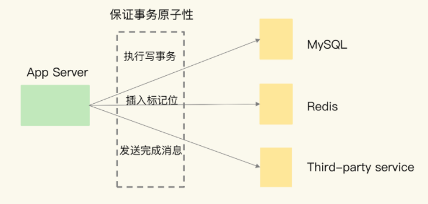
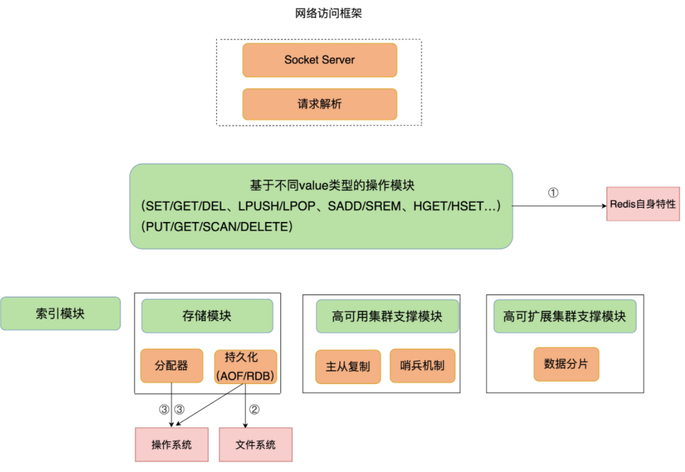
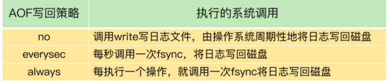
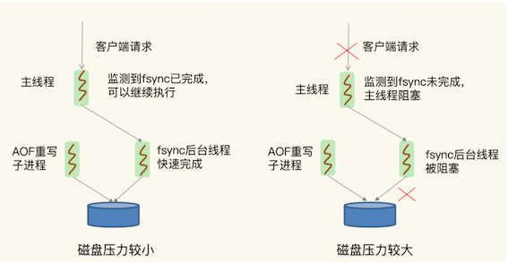

# **第三节 当redis查询变慢了怎么办？**

在实际生产环境中，Redis 往往是业务系统中的一个环节（例如作为缓存或是作为数据库）。一旦 Redis 上的请求延迟增加，就可能引起业务系统中的一串儿“连锁反应”。

应用服务器（App Server）要完成一个事务性操作，**包括在 MySQL 上执行一个写事务，在 Redis 上插入一个标记位，并通过一个第三方服务给用户发送一条完成消息**。

这三个操作都需要保证事务原子性，所以，如果此时 Redis 的延迟增加，就会拖累 App Server 端整个事务的执行。**这个事务一直完成不了，又会导致 MySQL 上写事务占用的资源无法释放，进而导致访问 MySQL 的其他请求被阻塞。**很明显，Redis 变慢会带来严重的连锁反应。



## **1、Redis 真的变慢了吗？**

一个最直接的方法，就是**查看 Redis 的响应延迟。**

大部分时候，Redis 延迟很低，但是在某些时刻，有些 Redis 实例会出现很高的响应延迟，**甚至能达到几秒到十几秒，不过持续时间不长，这也叫延迟“毛刺”**。

当你发现 Redis 命令的执行时间突然就增长到了几秒，基本就可以认定 Redis 变慢了。

大部分时候，Redis 延迟很低，但是在某些时刻，有些 Redis 实例会出现很高的响应延迟，甚至能达到几秒到十几秒，不过持续时间不长，这也叫延迟“毛刺”。当你发现 Redis 命令的执行时间突然就增长到了几秒，基本就可以认定 Redis 变慢了。

这种方法是看 Redis 延迟的绝对值，但是，在不同的软硬件环境下，Redis 本身的绝对性能并不相同。

比如，在我的环境中，当延迟为 1ms 时，我判定 Redis 变慢了，但是你的硬件配置高，那么，在你的运行环境下，可能延迟是 0.2ms 的时候，你就可以认定 Redis 变慢了。


### **1-1 基线性能**

**<span style="color:red">基于当前环境下的 Redis 基线性能做判断</span>**

**所谓的基线性能呢，也就是一个系统在低压力、无干扰下的基本性能，这个性能只由当前的软硬件配置决定。**


实际上，从 2.8.7 版本开始，`redis-cli` 命令提供了`–intrinsic-latency` 选项，可以用来监测和统计测试期间内的最大延迟，这个延迟可以作为 Redis 的基线性能。其中，测试时长可以用`–intrinsic-latency `选项的参数来指定。

举个例子，比如说，我们运行下面的命令，该命令会打印 120 秒内监测到的最大延迟。可以看到，这里的最大延迟是 119 微秒，也就是基线性能为 119 微秒。一般情况下，运行 120 秒就足够监测到最大延迟了，所以，我们可以把参数设置为 120。

```
./redis-cli --intrinsic-latency 120
Max latency so far: 17 microseconds.
Max latency so far: 44 microseconds.
Max latency so far: 94 microseconds.
Max latency so far: 110 microseconds.
Max latency so far: 119 microseconds.

36481658 total runs (avg latency: 3.2893 microseconds / 3289.32 nanoseconds per run).
Worst run took 36x longer than the average latency.
```

需要注意的是，基线性能和当前的操作系统、硬件配置相关。**因此，我们可以把它和 Redis 运行时的延迟结合起来，再进一步判断 Redis 性能是否变慢了**。


**<span style="color:red">一般来说，你要把运行时延迟和基线性能进行对比，如果你观察到的 Redis 运行时延迟是其基线性能的 2 倍及以上，就可以认定 Redis 变慢了。</span>**

判断基线性能这一点，对于在虚拟化环境下运行的 Redis 来说，非常重要。

是因为，在虚拟化环境（例如虚拟机或容器）中，由于增加了虚拟化软件层，与物理机相比，**虚拟机或容器本身就会引入一定的性能开销，所以基线性能会高一些**。下面的测试结果，显示的就是某一个虚拟机上运行 Redis 时测的基线性能。

```
$ ./redis-cli --intrinsic-latency 120
Max latency so far: 692 microseconds.
Max latency so far: 915 microseconds.
Max latency so far: 2193 microseconds.
Max latency so far: 9343 microseconds.
Max latency so far: 9871 microseconds.
```

可以看到，由于虚拟化软件本身的开销，此时的基线性能已经达到了 9.871ms。

如果该 Redis 实例的运行时延迟为 10ms，这并不能算作性能变慢，因为此时，运行时延迟只比基线性能增加了 1.3%。**如果你不了解基线性能，一看到较高的运行时延迟，就很有可能误判 Redis 变慢了。**


我们通常是通过客户端和网络访问 Redis 服务，为了避免网络对基线性能的影响，刚刚说的这个命令需要在服务器端直接运行，这也就是说，**我们只考虑服务器端软硬件环境的影响**。


### **1-2 网络对 Redis 性能的影响**

如果你想了解网络对 Redis 性能的影响，一个简单的方法是用 `iPerf` 这样的工具，测量从 Redis 客户端到服务器端的网络延迟。

**如果这个延迟有几十毫秒甚至是几百毫秒，就说明，Redis 运行的网络环境中很可能有大流量的其他应用程序在运行**，导致网络拥塞了。

这个时候，你就需要协调网络运维，调整网络的流量分配了。

## **2、如何应对 Redis 变慢？**

Redis 架构图，是 **Redis 自身的操作特性、文件系统和操作系统，它们是影响 Redis 性能的三大要素。**



## **3、Redis 自身操作特性的影响**

### **3-1 慢查询命令**

慢查询命令，就是指在 Redis 中执行速度慢的命令，这会导致 Redis 延迟增加。Redis 提供的命令操作很多，并不是所有命令都慢，这和命令操作的复杂度有关。

所以，我们必须要知道 Redis 的不同命令的复杂度。


比如说，`Value` 类型为` String` 时，`GET/SET` 操作主要就是操作 Redis 的哈希表索引。这个操作复杂度基本是固定的，即 `O(1)`。

但是，当 Value 类型为 Set 时，`SORT`、`SUNION/SMEMBERS` 操作复杂度分别为 `O(N+M*log(M)) `和 `O(N)`。其中，N 为 Set 中的元素个数，M 为 SORT 操作返回的元素个数。这个复杂度就增加了很多


[Redis 官方文档中对每个命令的复杂度都有介绍](https://redis.io/commands/)

**你发现 Redis 性能变慢时，可以通过 Redis 日志，或者是 `latency monitor 工具`，查询变慢的请求，**根据请求对应的具体命令以及官方文档，确认下是否采用了复杂度高的慢查询命令。


**<span style="color:red">如果的确有大量的慢查询命令，有两种处理方式：</span>**

* 用其他高效命令代替。比如说，如果你需要返回一个 SET 中的所有成员时，**不要使用 `SMEMBERS` 命令，而是要使用 `SSCAN` 多次迭代返回**，避免一次返回大量数据，造成线程阻塞。
* **<span style="color:red">当你需要执行排序、交集、并集操作时，可以在客户端完成，而不要用 SORT、SUNION、SINTER 这些命令，以免拖慢 Redis 实例。</span>**


当然，如果业务逻辑就是要求使用慢查询命令，那你得考虑采用性能更好的 CPU，更快地完成查询命令，避免慢查询的影响。


还有一个比较容易忽略的慢查询命令，就是 `KEYS`。**它用于返回和输入模式匹配的所有 key，例如，以下命令返回所有包含“name”字符串的 keys。**

```
redis> KEYS *name*
1) "lastname"
2) "firstname"
```

**<span style="color:red">因为 KEYS 命令需要遍历存储的键值对，所以操作延时高。如果你不了解它的实现而使用了它，就会导致 Redis 性能变慢。所以，KEYS 命令一般不被建议用于生产环境中。</span>**


### **3-2 过期 key 操作**

**过期 key 的自动删除机制。它是 Redis 用来回收内存空间的常用机制**，应用广泛，本身就会引起 Redis 操作阻塞，导致性能变慢，所以，你必须要知道该机制对性能的影响。

**Redis 键值对的 key 可以设置过期时间。**

<span style="color:red">默认情况下，Redis 每 100 毫秒会删除一些过期 key</span>，具体的算法如下：

1. 采样 `ACTIVE_EXPIRE_CYCLE_LOOKUPS_PER_LOOP` 个数的 key，并将其中过期的 key 全部删除；
2. 如果超过 25% 的 key 过期了，则重复删除的过程，直到过期 key 的比例降至 25% 以下。


**`ACTIVE_EXPIRE_CYCLE_LOOKUPS_PER_LOOP` 是 Redis 的一个参数，默认是 20**，那么，一秒内基本有 `200` 个过期 key 会被删除。

**这一策略对清除过期 key、释放内存空间很有帮助。如果每秒钟删除 200 个过期 key，并不会对 Redis 造成太大影响。**


**如果触发了上面这个算法的第二条，Redis 就会一直删除以释放内存空间**。

注意，删除操作是阻塞的（Redis 4.0 后可以用异步线程机制来减少阻塞影响）。所以，一旦该条件触发，Redis 的线程就会一直执行删除，这样一来，就没办法正常服务其他的键值操作了，就会进一步引起其他键值操作的延迟增加，Redis 就会变慢。

算法的第二条是怎么被触发的呢？

其中一个重要来源，**就是频繁使用带有相同时间参数的 `EXPIREAT` 命令设置过期 key，这就会导致，在同一秒内有大量的 key 同时过期**。

要检查业务代码在使用 EXPIREAT 命令设置 key 过期时间时，是否使用了相同的 UNIX 时间戳，有没有使用 EXPIRE 命令给批量的 key 设置相同的过期秒数。因为，这都会造成大量 key 在同一时间过期，导致性能变慢

* 首先要根据实际业务的使用需求，决定 `EXPIREAT` 和` EXPIRE` 的过期时间参数。
* 其次，如果一批 key 的确是同时过期，你还可以在 `EXPIREAT` 和 `EXPIRE` 的过期时间参数上，**加上一个一定大小范围内的随机数**，这样，既保证了 key 在一个邻近时间范围内被删除，又避免了同时过期造成的压力。


## **4、文件系统和操作系统**

**Redis 会持久化保存数据到磁盘，这个过程要依赖文件系统来完成，所以，文件系统将数据写回磁盘的机制，会直接影响到 Redis 持久化的效率**。

而且，在持久化的过程中，Redis 也还在接收其他请求，持久化的效率高低又会影响到 Redis 处理请求的性能。


另一方面，**Redis 是内存数据库，内存操作非常频繁**，所以，操作系统的内存机制会直接影响到 Redis 的处理效率。比如说，如果 Redis 的内存不够用了，操作系统会启动 swap 机制，这就会直接拖慢 Redis。


## **5、文件系统：AOF 模式**

Redis 是个内存数据库，为什么它的性能还和文件系统有关呢？

为了保证数据可靠性，Redis 会采用 AOF 日志或 RDB 快照。

其中，AOF 日志提供了三种日志写回策略：**no、everysec、always。这三种写回策略依赖文件系统的两个系统调用完成，也就是 write 和 fsync。**

* write 只要把日志记录写到内核缓冲区，就可以返回了，并不需要等待日志实际写回到磁盘；
* 而 fsync 需要把日志记录写回到磁盘后才能返回，时间较长。

下面这张表展示了三种写回策略所执行的系统调用。



当写回策略配置为 everysec 和 always 时，Redis 需要调用 fsync 把日志写回磁盘。

### **5-1 everysec**

在使用 everysec 时，Redis 允许丢失一秒的操作记录，所以，Redis 主线程并不需要确保每个操作记录日志都写回磁盘。

而且，fsync 的执行时间很长，如果是在 Redis 主线程中执行 fsync，就容易阻塞主线程。**所以，当写回策略配置为 everysec 时，Redis 会使用后台的子线程异步完成 fsync 的操作。**

### **5-2 always**

而对于 always 策略来说，Redis 需要确保每个操作记录日志都写回磁盘，如果用后台子线程异步完成，主线程就无法及时地知道每个操作是否已经完成了，这就不符合 always 策略的要求了。

**所以，always 策略并不使用后台子线程来执行。**

> **使用everysec时，会使用子线程来操作，不会阻塞主线程。而使用always时，是使用主线程来操作，所以会阻塞主线程**

### **5-3 AOF 重写**

在使用 AOF 日志时，为了避免日志文件不断增大，**Redis 会执行 AOF 重写，生成体量缩小的新的 AOF 日志文件**。AOF 重写本身需要的时间很长，也容易阻塞 Redis 主线程，所以，Redis 使用子进程来进行 AOF 重写。

潜在的风险点:  **<span style="color:red">AOF 重写会对磁盘进行大量 IO 操作，同时，fsync 又需要等到数据写到磁盘后才能返回，所以，当 AOF 重写的压力比较大时，就会导致 fsync 被阻塞。虽然 fsync 是由后台子线程负责执行的，但是，主线程会监控 fsync 的执行进度。</span>**

当主线程使用后台子线程执行了一次 fsync，需要再次把新接收的操作记录写回磁盘时，如果主线程发现上一次的 fsync 还没有执行完，那么它就会阻塞。

**所以，如果后台子线程执行的 fsync 频繁阻塞的话（比如 AOF 重写占用了大量的磁盘 IO 带宽），主线程也会阻塞，导致 Redis 性能变慢。**



**由于 `fsync` 后台子线程和 `AOF` 重写子进程的存在，主 `IO` 线程一般不会被阻塞。**

但是，如果在重写日志时，`AOF` 重写子进程的写入量比较大，`fsync` 线程也会被阻塞，进而阻塞主线程，导致延迟增加

首先，你可以检查下 Redis 配置文件中的 `appendfsync` 配置项，该配置项的取值表明了 `Redis` 实例使用的是哪种 `AOF` 日志写回策略，如下所示：


如果 `AOF` 写回策略使用了 `everysec` 或 `always` 配置，请先确认下业务方对数据可靠性的要求，明确是否需要每一秒或每一个操作都记日志。

**有的业务方不了解 Redis AOF 机制，很可能就直接使用数据可靠性最高等级的 always 配置了。其实，在有些场景中（例如 Redis 用于缓存），数据丢了还可以从后端数据库中获取，并不需要很高的数据可靠性。**

如果业务应用对延迟非常敏感，但同时允许一定量的数据丢失，那么，可以把配置项 `no-appendfsync-on-rewrite` 设置为 `yes`，如下所示：

```
no-appendfsync-on-rewrite yes
```

 **<span style="color:red">这个配置项设置为 `yes` 时，表示在 `AOF` 重写时，不进行 `fsync` 操作。也就是说，Redis 实例把写命令写到内存后，不调用后台线程进行 fsync 操作，就可以直接返回了。</span>**

当然，如果此时实例发生宕机，就会导致数据丢失。反之，如果这个配置项设置为 no（也是默认配置），在 AOF 重写时，Redis 实例仍然会调用后台线程进行 fsync 操作，这就会给实例带来阻塞。

**如果的确需要高性能，采用高速的固态硬盘作为 AOF 日志的写入设备。**

高速固态盘的带宽和并发度比传统的机械硬盘的要高出 10 倍及以上。

在 AOF 重写和 fsync 后台线程同时执行时，固态硬盘可以提供较为充足的磁盘 IO 资源，让 AOF 重写和 fsync 后台线程的磁盘 IO 资源竞争减少，从而降低对 Redis 的性能影响。


## **6、操作系统：swap**

如果 Redis 的 AOF 日志配置只是 no，或者就没有采用 AOF 模式

**潜在的瓶颈：操作系统的内存 swap。**

**内存 swap 是操作系统里将内存数据在内存和磁盘间来回换入和换出的机制，涉及到磁盘的读写**，所以，一旦触发 swap，无论是被换入数据的进程，还是被换出数据的进程，其性能都会受到慢速磁盘读写的影响。

Redis 是内存数据库，内存使用量大，如果没有控制好内存的使用量，或者和其他内存需求大的应用一起运行了，就可能受到 swap 的影响，而导致性能变慢。

Redis 内存数据库而言，显得更为重要：**正常情况下，Redis 的操作是直接通过访问内存就能完成，一旦 swap 被触发了，Redis 的请求操作需要等到磁盘数据读写完成才行**。

而且， AOF 日志文件读写使用 fsync 线程不同，swap 触发后影响的是 Redis 主 IO 线程，这会极大地增加 Redis 的响应时间。

### **6-1 swap 而导致性能降低**

实例完成 5000 万个 GET 请求时需要 300s，但是，有一次，这个实例完成 5000 万 GET 请求，花了将近 4 个小时的时间

问题复现，当时 Redis 处理请求用了近 4 小时的情况下，**该实例所在的机器已经发生了 swap**。从 300s 到 4 个小时，延迟增加了将近 48 倍，可以看到 swap 对性能造成的严重影响。

什么时候会触发 swap 呢？

**通常，触发 swap 的原因主要是物理机器内存不足**对于 Redis 而言，有两种常见的情况：


* Redis 实例自身使用了大量的内存，导致物理机器的可用内存不足；
* 和 Redis 实例在同一台机器上运行的**其他进程，在进行大量的文件读写操作**。文件读写本身会占用系统内存，这会导致分配给 Redis 实例的内存量变少，**进而触发 Redis 发生 swap**。


 **<span style="color:red">解决思路：增加机器的内存或者使用 Redis 集群</span>**
 
操作系统本身会在后台记录每个进程的 swap 使用情况，即有多少数据量发生了 swap。你可以先通过下面的命令查看 Redis 的进程号，这里是 5332。
 
```
$ redis-cli info | grep process_id
process_id: 5332
```

然后，进入 Redis 所在机器的 `/proc` 目录下的该进程目录中：

```
$ cd /proc/5332
```

最后，运行下面的命令，查看该 Redis 进程的使用情况。

```
$cat smaps | egrep '^(Swap|Size)'
Size: 584 kB
Swap: 0 kB
Size: 4 kB
Swap: 4 kB
Size: 4 kB
Swap: 0 kB
Size: 462044 kB
Swap: 462008 kB
Size: 21392 kB
Swap: 0 kB
```

每一行 Size 表示的是 Redis 实例所用的一块内存大小，而 Size 下方的 Swap 和它相对应，表示这块 Size 大小的内存区域有多少已经被换出到磁盘上了。**如果这两个值相等，就表示这块内存区域已经完全被换出到磁盘了。**

* **作为内存数据库，Redis 本身会使用很多大小不一的内存块**，所以，你可以看到有很多 Size 行，有的很小，就是 4KB，而有的很大，例如 462044KB。
* **不同内存块被换出到磁盘上的大小也不一样**，例如刚刚的结果中的第一个 4KB 内存块，它下方的 Swap 也是 4KB，这表示这个内存块已经被换出了；
* 另外，462044KB 这个内存块也被换出了 462008KB，差不多有 462MB。

当出现百 MB，甚至 GB 级别的 swap 大小时，就表明，此时，Redis 实例的内存压力很大，很有可能会变慢。所以，swap 的大小是排查 Redis 性能变慢是否由 swap 引起的重要指标。

一旦发生内存 swap， **<span style="color:red">最直接的解决方法就是增加机器内存</span>**。

如果该实例在一个 Redis 切片集群中，可以增加 Redis 集群的实例个数，来分摊每个实例服务的数据量，进而减少每个实例所需的内存量。


如果 Redis 实例和其他操作大量文件的程序（例如数据分析程序）共享机器，你可以将 Redis 实例迁移到单独的机器上运行，以满足它的内存需求量。如果该实例正好是 Redis 主从集群中的主库，而从库的内存很大，也可以考虑进行主从切换，把大内存的从库变成主库，由它来处理客户端请求。


## **7、操作系统：内存大页**

除了内存 swap，还有一个和内存相关的因素，即内存大页机制（Transparent Huge Page, THP），也会影响 Redis 性能。

### **7-1 内存大页 trade-off**

Linux 内核从 2.6.38 开始支持内存大页机制，**该机制支持 2MB 大小的内存页分配，而常规的内存页分配是按 4KB 的粒度来执行的。**

Redis 是内存数据库，内存大页不正好可以满足 Redis 的需求吗？而且在分配相同的内存量时，内存大页还能减少分配次数，不也是对 Redis 友好吗?

**其实，系统的设计通常是一个取舍过程，我们称之为 trade-off。很多机制通常都是优势和劣势并存的。Redis 使用内存大页就是一个典型的例子。**

虽然内存大页可以给 Redis 带来内存分配方面的收益，不要忘了，Redis 为了提供数据可靠性保证，需要将数据做持久化保存。

这个写入过程由额外的线程执行，所以，此时，Redis 主线程仍然可以接收客户端写请求。客户端的写请求可能会修改正在进行持久化的数据。

在这一过程中，Redis 就会采用写时复制机制，也就是说，一旦有数据要被修改，Redis 并不会直接修改内存中的数据，*而是将这些数据拷贝一份，然后再进行修改*。


**如果采用了内存大页，那么，即使客户端请求只修改 100B 的数据，Redis 也需要拷贝 2MB 的大页。相反，如果是常规内存页机制，只用拷贝 4KB**

当客户端请求修改或新写入数据较多时，内存大页机制将导致大量的拷贝，这就会影响 Redis 正常的访存操作，最终导致性能变慢。

### **7-2 关闭内存大页**

首先，我们要先排查下内存大页。方法是：在 Redis 实例运行的机器上执行如下命令:

```
cat /sys/kernel/mm/transparent_hugepage/enabled
```

如果执行结果是 always，就表明内存大页机制被启动了；如果是 never，就表示，内存大页机制被禁止。

**在实际生产环境中部署时，建议不要使用内存大页机制，操作也很简单，只需要执行下面的命令就可以了**：

```
echo never > /sys/kernel/mm/transparent_hugepage/enabled
```

## 本节小结


判断 Redis 变慢的方法，**一个是看响应延迟，一个是看基线性能**。同时，我还给了你两种排查和解决 Redis 变慢这个问题的方法：

* **从慢查询命令开始排查，并且根据业务需求替换慢查询命令**；
* **排查过期 key 的时间设置，并根据实际使用需求，设置不同的过期时间**。

9 个检查点的 Checklist，希望你在遇到 Redis 性能变慢时，按照这些步骤逐一检查，高效地解决问题:

1. 获取 Redis 实例在当前环境下的基线性能。
2. 是否用了慢查询命令？如果是的话，就使用其他命令替代慢查询命令，或者把聚合计算命令放在客户端做。
3. 是否对过期 key 设置了相同的过期时间？**对于批量删除的 key，可以在每个 key 的过期时间上加一个随机数，避免同时删除**。
4. 是否存在 bigkey？ 对于 bigkey 的删除操作，如果你的 Redis 是 4.0 及以上的版本，可以直接利用异步线程机制减少主线程阻塞；如果是 Redis 4.0 以前的版本，**可以使用 SCAN 命令迭代删除；对于 bigkey 的集合查询和聚合操作，可以使用 SCAN 命令在客户端完成**。
5. Redis AOF 配置级别是什么？业务层面是否的确需要这一可靠性级别？如果我们需要高性能，同时也允许数据丢失，**可以将配置项 `no-appendfsync-on-rewrite` 设置为 `yes`**，**避免 AOF 重写和 fsync 竞争磁盘 IO 资源，导致 Redis 延迟增加**。当然， 如果既需要高性能又需要高可靠性，最好使用高速固态盘作为 AOF 日志的写入盘。
6. Redis 实例的内存使用是否过大？发生 swap 了吗？如果是的话，就增加机器内存，或者是使用 Redis 集群，分摊单机 Redis 的键值对数量和内存压力。同时，要避免出现 Redis 和其他内存需求大的应用共享机器的情况。
7. 在 Redis 实例的运行环境中，是否启用了透明大页机制？如果是的话，直接关闭内存大页机制就行了。
8. 是否运行了 Redis 主从集群？如果是的话，把主库实例的数据量大小控制在 2~4GB，以免主从复制时，从库因加载大的 RDB 文件而阻塞。
9. 是否使用了多核 CPU 或 NUMA 架构的机器运行 Redis 实例？使用多核 CPU 时，可以给 Redis 实例绑定物理核；使用 NUMA 架构时，注意把 Redis 实例和网络中断处理程序运行在同一个 CPU Socket 上。

仔细检查下有没有恼人的“邻居”，具体点说，就是 Redis 所在的机器上有没有一些其他占内存、磁盘 IO 和网络 IO 的程序，比如说数据库程序或者数据采集程序。**如果有的话，我建议你将这些程序迁移到其他机器上运行。**


### **分析、排查、解决Redis变慢问题**

1. 使用复杂度过高的命令（例如SORT/SUION/ZUNIONSTORE/KEYS），或一次查询全量数据（例如LRANGE key 0 N，但N很大）
	* 分析：
		* a) 查看slowlog是否存在这些命令 
		* b) Redis进程CPU使用率是否飙升（聚合运算命令导致）
	* 解决：
		* a) 不使用复杂度过高的命令，或用其他方式代替实现（放在客户端做）
		* b) 数据尽量分批查询（LRANGE key 0 N，建议N<=100，查询全量数据建议使用HSCAN/SSCAN/ZSCAN）
2. 操作bigkey
	* 分析：
		* a) `slowlog`出现很多`SET/DELETE`变慢命令（bigkey分配内存和释放内存变慢） 
		* b) 使用`redis-cli -h $host -p $port --bigkeys`扫描出很多`bigkey`
	* 解决：
		* a) 优化业务，避免存储bigkey 
		* b) Redis 4.0+可开启`lazy-free`机制
3. 大量key集中过期
	* 分析：
		* a) 业务使用EXPIREAT/PEXPIREAT命令 
		* b) Redis info中的`expired_keys`指标短期突增
	* 解决：
		* a) 优化业务，过期增加随机时间，把时间打散，减轻删除过期key的压力 
		* b) 运维层面，监控`expired_keys`指标，有短期突增及时报警排查
4. Redis内存达到maxmemory
	* 分析：
		* a) 实例内存达到maxmemory，且写入量大，淘汰key压力变大 
		* b) Redis info中的`evicted_keys`指标短期突增
	* 解决：
		* a) 业务层面，根据情况调整淘汰策略（随机比LRU快） 
		* b) 运维层面，监控evicted_keys指标，有短期突增及时报警 
		* c) 集群扩容，多个实例减轻淘汰key的压力
5. 大量短连接请求
	* 分析：Redis处理大量短连接请求，TCP三次握手和四次挥手也会增加耗时
	* 解决：使用长连接操作Redis
6. 生成RDB和AOF重写fork耗时严重
	* 分析：
		* a) Redis变慢只发生在生成RDB和AOF重写期间 
		* b) 实例占用内存越大，fork拷贝内存页表越久 
		* c) Redis info中`latest_fork_usec`耗时变长
	* 解决：
		* a) 实例尽量小 
		* b) Redis尽量部署在物理机上 
		* c) 优化备份策略（例如低峰期备份） 
		* d) 合理配置`repl-backlog`和`slave client-output-buffer-limit`，避免主从全量同步 
		* e) 视情况考虑关闭AOF 
		* f) 监控`latest_fork_usec`耗时是否变长
7. AOF使用`awalys`机制
	* 分析：磁盘IO负载变高
	* 解决：
		* a) 使用everysec机制 
		* b) 丢失数据不敏感的业务不开启AOF
8. 使用Swap
	* 分析：
		* a) 所有请求全部开始变慢 
		* b) slowlog大量慢日志
		* c) 查看Redis进程是否使用到了Swap
	* 解决：
		* a) 增加机器内存 
		* b) 集群扩容 
		* c) Swap使用时监控报警
9. 进程绑定CPU不合理
	* 分析
		* a) Redis进程只绑定一个CPU逻辑核
		* b) NUMA架构下，网络中断处理程序和Redis进程没有绑定在同一个Socket下
	* 解决
		* a) Redis进程绑定多个CPU逻辑核
		* b) 网络中断处理程序和Redis进程绑定在同一个Socket下
10. 开启透明大页机制
	* 分析：生成RDB和AOF重写期间，主线程处理写请求耗时变长（拷贝内存副本耗时变长）
	* 解决：关闭透明大页机制
11. 网卡负载过高
	* 分析：
		* a) TCP/IP层延迟变大，丢包重传变多 
		* b) 是否存在流量过大的实例占满带宽
	* 解决：
		* a) 机器网络资源监控，负载过高及时报警 
		* b) 提前规划部署策略，访问量大的实例隔离部署

总之，Redis的性能与CPU、内存、网络、磁盘都息息相关，任何一处发生问题，都会影响到Redis的性能。


### 要点&亮点

* 通过`redis-cli --intrinsic-latency 120`可以得知redis的基准线。后续可以根据基准线的响应速度进行判断是否查询慢
* 基于自己对 Redis 本身的工作原理的理解，并且结合和它交互的操作系统、存储以及网络等外部系统关键机制，再借助一些辅助工具来定位原因，并制定行之有效的解决方案
* Redis 自身操作特性的影响
	* 慢查询命令：命令操作的复杂度有关
		*  排查方法：通过 Redis 日志，或者是 latency monitor 工具，查询变慢的请求
		*  解决方法：
			*  用其他高效命令代替。如不要使用keys查询所有key，可以使用scan进行查询，不会阻塞线程
			*  当你需要执行排序、交集、并集操作时，可以在客户端完成，而不要用 SORT、SUNION、SINTER 这些命令，以免拖慢 Redis 实例。
	* 过期 key 操作：redis本身的内存回收机制会造成redis操作阻塞，导致性能变慢（Redis 4.0 后可以用异步线程机制来减少阻塞影响）
		* 导致原因：大批量的key同时间内过期，导致删除过期key的机制一直触发，引起redis操作阻塞
		* 解决方法：对key设定过期时间时，添加一个删除的时间随机数，能避免key存在同一时间过期
	* redis删除过期key的机制，每100毫秒对一些key进行删除。算法如下
		* 采样 `ACTIVE_EXPIRE_CYCLE_LOOKUPS_PER_LOOP` 个数的 key，并将其中过期的 key 全部删除；
		* 果超过 25% 的 key 过期了，则重复删除的过程，直到过期 key 的比例降至 25% 以下。