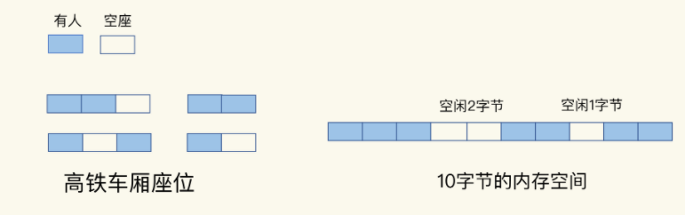
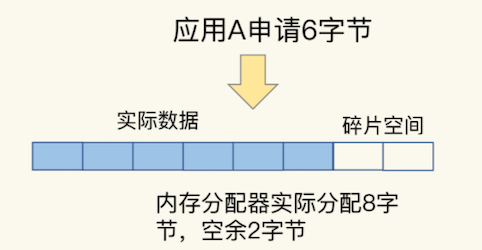
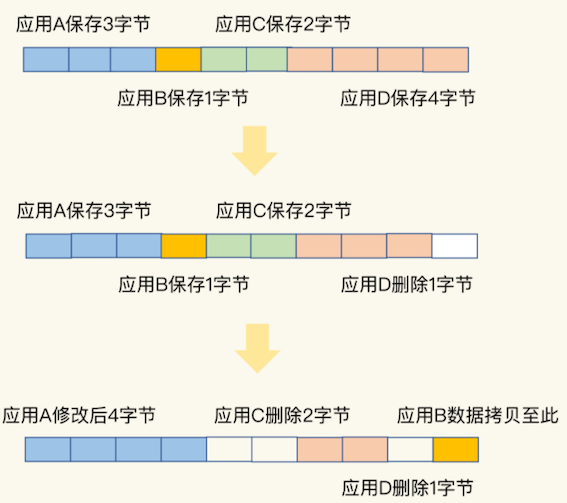
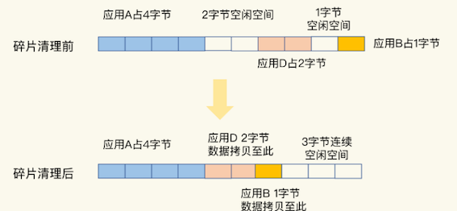

# **第四节 删除数据后，内存占用率还是很高**

明明做了数据删除，数据量已经不大了，为什么使用 top 命令查看时，还会发现 Redis 占用了很多内存呢？

这是因为，当数据删除后，**Redis 释放的内存空间会由内存分配器管理，并不会立即返回给操作系统**。所以，**操作系统仍然会记录着给 Redis 分配了大量内存**。


潜在的风险点：**Redis 释放的内存空间可能并不是连续的，那么，这些不连续的内存空间很有可能处于一种闲置的状态。**

这就会导致一个问题：**虽然有空闲空间，Redis 却无法用来保存数据，不仅会减少 Redis 能够实际保存的数据量，还会降低 Redis 运行机器的成本回报率**。

## **1、什么是内存碎片？**

通常情况下，内存空间闲置，往往是因为操作系统发生了较为严重的内存碎片。



我们可以把这些分散的空座位叫作“车厢座位碎片”，操作系统的内存碎片就很容易理解了。

虽然操作系统的剩余内存空间总量足够，但是，应用申请的是一块连续地址空间的 N 字节，但在剩余的内存空间中，没有大小为 N 字节的连续空间了，那么，这些剩余空间就是内存碎片（比如上图中的“空闲 2 字节”和“空闲 1 字节”，就是这样的碎片）。

## **2、内存碎片是如何形成的？**

内存碎片的形成有内因和外因两个层面的原因。简单来说，**内因是操作系统的内存分配机制，外因是 Redis 的负载特征。**


### **2-1 内因：内存分配器的分配策略**

**内存分配器的分配策略就决定了操作系统无法做到“按需分配”**。这是因为，内存分配器一般是按固定大小来分配内存，而不是完全按照应用程序申请的内存空间大小给程序分配。

**Redis 可以使用 libc、jemalloc、tcmalloc 多种内存分配器来分配内存，默认使用 jemalloc**。接下来，以 jemalloc 为例，来具体解释一下。其他分配器也存在类似的问题。

**jemalloc 的分配策略之一，是按照一系列固定的大小划分内存空间**，例如 8 字节、16 字节、32 字节、48 字节，…, 2KB、4KB、8KB 等。当程序申请的内存最接近某个固定值时，jemalloc 会给它分配相应大小的空间。

这样的分配方式本身是为了减少分配次数。**例如，Redis 申请一个 20 字节的空间保存数据，jemalloc 就会分配 32 字节**，此时，如果应用还要写入 10 字节的数据，Redis 就不用再向操作系统申请空间了，因为刚才分配的 32 字节已经够用了，这就避免了一次分配操作。

但是，如果 Redis 每次向分配器申请的内存空间大小不一样，这种分配方式就会有形成碎片的风险，而这正好来源于 Redis 的外因了。

### **2-2 外因：键值对大小不一样和删改操作**

**Redis 通常作为共用的缓存系统或键值数据库对外提供服务**，所以，不同业务应用的数据都可能保存在 Redis 中，这就会带来不同大小的键值对。

这样一来，Redis 申请内存空间分配时，本身就会有大小不一的空间需求。这是第一个外因。

内存分配器只能按固定大小分配内存，所以，分配的内存空间一般都会比申请的空间大一些，不会完全一致，这本身就会造成一定的碎片，降低内存空间存储效率。

比如说，应用 A 保存 6 字节数据，jemalloc 按分配策略分配 8 字节。如果应用 A 不再保存新数据，那么，这里多出来的 2 字节空间就是内存碎片了，如下图所示：



**第二个外因是，这些键值对会被修改和删除，这会导致空间的扩容和释放。**

具体来说，

* 一方面，如果修改后的键值对变大或变小了，**就需要占用额外的空间或者释放不用的空间**。
* 另一方面，删除的键值对就不再需要内存空间了，此时，**就会把空间释放出来，形成空闲空间**。




* 一开始，应用 A、B、C、D 分别保存了 3、1、2、4 字节的数据，并占据了相应的内存空间。
* 然后，应用 D 删除了 1 个字节，这个 1 字节的内存空间就空出来了。
* 紧接着，应用 A 修改了数据，从 3 字节变成了 4 字节。
* 为了保持 A 数据的空间连续性，操作系统就需要把 B 的数据拷贝到别的空间，比如拷贝到 D 刚刚释放的空间中。
* 此时，应用 C 和 D 也分别删除了 2 字节和 1 字节的数据，整个内存空间上就分别出现了 2 字节和 1 字节的空闲碎片。
* **如果应用 E 想要一个 3 字节的连续空间，显然是不能得到满足的。因为，虽然空间总量够，但却是碎片空间，并不是连续的。**

好了，到这里，我们就知道了造成内存碎片的内外因素，其中，内存分配器策略是内因，而 Redis 的负载属于外因，包括了大小不一的键值对和键值对修改删除带来的内存空间变化。

大量内存碎片的存在，会造成 Redis 的内存实际利用率变低，接下来，我们就要来解决这个问题了。不过，在解决问题前，我们要先判断 Redis 运行过程中是否存在内存碎片。

## **3、如何判断是否有内存碎片？**

Redis 是内存数据库，内存利用率的高低直接关系到 Redis 运行效率的高低。为了让用户能监控到实时的内存使用情况，Redis 自身提供了 INFO 命令，可以用来查询内存使用的详细信息，命令如下：

```
INFO memory
# Memory
used_memory:1073741736
used_memory_human:1024.00M
used_memory_rss:1997159792
used_memory_rss_human:1.86G
…
mem_fragmentation_ratio:1.86
```

**<span style="color:red">这里有一个 `mem_fragmentation_ratio` 的指标，它表示的就是 Redis 当前的内存碎片率。</span>**

那么，这个碎片率是怎么计算的呢？其实，就是上面的命令中的两个指标 `used_memory_rss` 和 `used_memory` 相除的结果。

```
mem_fragmentation_ratio = used_memory_rss/ used_memory
```

* `used_memory_rss` 是操作系统实际分配给 Redis 的物理内存空间，里面就包含了碎片；
* 而 `used_memory` 是 Redis 为了保存数据实际申请使用的空间。


我简单举个例子。例如，Redis 申请使用了 100 字节（used_memory），操作系统实际分配了 128 字节（`used_memory_rss`），此时，`mem_fragmentation_ratio` 就是 `1.28`。

* **`mem_fragmentation_ratio` 大于 1 但小于 1.5。这种情况是合理的**。这是因为，刚才我介绍的那些因素是难以避免的。毕竟，内因的内存分配器是一定要使用的，分配策略都是通用的，**不会轻易修改；而外因由 Redis 负载决定，也无法限制。所以，存在内存碎片也是正常的**。

* **`mem_fragmentation_ratio `大于 1.5**。这表明内存碎片率已经超过了 50%。一般情况下，这个时候，我们就需要采取一些措施来降低内存碎片率了。


## **4、如何清理内存碎片？**

当 Redis 发生内存碎片后，一个“简单粗暴”的方法就是**重启 Redis 实例**。当然，这并不是一个“优雅”的方法，毕竟，重启 Redis 会带来两个后果：


* 如果 Redis 中的数据没有持久化，那么，数据就会丢失；
* 即使 Redis 数据持久化了，我们还需要通过 AOF 或 RDB 进行恢复，恢复时长取决于 AOF 或 RDB 的大小，如果只有一个 Redis 实例，恢复阶段无法提供服务。

### **4-1 内存碎片清理**

幸运的是，从 4.0-RC3 版本以后，Redis 自身提供了一种内存碎片自动清理的方法，我们先来看这个方法的基本机制。

**内存碎片清理，简单来说，就是“搬家让位，合并空间”。**

**当有数据把一块连续的内存空间分割成好几块不连续的空间时，操作系统就会把数据拷贝到别处。此时，数据拷贝需要能把这些数据原来占用的空间都空出来，把原本不连续的内存空间变成连续的空间。**否则，如果数据拷贝后，并没有形成连续的内存空间，这就不能算是清理了。




在进行碎片清理前，这段 10 字节的空间中分别有 1 个 2 字节和 1 个 1 字节的空闲空间，只是这两个空间并不连续。

操作系统在清理碎片时，会先把应用 D 的数据拷贝到 2 字节的空闲空间中，并释放 D 原先所占的空间。然后，再把 B 的数据拷贝到 D 原来的空间中。这样一来，这段 10 字节空间的最后三个字节就是一块连续空间了。到这里，碎片清理结束。

### **4-2 碎片清理是有代价**

**<span style="color:red">操作系统需要把多份数据拷贝到新位置，把原有空间释放出来，这会带来时间开销。</span>**

* 因为 Redis 是单线程，在数据拷贝时，Redis 只能等着，这就导致 Redis 无法及时处理请求，性能就会降低。
* 而且，有的时候，数据拷贝还需要注意顺序，就像刚刚说的清理内存碎片的例子，操作系统需要先拷贝 D，并释放 D 的空间后，才能拷贝 B。
* 这种对顺序性的要求，会进一步增加 Redis 的等待时间，导致性能降低。

有什么办法可以尽量缓解这个问题吗？

**Redis 专门为自动内存碎片清理功机制设置的参数了**。我们可以通过设置参数，来控制碎片清理的开始和结束时机，以及占用的 CPU 比例，从而减少碎片清理对 Redis 本身请求处理的性能影响。

首先，Redis 需要启用自动内存碎片清理，可以把 `activedefrag` 配置项设置为 `yes`，命令如下：

```
config set activedefrag yes
```

这个命令只是启用了自动清理功能，但是，具体什么时候清理，会受到下面这两个参数的控制。

### **4-3 触发内存清理条件**

这两个参数分别设置了触发内存清理的一个条件，如果同时满足这两个条件，就开始清理。在清理的过程中，只要有一个条件不满足了，就停止自动清理。

* **<span style="color:red">`active-defrag-ignore-bytes 100mb`：表示内存碎片的字节数达到 100MB 时，开始清理；</span>**
* **<span style="color:red">`active-defrag-threshold-lower 10`：表示内存碎片空间占操作系统分配给 Redis 的总空间比例达到 10% 时，开始清理。</span>**


### **4-4 减少碎片清理影响**

**为了尽可能减少碎片清理对 Redis 正常请求处理的影响**，自动内存碎片清理功能在执行时，还会监控清理操作占用的 CPU 时间，而且还设置了两个参数，分别用于控制清理操作占用的 CPU 时间比例的上、下限，既保证清理工作能正常进行，又避免了降低 Redis 性能。这两个参数具体如下：

* **<span style="color:red">`active-defrag-cycle-min 25`： 表示自动清理过程所用 CPU 时间的比例不低于 25%，保证清理能正常开展；</span>**
* **<span style="color:red">`active-defrag-cycle-max 75`：表示自动清理过程所用 CPU 时间的比例不高于 75%，一旦超过，就停止清理，从而避免在清理时，大量的内存拷贝阻塞 Redis，导致响应延迟升高。</span>**

自动内存碎片清理机制在控制碎片清理启停的时机上，**既考虑了碎片的空间占比、对 Redis 内存使用效率的影响，还考虑了清理机制本身的 CPU 时间占比、对 Redis 性能的影响**。

## **5、本节小结**

Redis 的内存空间效率问题

* **`info memory` 命令是一个好工具，可以帮助你查看碎片率的情况；**
* **碎片率阈值是一个好经验**，可以帮忙你有效地判断是否要进行碎片清理了；
* **内存碎片自动清理是一个好方法**，可以避免因为碎片导致 Redis 的内存实际利用率降低，提升成本收益率。


内存碎片自动清理涉及内存拷贝，这对 Redis 而言，是个潜在的风险。如果你在实践过程中遇到 Redis 性能变慢，记得通过日志看下是否正在进行碎片清理。**如果 Redis 的确正在清理碎片，那么，我建议你调小 `active-defrag-cycle-max` 的值，以减轻对正常请求处理的影响。**