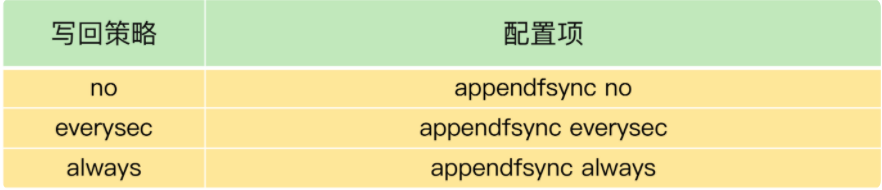

# **Redis 影响性能的潜在因素**

## **1、Redis 性能的 5 大方面的潜在因素，**

### **1、Redis有哪些可能导致阻塞的操作，以及解决机制**

* Redis 内部的阻塞式操作；
* CPU 核和 NUMA 架构的影响；
* Redis 关键系统配置；
* Redis 内存碎片；
* Redis 缓冲区。

Redis 实例运行时的 4 大类交互对象：**客户端、磁盘、主从库实例、切片集群实例**。

基于这 4 大类交互对象，我们梳理了会导致 Redis 性能受损的 5 大阻塞点，包括**集合全量查询和聚合操作、bigkey 删除、清空数据库、AOF 日志同步写，以及从库加载 RDB 文件**。

在这 5 大阻塞点中，**bigkey 删除、清空数据库、AOF 日志同步写不属于关键路径操作，可以使用异步子线程机制来完成**。

Redis 在运行时会创建三个子线程，主线程会通过一个任务队列和三个子线程进行交互。子线程会根据任务的具体类型，来执行相应的异步操作。

不过，异步删除操作是 Redis 4.0 以后才有的功能，如果你使用的是 4.0 之前的版本，当你遇到 bigkey 删除时：

**使用集合类型提供的 SCAN 命令读取数据，然后再进行删除。因为用 SCAN 命令可以每次只读取一部分数据并进行删除，这样可以避免一次性删除大量 key 给主线程带来的阻塞**。

例如，对于 Hash 类型的 bigkey 删除，你可以使用 HSCAN 命令，每次从 Hash 集合中获取一部分键值对（例如 200 个），再使用 HDEL 删除这些键值对，这样就可以把删除压力分摊到多次操作中，那么，每次删除操作的耗时就不会太长，也就不会阻塞主线程了。

**集合全量查询和聚合操作、从库加载 RDB 文件是在关键路径上，无法使用异步操作来完成**。对于这两个阻塞点，我两个小建议。

* 集合全量查询和聚合操作：可以使用 SCAN 命令，分批读取数据，再在客户端进行聚合计算；
* **<span style="color:red">从库加载 RDB 文件：把主库的数据量大小控制在 2~4GB 左右，以保证 RDB 文件能以较快的速度加载。</span>**


**要点&亮点**

* 与客户端交互时的阻塞点：高复杂度的增删改操作（集合全量的查询和聚合操作，bigKey 删除操作，清空数据库）
* 与磁盘交互的阻塞点：aof日志实时同步写回
* 主从节点交互时的阻塞点：从库加载RDB文件
* 分片集群的阻塞点：哈希槽bigkey数据迁移
* 关键路径操作概念：客户端把请求发给Redis后，要等着Redis返回数据结果的操作
* 异步的子线程机制：主线程通过一个链表形式的任务队列和子线程进行交互


`lazy free`机制：Redis收到键值对删除和清空数据库的指令时，主线线程会把这个操作封装成一个任务，放入任务队列中，然后给客户端返回一个完成信息，但实际上，这个删除还没有执行，需要等待后台子线程从任务队列中读取到这个任务后，才开始实际删除键值对，并释放相应的内存空间。

但是：`lazy-free`是`4.0`新增功能，默认关闭。开启这个配置后， 除了`replica-lazy-flush`之外，其他情况都只是***可能***去异步释放`key`的内存，并不是每次必定异步释放内存的。是否会真正异步释放内存，取决于`key`的类型，编码方式，元素数量，所以 即使开启了`lazy-free`，`String`类型的`bigkey`，在删除时依旧有阻塞主线程的风险

### **2、在多核CPU架构和NUMA架构下，如何对redis进行优化配置**

* 多核 CPU 架构，以及 NUMA 架构。
* **在多核 CPU 架构下，Redis 如果在不同的核上运行，就需要频繁地进行上下文切换，这个过程会增加 Redis 的执行时间，客户端也会观察到较高的尾延迟了。**所以，**建议你在 Redis 运行时，把实例和某个核绑定，这样，就能重复利用核上的 L1、L2 缓存，可以降低响应延迟**。
* **<span style="color:red">为了提升 Redis 的网络性能，我们有时还会把网络中断处理程序和 CPU 核绑定。</span>**
* 如果服务器使用的是 NUMA 架构，Redis 实例一旦被调度到和中断处理程序不在同一个 CPU Socket，就要跨 CPU Socket 访问网络数据，这就会降低 Redis 的性能。
* **建议你把 Redis 实例和网络中断处理程序绑在同一个 CPU Socket 下的不同核上，这样可以提升 Redis 的运行性能。**


虽然绑核可以帮助 Redis 降低请求执行时间，但是，除了主线程，Redis 还有用于 RDB 和 AOF 重写的子进程，以及 4.0 版本之后提供的用于惰性删除的后台线程。

**当 Redis 实例和一个逻辑核绑定后，这些子进程和后台线程会和主线程竞争 CPU 资源，也会对 Redis 性能造成影响**。所以，我给了你两个建议：

* 如果你不想修改 Redis 代码，**可以把按一个 Redis 实例一个物理核方式进行绑定，这样，Redis 的主线程、子进程和后台线程可以共享使用一个物理核上的两个逻辑核**。
* Redis 的源码，就可以在源码中增加绑核操作，把子进程和后台线程绑到不同的核上，这样可以避免对主线程的 CPU 资源竞争
* Redis 6.0 出来后，可以支持 CPU 核绑定的配置操作了

**亮点&要点**

* 主流的CPU架构，主要有多核CPU架构和NUMA架构两个架构
	* 多核CPU架构： 多个物理核，各物理核使用私有的1、2级缓存，共享3级缓存。物理核可包含2个超线程，称为逻辑核
	* NUMA架构： 一个服务器上多个cpu，称为CPU Socket，每个cpu socker存在多个物理核。每个socket通过总线连接，并且有用私有的内存空间
* cpu架构：一个cpu一般拥有多个物理核，每个物理核都拥有私有的一级缓存，二级缓存。三级缓存是各物理核共享的缓存空间。而物理核又可以分为多个超线程，称为逻辑核，同一个物理核的逻辑核会共享使用 L1、L2 缓存。
* 一级缓存和二级缓存访问延迟不超过10纳秒，但空间很小，只是KB单位。而应用程序访问内存延迟是百纳秒级别，基本上是一二级缓存的10倍
* 不同的物理核还会共享一个共同的三级缓存，三级缓存空间比较多，为几到几十MB，当 L1、L2 缓存中没有数据缓存时，可以访问 L3，尽可能避免访问内存。
* 多核CPU运行redis实例，会导致context switch，导致增加延迟，可以通过taskset 命令把redis进程绑定到某个cup物理核上。
* NUMA架构运行redis实例，如果网络中断程序和redis实例运行在不同的socket上，就需要跨 CPU Socket 访问内存，这个过程会花费较多时间。
* 绑核的风险和解决方案：
	* 一个 Redis 实例对应绑一个物理核 ： 将redis服务绑定到一个物理核上，而不是一个逻辑核上，如`taskset -c 0,12 ./redis-server`
	* 优化 Redis 源码。


### **3、当redis查询变慢了怎么办？**

判断 Redis 变慢的方法，**一个是看响应延迟，一个是看基线性能**。同时，我还给了你两种排查和解决 Redis 变慢这个问题的方法：

* **从慢查询命令开始排查，并且根据业务需求替换慢查询命令**；
* **排查过期 key 的时间设置，并根据实际使用需求，设置不同的过期时间**。

9 个检查点的 Checklist，希望你在遇到 Redis 性能变慢时，按照这些步骤逐一检查，高效地解决问题:

1. 获取 Redis 实例在当前环境下的基线性能。
2. 是否用了慢查询命令？如果是的话，就使用其他命令替代慢查询命令，或者把聚合计算命令放在客户端做。
3. 是否对过期 key 设置了相同的过期时间？**对于批量删除的 key，可以在每个 key 的过期时间上加一个随机数，避免同时删除**。
4. 是否存在 bigkey？ 对于 bigkey 的删除操作，如果你的 Redis 是 4.0 及以上的版本，可以直接利用异步线程机制减少主线程阻塞；如果是 Redis 4.0 以前的版本，**可以使用 SCAN 命令迭代删除；对于 bigkey 的集合查询和聚合操作，可以使用 SCAN 命令在客户端完成**。
5. Redis AOF 配置级别是什么？业务层面是否的确需要这一可靠性级别？如果我们需要高性能，同时也允许数据丢失，**可以将配置项 `no-appendfsync-on-rewrite` 设置为 `yes`**，**避免 AOF 重写和 fsync 竞争磁盘 IO 资源，导致 Redis 延迟增加**。当然， 如果既需要高性能又需要高可靠性，最好使用高速固态盘作为 AOF 日志的写入盘。
6. Redis 实例的内存使用是否过大？发生 swap 了吗？如果是的话，就增加机器内存，或者是使用 Redis 集群，分摊单机 Redis 的键值对数量和内存压力。同时，要避免出现 Redis 和其他内存需求大的应用共享机器的情况。
7. 在 Redis 实例的运行环境中，是否启用了透明大页机制？如果是的话，直接关闭内存大页机制就行了。
8. 是否运行了 Redis 主从集群？如果是的话，把主库实例的数据量大小控制在 2~4GB，以免主从复制时，从库因加载大的 RDB 文件而阻塞。
9. 是否使用了多核 CPU 或 NUMA 架构的机器运行 Redis 实例？使用多核 CPU 时，可以给 Redis 实例绑定物理核；使用 NUMA 架构时，注意把 Redis 实例和网络中断处理程序运行在同一个 CPU Socket 上。

仔细检查下有没有恼人的“邻居”，具体点说，就是 Redis 所在的机器上有没有一些其他占内存、磁盘 IO 和网络 IO 的程序，比如说数据库程序或者数据采集程序。**如果有的话，我建议你将这些程序迁移到其他机器上运行。**


 **分析、排查、解决Redis变慢问题**

1. 使用复杂度过高的命令（例如SORT/SUION/ZUNIONSTORE/KEYS），或一次查询全量数据（例如LRANGE key 0 N，但N很大）
	* 分析：
		* a) 查看slowlog是否存在这些命令 
		* b) Redis进程CPU使用率是否飙升（聚合运算命令导致）
	* 解决：
		* a) 不使用复杂度过高的命令，或用其他方式代替实现（放在客户端做）
		* b) 数据尽量分批查询（LRANGE key 0 N，建议N<=100，查询全量数据建议使用HSCAN/SSCAN/ZSCAN）
2. 操作bigkey
	* 分析：
		* a) `slowlog`出现很多`SET/DELETE`变慢命令（bigkey分配内存和释放内存变慢） 
		* b) 使用`redis-cli -h $host -p $port --bigkeys`扫描出很多`bigkey`
	* 解决：
		* a) 优化业务，避免存储bigkey 
		* b) Redis 4.0+可开启`lazy-free`机制
3. 大量key集中过期
	* 分析：
		* a) 业务使用EXPIREAT/PEXPIREAT命令 
		* b) Redis info中的`expired_keys`指标短期突增
	* 解决：
		* a) 优化业务，过期增加随机时间，把时间打散，减轻删除过期key的压力 
		* b) 运维层面，监控`expired_keys`指标，有短期突增及时报警排查
4. Redis内存达到maxmemory
	* 分析：
		* a) 实例内存达到maxmemory，且写入量大，淘汰key压力变大 
		* b) Redis info中的`evicted_keys`指标短期突增
	* 解决：
		* a) 业务层面，根据情况调整淘汰策略（随机比LRU快） 
		* b) 运维层面，监控evicted_keys指标，有短期突增及时报警 
		* c) 集群扩容，多个实例减轻淘汰key的压力
5. 大量短连接请求
	* 分析：Redis处理大量短连接请求，TCP三次握手和四次挥手也会增加耗时
	* 解决：使用长连接操作Redis
6. 生成RDB和AOF重写fork耗时严重
	* 分析：
		* a) Redis变慢只发生在生成RDB和AOF重写期间 
		* b) 实例占用内存越大，fork拷贝内存页表越久 
		* c) Redis info中`latest_fork_usec`耗时变长
	* 解决：
		* a) 实例尽量小 
		* b) Redis尽量部署在物理机上 
		* c) 优化备份策略（例如低峰期备份） 
		* d) 合理配置`repl-backlog`和`slave client-output-buffer-limit`，避免主从全量同步 
		* e) 视情况考虑关闭AOF 
		* f) 监控`latest_fork_usec`耗时是否变长
7. AOF使用`awalys`机制
	* 分析：磁盘IO负载变高
	* 解决：
		* a) 使用everysec机制 
		* b) 丢失数据不敏感的业务不开启AOF
8. 使用Swap
	* 分析：
		* a) 所有请求全部开始变慢 
		* b) slowlog大量慢日志
		* c) 查看Redis进程是否使用到了Swap
	* 解决：
		* a) 增加机器内存 
		* b) 集群扩容 
		* c) Swap使用时监控报警
9. 进程绑定CPU不合理
	* 分析
		* a) Redis进程只绑定一个CPU逻辑核
		* b) NUMA架构下，网络中断处理程序和Redis进程没有绑定在同一个Socket下
	* 解决
		* a) Redis进程绑定多个CPU逻辑核
		* b) 网络中断处理程序和Redis进程绑定在同一个Socket下
10. 开启透明大页机制
	* 分析：生成RDB和AOF重写期间，主线程处理写请求耗时变长（拷贝内存副本耗时变长）
	* 解决：关闭透明大页机制
11. 网卡负载过高
	* 分析：
		* a) TCP/IP层延迟变大，丢包重传变多 
		* b) 是否存在流量过大的实例占满带宽
	* 解决：
		* a) 机器网络资源监控，负载过高及时报警 
		* b) 提前规划部署策略，访问量大的实例隔离部署

总之，Redis的性能与CPU、内存、网络、磁盘都息息相关，任何一处发生问题，都会影响到Redis的性能。


**要点&亮点**

* 通过`redis-cli --intrinsic-latency 120`可以得知redis的基准线。后续可以根据基准线的响应速度进行判断是否查询慢
* 基于自己对 Redis 本身的工作原理的理解，并且结合和它交互的操作系统、存储以及网络等外部系统关键机制，再借助一些辅助工具来定位原因，并制定行之有效的解决方案
* Redis 自身操作特性的影响
	* 慢查询命令：命令操作的复杂度有关
		*  排查方法：通过 Redis 日志，或者是 latency monitor 工具，查询变慢的请求
		*  解决方法：
			*  用其他高效命令代替。如不要使用keys查询所有key，可以使用scan进行查询，不会阻塞线程
			*  当你需要执行排序、交集、并集操作时，可以在客户端完成，而不要用 SORT、SUNION、SINTER 这些命令，以免拖慢 Redis 实例。
	* 过期 key 操作：redis本身的内存回收机制会造成redis操作阻塞，导致性能变慢（Redis 4.0 后可以用异步线程机制来减少阻塞影响）
		* 导致原因：大批量的key同时间内过期，导致删除过期key的机制一直触发，引起redis操作阻塞
		* 解决方法：对key设定过期时间时，添加一个删除的时间随机数，能避免key存在同一时间过期
	* redis删除过期key的机制，每100毫秒对一些key进行删除。算法如下
		* 采样 `ACTIVE_EXPIRE_CYCLE_LOOKUPS_PER_LOOP` 个数的 key，并将其中过期的 key 全部删除；
		* 果超过 25% 的 key 过期了，则重复删除的过程，直到过期 key 的比例降至 25% 以下。

### **4、 删除数据后，内存占用率还是很高**

Redis 的内存空间效率问题

* **`info memory` 命令是一个好工具，可以帮助你查看碎片率的情况；**
* **碎片率阈值是一个好经验**，可以帮忙你有效地判断是否要进行碎片清理了；
* **内存碎片自动清理是一个好方法**，可以避免因为碎片导致 Redis 的内存实际利用率降低，提升成本收益率。


内存碎片自动清理涉及内存拷贝，这对 Redis 而言，是个潜在的风险。如果你在实践过程中遇到 Redis 性能变慢，记得通过日志看下是否正在进行碎片清理。**如果 Redis 的确正在清理碎片，那么，我建议你调小 `active-defrag-cycle-max` 的值，以减轻对正常请求处理的影响。**

### **5、Redis缓冲区**

使用缓冲区以后，当命令数据的接收方处理速度跟不上发送方的发送速度时，缓冲区可以避免命令数据的丢失。

按照缓冲区的用途，例如是用于客户端通信还是用于主从节点复制，我把缓冲区分成了

* **客户端的输入**
* **客户端输出缓冲区**
* **主从集群中主节点上的复制缓冲区**
* **复制积压缓冲区**


现在，从缓冲区溢出对 Redis 的影响的角度，我再把这四个缓冲区分成两类做个总结。

* 缓冲区溢出导致网络连接关闭：普通客户端、订阅客户端，以及从节点客户端，它们使用的缓冲区，本质上都是 Redis 客户端和服务器端之间，或是主从节点之间为了传输命令数据而维护的。这些缓冲区一旦发生溢出，处理机制都是直接把客户端和服务器端的连接，或是主从节点间的连接关闭。网络连接关闭造成的直接影响，就是业务程序无法读写 Redis，或者是主从节点全量同步失败，需要重新执行。
* 缓冲区溢出导致命令数据丢失：主节点上的复制积压缓冲区属于环形缓冲区，一旦发生溢出，新写入的命令数据就会覆盖旧的命令数据，导致旧命令数据的丢失，进而导致主从节点重新进行全量复制。

从本质上看，缓冲区溢出，无非就是三个原因：

* 命令数据发送过快过大；
* 命令数据处理较慢；
* 缓冲区空间过小。

明白了这个，我们就可以有针对性地拿出应对策略了。

* 针对命令数据发送过快过大的问题，对于普通客户端来说可以避免 bigkey，而对于复制缓冲区来说，就是避免过大的 RDB 文件。
* 针对命令数据处理较慢的问题，解决方案就是减少 Redis 主线程上的阻塞操作，例如使用异步的删除操作。
* **针对缓冲区空间过小的问题，解决方案就是使用 `client-output-buffer-limit` 配置项设置合理的输出缓冲区、复制缓冲区和复制积压缓冲区大小**。当然，我们不要忘了，输入缓冲区的大小默认是固定的，我们无法通过配置来修改它，除非直接去修改 Redis 源码。


## **2、本章操作总结**

### **2-1 异步的子线程机制**

**键值对删除**：当你的集合类型中有大量元素（例如有百万级别或千万级别元素）需要删除时，我建议你使用 UNLINK 命令:

```
UNLINK
```

**清空数据库**：可以在 `FLUSHDB` 和 `FLUSHALL` 命令后加上 ASYNC 选项，这样就可以让后台子线程异步地清空数据库，如下所示：

```
FLUSHDB ASYNC
FLUSHALL AYSNC
```

### **2-2 CPU 环境下对 Redis 性能进行调优**

taskset 命令把一个程序绑定在一个核上运行。

```
taskset -c 0 ./redis-server
```

绑定以后，我们进行了测试。我们发现，**Redis 实例的 GET 和 PUT 的 99% 尾延迟一下子就分别降到了 260 微秒和 482 微秒**，达到了我们期望的目标。

**CPU 的 NUMA 架构对 Redis 性能的影响**

**<span style="color:red">假设有 2 个 CPU Socket，每个 Socket 上有 6 个物理核，每个物理核又有 2 个逻辑核，总共 24 个逻辑核。</span>**

**我们可以执行 `lscpu` 命令**，查看到这些核的编号：

```
lscpu

Architecture: x86_64
...
NUMA node0 CPU(s): 0-5,12-17
NUMA node1 CPU(s): 6-11,18-23
```

NUMA node0 的 CPU 核编号是 0 到 5、12 到 17。

其中，0 到 5 是 node0 上的 6 个物理核中的第一个逻辑核的编号，12 到 17 是相应物理核中的第二个逻辑核编号。

```
taskset -c 0,12 ./redis-server
```

### **2-3 redis查询**

**<span style="color:red">基于当前环境下的 Redis 基线性能做判断</span>**

实际上，从 2.8.7 版本开始，`redis-cli` 命令提供了`–intrinsic-latency` 选项，可以用来监测和统计测试期间内的最大延迟，这个延迟可以作为 Redis 的基线性能。其中，测试时长可以用`–intrinsic-latency `选项的参数来指定。

举个例子，比如说，我们运行下面的命令，该命令会打印 120 秒内监测到的最大延迟。可以看到，这里的最大延迟是 119 微秒，也就是基线性能为 119 微秒。一般情况下，运行 120 秒就足够监测到最大延迟了，所以，我们可以把参数设置为 120。

```
./redis-cli --intrinsic-latency 120
Max latency so far: 17 microseconds.
Max latency so far: 44 microseconds.
Max latency so far: 94 microseconds.
Max latency so far: 110 microseconds.
Max latency so far: 119 microseconds.

36481658 total runs (avg latency: 3.2893 microseconds / 3289.32 nanoseconds per run).
Worst
```

下面的测试结果，显示的就是某一个虚拟机上运行 Redis 时测的基线性能。

```
$ ./redis-cli --intrinsic-latency 120
Max latency so far: 692 microseconds.
Max latency so far: 915 microseconds.
Max latency so far: 2193 microseconds.
Max latency so far: 9343 microseconds.
Max latency so far: 9871 microseconds.
```

可以看到，由于虚拟化软件本身的开销，此时的基线性能已经达到了 9.871ms。

如果该 Redis 实例的运行时延迟为 10ms，这并不能算作性能变慢，因为此时，运行时延迟只比基线性能增加了 1.3%。**如果你不了解基线性能，一看到较高的运行时延迟，就很有可能误判 Redis 变慢了。**

**慢查询命令**

* 用其他高效命令代替。比如说，如果你需要返回一个 SET 中的所有成员时，**不要使用 `SMEMBERS` 命令，而是要使用 `SSCAN` 多次迭代返回**，避免一次返回大量数据，造成线程阻塞。
* **<span style="color:red">当你需要执行排序、交集、并集操作时，可以在客户端完成，而不要用 SORT、SUNION、SINTER 这些命令，以免拖慢 Redis 实例。</span>**

还有一个比较容易忽略的慢查询命令，就是 `KEYS`。**它用于返回和输入模式匹配的所有 key，例如，以下命令返回所有包含“name”字符串的 keys。**

```
redis> KEYS *name*
1) "lastname"
2) "firstname"
```

所以，KEYS 命令一般不被建议用于生产环境中

**AOF 重写**

在使用 AOF 日志时，为了避免日志文件不断增大，Redis 会执行 AOF 重写，生成体量缩小的新的 AOF 日志文件。



如果 `AOF` 写回策略使用了 `everysec` 或 `always` 配置，请先确认下业务方对数据可靠性的要求，明确是否需要每一秒或每一个操作都记日志。

如果业务应用对延迟非常敏感，但同时允许一定量的数据丢失，那么，可以把配置项 `no-appendfsync-on-rewrite` 设置为 `yes`，如下所示：

```
no-appendfsync-on-rewrite yes
```

这个配置项设置为 `yes` 时，表示在 `AOF` 重写时，不进行 `fsync` 操作。也就是说，Redis 实例把写命令写到内存后，不调用后台线程进行 fsync 操作，就可以直接返回了。

当然，如果此时实例发生宕机，就会导致数据丢失。反之，如果这个配置项设置为 no（也是默认配置），在 AOF 重写时，Redis 实例仍然会调用后台线程进行 fsync 操作，这就会给实例带来阻塞。

**swap 而导致性能降低**

操作系统本身会在后台记录每个进程的 swap 使用情况，即有多少数据量发生了 swap。

```
$ redis-cli info | grep process_id
process_id: 5332

$ cd /proc/5332

$cat smaps | egrep '^(Swap|Size)'
Size: 584 kB
Swap: 0 kB
Size: 4 kB
Swap: 4 kB
Size: 4 kB
Swap: 0 kB
Size: 462044 kB
Swap: 462008 kB
Size: 21392 kB
Swap: 0 kB
```

**关闭内存大页**

```
cat /sys/kernel/mm/transparent_hugepage/enabled
echo never > /sys/kernel/mm/transparent_hugepage/enabled
```

### **2-4 Redis 内存碎片**

**如何判断是否有内存碎片**

```
INFO memory
# Memory
used_memory:1073741736
used_memory_human:1024.00M
used_memory_rss:1997159792
used_memory_rss_human:1.86G
…
mem_fragmentation_ratio:1.86
```

**<span style="color:red">这里有一个 `mem_fragmentation_ratio` 的指标，它表示的就是 Redis 当前的内存碎片率。</span>**

那么，这个碎片率是怎么计算的呢？其实，就是上面的命令中的两个指标 `used_memory_rss` 和 `used_memory` 相除的结果。

```
mem_fragmentation_ratio = used_memory_rss/ used_memory
```

**`mem_fragmentation_ratio `大于 1.5**。这表明内存碎片率已经超过了 50%。一般情况下，这个时候，我们就需要采取一些措施来降低内存碎片率了。

**Redis 专门为自动内存碎片清理**

首先，Redis 需要启用自动内存碎片清理，可以把 `activedefrag` 配置项设置为 `yes`，命令如下：

```
config set activedefrag yes
```

**触发内存清理条件:**

这两个参数分别设置了触发内存清理的一个条件，如果同时满足这两个条件，就开始清理。在清理的过程中，只要有一个条件不满足了，就停止自动清理。

* **<span style="color:red">`active-defrag-ignore-bytes 100mb`：表示内存碎片的字节数达到 100MB 时，开始清理；</span>**
* **<span style="color:red">`active-defrag-threshold-lower 10`：表示内存碎片空间占操作系统分配给 Redis 的总空间比例达到 10% 时，开始清理。</span>**

**减少碎片清理影响:**

* **<span style="color:red">`active-defrag-cycle-min 25`： 表示自动清理过程所用 CPU 时间的比例不低于 25%，保证清理能正常开展；</span>**
* **<span style="color:red">`active-defrag-cycle-max 75`：表示自动清理过程所用 CPU 时间的比例不高于 75%，一旦超过，就停止清理，从而避免在清理时，大量的内存拷贝阻塞 Redis，导致响应延迟升高。</span>**


### **2-5 缓冲区溢出**

要查看和服务器端相连的每个客户端对输入缓冲区的使用情况，我们可以使用 `CLIENT LIST` 命令：

```
CLIENT LIST
id=5 addr=127.0.0.1:50487 fd=9 name= age=4 idle=0 flags=N db=0 sub=0 psub=0 multi=-1 qbuf=26 qbuf-free=32742 obl=0 oll=0 omem=0 events=r cmd=client
```

CLIENT 命令返回的信息虽然很多，但我们只需要重点关注两类信息就可以了。

**一类是与服务器端连接的客户端的信息。**这个案例展示的是一个客户端的输入缓冲区情况，如果有多个客户端，输出结果中的 addr 会显示不同客户端的 IP 和端口号。


另一类是与输入缓冲区相关的三个参数：

* `cmd`，**表示客户端最新执行的命令**。这个例子中执行的是 CLIENT 命令。
* `qbuf`，**表示输入缓冲区已经使用的大小**。这个例子中的 CLIENT 命令已使用了 26 字节大小的缓冲区。
* **`qbuf-free`，表示输入缓冲区尚未使用的大小**。这个例子中的 CLIENT 命令还可以使用 32742 字节的缓冲区。`qbuf` 和 `qbuf-free `的总和就是，Redis 服务器端当前为已连接的这个客户端分配的缓冲区总大小。这个例子中总共分配了 `26 + 32742 = 32768` 字节，也就是 32KB 的缓冲区。

**MONITOR 命令是用来监测 Redis 执行的。**执行这个命令之后，就会持续输出监测到的各个命令操作，如下所示：

```
MONITOR
OK
1600617456.437129 [0 127.0.0.1:50487] "COMMAND"
1600617477.289667 [0 127.0.0.1:50487] "info" "memory"
```

MONITOR 的输出结果会持续占用输出缓冲区，并越占越多，最后的结果就是发生溢出。

我要给你一个小建议：**<span style="color:red">MONITOR 命令主要用在调试环境中，不要在线上生产环境中持续使用 MONITOR。</span>**

如果在线上环境中偶尔使用 MONITOR 检查 Redis 的命令执行情况，是没问题的。

当我们给普通客户端设置缓冲区大小时，通常可以在 Redis 配置文件中进行这样的设置：

```
client-output-buffer-limit normal 0 0 0
```

其中，normal 表示当前设置的是普通客户端，**第 1 个 0 设置的是缓冲区大小限制，第 2 个 0 和第 3 个 0 分别表示缓冲区持续写入量限制和持续写入时间限制**。

**我们会给订阅客户端设置缓冲区大小限制、缓冲区持续写入量限制，以及持续写入时间限制**，可以在 Redis 配置文件中这样设置：

```
client-output-buffer-limit pubsub 8mb 2mb 60
```

其中，pubsub 参数表示当前是对订阅客户端进行设置；

* **8mb 表示`输出缓冲区`的大小上限为 8MB，一旦实际占用的缓冲区大小要超过 8MB，服务器端就会直接关闭客户端的连接；**
* **2mb 和 60 表示，如果连续 60 秒内对输出缓冲区的写入量超过 2MB 的话，服务器端也会关闭客户端连接。**

## **3、本章问题**

**1、问题：Redis 的写操作（例如 SET、HSET、SADD 等）是在关键路径上吗？**

答案：Redis 本身是内存数据库，所以，写操作都需要在内存上完成执行后才能返回，这就意味着，如果这些写操作处理的是大数据集，例如 1 万个数据，**那么，主线程需要等这 1 万个数据都写完，才能继续执行后面的命令。所以说，Redis 的写操作也是在关键路径上的**。

这个问题是希望你把面向内存和面向磁盘的写操作区分开。当一个写操作需要把数据写到磁盘时，一般来说，写操作只要把数据写到操作系统的内核缓冲区就行。不过，如果我们执行了同步写操作，那就必须要等到数据写回磁盘。所以，面向磁盘的写操作一般不会在关键路径上。

**2、问题：在一台有两个 CPU Socket（每个 Socket 8 个物理核）的服务器上，我们部署了一个有着 8 个实例的 Redis 切片集群（8 个实例都为主节点，没有主备关系），现在有两个方案：**

* 在同一个 CPU Socket 上运行 8 个实例，并和 8 个 CPU 核绑定；
* 在两个 CPU Socket 上各运行 4 个实例，并和相应 Socket 上的核绑定。

如果不考虑网络数据读取的影响，你会选择哪个方案呢？

**答案：建议使用第二个方案，主要有两方面的原因。**

1. 同一个 CPU Socket 上的进程，会共享 L3 缓存。**如果把 8 个实例都部署在同一个 Socket 上，它们会竞争 L3 缓存，这就会导致它们的 L3 缓存命中率降低，影响访问性能**。
2. **同一个 CPU Socket 上的进程，会使用同一个 Socket 上的内存空间。8 个实例共享同一个 Socket 上的内存空间，肯定会竞争内存资源。**如果有实例保存的数据量大，其他实例能用到的内存空间可能就不够了，此时，其他实例就会跨 Socket 申请内存，进而造成跨 Socket 访问内存，造成实例的性能降低。


另外，在切片集群中，不同实例间通过网络进行消息通信和数据迁移，并不会使用共享内存空间进行跨实例的数据访问。所以，即使把不同的实例部署到不同的 Socket 上，它们之间也不会发生跨 Socket 内存的访问，不会受跨 Socket 内存访问的负面影响。

**3、问题：在 Redis 中，还有哪些命令可以代替 KEYS 命令，实现对键值对的 key 的模糊查询呢？这些命令的复杂度会导致 Redis 变慢吗？**

：Redis 提供的 SCAN 命令，以及针对集合类型数据提供的 SSCAN、HSCAN 等，可以根据执行时设定的数量参数，返回指定数量的数据，这就可以避免像 KEYS 命令一样同时返回所有匹配的数据，不会导致 Redis 变慢。

以 HSCAN 为例，我们可以执行下面的命令，**从 user 这个 Hash 集合中返回 key 前缀以 103 开头的 100 个键值对。**

```
HSCAN user 0  match "103*" 100
```

**4、你遇到过 Redis 变慢的情况吗？如果有的话，你是怎么解决的呢？**

1. 使用复杂度过高的命令或一次查询全量数据；操作 bigkey；
2. 大量 key 集中过期；内存达到 maxmemory；
3. 客户端使用短连接和 Redis 相连；
4. 当 Redis 实例的数据量大时，无论是生成 RDB，还是 AOF 重写，都会导致 fork 耗时严重；
5. AOF 的写回策略为 always，导致每个操作都要同步刷回磁盘；
6. Redis 实例运行机器的内存不足，导致 swap 发生，Redis 需要到 swap 分区读取数据；
7. 进程绑定 CPU 不合理；
8. Redis 实例运行机器上开启了透明内存大页机制；
9. 网卡压力过大。

**5、问题：我们可以使用 `mem_fragmentation_ratio` 来判断 Redis 当前的内存碎片率是否严重，我给出的经验阈值都是大于 1 的。我想请你思考一下，如果 `mem_fragmentation_ratio` 小于 1，Redis 的内存使用是什么情况呢？会对 Redis 的性能和内存空间利用率造成什么影响呢？**

答案：如果 `mem_fragmentation_ratio` 小于 1，就表明，**操作系统分配给 Redis 的内存空间已经小于 Redis 所申请的空间大小了，此时，运行 Redis 实例的服务器上的内存已经不够用了**，可能已经发生 swap 了。这样一来，Redis 的读写性能也会受到影响，因为 Redis 实例需要在磁盘上的 swap 分区中读写数据，速度较慢。

**6、在和 Redis 实例交互时，应用程序中使用的客户端需要使用缓冲区吗？如果使用的话，对 Redis 的性能和内存使用会有影响吗？**

答案：**应用程序中使用的 Redis 客户端，需要把要发送的请求暂存在缓冲区**。这有两方面的好处。

* 一方面，**可以在客户端控制发送速率，避免把过多的请求一下子全部发到 Redis 实例**，导致实例因压力过大而性能下降。不过，客户端缓冲区不会太大，所以，对 Redis 实例的内存使用没有什么影响。


* 另一方面，**在应用 Redis 主从集群时，主从节点进行故障切换是需要一定时间的，此时，主节点无法服务外来请求**。如果客户端有缓冲区暂存请求，那么，客户端仍然可以正常接收业务应用的请求，这就可以避免直接给应用返回无法服务的错误。

## 4、代表性问题

**问题 1：如何使用慢查询日志和 latency monitor 排查执行慢的操作？**

Redis 的慢查询日志记录了执行时间超过一定阈值的命令操作。当我们发现 Redis 响应变慢、请求延迟增加时，就可以在慢查询日志中进行查找，确定究竟是哪些命令执行时间很长。

在使用慢查询日志前，我们需要设置两个参数。

* **`slowlog-log-slower-than`：这个参数表示，慢查询日志对执行时间大于多少微秒的命令进行记录。**
* **`slowlog-max-len`：这个参数表示，慢查询日志最多能记录多少条命令记录**。慢查询日志的底层实现是一个具有预定大小的先进先出队列，一旦记录的命令数量超过了队列长度，最先记录的命令操作就会被删除。这个值默认是 128。但是，如果慢查询命令较多的话，日志里就存不下了；如果这个值太大了，又会占用一定的内存空间。所以，一般建议设置为 1000 左右，这样既可以多记录些慢查询命令，方便排查，也可以避免内存开销。

设置好参数后，慢查询日志就会把执行时间超过 `slowlog-log-slower-than` 阈值的命令操作记录在日志中。

我们可以使用 `SLOWLOG GET` 命令，来查看慢查询日志中记录的命令操作，例如，我们执行如下命令，可以查看最近的一条慢查询的日志信息。

```
SLOWLOG GET 1
1) 1) (integer) 33           //每条日志的唯一ID编号
   2) (integer) 1600990583   //命令执行时的时间戳
   3) (integer) 20906        //命令执行的时长，单位是微秒
   4) 1) "keys"               //具体的执行命令和参数
      2) "abc*"
   5) "127.0.0.1:54793"      //客户端的IP和端口号
   6) ""                     //客户端的名称，此处为空
```

可以看到，`KEYS "abc*"`这条命令的执行时间是 `20906` 微秒，大约 `20` 毫秒，的确是一条执行较慢的命令操作。

如果我们想查看更多的慢日志，只要把 SLOWLOG GET 后面的数字参数改为想查看的日志条数，就可以了。

除了慢查询日志以外，Redis 从 2.8.13 版本开始，还提供了 `latency monitor` 监控工具，这个工具可以用来监控 Redis 运行过程中的峰值延迟情况。

和慢查询日志的设置相类似，要使用 `latency monitor`，首先要设置命令执行时长的阈值。当一个命令的实际执行时长超过该阈值时，就会被 latency monitor 监控到。比如，我们可以把 latency monitor 监控的命令执行时长阈值设为 1000 微秒，如下所示：

```
config set latency-monitor-threshold 1000
```

设置好了 latency monitor 的参数后，我们可以使用 latency latest 命令，查看最新和最大的超过阈值的延迟情况，如下所示：


```
latency latest
1) 1) "command"
   2) (integer) 1600991500    //命令执行的时间戳
   3) (integer) 2500           //最近的超过阈值的延迟
   4) (integer) 10100          //最大的超过阈值的延迟
```

**问题 2：如何排查 Redis 的 bigkey？**

在应用 Redis 时，我们要尽量避免 bigkey 的使用，这是因为，Redis 主线程在操作 bigkey 时，会被阻塞。那么，一旦业务应用中使用了 bigkey，我们该如何进行排查呢？

**Redis 可以在执行 `redis-cli` 命令时带上`–bigkeys` 选项，进而对整个数据库中的键值对大小情况进行统计分析，比如说，统计每种数据类型的键值对个数以及平均大小。**

此外，这个命令执行后，会输出每种数据类型中最大的 bigkey 的信息，对于 String 类型来说，会输出最大 bigkey 的字节长度，对于集合类型来说，会输出最大 bigkey 的元素个数，如下所示：

```
./redis-cli  --bigkeys

-------- summary -------
Sampled 32 keys in the keyspace!
Total key length in bytes is 184 (avg len 5.75)

//统计每种数据类型中元素个数最多的bigkey
Biggest   list found 'product1' has 8 items
Biggest   hash found 'dtemp' has 5 fields
Biggest string found 'page2' has 28 bytes
Biggest stream found 'mqstream' has 4 entries
Biggest    set found 'userid' has 5 members
Biggest   zset found 'device:temperature' has 6 members

//统计每种数据类型的总键值个数，占所有键值个数的比例，以及平均大小
4 lists with 15 items (12.50% of keys, avg size 3.75)
5 hashs with 14 fields (15.62% of keys, avg size 2.80)
10 strings with 68 bytes (31.25% of keys, avg size 6.80)
1 streams with 4 entries (03.12% of keys, avg size 4.00)
7 sets with 19 members (21.88% of keys, avg size 2.71)
5 zsets with 17 members (15.62% of keys, avg size 3.40)
```

不过，在使用`–bigkeys` 选项时，有一个地方需要注意一下。

这个工具是通过扫描数据库来查找 bigkey 的，所以，在执行的过程中，会对 Redis 实例的性能产生影响。如果你在使用主从集群，我建议你在从节点上执行该命令

因为主节点上执行时，会阻塞主节点。如果没有从节点，那么，我给你两个小建议：

* 第一个建议是，在 Redis 实例业务压力的低峰阶段进行扫描查询，以免影响到实例的正常运行；
* 第二个建议是，可以使用 `-i` 参数控制扫描间隔，避免长时间扫描降低 Redis 实例的性能。例如，我们执行如下命令时，`redis-cli` 会每扫描 `100` 次暂停 `100` 毫秒（0.1 秒）。

```
./redis-cli  --bigkeys -i 0.1
```

当然，使用 Redis 自带的`–bigkeys` 选项排查 `bigkey`，有两个不足的地方：

1. **这个方法只能返回每种类型中最大的那个 bigkey，无法得到大小排在前 N 位的 bigkey；**
2. 对于集合类型来说，这个方法只统计集合元素个数的多少，而不是实际占用的内存量。但是，一个集合中的元素个数多，并不一定占用的内存就多。因为，有可能每个元素占用的内存很小，这样的话，即使元素个数有很多，总内存开销也不大。

开发思路：使用 SCAN 命令对数据库扫描，然后用 TYPE 命令获取返回的每一个 key 的类型。接下来，对于 String 类型，可以直接使用 STRLEN 命令获取字符串的长度，也就是占用的内存空间字节数。


如果你能够预先从业务层知道集合元素的平均大小，那么，可以使用下面的命令获取集合元素的个数，然后乘以集合元素的平均大小，这样就能获得集合占用的内存大小了。

* List 类型：LLEN 命令；
* Hash 类型：HLEN 命令；
* Set 类型：SCARD 命令；
* Sorted Set 类型：ZCARD 命令；

如果你不能提前知道写入集合的元素大小，可以使用 MEMORY USAGE 命令（需要 Redis 4.0 及以上版本），查询一个键值对占用的内存空间。例如，执行以下命令，可以获得 key 为 `user:info` 这个集合类型占用的内存空间大小。

```
MEMORY USAGE user:info
(integer) 315663239
```