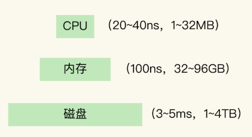
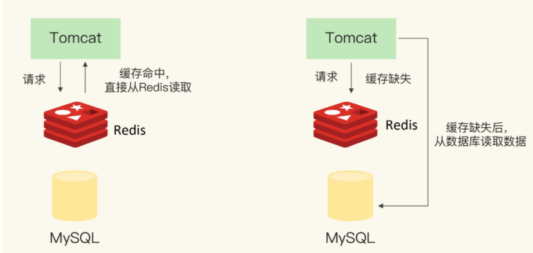
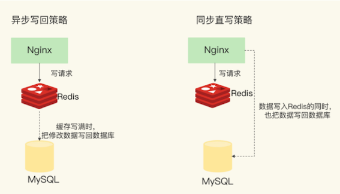

# **第一节 Redis 旁路缓存**

Redis 提供了高性能的数据存取功能，所以广泛应用在缓存场景中，既能有效地提升业务应用的响应速度，还可以避免把高并发大压力的请求发送到数据库层。

但是，如果 Redis 做缓存时出现了问题，**比如说缓存失效，那么，大量请求就会直接积压到数据库层，必然会给数据库带来巨大的压力**，很可能会导致数据库宕机或是故障，那么，业务应用就没有办法存取数据、响应用户请求了。


正因为 Redis 用作缓存的普遍性以及它在业务应用中的重要作用，。具体来说，我们需要解决四个关键问题：

* Redis 缓存具体是怎么工作的？
* Redis 缓存如果满了，该怎么办？
* 为什么会有缓存一致性、缓存穿透、缓存雪崩、缓存击穿等异常，该如何应对？
* Redis 的内存毕竟有限，如果用快速的固态硬盘来保存数据，可以增加缓存的数据量，那么，Redis 缓存可以使用快速固态硬盘吗？

## **1、缓存的特征**

首先，**一个系统中的不同层之间的访问速度不一样，所以我们才需要缓存，这样就可以把一些需要频繁访问的数据放在缓存中，以加快它们的访问速度**。

为了让你能更好地理解，我以计算机系统为例，来解释一下。下图是计算机系统中的三层存储结构，以及它们各自的常用容量和访问性能。

**最上面是处理器，中间是内存，最下面是磁盘。**



从图上可以看到，CPU、内存和磁盘这三层的访问速度从几十 ns 到 100ns，再到几 ms，性能的差异很大。

如果每次 CPU 处理数据时，都要从 ms 级别的慢速磁盘中读取数据，然后再进行处理，那么，CPU 只能等磁盘的数据传输完成。这样一来，高速的 CPU 就被慢速的磁盘拖累了，整个计算机系统的运行速度会变得非常慢。

所以，计算机系统中，默认有两种缓存：

* **CPU 里面的末级缓存，即 LLC**，**用来缓存内存中的数据，避免每次从内存中存取数据；**
* **内存中的高速页缓存，即 page cache，用来缓存磁盘中的数据，避免每次从磁盘中存取数据。**


**<span style="color:red">跟内存相比，LLC 的访问速度更快，而跟磁盘相比，内存的访问是更快的。</span>**

* **缓存的第一个特征:**

在一个层次化的系统中，缓存一定是一个快速子系统，数据存在缓存中时，能避免每次从慢速子系统中存取数据。对应到互联网应用来说，Redis 就是快速子系统，而数据库就是慢速子系统了。

* **缓存的第二个特征:**

> 。LLC 的大小是 MB 级别，page cache 的大小是 GB 级别，而磁盘的大小是 TB 级别

缓存系统的容量大小总是小于后端慢速系统的，我们不可能把所有数据都放在缓存系统中。

**缓存的容量终究是有限的，缓存中的数据量也是有限的，肯定是没法时刻都满足访问需求的。**

所以，缓存和后端慢速系统之间，必然存在数据写回和再读取的交互过程。**简单来说，缓存中的数据需要按一定规则淘汰出去，写回后端系统，而新的数据又要从后端系统中读取进来，写入缓存。**


Redis 本身是支持按一定规则淘汰数据的，相当于实现了缓存的数据淘汰，其实，这也是 Redis 适合用作缓存的一个重要原因。

## **2、Redis 缓存处理请求的两种情况**

把 Redis 用作缓存时，我们会把 Redis 部署在数据库的前端，业务应用在访问数据时，会先查询 Redis 中是否保存了相应的数据。此时，根据数据是否存在缓存中，会有两种情况。

* **缓存命中**：<span style="color:red">Redis 中有相应数据，就直接读取 Redis，性能非常快。</span>
* **缓存缺失**：Redis 中没有保存相应数据，就从后端数据库中读取数据，性能就会变慢。
	* 而且，一旦发生缓存缺失，为了让后续请求能从缓存中读取到数据，**我们需要把缺失的数据写入 Redis，这个过程叫作缓存更新**。
	* **缓存更新操作会涉及到保证缓存和数据库之间的数据一致性问题**



假设我们在一个 Web 应用中，使用 Redis 作为缓存。

* 用户请求发送给 Tomcat，Tomcat 负责处理业务逻辑。
* 如果要访问数据，就需要从 MySQL 中读写数据。
* 那么，我们可以把 Redis 部署在 MySQL 前端。
* 如果访问的数据在 Redis 中，此时缓存命中，Tomcat 可以直接从 Redis 中读取数据，加速应用的访问。
* **否则，Tomcat 就需要从慢速的数据库中读取数据了。**

到这里，你可能已经发现了，使用 Redis 缓存时，我们基本有三个操作：

* 应用读取数据时，需要先读取 Redis；
* 发生缓存缺失时，需要从数据库读取数据；
* 发生缓存缺失时，还需要更新缓存。

## **3、Redis 作为旁路缓存的使用操作**

Redis 是一个独立的系统软件，和业务应用程序是两个软件，当我们部署了 Redis 实例后，它只会被动地等待客户端发送请求，然后再进行处理。

所以，如果应用程序想要使用 Redis 缓存，我们就要在程序中增加相应的缓存操作代码。

**<span style="color:red">我们也把 Redis 称为旁路缓存，也就是说，读取缓存、读取数据库和更新缓存的操作都需要在应用程序中来完成。</span>**

使用 Redis 缓存时，具体来说，我们需要在应用程序中增加三方面的代码：

* 当应用程序需要读取数据时，我们需要在代码中显式调用 Redis 的 GET 操作接口，进行查询；
* 如果缓存缺失了，应用程序需要再和数据库连接，从数据库中读取数据；
* 当缓存中的数据需要更新时，我们也需要在应用程序中显式地调用 SET 操作接口，把更新的数据写入缓存。


展示一段 Web 应用中使用 Redis 缓存的伪代码示例。

```
String cacheKey = “productid_11010003”;
String cacheValue = redisCache.get(cacheKey)；
//缓存命中
if ( cacheValue != NULL)
   return cacheValue;
//缓存缺失
else
   cacheValue = getProductFromDB();
   redisCache.put(cacheValue)  //缓存更新
```

可以看到，为了使用缓存，**Web 应用程序需要有一个表示缓存系统的实例对象 `redisCache`，还需要主动调用 `Redis` 的 `GET` 接口，并且要处理缓存命中和缓存缺失时的逻辑，例如在缓存缺失时，需要更新缓存**。


在使用旁路缓存时，我们需要在应用程序中增加操作代码，增加了使用 Redis 缓存的额外工作量，但是，也正因为 Redis 是旁路缓存，是一个独立的系统，我们可以单独对 Redis 缓存进行扩容或性能优化。而且，只要保持操作接口不变，我们在应用程序中增加的代码就不用再修改了。

除了从 Redis 缓存中查询、读取数据以外，应用程序还可能会对数据进行修改，这时，我们既可以在缓存中修改，也可以在后端数据库中进行修改，我们该怎么选择呢？

**Redis 缓存的两种类型**：只读缓存和读写缓存。

* **只读缓存能加速读请求，而读写缓存可以同时加速读写请求**。
* 读写缓存又有两种数据写回策略，可以让我们根据业务需求，在保证性能和保证数据可靠性之间进行选择。


所以，接下来，我们来具体了解下 Redis 的缓存类型和相应的写回策略。

## **4、缓存的类型**

按照 Redis 缓存是否接受写请求，我们可以把它分成**只读缓存和读写缓存**。

### **4-1 只读缓存**

当 Redis 用作只读缓存时，应用要读取数据的话，会先调用 `Redis GET` 接口，查询数据是否存在。**而所有的数据写请求，会直接发往后端的数据库，在数据库中增删改。**

对于删改的数据来说，如果 Redis 已经缓存了相应的数据，应用需要把这些缓存的数据删除，Redis 中就没有这些数据了。

当应用再次读取这些数据时，会发生缓存缺失，应用会把这些数据从数据库中读出来，并写到缓存中。这样一来，这些数据后续再被读取时，就可以直接从缓存中获取了，能起到加速访问的效果。

* 假设业务应用要修改数据 A，此时，数据 A 在 Redis 中也缓存了，
* 应用会先直接在**数据库里修改 A，并把 Redis 中的 A 删除**。
* 等到应用需要读取数据 A 时，会发生**缓存缺失，此时，应用从数据库中读取 A，并写入 Redis**，以便后续请求从缓存中直接读取，如下图所示：


**只读缓存直接在数据库中更新数据的好处是，所有最新的数据都在数据库中，而数据库是提供数据可靠性保障的，这些数据不会有丢失的风险。**

**<span style="color:red">当我们需要缓存图片、短视频这些用户只读的数据时，就可以使用只读缓存这个类型了。</span>**

### **4-2 读写缓存**

对于读写缓存来说，除了读请求会发送到缓存进行处理（直接在缓存中查询数据是否存在)，所有的写请求也会发送到缓存，在缓存中直接对数据进行增删改操作。

**此时，得益于 Redis 的高性能访问特性，数据的增删改操作可以在缓存中快速完成，处理结果也会快速返回给业务应用，这就可以提升业务应用的响应速度。**


**但是，和只读缓存不一样的是，在使用读写缓存时，最新的数据是在 Redis 中，而 Redis 是内存数据库，一旦出现掉电或宕机**，内存中的数据就会丢失。这也就是说，应用的最新数据可能会丢失，给应用业务带来风险。


所以，根据业务应用对数据可靠性和缓存性能的不同要求，**<span style="color:red">我们会有同步直写和异步写回两种策略。其中，同步直写策略优先保证数据可靠性，而异步写回策略优先提供快速响应。</span>**


### **4-2  读写缓存:同步直写**

写请求发给缓存的同时，也会发给后端数据库进行处理，等到缓存和数据库都写完数据，才给客户端返回

即使缓存宕机或发生故障，最新的数据仍然保存在数据库中，这就提供了数据可靠性保证。

**不过，同步直写会降低缓存的访问性能。**

* 这是因为缓存中处理写请求的速度是很快的，而数据库处理写请求的速度较慢。
* 即使缓存很快地处理了写请求，也需要等待数据库处理完所有的写请求，才能给应用返回结果，这就增加了缓存的响应延迟。


### **4-3  读写缓存:而异步写回**

而异步写回策略，则是优先考虑了响应延迟。此时，**所有写请求都先在缓存中处理。等到这些增改的数据要被从缓存中淘汰出来时，缓存将它们写回后端数据库。**

**只不过，如果发生了掉电，而它们还没有被写回数据库，就会有丢失的风险了。**



关于是选择只读缓存，还是读写缓存，主要看我们对写请求是否有加速的需求。

* **<span style="color:red">如果需要对写请求进行加速，我们选择读写缓存；</span>**
* **<span style="color:green">如果写请求很少，或者是只需要提升读请求的响应速度的话，我们选择只读缓存。</span>**


举个例子，在商品大促的场景中，商品的库存信息会一直被修改。如果每次修改都需到数据库中处理，就会拖慢整个应用，此时，我们通常会选择读写缓存的模式。

而在短视频 App 的场景中，虽然视频的属性有很多，但是，一般确定后，修改并不频繁，此时，在数据库中进行修改对缓存影响不大，所以只读缓存模式是一个合适的选择。


## **5、本节小结**

* 分层系统中，数据暂存在快速子系统中有助于加速访问；缓存容量有限，缓存写满时，数据需要被淘汰
* Redis 天然就具有高性能访问和数据淘汰机制，正好符合缓存的这两个特征的要求，所以非常适合用作缓存。
* Redis 作为旁路缓存的特性，旁路缓存就意味着需要在应用程序中新增缓存逻辑处理的代码。当然，如果是无法修改源码的应用场景，就不能使用 Redis 做缓存了。
* Redis 做缓存时，还有两种模式，分别是只读缓存和读写缓存。
* 读写缓存还提供了同步直写和异步写回这两种模式，同步直写模式侧重于保证数据可靠性，而异步写回模式则侧重于提供低延迟访问，
* **<span style="color:red">如果需要对写请求进行加速，我们选择读写缓存；</span>**
* **<span style="color:green">如果写请求很少，或者是只需要提升读请求的响应速度的话，我们选择只读缓存。</span>**
