# **第三节 如何解决缓存和数据库的数据不一致的缓存异常**

Redis 缓存时的异常问题，概括来说有 4 个方面：

* 缓存中的数据和数据库中的不一致；
* 缓存雪崩；
* 缓存击穿和缓存穿透。

只要我们使用 Redis 缓存，就必然会面对缓存和数据库间的一致性保证问题，如果数据不一致，那么业务应用从缓存中读取的数据就不是最新数据，这会导致严重的错误。

比如说，我们把电商商品的库存信息缓存在 Redis 中，如果库存信息不对，那么业务层下单操作就可能出错，这当然是不能接受的。

## **1、缓存和数据库的数据不一致是如何发生的？**

* 缓存中有数据，那么，缓存的数据值需要和数据库中的值相同；
* 缓存中本身没有数据，那么，数据库中的值必须是最新值。

**<span style="color:red">不符合这两种情况的，就属于缓存和数据库的数据不一致问题了。</span>**

不过，当缓存的读写模式不同时，缓存数据不一致的发生情况不一样，我们的应对方法也会有所不同，所以，我们先按照缓存读写模式，来分别了解下不同模式下的缓存不一致情况

**根据是否接收写请求，我们可以把缓存分成读写缓存和只读缓存。**

### **1-1 读写缓存**

对于读写缓存来说，如果要对数据进行增删改，就需要在缓存中进行，同时还要根据采取的写回策略，决定是否同步写回到数据库中。

* 同步直写策略：写缓存时，也同步写数据库，缓存和数据库中的数据一致；
* 异步写回策略：写缓存时不同步写数据库，等到数据从缓存中淘汰时，再写回数据库。使用这种策略时，如果数据还没有写回数据库，缓存就发生了故障，那么，此时，数据库就没有最新的数据了。

所以，对于读写缓存来说，要想保证缓存和数据库中的数据一致，就要采用同步直写策略。

**需要注意的是，如果采用这种策略，就需要同时更新缓存和数据库**。所以，我们要在业务应用中使用事务机制，来保证缓存和数据库的更新具有原子性，也就是说，两者要不一起更新，要不都不更新，返回错误信息，进行重试。否则，我们就无法实现同步直写。

在有些场景下，我们对**数据一致性的要求可能不是那么高**，比如说缓存的是电商商品的非关键属性或者短视频的创建或修改时间等，那么，**我们可以使用异步写回策略**。

### **1-2 只读缓存**

对于只读缓存来说，如果有数据新增，会直接写入数据库；

**而有数据删改时，就需要把只读缓存中的数据标记为无效。这样一来，应用后续再访问这些增删改的数据时，因为缓存中没有相应的数据，就会发生缓存缺失**。

此时，应用再从数据库中把数据读入缓存，这样后续再访问数据时，就能够直接从缓存中读取了。

**Tomcat 向 MySQL 中写入和删改数据**

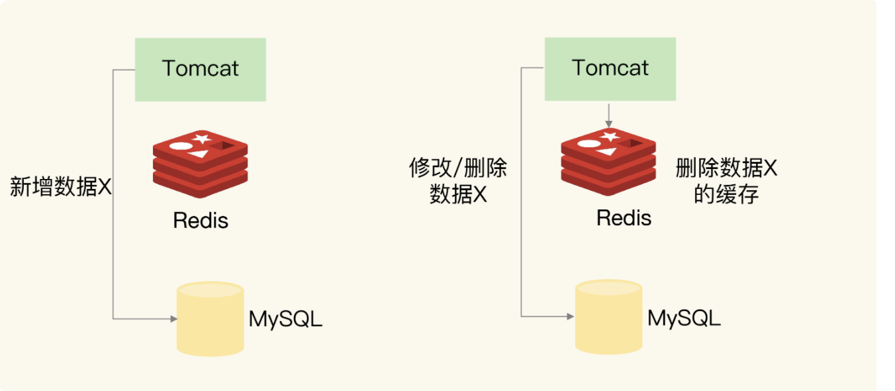

，Tomcat 上运行的应用，无论是新增（Insert 操作）、修改（Update 操作）、还是删除（Delete 操作）数据 X，都会直接在数据库中增改删。

**当然，如果应用执行的是修改或删除操作，还会删除缓存的数据 X。**

### **1-2-1 新增数据**

如果是新增数据，数据会直接写到数据库中，不用对缓存做任何操作，此时，缓存中本身就没有新增数据，而数据库中是最新值，这种情况符合我们刚刚所说的一致性的第 2 种情况，所以，此时，缓存和数据库的数据是一致的

### **1-2-2 删改数据**

**如果发生删改操作，应用既要更新数据库，也要在缓存中删除数据。这两个操作如果无法保证原子性，也就是说，要不都完成，要不都没完成**，此时，就会出现数据不一致问题了。这个问题比较复杂，我们来分析一下。

**<span style="color:red">我们假设应用先删除缓存，再更新数据库，如果缓存删除成功，但是数据库更新失败，那么，应用再访问数据时，缓存中没有数据，就会发生缓存缺失</span>**

然后，应用再访问数据库，但是数据库中的值为旧值，应用就访问到旧值了。

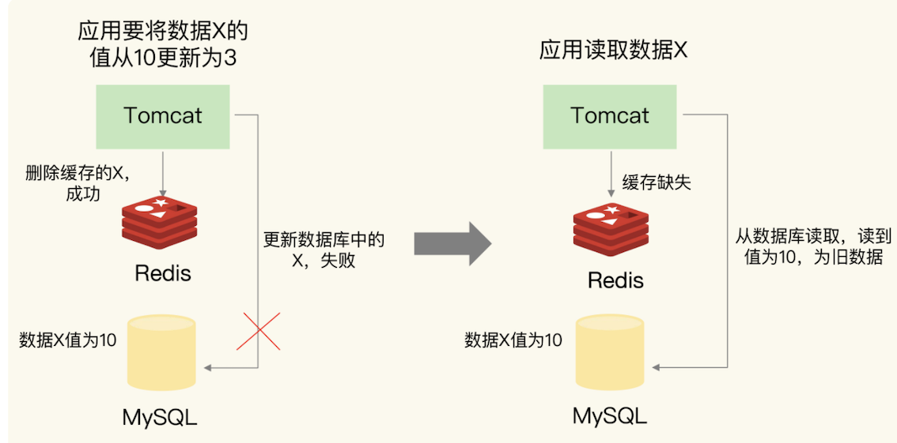

* 应用要把数据 X 的值从 10 更新为 3，先在 Redis 缓存中删除了 X 的缓存值，但是更新数据库却失败了。
* 如果此时有其他并发的请求访问 X，会发现 Redis 中缓存缺失，紧接着，请求就会访问数据库，读到的却是旧值 10。

如果应用先完成了数据库的更新，但是，在删除缓存时失败了，那么，数据库中的值是新值，而缓存中的是旧值，这肯定是不一致的。这个时候，如果有其他的并发请求来访问数据，按照正常的缓存访问流程，就会先在缓存中查询，但此时，就会读到旧值了。

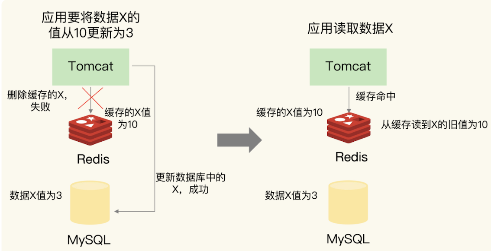

应用要把数据 X 的值从 10 更新为 3，先成功更新了数据库，然后在 Redis 缓存中删除 X 的缓存，但是这个操作却失败了，这个时候，数据库中 X 的新值为 3，Redis 中的 X 的缓存值为 10，这肯定是不一致的。如果刚好此时有其他客户端也发送请求访问 X，会先在 Redis 中查询，该客户端会发现缓存命中，但是读到的却是旧值 10。


**在更新数据库和删除缓存值的过程中，无论这两个操作的执行顺序谁先谁后，只要有一个操作失败了，就会导致客户端读取到旧值。**

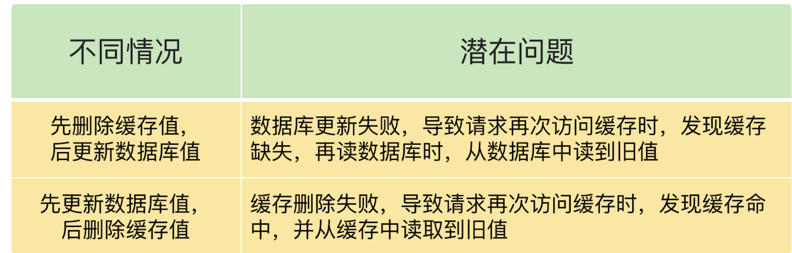

## **2、如何解决数据不一致问题？**

### **2-1 重试机制**

具体来说，可以把要删除的缓存值或者是要更新的数据库值暂存到消息队列中（例如使用 Kafka 消息队列）。

当应用没有能够成功地删除缓存值或者是更新数据库值时，可以从消息队列中重新读取这些值，然后再次进行删除或更新。

如果能够成功地删除或更新，我们就要把这些值从消息队列中去除，以免重复操作，此时，我们也可以保证数据库和缓存的数据一致了。否则的话，**我们还需要再次进行重试。如果重试超过的一定次数，还是没有成功，我们就需要向业务层发送报错信息了。**

先更新数据库，再删除缓存值时，如果缓存删除失败，再次重试后删除成功的情况

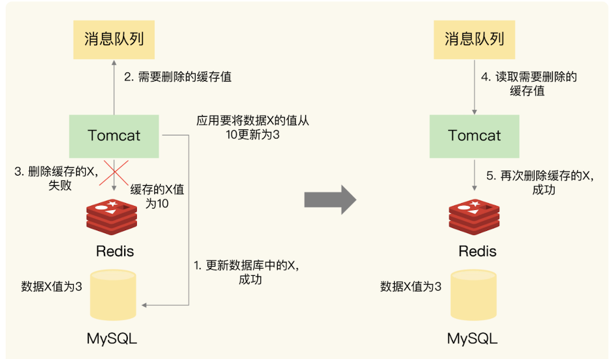

实际上，即使这两个操作第一次执行时都没有失败，当有大量并发请求时，应用还是有可能读到不一致的数据。

我们按照不同的删除和更新顺序，分成两种情况来看。在这两种情况下，我们的解决方法也有所不同。

### **2-2 情况一：先删除缓存，再更新数据库**

假设线程 A 删除缓存值后，还没有来得及更新数据库（比如说有网络延迟），线程 B 就开始读取数据了，那么这个时候，线程 B 会发现缓存缺失，就只能去数据库读取。这会带来两个问题：

* 线程 B 读取到了旧值；
* 线程 B 是在缓存缺失的情况下读取的数据库，所以，它还会把旧值写入缓存，这可能会导致其他线程从缓存中读到旧值。

等到线程 B 从数据库读取完数据、更新了缓存后，线程 A 才开始更新数据库，此时，缓存中的数据是旧值，而数据库中的是最新值，两者就不一致了。

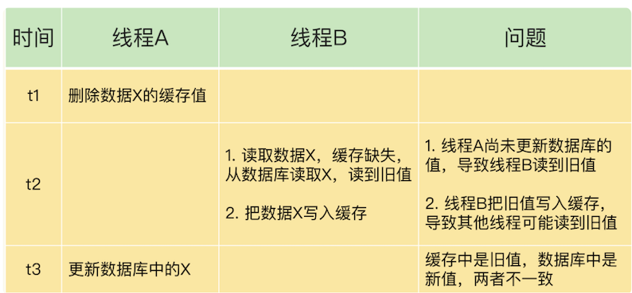

**<span style="color:red">在线程 A 更新完数据库值以后，我们可以让它先 sleep 一小段时间，再进行一次缓存删除操作。</span>**

* 之所以要加上 sleep 的这段时间，就是为了让线程 B 能够先从数据库读取数据，
* **再把缺失的数据写入缓存，**
* 然后，线程 A 再进行删除。
* **所以，线程 A sleep 的时间，就需要大于线程 B 读取数据再写入缓存的时间**。

这个时间怎么确定呢？

建议你在业务程序运行的时候，统计下线程读数据和写缓存的操作时间，以此为基础来进行估算。

**<span style="color:red">这样一来，其它线程读取数据时，会发现缓存缺失，所以会从数据库中读取最新值。因为这个方案会在第一次删除缓存值后，延迟一段时间再次进行删除，所以我们也把它叫做“延迟双删”。</span>**

```
redis.delKey(X)
db.update(X)
Thread.sleep(N)
redis.delKey(X)
```

### **2-3 情况二：先更新数据库值，再删除缓存值**

如果线程 A 删除了数据库中的值，但还没来得及删除缓存值，线程 B 就开始读取数据了，那么此时，线程 B 查询缓存时，发现缓存命中，就会直接从缓存中读取旧值。

不过，在这种情况下，如果其他线程并发读缓存的请求不多，那么，就不会有很多请求读取到旧值。而且，线程 A 一般也会很快删除缓存值，

这样一来，其他线程再次读取时，就会发生缓存缺失，进而从数据库中读取最新值。所以，这种情况对业务的影响较小。

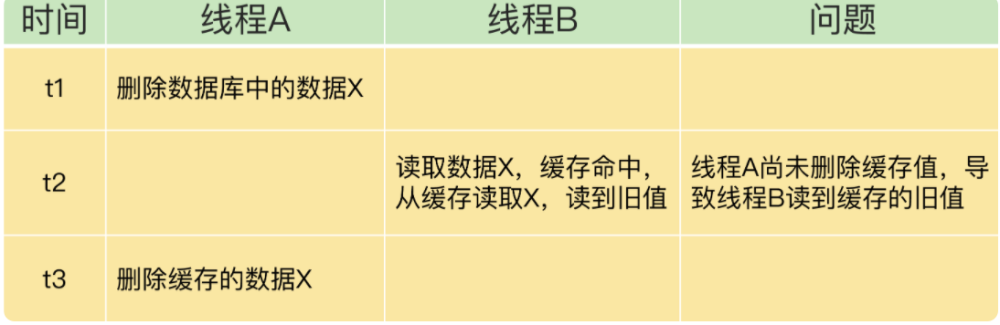

* 删除缓存值或更新数据库失败而导致数据不一致，**你可以使用重试机制确保删除或更新操作成功**
* 在删除缓存值、更新数据库的这两步操作中，**有其他线程的并发读操作，导致其他线程读取到旧值，应对方案是延迟双删。**

## **3、缓存雪崩**

缓存雪崩是指大量的应用请求无法在 Redis 缓存中进行处理，紧接着，应用将大量请求发送到数据库层，导致数据库层的压力激增。

**第一个原因是：缓存中有大量数据同时过期，导致大量请求无法得到处理。**

具体来说，**当数据保存在缓存中，并且设置了过期时间时，如果在某一个时刻，大量数据同时过期，此时，应用再访问这些数据的话，就会发生缓存缺失。** 紧接着，应用就会把请求发送给数据库，从数据库中读取数据。如果应用的并发请求量很大，那么数据库的压力也就很大，这会进一步影响到数据库的其他正常业务请求处理。

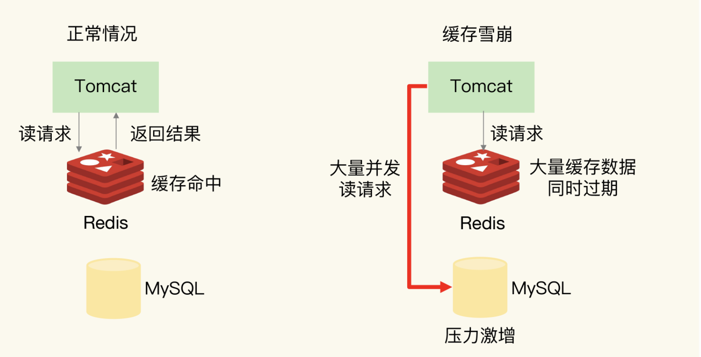

针对大量数据同时失效带来的缓存雪崩问题，提供两种解决方案。

### **3-1 避免给大量的数据设置相同的过期时间**

首先，我们可以避免给大量的数据设置相同的过期时间。

如果业务层的确要求有些数据同时失效，你可以在用 `EXPIRE` 命令给每个数据设置过期时间时，给**这些数据的过期时间增加一个较小的随机数（例如，随机增加 1~3 分钟）**，这样一来，不同数据的过期时间有所差别，但差别又不会太大，既避免了大量数据同时过期，同时也保证了这些数据基本在相近的时间失效，仍然能满足业务需求。

### **3-2 服务降级**

我们还可以通过服务降级，来应对缓存雪崩。所谓的服务降级，是指发生缓存雪崩时，针对不同的数据采取不同的处理方式。

* 当业务应用访问的是非核心数据（例如电商商品属性）时，**暂时停止从缓存中查询这些数据，而是直接返回预定义信息、空值或是错误信息；**
* **当业务应用访问的是核心数据（例如电商商品库存）时，仍然允许查询缓存**，如果缓存缺失，也可以继续通过数据库读取。

这样一来，只有部分过期数据的请求会发送到数据库，数据库的压力就没有那么大了。

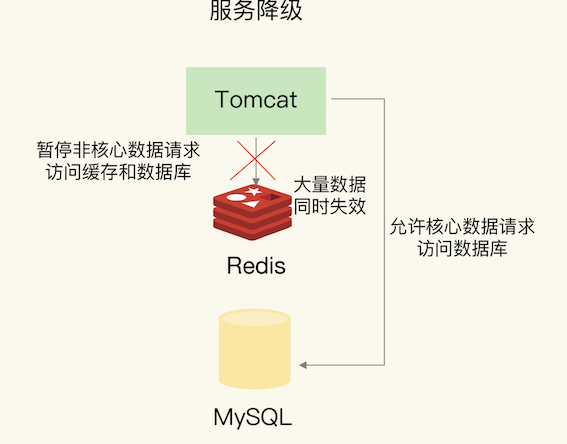

**<span style="color:red">除了大量数据同时失效会导致缓存雪崩，还有一种情况也会发生缓存雪崩，那就是，Redis 缓存实例发生故障宕机了，无法处理请求，这就会导致大量请求一下子积压到数据库层，从而发生缓存雪崩。</span>**

一般来说，一个 Redis 实例可以支持数万级别的请求处理吞吐量，而单个数据库可能只能支持数千级别的请求处理吞吐量，它们两个的处理能力可能相差了近十倍。由于缓存雪崩，Redis 缓存失效，所以，数据库就可能要承受近十倍的请求压力，从而因为压力过大而崩溃。

因为 Redis 实例发生了宕机，我们需要通过其他方法来应对缓存雪崩了

### **3-3 建议一：是在业务系统中实现服务熔断或请求限流机制**

所谓的服务熔断，是指在发生缓存雪崩时，为了防止引发连锁的数据库雪崩，甚至是整个系统的崩溃，**我们暂停业务应用对缓存系统的接口访问。**

再具体点说，**就是业务应用调用缓存接口时，缓存客户端并不把请求发给 Redis 缓存实例**，而是直接返回，等到 Redis 缓存实例重新恢复服务后，再允许应用请求发送到缓存系统。

这样一来，就避免了大量请求因缓存缺失，而积压到数据库系统，保证了数据库系统的正常运行。

在业务系统运行时，我们可以监测 Redis 缓存所在机器和数据库所在机器的负载指标，例如每秒请求数、CPU 利用率、内存利用率等。如果我们发现 Redis 缓存实例宕机了，而数据库所在机器的负载压力突然增加（例如每秒请求数激增），此时，就发生缓存雪崩了。

**大量请求被发送到数据库进行处理。我们可以启动服务熔断机制，暂停业务应用对缓存服务的访问，从而降低对数据库的访问压力，**如下图所示：

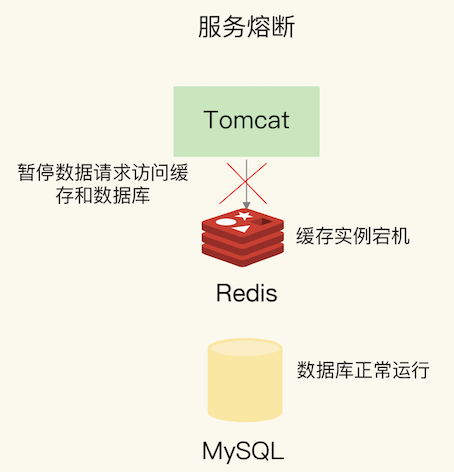

服务熔断虽然可以保证数据库的正常运行，但是暂停了整个缓存系统的访问，对业务应用的影响范围大。

**为了尽可能减少这种影响，我们也可以进行请求限流。这里说的请求限流，就是指，我们在业务系统的请求入口前端控制每秒进入系统的请求数，避免过多的请求被发送到数据库。**

你举个例子。假设业务系统正常运行时，请求入口前端允许每秒进入系统的请求是 1 万个，其中，9000 个请求都能在缓存系统中进行处理，只有 1000 个请求会被应用发送到数据库进行处理。

一旦发生了缓存雪崩，数据库的每秒请求数突然增加到每秒 1 万个，此时，我们就可以启动请求限流机制，在请求入口前端只允许每秒进入系统的请求数为 1000 个，再多的请求就会在入口前端被直接拒绝服务。所以，使用了请求限流，就可以避免大量并发请求压力传递到数据库层。

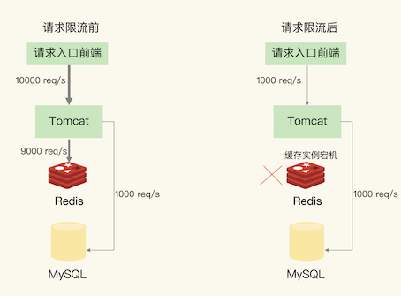

### **3-4  建议二：事前预防**

通过主从节点的方式构建 Redis 缓存高可靠集群。**如果 Redis 缓存的主节点故障宕机了，从节点还可以切换成为主节点，继续提供缓存服务，避免了由于缓存实例宕机而导致的缓存雪崩问题**。

缓存雪崩是发生在大量数据同时失效的场景下，和缓存雪崩相比，缓存击穿失效的数据数量要小很多。

## **4、缓存击穿**

缓存击穿是指，针对某个访问非常频繁的热点数据的请求，无法在缓存中进行处理，紧接着，访问该数据的大量请求，一下子都发送到了后端数据库，**导致了数据库压力激增，会影响数据库处理其他请求**。**缓存击穿的情况，经常发生在热点数据过期失效时**，如下图所示：

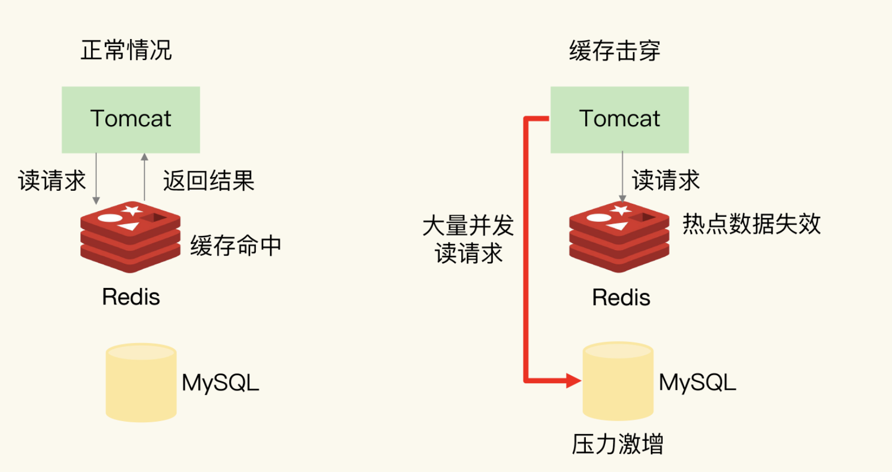

为了避免缓存击穿给数据库带来的激增压力，解决方法也比较直接，**对于访问特别频繁的热点数据，我们就不设置过期时间了**

对热点数据的访问请求，都可以在缓存中进行处理，而 Redis 数万级别的高吞吐量可以很好地应对大量的并发请求访问。

## **5、缓存穿透**

缓存穿透是指要访问的数据既**不在 Redis 缓存中，也不在数据库中，导致请求在访问缓存时，发生缓存缺失**，再去访问数据库时，发现数据库中也没有要访问的数据

应用也无法从数据库中读取数据再写入缓存，来服务后续请求，这样一来，**缓存也就成了“摆设”，如果应用持续有大量请求访问数据，就会同时给缓存和数据库带来巨大压力**

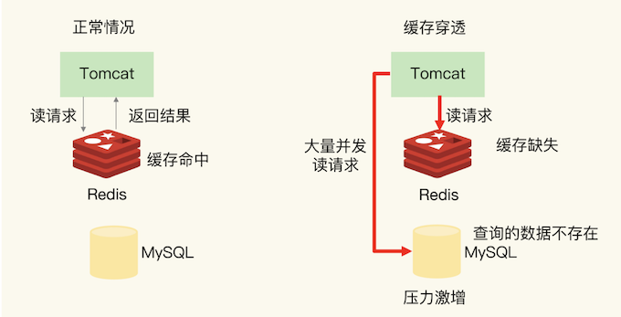

缓存穿透会发生在什么时候呢？一般来说，有两种情况。

* **业务层误操作：缓存中的数据和数据库中的数据被误删除了，所以缓存和数据库中都没有数据；**
* **恶意攻击：专门访问数据库中没有的数据。**

### **5-1 方案一：缓存空值或缺省值**

一旦发生缓存穿透，我们就可以针对查询的数据，**在 Redis 中缓存一个空值或是和业务层协商确定的缺省值（例如，库存的缺省值可以设为 0）。**

紧接着，**应用发送的后续请求再进行查询时，就可以直接从 Redis 中读取空值或缺省值**，返回给业务应用了，避免了把大量请求发送给数据库处理，保持了数据库的正常运行。

### **5-2 方案二 使用布隆过滤器快速判断数据是否存在**

**使用布隆过滤器快速判断数据是否存在，避免从数据库中查询数据是否存在，减轻数据库压力。**

使用布隆过滤器快速判断数据是否存在

布隆过滤器由一个初值都为 0 的 bit 数组和 N 个哈希函数组成，可以用来快速判断某个数据是否存在。当我们想标记某个数据存在时（例如，数据已被写入数据库），布隆过滤器会通过三个操作完成标记：

* 首先，使用 N 个哈希函数，分别计算这个数据的哈希值，得到 N 个哈希值。
* 然后，我们把这 N 个哈希值对 bit 数组的长度取模，得到每个哈希值在数组中的对应位置。
* 最后，我们把对应位置的 bit 位设置为 1，这就完成了在布隆过滤器中标记数据的操作。

如果数据不存在（例如，数据库里没有写入数据），我们也就没有用布隆过滤器标记过数据，那么，bit 数组对应 bit 位的值仍然为 0。

当需要查询某个数据时，我们就执行刚刚说的计算过程，先得到这个数据在 bit 数组中对应的 N 个位置。紧接着，我们查看 bit 数组中这 N 个位置上的 bit 值。只要这 N 个 bit 值有一个不为 1，这就表明布隆过滤器没有对该数据做过标记，所以，查询的数据一定没有在数据库中保存。

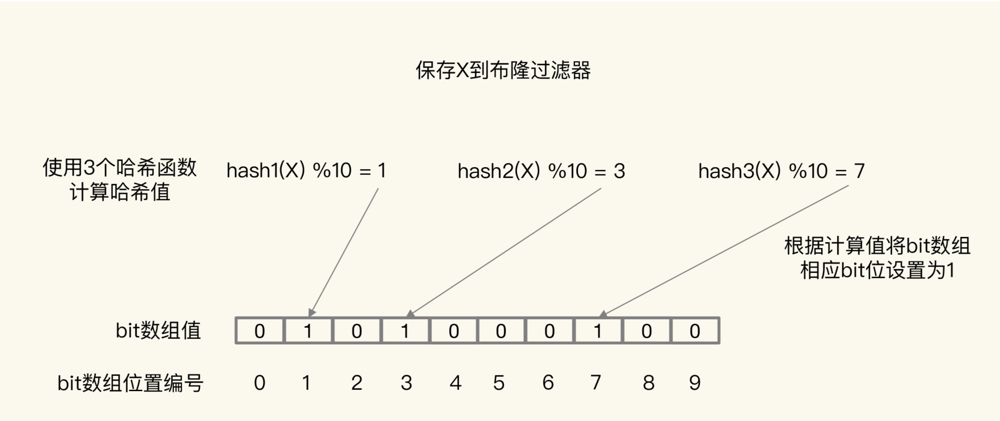

正是基于布隆过滤器的快速检测特性，我们可以在把数据写入数据库时，使用布隆过滤器做个标记。当缓存缺失后，应用查询数据库时，可以通过查询布隆过滤器快速判断数据是否存在。如果不存在，就不用再去数据库中查询了。

**这样一来，即使发生缓存穿透了，大量请求只会查询 Redis 和布隆过滤器，而不会积压到数据库，也就不会影响数据库的正常运行。布隆过滤器可以使用 Redis 实现，本身就能承担较大的并发访问压力。**

### **5-2 方案三 请求入口的前端进行请求检测**

**缓存穿透的一个原因是有大量的恶意请求访问不存在的数据，所以，一个有效的应对方案是在请求入口前端，对业务系统接收到的请求进行合法性检测**，把恶意的请求（例如请求参数不合理、请求参数是非法值、请求字段不存在）直接过滤掉，不让它们访问后端缓存和数据库。这样一来，也就不会出现缓存穿透问题了。

**跟缓存雪崩、缓存击穿这两类问题相比，缓存穿透的影响更大一些**

* 从预防的角度来说，我们需要避免误删除数据库和缓存中的数据；
* 从应对角度来说，**我们可以在业务系统中使用缓存空值或缺省值、使用布隆过滤器，以及进行恶意请求检测等方法**。

## **本节小结**

使用 Redis 缓存时，最常遇见的一个问题，也就是缓存和数据库不一致的问题

对于读写缓存来说，如果我们采用同步写回策略，那么可以保证缓存和数据库中的数据一致。


**<span style="color:red">在大多数业务场景下，我们会把 Redis 作为只读缓存使用</span>**

针对只读缓存来说，我们既可以先删除缓存值再更新数据库，也可以先更新数据库再删除缓存。我的建议是，**<span style="color:red">优先使用先更新数据库再删除缓存的方法</span>**，原因主要有两个：

1. 先删除缓存值再更新数据库，有可能导致请求因缓存缺失而访问数据库，给数据库带来压力；
2. 如果业务应用中读取数据库和写缓存的时间不好估算，那么，延迟双删中的等待时间就不好设置。

不过，当使用先更新数据库再删除缓存时，也有个地方需要注意，**如果业务层要求必须读取一致的数据，那么，我们就需要在更新数据库时，先在 Redis 缓存客户端暂存并发读请求，等数据库更新完、缓存值删除后，再读取数据，从而保证数据一致性**。

**缓存雪崩和击穿主要是因为数据不在缓存中了，而缓存穿透则是因为数据既不在缓存中，也不在数据库中。**

* 所以，缓存雪崩或击穿时，**一旦数据库中的数据被再次写入到缓存后，应用又可以在缓存中快速访问数据了**，数据库的压力也会相应地降低下来
* 而缓存穿透发生时**，Redis 缓存和数据库会同时持续承受请求压力。**


服务熔断、服务降级、请求限流这些方法都是属于“有损”方案，在保证数据库和整体系统稳定的同时，会对业务应用带来负面影响。

例如使用服务降级时，有部分数据的请求就只能得到错误返回信息，无法正常处理。如果使用了服务熔断，那么，整个缓存系统的服务都被暂停了，影响的业务范围更大。而使用了请求限流机制后，整个业务系统的吞吐率会降低，能并发处理的用户请求会减少，会影响到用户体验

**<span style="color:red">尽量使用预防式方案：</span>**


* **针对缓存雪崩，合理地设置数据过期时间，以及搭建高可靠缓存集群**；
* **针对缓存击穿，在缓存访问非常频繁的热点数据时，不要设置过期时间；**
* **针对缓存穿透，提前在入口前端实现恶意请求检测，或者规范数据库的数据删除操作，避免误删除。**