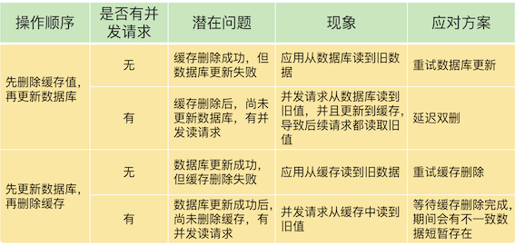
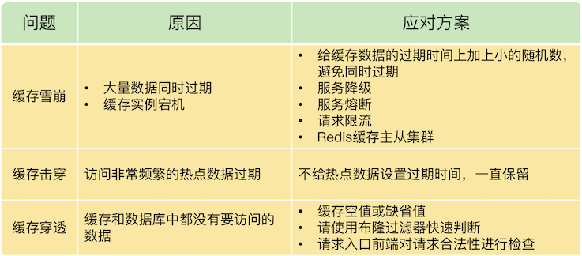
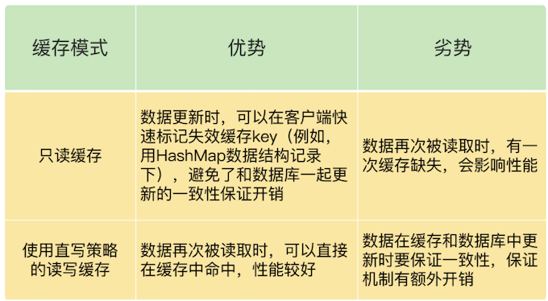

# **第五节 Redis 缓存总结**

## **1、本章小结**

### **1-1 Redis 旁路缓存**

* 分层系统中，数据暂存在快速子系统中有助于加速访问；缓存容量有限，缓存写满时，数据需要被淘汰
* Redis 天然就具有高性能访问和数据淘汰机制，正好符合缓存的这两个特征的要求，所以非常适合用作缓存。
* Redis 作为旁路缓存的特性，旁路缓存就意味着需要在应用程序中新增缓存逻辑处理的代码。当然，如果是无法修改源码的应用场景，就不能使用 Redis 做缓存了。
* Redis 做缓存时，还有两种模式，分别是只读缓存和读写缓存。
* 读写缓存还提供了同步直写和异步写回这两种模式，同步直写模式侧重于保证数据可靠性，而异步写回模式则侧重于提供低延迟访问，
* **<span style="color:red">如果需要对写请求进行加速，我们选择读写缓存；</span>**
* **<span style="color:green">如果写请求很少，或者是只需要提升读请求的响应速度的话，我们选择只读缓存。</span>**

### **1-2 缓存满后的替换策略**

缓存替换时的数据淘汰策略，以及被淘汰数据的处理方法。

Redis 4.0 版本以后一共提供了 8 种数据淘汰策略，从淘汰数据的候选集范围来看，我们有两种候选范围：**一种是所有数据都是候选集，一种是设置了过期时间的数据是候选集。**

另外，无论是面向哪种候选数据集进行淘汰数据选择，我们都有三种策略，**分别是随机选择，根据 LRU 算法选择，以及根据 LFU 算法选择**。

当然，当面向设置了过期时间的数据集选择淘汰数据时，我们还可以根据数据离过期时间的远近来决定。

一般来说，缓存系统对于选定的被淘汰数据，**会根据其是干净数据还是脏数据，选择直接删除还是写回数据库**。

但是，在 Redis 中，被淘汰数据无论干净与否都会被删除，所以，这是我们在使用 Redis 缓存时要特别注意的：当数据修改成为脏数据时，需要在数据库中也把数据修改过来。

先根据是否有始终会被频繁访问的数据（例如置顶消息），来选择淘汰数据的候选集，也就是决定是针对所有数据进行淘汰，还是针对设置了过期时间的数据进行淘汰。

**候选数据集范围选定后，建议优先使用 LRU 算法，也就是，allkeys-lru 或 volatile-lru 策略。**

**合实际应用的数据总量、热数据的体量，以及成本预算，把缓存空间大小设置在总数据量的 15% 到 30% 这个区间就可以。**

### **1-3 如何解决缓存和数据库的数据不一致的缓存异常**

使用 Redis 缓存时，最常遇见的一个问题，也就是缓存和数据库不一致的问题

对于读写缓存来说，如果我们采用同步写回策略，那么可以保证缓存和数据库中的数据一致。



**<span style="color:red">在大多数业务场景下，我们会把 Redis 作为只读缓存使用</span>**

针对只读缓存来说，我们既可以先删除缓存值再更新数据库，也可以先更新数据库再删除缓存。我的建议是，**<span style="color:red">优先使用先更新数据库再删除缓存的方法</span>**，原因主要有两个：

1. 先删除缓存值再更新数据库，有可能导致请求因缓存缺失而访问数据库，给数据库带来压力；
2. 如果业务应用中读取数据库和写缓存的时间不好估算，那么，延迟双删中的等待时间就不好设置。

不过，当使用先更新数据库再删除缓存时，也有个地方需要注意，**如果业务层要求必须读取一致的数据，那么，我们就需要在更新数据库时，先在 Redis 缓存客户端暂存并发读请求，等数据库更新完、缓存值删除后，再读取数据，从而保证数据一致性**。

**缓存雪崩和击穿主要是因为数据不在缓存中了，而缓存穿透则是因为数据既不在缓存中，也不在数据库中。**

* 所以，缓存雪崩或击穿时，**一旦数据库中的数据被再次写入到缓存后，应用又可以在缓存中快速访问数据了**，数据库的压力也会相应地降低下来
* 而缓存穿透发生时**，Redis 缓存和数据库会同时持续承受请求压力。**



服务熔断、服务降级、请求限流这些方法都是属于“有损”方案，在保证数据库和整体系统稳定的同时，会对业务应用带来负面影响。

例如使用服务降级时，有部分数据的请求就只能得到错误返回信息，无法正常处理。如果使用了服务熔断，那么，整个缓存系统的服务都被暂停了，影响的业务范围更大。而使用了请求限流机制后，整个业务系统的吞吐率会降低，能并发处理的用户请求会减少，会影响到用户体验

**<span style="color:red">尽量使用预防式方案：</span>**


* **针对缓存雪崩，合理地设置数据过期时间，以及搭建高可靠缓存集群**；
* **针对缓存击穿，在缓存访问非常频繁的热点数据时，不要设置过期时间；**
* **针对缓存穿透，提前在入口前端实现恶意请求检测，或者规范数据库的数据删除操作，避免误删除。**

### **1-4 缓存被污染的解决问题**

如何解决缓存污染

缓存污染问题指的是留存在缓存中的数据，实际不会被再次访问了，但是又占据了缓存空间。如果这样的数据体量很大，甚至占满了缓存，每次有新数据写入缓存时，还需要把这些数据逐步淘汰出缓存，就会增加缓存操作的时间开销。

要解决缓存污染问题，最关键的技术点就是能识别出这些只访问一次或是访问次数很少的数据，在淘汰数据时，优先把它们筛选出来并淘汰掉。


**`volatile-random` 和 `allkeys-random` 是随机选择数据进行淘汰，无法把不再访问的数据筛选出来，可能会造成缓存污染。**

如果业务层明确知道数据的访问时长，可以给数据设置合理的过期时间，再设置 Redis 缓存使用 volatile-ttl 策略。当缓存写满时，剩余存活时间最短的数据就会被淘汰出缓存，避免滞留在缓存中，造成污染。

当我们使用 LRU 策略时，由于 LRU 策略只考虑数据的访问时效，对于只访问一次的数据来说，LRU 策略无法很快将其筛选出来。**而 LFU 策略在 LRU 策略基础上进行了优化，在筛选数据时，首先会筛选并淘汰访问次数少的数据，然后针对访问次数相同的数据，再筛选并淘汰访问时间最久远的数据。**

在具体实现上，相对于 LRU 策略，Redis 只是把原来 24bit 大小的 lru 字段，又进一步拆分成了 16bit 的 ldt 和 8bit 的 counter，分别用来表示数据的访问时间戳和访问次数。**为了避开 8bit 最大只能记录 255 的限制，LFU 策略设计使用非线性增长的计数器来表示数据的访问次数。**

**<span style="color:red">在实际业务应用中，LRU 和 LFU 两个策略都有应用。LRU 和 LFU 两个策略关注的数据访问特征各有侧重，LRU 策略更加关注数据的时效性，而 LFU 策略更加关注数据的访问频次</span>**

通常情况下，实际应用的负载具有较好的时间局部性，所以 LRU 策略的应用会更加广泛。但是，在扫描式查询的应用场景中，LFU 策略就可以很好地应对缓存污染问题了，建议你优先使用。

外，如果业务应用中有短时高频访问的数据，除了 LFU 策略本身会对数据的访问次数进行自动衰减以外，我再给你个小建议：你可以优先使用 `volatile-lfu `策略，并根据这些数据的访问时限设置它们的过期时间，以免它们留存在缓存中造成污染


## **2、本章操作总结**

展示一段 Web 应用中使用 Redis 缓存的伪代码示例。

```
String cacheKey = “productid_11010003”;
String cacheValue = redisCache.get(cacheKey)；
//缓存命中
if ( cacheValue != NULL)
   return cacheValue;
//缓存缺失
else
   cacheValue = getProductFromDB();
   redisCache.put(cacheValue)  //缓存更新
```


对于 Redis 来说，一旦确定了缓存最大容量，比如 4GB，你就可以使用下面这个命令来设定缓存的大小了：

```
CONFIG SET maxmemory 4gb
```

**<span style="color:red">这样一来，其它线程读取数据时，会发现缓存缺失，所以会从数据库中读取最新值。因为这个方案会在第一次删除缓存值后，延迟一段时间再次进行删除，所以我们也把它叫做“延迟双删”。</span>**

```
redis.delKey(X)
db.update(X)
Thread.sleep(N)
redis.delKey(X)
```

## **3、本章问题**

**问题**：Redis 的只读缓存和使用直写策略的读写缓存，都会把数据同步写到后端数据库中，你觉得它们有什么区别吗？

答案：主要的区别在于，当有缓存数据被修改时，**在只读缓存中，业务应用会直接修改数据库，并把缓存中的数据标记为无效；而在读写缓存中，业务应用需要同时修改缓存和数据库**。



**问题**：Redis 缓存在处理脏数据时，不仅会修改数据，还会把它写回数据库。我们在前面学过 Redis 的只读缓存模式和两种读写缓存模式（带同步直写的读写模式，带异步写回的读写模式）），请你思考下，Redis 缓存对应哪一种或哪几种模式？


答案：如果我们在使用 Redis 缓存时，需要把脏数据写回数据库，**这就意味着，Redis 中缓存的数据可以直接被修改，这就对应了读写缓存模式**。更进一步分析的话，**脏数据是在被替换出缓存时写回后端数据库的，这就对应了带有异步写回策略的读写缓存模式**。

**问题**：在只读缓存中对数据进行删改时，需要在缓存中删除相应的缓存值。如果在这个过程中，我们不是删除缓存值，而是直接更新缓存的值，你觉得，和删除缓存值相比，直接更新缓存值有什么好处和不足吗？

答案：如果我们直接在缓存中更新缓存值，等到下次数据再被访问时，业务应用可以直接从缓存中读取数据，这是它的一大好处。

不足之处在于，当有数据更新操作时，我们要保证缓存和数据库中的数据是一致的，**这就可以采用重试或延时双删方法**。不过，这样就需要在业务应用中增加额外代码，有一定的开销。

**问题**：在讲到缓存雪崩时，我提到，可以采用服务熔断、服务降级、请求限流三种方法来应对。请你思考下，这三个方法可以用来应对缓存穿透问题吗？

* 缓存穿透这个问题的本质是查询了 Redis 和数据库中没有的数据，
* 服务熔断、服务降级和请求限流的方法，本质上是为了解决 Redis 实例没有起到缓存层作用的问题，缓存雪崩和缓存击穿都属于这类问题。

在缓存穿透的场景下，业务应用是要从 Redis 和数据库中读取不存在的数据，此时，如果没有人工介入，Redis 是无法发挥缓存作用的。

一个可行的办法就是**事前拦截**，不让这种查询 Redis 和数据库中都没有的数据的请求发送到数据库层。

在缓存穿透的场景下，业务应用是要从 Redis 和数据库中读取不存在的数据，此时，如果没有人工介入，Redis 是无法发挥缓存作用的。一个可行的办法就是事前拦截，不让这种查询 Redis 和数据库中都没有的数据的请求发送到数据库层。

另外，这里，有个地方需要注意下，对于缓存雪崩和击穿问题来说，服务熔断、服务降级和请求限流这三种方法属于有损方法，会降低业务吞吐量、拖慢系统响应、降低用户体验。不过，采用这些方法后，随着数据慢慢地重新填充回 Redis，Redis 还是可以逐步恢复缓存层作用的。


**问题**：使用了 LFU 策略后，缓存还会被污染吗？

答案：在 Redis 中，我们使用了 LFU 策略后，还是有可能发生缓存污染的。

**在一些极端情况下，LFU 策略使用的计数器可能会在短时间内达到一个很大值，而计数器的衰减配置项设置得较大，导致计数器值衰减很慢，**在这种情况下，数据就可能在缓存中长期驻留。例如，一个数据在短时间内被高频访问，即使我们使用了 LFU 策略，这个数据也有可能滞留在缓存中，造成污染。

## **4、典型问题答疑**

**4-1 如何理解把 Redis 称为旁路缓存？**

Redis 称为旁路缓存，更多的是从“业务应用程序如何使用 Redis 缓存”这个角度来说的。**业务应用在使用 Redis 缓存时，需要在业务代码中显式地增加缓存的操作逻辑**。

例如，一个基本的缓存操作就是，一旦发生缓存缺失，业务应用需要自行去读取数据库，而不是缓存自身去从数据库中读取数据再返回。为了便于你理解，我们再来看下和旁路缓存相对应的、计算机系统中的 CPU 缓存和 page cache。这两种缓存默认就在应用程序访问内存和磁盘的路径上，我们写的应用程序都能直接使用这两种缓存。

**我之所以强调 Redis 是一个旁路缓存，也是希望你能够记住，在使用 Redis 缓存时，我们需要修改业务代码。**

### **4-2 使用 Redis 缓存时，应该用哪种模式？**

缓存模式有三种：**只读缓存模式、采用同步直写策略的读写缓存模式、采用异步写回策略的读写缓存模式。**

**一般情况下，我们会把 Redis 缓存用作只读缓存。**只读缓存涉及的操作，包括查询缓存、缓存缺失时读数据库和回填，数据更新时删除缓存数据，这些操作都可以加到业务应用中。而且，当数据更新时，缓存直接删除数据，缓存和数据库的数据一致性较为容易保证。

当然，有时我们也会把 Redis 用作读写缓存，同时采用同步直写策略。在这种情况下，缓存涉及的操作也都可以加到业务应用中。而且，和只读缓存相比有一个好处，就是数据修改后的最新值可以直接从缓存中读取。

**对于采用异步写回策略的读写缓存模式来说，缓存系统需要能在脏数据被淘汰时，自行把数据写回数据库，但是，Redis 是无法实现这一点的，所以我们使用 Redis 缓存时，并不采用这个模式。**