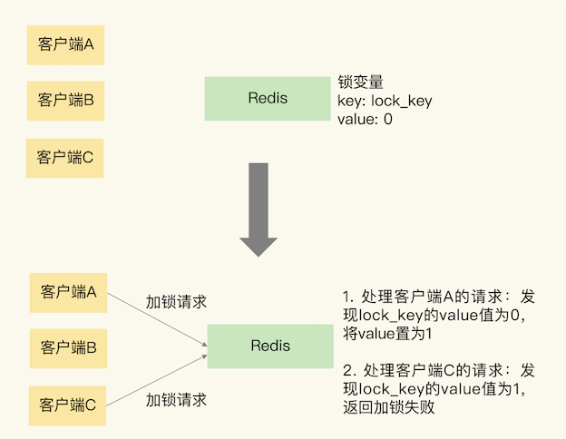
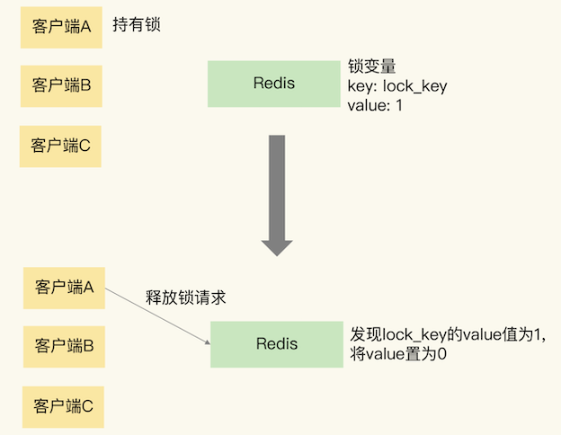

# **第三节 Redis实现分布式锁**

应对并发问题时，除了原子操作，Redis 客户端还可以通过加锁的方式，来控制并发写操作对共享数据的修改，从而保证数据的正确性。

Redis 属于分布式系统，当有多个客户端需要争抢锁时，必须要保证，**这把锁不能是某个客户端本地的锁**。否则的话，其它客户端是无法访问这把锁的，当然也就不能获取这把锁了。

所以，在分布式系统中，当有多个客户端需要获取锁时，我们需要**分布式锁**。此时，**锁是保存在一个共享存储系统中的，可以被多个客户端共享访问和获取。**

* Redis 本身可以被多个客户端共享访问，正好就是一个共享存储系统，可以用来保存分布式锁。
* 而且 Redis 的读写性能高，可以应对高并发的锁操作场景。


## **1、单机上的锁和分布式锁的联系与区别**

### **1-1 单机上的锁**

对于在单机上运行的多线程程序来说，锁本身可以用一个变量表示。

* 变量值为 0 时，表示没有线程获取锁；
* 变量值为 1 时，表示已经有线程获取到锁了。

线程调用加锁和释放锁的操作，到底是啥意思呢？

实际上，一个线程调用加锁操作，其实就是检查锁变量值是否为 0。如果是 0，就把锁的变量值设置为 1，表示获取到锁，如果不是 0，就返回错误信息，表示加锁失败，已经有别的线程获取到锁了。而一个线程调用释放锁操作，其实就是将锁变量的值置为 0，以便其它线程可以来获取锁。

```
acquire_lock(){
  if lock == 0
     lock = 1
     return 1
  else
     return 0
} 

release_lock(){
  lock = 0
  return 1
}
```

### **1-2 分布式锁**

和单机上的锁类似，分布式锁同样可以**<span style="color:red">用一个变量来实现</span>**。

客户端加锁和释放锁的操作逻辑，也和单机上的加锁和释放锁操作逻辑一致：**加锁时同样需要判断锁变量的值，根据锁变量值来判断能否加锁成功；释放锁时需要把锁变量值设置为 0，表明客户端不再持有锁。**

和线程在单机上操作锁不同的是，在分布式场景下，**<span style="color:red">锁变量需要由一个共享存储系统来维护，只有这样，多个客户端才可以通过访问共享存储系统来访问锁变量。相应的，加锁和释放锁的操作就变成了读取、判断和设置共享存储系统中的锁变量值</span>**。

实现分布式锁的两个要求

* 要求一：分布式锁的加锁和释放锁的过程，涉及多个操作。所**以，在实现分布式锁时，我们需要保证这些锁操作的原子性**；
* 要求二：共享存储系统保存了锁变量，如果共享存储系统发生故障或宕机，那么客户端也就无法进行锁操作了**。在实现分布式锁时，我们需要考虑保证共享存储系统的可靠性，进而保证锁的可靠性**。

## **2、基于单个 Redis 节点实现分布式锁**

### **2-1 锁变量**

作为分布式锁实现过程中的共享存储系统，**Redis 可以使用键值对来保存锁变量**，再接收和处理不同客户端发送的加锁和释放锁的操作请求。

我们要赋予锁变量一个变量名**，把这个变量名作为键值对的键，而锁变量的值，则是键值对的值**，这样一来，Redis 就能保存锁变量了，客户端也就可以通过 Redis 的命令操作来实现锁操作。



Redis 可以使用一个键值对 `lock_key:0` 来保存锁变量，其中，键是 `lock_key`，也是锁变量的名称，锁变量的初始值是 0。

### **2-2 加锁操作**

在图中，客户端 A 和 C 同时请求加锁。因为 Redis 使用单线程处理请求，所以，即使客户端 A 和 C 同时把加锁请求发给了 Redis，Redis 也会串行处理它们的请求。

我们假设 Redis 先处理客户端 A 的请求，读取 `lock_key` 的值，发现 `lock_key` 为 `0`，所以，Redis 就把 `lock_key` 的 `value` 置为 `1`，表示已经加锁了。

紧接着，Redis 处理客户端 C 的请求，此时，Redis 会发现 lock_key 的值已经为 1 了，所以就返回加锁失败的信息。

刚刚说的是加锁的操作，那释放锁该怎么操作呢？其实，释放锁就是直接把锁变量值设置为 0。

这张图片展示了客户端 A 请求释放锁的过程。当客户端 A 持有锁时，锁变量 `lock_key `的值为 1。客户端 A 执行释放锁操作后，Redis 将 `lock_key` 的值置为 0，表明已经没有客户端持有锁了。



因为加锁包含了三个操作（读取锁变量、判断锁变量值以及把锁变量值设置为 1），而这三个操作在执行时需要保证原子性。那怎么保证原子性呢？

要想保证操作的原子性，有两种通用的方法，分别是使用 Redis 的单命令操作和使用 Lua 脚本。那么，**在分布式加锁场景下，该怎么应用这两个方法呢？**

### **2-3 分布式加锁场景下的原子性**

单命令操作实现加锁操作

首先是 `SETNX` 命令，它用于设置键值对的值。

**<span style="color:red">具体来说，就是这个命令在执行时会判断键值对是否存在，如果不存在，就设置键值对的值，如果存在，就不做任何设置。</span>**

举个例子，**如果执行下面的命令时，key 不存在，那么 key 会被创建，并且值会被设置为 value；如果 key 已经存在，SETNX 不做任何赋值操作**。

```
SETNX key value
```

* 对于释放锁操作来说，可以在执行完业务逻辑后，**使用 DEL 命令删除锁变量。**不过，你不用担心锁变量被删除后，其他客户端无法请求加锁了。
* **因为 SETNX 命令在执行时，如果要设置的键值对（也就是锁变量）不存在，SETNX 命令会先创建键值对，然后设置它的值**。
* 所以，释放锁之后，再有客户端请求加锁时，SETNX 命令会创建保存锁变量的键值对，并设置锁变量的值，完成加锁。

总结来说，**可以用 SETNX 和 DEL 命令组合来实现加锁和释放锁操作**。下面的伪代码示例显示了锁操作的过程，你可以看下。

```
// 加锁
SETNX lock_key 1
// 业务逻辑
DO THINGS
// 释放锁
DEL lock_key
```

使用 SETNX 和 DEL 命令组合实现分布锁，存在两个潜在的风险。


第一个风险是，假如某个客户端在执行了 SETNX 命令、加锁之后，紧接着却在操作共享数据时发生了异常，**结果一直没有执行最后的 DEL 命令释放锁。因此，锁就一直被这个客户端持有，其它客户端无法拿到锁，也无法访问共享数据和执行后续操作，这会给业务应用带来影响。**


针对这个问题，**<span style="color:red">一个有效的解决方法是，给锁变量设置一个过期时间</span>**。

这样一来，即使持有锁的客户端发生了异常，无法主动地释放锁，Redis 也会根据锁变量的过期时间，**在锁变量过期后，把它删除。其它客户端在锁变量过期后，就可以重新请求加锁，这就不会出现无法加锁的问题了。**


第二个风险。**如果客户端 A 执行了 SETNX 命令加锁后，假设客户端 B 执行了 DEL 命令释放锁，此时，客户端 A 的锁就被误释放了**。**如果客户端 C 正好也在申请加锁，就可以成功获得锁，进而开始操作共享数据。这样一来，客户端 A 和 C 同时在对共享数据进行操作**，数据就会被修改错误，这也是业务层不能接受的。

为了应对这个问题，**我们需要能区分来自不同客户端的锁操作**，具体咋做呢？

* 在使用 SETNX 命令进行加锁的方法中，通过把锁变量值设置为 1 或 0，表示是否加锁成功。
* 1 和 0 只有两种状态，无法表示究竟是哪个客户端进行的锁操作。
* 所以，我们在加锁操作时，**可以让每个客户端给锁变量设置一个唯一值，这里的唯一值就可以用来标识当前操作的客户端**。
* 在释放锁操作时，客户端需要判断，当前锁变量的值是否和自己的唯一标识相等，只有在相等的情况下，才能释放锁。

### **2-4 Redis 的 SET 命令**

**Redis 给 SET 命令提供了类似的选项 NX，用来实现“不存在即设置”。**

如果使用了 NX 选项，SET 命令只有在键值对不存在时，才会进行设置，否则不做赋值操作。此外，**SET 命令在执行时还可以带上 EX 或 PX 选项，用来设置键值对的过期时间**。

举个例子，执行下面的命令时，只有 key 不存在时，SET 才会创建 key，并对 key 进行赋值。另外，**key 的存活时间由 seconds 或者 milliseconds 选项值来决定。**

```
SET key value [EX seconds | PX milliseconds]  [NX]
```

有了 SET 命令的 NX 和 EX/PX 选项后，我们就可以用下面的命令来实现加锁操作了。

```
// 加锁, unique_value作为客户端唯一性的标识
SET lock_key unique_value NX PX 10000
```

其中，`unique_value` 是客户端的唯一标识，可以用一个随机生成的字符串来表示，`PX 10000` 则表示 `lock_key` 会在 `10s` 后过期，以免客户端在这期间发生异常而无法释放锁。

因为在加锁操作中，每个客户端都使用了一个唯一标识，所以在释放锁操作时，我们需要判断锁变量的值，是否等于执行释放锁操作的客户端的唯一标识，如下所示：

```
//释放锁 比较unique_value是否相等，避免误释放
if redis.call("get",KEYS[1]) == ARGV[1] then
    return redis.call("del",KEYS[1])
else
    return 0
end
```

这是使用 Lua 脚本（`unlock.script`）实现的释放锁操作的伪代码，其中，`KEYS[1]`表示 `lock_key`，`ARGV[1]`是当前客户端的唯一标识，这两个值都是我们在执行 `Lua` 脚本时作为参数传入的。

最后，我们执行下面的命令，就可以完成锁释放操作了。

```
redis-cli  --eval  unlock.script lock_key , unique_value 
```

在释放锁操作中，我们使用了 Lua 脚本，这是因为，释放锁操作的逻辑也包含了读取锁变量、判断值、删除锁变量的多个操作，而 Redis 在执行 Lua 脚本时，可以以原子性的方式执行，从而保证了锁释放操作的原子性。

## **3、基于多个 Redis 节点实现高可靠的分布式锁**

为了避免 Redis 实例故障而导致的锁无法工作的问题，Redis 的开发者 Antirez 提出了分布式锁算法 Redlock。

**<span style="color:red">Redlock 算法的基本思路，是让客户端和多个独立的 Redis 实例依次请求加锁，如果客户端能够和半数以上的实例成功地完成加锁操作，那么我们就认为，客户端成功地获得分布式锁了，否则加锁失败</span>**。


这样一来，即使有单个 Redis 实例发生故障，因为锁变量在其它实例上也有保存，所以，客户端仍然可以正常地进行锁操作，锁变量并不会丢失。

Redlock 算法的执行步骤。Redlock 算法的实现需要有 N 个独立的 Redis 实例。接下来，我们可以分成 3 步来完成加锁操作。

**第一步是，客户端获取当前时间。**

**第二步是，客户端按顺序依次向 N 个 Redis 实例执行加锁操作。**

这里的加锁操作和在单实例上执行的加锁操作一样，使用 SET 命令，带上 NX，EX/PX 选项，以及带上客户端的唯一标识。当然，如果某个 Redis 实例发生故障了，为了保证在这种情况下，Redlock 算法能够继续运行，我们需要给加锁操作设置一个超时时间

**如果客户端在和一个 Redis 实例请求加锁时，一直到超时都没有成功，那么此时，客户端会和下一个 Redis 实例继续请求加锁。加锁操作的超时时间需要远远地小于锁的有效时间，一般也就是设置为几十毫秒。**

**第三步是，一旦客户端完成了和所有 Redis 实例的加锁操作，客户端就要计算整个加锁过程的总耗时。**

客户端只有在满足下面的这两个条件时，才能认为是加锁成功。

* 条件一：客户端从超过半数`（大于等于 N/2+1）`的 Redis 实例上成功获取到了锁；
* 条件二：客户端获取锁的总耗时没有超过锁的有效时间。

在满足了这两个条件后，我们需要重新计算这把锁的有效时间，计算的结果是锁的最初有效时间减去客户端为获取锁的总耗时。

如果锁的有效时间已经来不及完成共享数据的操作了，我们可以释放锁，以免出现还没完成数据操作，锁就过期了的情况。

在 Redlock 算法中，释放锁的操作和在单实例上释放锁的操作一样，只要执行释放锁的 Lua 脚本就可以了。这样一来，只要 N 个 Redis 实例中的半数以上实例能正常工作，就能保证分布式锁的正常工作了。

## **4、本节总结**

分布式锁是由共享存储系统维护的变量，多个客户端可以向共享存储系统发送命令进行加锁或释放锁操作。**Redis 作为一个共享存储系统，可以用来实现分布式锁。**

在基于单个 Redis 实例实现分布式锁时，对于加锁操作，我们需要满足三个条件。

1. 加锁包括了**读取锁变量、检查锁变量值和设置锁变量值**三个操作，但需要以原子操作的方式完成，所以**，我们使用 SET 命令带上 NX 选项来实现加锁**；
2. 锁变量需要设置过期时间，以免客户端拿到锁后发生异常，导致锁一直无法释放，所以，我们在 **SET 命令执行时加上 EX/PX 选项**，设置其过期时间；
3. 锁变量的值需要能区分来自不同客户端的加锁操作，以免在释放锁时，出现误释放操作，所以，我们使用 SET 命令设置锁变量值时，每个客户端设置的值是一个唯一值，用于标识客户端。


**和加锁类似，释放锁也包含了读取锁变量值、判断锁变量值和删除锁变量三个操作，不过，我们无法使用单个命令来实现，所以，我们可以采用 Lua 脚本执行释放锁操作，通过 Redis 原子性地执行 Lua 脚本，来保证释放锁操作的原子性。**

不过，基于单个 Redis 实例实现分布式锁时，会面临实例异常或崩溃的情况，这会导致实例无法提供锁操作，**正因为此，Redis 也提供了 Redlock 算法，用来实现基于多个实例的分布式锁**。

这样一来，锁变量由多个实例维护，即使有实例发生了故障，锁变量仍然是存在的，客户端还是可以完成锁操作

