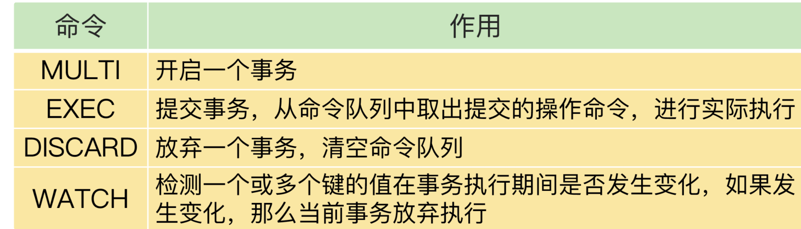

# **第六章 Redis性能与锁机制以及ACID**

## **1、本章小结**

### **1-1 基于SSD实现大容量Redis:Pika**

跟 Redis 相比，Pika 的好处非常明显：既支持 Redis 操作接口，又能支持保存大容量的数据。

如果你原来就在应用 Redis，现在想进行扩容，那么，Pika 无疑是一个很好的选择，无论是代码迁移还是运维管理，Pika 基本不需要额外的工作量。

不过，Pika 毕竟是把数据保存到了 SSD 上，数据访问要读写 SSD，所以，读写性能要弱于 Redis。针对这一点，我给你提供两个降低读写 SSD 对 Pika 的性能影响的小建议：

1. 利用 Pika 的多线程模型，增加线程数量，提升 Pika 的并发请求处理能力；
2. 为 Pika 配置高配的 SSD，提升 SSD 自身的访问性能。

Pika 本身提供了很多工具，可以帮助我们把 Redis 数据迁移到 Pika，或者是把 Redis 请求转发给 Pika。比如说，我们使用 `aof_to_pika ` 命令，并且指定 Redis 的 AOF 文件以及 Pika 的连接信息，就可以把 Redis 数据迁移到 Pika 中了，如下所示：

```
aof_to_pika -i [Redis AOF文件] -h [Pika IP] -p [Pika port] -a [认证信息]
```

你都可以直接在 Pika 的[GitHub](https://github.com/Qihoo360/pika/wiki)上找到。而且，Pika 本身也还在迭代开发中，我也建议你多去看看 GitHub，进一步地了解它。**这样，你就可以获得 Pika 的最新进展，也能更好地把它应用到你的业务实践中。**

### **1-2 Redis应对并发访问：无锁的原子操作**

在并发访问时，并发的 RMW 操作会导致数据错误，所以需要进行并发控制。所谓并发控制，就是要保证临界区代码的互斥执行。

**Redis 提供了两种原子操作的方法来实现并发控制，分别是单命令操作和 Lua 脚本。**因为原子操作本身不会对太多的资源限制访问，可以维持较高的系统并发性能。

但是，单命令原子操作的适用范围较小，并不是所有的 RMW 操作都能转变成单命令的原子操作（例如 INCR/DECR 命令只能在读取数据后做原子增减），当我们需要对读取的数据做更多判断，或者是我们对数据的修改不是简单的增减时，单命令操作就不适用了。

而 Redis 的 Lua 脚本可以包含多个操作，这些操作都会以原子性的方式执行，绕开了单命令操作的限制。

**不过，如果把很多操作都放在 Lua 脚本中原子执行，会导致 Redis 执行脚本的时间增加，同样也会降低 Redis 的并发性能。所以，我给你一个小建议：在编写 Lua 脚本时，你要避免把不需要做并发控制的操作写入脚本中。**

当然，加锁也能实现临界区代码的互斥执行，只是如果有多个客户端加锁时，就需要分布式锁的支持了


### **1-3 Redis实现分布式锁**

分布式锁是由共享存储系统维护的变量，多个客户端可以向共享存储系统发送命令进行加锁或释放锁操作。**Redis 作为一个共享存储系统，可以用来实现分布式锁。**

在基于单个 Redis 实例实现分布式锁时，对于加锁操作，我们需要满足三个条件。

1. 加锁包括了**读取锁变量、检查锁变量值和设置锁变量值**三个操作，但需要以原子操作的方式完成，所以**，我们使用 SET 命令带上 NX 选项来实现加锁**；
2. 锁变量需要设置过期时间，以免客户端拿到锁后发生异常，导致锁一直无法释放，所以，我们在 **SET 命令执行时加上 EX/PX 选项**，设置其过期时间；
3. 锁变量的值需要能区分来自不同客户端的加锁操作，以免在释放锁时，出现误释放操作，所以，我们使用 SET 命令设置锁变量值时，每个客户端设置的值是一个唯一值，用于标识客户端。


**和加锁类似，释放锁也包含了读取锁变量值、判断锁变量值和删除锁变量三个操作，不过，我们无法使用单个命令来实现，所以，我们可以采用 Lua 脚本执行释放锁操作，通过 Redis 原子性地执行 Lua 脚本，来保证释放锁操作的原子性。**

不过，基于单个 Redis 实例实现分布式锁时，会面临实例异常或崩溃的情况，这会导致实例无法提供锁操作，**正因为此，Redis 也提供了 Redlock 算法，用来实现基于多个实例的分布式锁**。

这样一来，锁变量由多个实例维护，即使有实例发生了故障，锁变量仍然是存在的，客户端还是可以完成锁操作

### **1-4 事务机制 Redis实现ACID属性**

Redis 通过 MULTI、EXEC、DISCARD 和 WATCH 四个命令来支持事务机制，这 4 个命令的作用，总结在下面的表中，你可以再看下。



Redis 的事务机制可以保证一致性和隔离性，但是无法保证持久性。不过，因为 Redis 本身是内存数据库，持久性并不是一个必须的属性，我们更加关注的还是原子性、一致性和隔离性这三个属性。

原子性的情况比较复杂，**只有当事务中使用的命令语法有误时，原子性得不到保证，在其它情况下，事务都可以原子性执行。**

小建议：严格按照 Redis 的命令规范进行程序开发，并且通过 code review 确保命令的正确性。这

## **2、本章操作总结**

**Redis 提供了 `INCR/DECR `命令，把这三个操作转变为一个原子操作了**。

INCR/DECR 命令可以对数据进行增值 / 减值操作，而且它们本身就是单个命令操作，Redis 在执行它们时，本身就具有互斥性

比如说，在刚才的库存扣减例子中，客户端可以使用下面的代码，直接完成对商品 id 的库存值减 1 操作。**即使有多个客户端执行下面的代码，也不用担心出现库存值扣减错误的问题**。

```
DECR id 
```

Lua 脚本， 下面的这段代码，它实现了对客户端每分钟访问次数不超过 20 次的限制。

```
//获取ip对应的访问次数
current = GET(ip)
//如果超过访问次数超过20次，则报错
IF current != NULL AND current > 20 THEN
    ERROR "exceed 20 accesses per second"
ELSE
    //如果访问次数不足20次，增加一次访问计数
    value = INCR(ip)
    //如果是第一次访问，将键值对的过期时间设置为60s后
    IF value == 1 THEN
        EXPIRE(ip,60)
    END
    //执行其他操作
    DO THINGS
END
```

使用 Lua 脚本来保证并发控制。

* 我们可以把访问次数加 1
* 判断访问次数是否为 1
* 以及设置过期时间这三个操作写入一个 Lua 脚本

如下所示：

```
local current
current = redis.call("incr",KEYS[1])
if tonumber(current) == 1 then
    redis.call("expire",KEYS[1],60)
end
```

编写的脚本名称为` lua.script`，我们接着就可以使用 Redis 客户端，带上 eval 选项，来执行该脚本。脚本所需的参数将通过以下命令中的 keys 和 args 进行传递。

```
redis-cli  --eval lua.script  keys , args
```

这样一来，访问次数加 1、判断访问次数是否为 1，以及设置过期时间这三个操作就可以原子性地执行了。即使客户端有多个线程同时执行这个脚本，Redis 也会依次串行执行脚本代码，避免了并发操作带来的数据错误。

**Redis实现分布式锁**

**如果执行下面的命令时，key 不存在，那么 key 会被创建，并且值会被设置为 value；如果 key 已经存在，SETNX 不做任何赋值操作**。

```
SETNX key value
```
**可以用 SETNX 和 DEL 命令组合来实现加锁和释放锁操作**。下面的伪代码示例显示了锁操作的过程，你可以看下。

```
// 加锁
SETNX lock_key 1
// 业务逻辑
DO THINGS
// 释放锁
DEL lock_key
```

执行下面的命令时，只有 key 不存在时，SET 才会创建 key，并对 key 进行赋值。另外，**key 的存活时间由 seconds 或者 milliseconds 选项值来决定。**

```
SET key value [EX seconds | PX milliseconds]  [NX]
```

有了 SET 命令的 NX 和 EX/PX 选项后，我们就可以用下面的命令来实现加锁操作了。

```
// 加锁, unique_value作为客户端唯一性的标识
SET lock_key unique_value NX PX 10000
```

其中，`unique_value` 是客户端的唯一标识，可以用一个随机生成的字符串来表示，`PX 10000` 则表示 `lock_key` 会在 `10s` 后过期，以免客户端在这期间发生异常而无法释放锁。

因为在加锁操作中，每个客户端都使用了一个唯一标识，所以在释放锁操作时，我们需要判断锁变量的值，是否等于执行释放锁操作的客户端的唯一标识，如下所示：

```
//释放锁 比较unique_value是否相等，避免误释放
if redis.call("get",KEYS[1]) == ARGV[1] then
    return redis.call("del",KEYS[1])
else
    return 0
end
```

这是使用 Lua 脚本（`unlock.script`）实现的释放锁操作的伪代码，其中，`KEYS[1]`表示 `lock_key`，`ARGV[1]`是当前客户端的唯一标识，这两个值都是我们在执行 `Lua` 脚本时作为参数传入的。

最后，我们执行下面的命令，就可以完成锁释放操作了。

```
redis-cli  --eval  unlock.script lock_key , unique_value 
```

**事务机制 Redis实现ACID属性**

使用 MULTI 和 EXEC 执行一个事务的过程

```

#开启事务
127.0.0.1:6379> MULTI
OK
#将a:stock减1，
127.0.0.1:6379> DECR a:stock
QUEUED
#将b:stock减1
127.0.0.1:6379> DECR b:stock
QUEUED
#实际执行事务
127.0.0.1:6379> EXEC
1) (integer) 4
2) (integer) 9
```

* 假设 `a:stock`、`b:stock` 两个键的初始值是 5 和 10。
* 在 MULTI 命令后执行的两个 DECR 命令，是把 `a:stock`、`b:stock` 两个键的值分别减 1，它们执行后的返回结果都是` QUEUED`，这就表示，这些操作都被暂存到了命令队列，还没有实际执行。
* 等到执行了 EXEC 命令后，可以看到返回了 4、9，这就表明，两个 DECR 命令已经成功地执行了。

```
#开启事务
127.0.0.1:6379> MULTI
OK
#发送事务中的第一个操作，但是Redis不支持该命令，返回报错信息
127.0.0.1:6379> PUT a:stock 5
(error) ERR unknown command `PUT`, with args beginning with: `a:stock`, `5`, 
#发送事务中的第二个操作，这个操作是正确的命令，Redis把该命令入队
127.0.0.1:6379> DECR b:stock
QUEUED
#实际执行事务，但是之前命令有错误，所以Redis拒绝执行
127.0.0.1:6379> EXEC
(error) EXECABORT Transaction discarded because of previous errors.
```

在这个例子中，**<span style="color:red">事务里包含了一个 Redis 本身就不支持的 PUT 命令，所以，在 PUT 命令入队时，Redis 就报错了</span>**。

虽然，事务里还有一个正确的 DECR 命令，但是，在最后执行 EXEC 命令后，整个事务被放弃执行了。

事务中的 LPOP 命令对 String 类型数据进行操作，入队时没有报错，但是，在 EXEC 执行时报错了。LPOP 命令本身没有执行成功，但是事务中的 DECR 命令却成功执行了。

```

#开启事务
127.0.0.1:6379> MULTI
OK
#发送事务中的第一个操作，LPOP命令操作的数据类型不匹配，此时并不报错
127.0.0.1:6379> LPOP a:stock
QUEUED
#发送事务中的第二个操作
127.0.0.1:6379> DECR b:stock
QUEUED
#实际执行事务，事务第一个操作执行报错
127.0.0.1:6379> EXEC
1) (error) WRONGTYPE Operation against a key holding the wrong kind of value
2) (integer) 8
```

**Redis 中并没有提供回滚机制。**虽然 Redis 提供了 `DISCARD` 命令，但是，这个命令只能用来主动放弃事务执行，把暂存的命令队列清空，起不到回滚的效果。

```

#读取a:stock的值4
127.0.0.1:6379> GET a:stock
"4"
#开启事务
127.0.0.1:6379> MULTI 
OK
#发送事务的第一个操作，对a:stock减1
127.0.0.1:6379> DECR a:stock
QUEUED
#执行DISCARD命令，主动放弃事务
127.0.0.1:6379> DISCARD
OK
#再次读取a:stock的值，值没有被修改
127.0.0.1:6379> GET a:stock
"4"
```

例子中，a:stock 键的值一开始为 4，然后，我们执行一个事务，想对 a:stock 的值减 1。但是，在事务的最后，我们执行的是 DISCARD 命令，所以事务就被放弃了。我们再次查看 a:stock 的值，会发现仍然为 4。

## **3、本章问题**

**问题**：介绍的是使用 SSD 作为内存容量的扩展，增加 Redis 实例的数据保存量，可以使用机械硬盘来作为实例容量扩展吗？有什么好处或不足吗？

从容量维度来看，机械硬盘的性价比更高，机械硬盘每 GB 的成本大约在 0.1 元左右，而 SSD 每 GB 的成本大约是 0.4~0.6 元左右。

从性能角度来看，机械硬盘（例如 SAS 盘）的延迟大约在 3~5ms，而企业级 SSD 的读延迟大约是 60~80us，写延迟在 20us。缓存的负载特征一般是小粒度数据、高并发请求，要求访问延迟低。所以，如果使用机械硬盘作为 Pika 底层存储设备的话，缓存的访问性能就会降低。

所以，我的建议是，如果业务应用需要缓存大容量数据，**但是对缓存的性能要求不高，就可以使用机械硬盘，否则最好是用 SSD。**

**问题**：Redis 在执行 Lua 脚本时，是可以保证原子性的，那么，在课程里举的 Lua 脚本例子（lua.script）中，你觉得是否需要把读取客户端 ip 的访问次数，也就是 GET(ip)，以及判断访问次数是否超过 20 的判断逻辑，也加到 Lua 脚本中吗？代码如下所示：

```
local current
current = redis.call("incr",KEYS[1])
if tonumber(current) == 1 then
    redis.call("expire",KEYS[1],60)
end
```

答案：如果使用这个方法实现加锁的话，SETNX 和 EXPIRE 两个命令虽然分别完成了对锁变量进行原子判断和值设置，以及设置锁变量的过期时间的操作，但是这两个操作一起执行时，并没有保证原子性。

如果在执行了 SETNX 命令后，客户端发生了故障，但锁变量还没有设置过期时间，就无法在实例上释放了，这就会导致别的客户端无法执行加锁操作。所以，我们不能使用这个方法进行加锁。


**问题**：在执行事务时，如果 Redis 实例发生故障，而 Redis 使用的是 RDB 机制，那么，事务的原子性还能得到保证吗？

答案：**当 Redis 采用 RDB 机制保证数据可靠性时，Redis 会按照一定的周期执行内存快照。**

一个事务在执行过程中，事务操作对数据所做的修改并不会实时地记录到 RDB 中，而且，Redis 也不会创建 RDB 快照。我们可以根据故障发生的时机以及 RDB 是否生成，分成三种情况来讨论事务的原子性保证。

1. 假设事务在执行到一半时，实例发生了故障，在这种情况下，上一次 RDB 快照中不会包含事务所做的修改，而下一次 RDB 快照还没有执行。所以，实例恢复后，事务修改的数据会丢失，事务的原子性能得到保证。
2. 假设事务执行完成后，RDB 快照已经生成了，如果实例发生了故障，事务修改的数据可以从 RDB 中恢复，事务的原子性也就得到了保证。
3. 假设事务执行已经完成，但是 RDB 快照还没有生成，如果实例发生了故障，那么，事务修改的数据就会全部丢失，也就谈不上原子性了。

