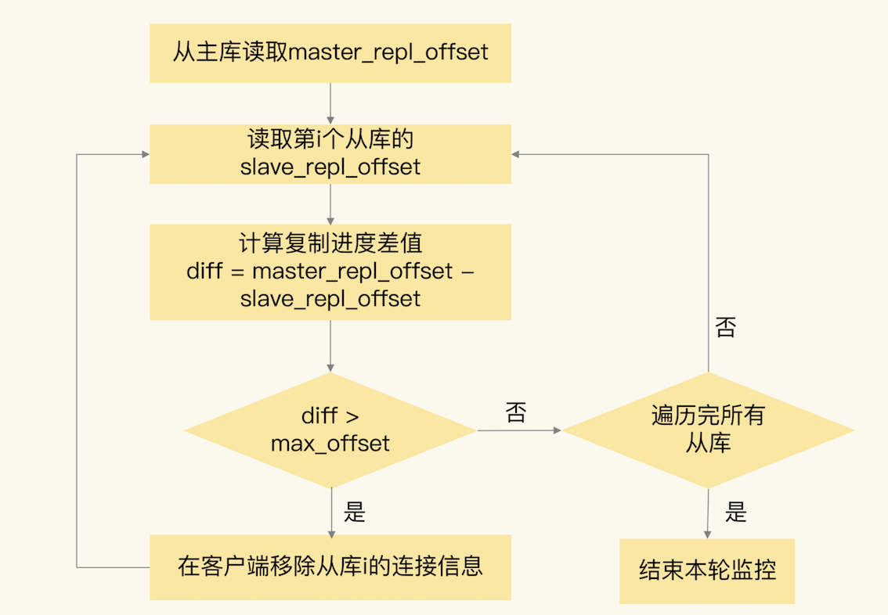
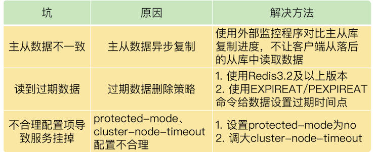

# **第一节 Redis主从同步与故障切换的三个坑**

Redis 的主从同步机制不仅可以让从库服务更多的读请求，分担主库的压力，而且还能在主库发生故障时，进行主从库切换，提供高可靠服务。

介绍 3 个坑，分别是主从数据不一致、读到过期数据，以及配置项设置得不合理从而导致服务挂掉。

## **1、主从数据不一致**

### **1-1 造成因素**

主从数据不一致，就是指客户端从从库中读取到的值和主库中的最新值并不一致。

举个例子，假设主从库之前保存的用户年龄值是 19，但是主库接收到了修改命令，已经把这个数据更新为 20 了，但是，从库中的值仍然是 19。那么，如果客户端从从库中读取用户年龄值，就会读到旧值。

* 具体来说，在主从库命令传播阶段，主库收到新的写命令后，会发送给从库。
* 但是，主库并不会等到从库实际执行完命令后，再把结果返回给客户端，而是主库自己在本地执行完命令后，就会向客户端返回结果了。
* 如果从库还没有执行主库同步过来的命令，主从库间的数据就不一致了。

从库会滞后执行同步命令呢？其实，这里主要有两个原因。

* **主从库间的网络可能会有传输延迟**，所以从库不能及时地收到主库发送的命令，从库上执行同步命令的时间就会被延后。
* 即使从库及时收到了主库的命令，但是，也可能会因为正在处理其它复杂度高的命令（例如集合操作命令）而阻塞。此时，**从库需要处理完当前的命令，才能执行主库发送的命令操作，这就会造成主从数据不一致**。而在主库命令被滞后处理的这段时间内，主库本身可能又执行了新的写操作。这样一来，主从库间的数据不一致程度就会进一步加剧

### **1-2 造成因素**

首先，在硬件环境配置方面，**要尽量保证主从库间的网络连接状况良好**。例如，我们要避免把主从库部署在不同的机房，或者是避免把网络通信密集的应用（例如数据分析应用）和 Redis 主从库部署在一起。

**还可以开发一个外部程序来监控主从库间的复制进度。**

因为 Redis 的 INFO replication 命令可以查看主库接收写命令的进度信息（`master_repl_offset`）和从库复制写命令的进度信息（`slave_repl_offset`）

* 所以就可以开发一个监控程序，先用 `INFO replication` 命令查到主、从库的进度，
* 然后，我们用 `master_repl_offset` 减去 `slave_repl_offset`，这样就能得到从库和主库间的复制进度差值了。

**某个从库的进度差值大于我们预设的阈值，可以让客户端不再和这个从库连接进行数据读取，这样就可以减少读到不一致数据的情况。**

不过，为了避免出现客户端和所有从库都不能连接的情况，我们需要把复制进度差值的阈值设置得大一些。

在应用 Redis 时，可以周期性地运行这个流程来监测主从库间的不一致情况。



当然，监控程序可以一直监控着从库的复制进度，当从库的复制进度又赶上主库时，就允许客户端再次跟这些从库连接。


## **2、读取过期数据**

在使用 Redis 主从集群时，有时会读到过期数据。例如，数据 X 的过期时间是 202010240900，但是客户端在 202010240910 时，仍然可以从从库中读到数据 X。

一个数据过期后，应该是被删除的，客户端不能再读取到该数据，但是，Redis 为什么还能在从库中读到过期的数据呢？

**这是由 Redis 的过期数据删除策略引起的。**

**Redis 同时使用了两种策略来删除过期的数据，分别是惰性删除策略和定期删除策略。**

### **2-1 惰性删除策略**

当一个数据的过期时间到了以后，并不会立即删除数据，而是等到再有请求来读写这个数据时，**对数据进行检查，如果发现数据已经过期了，再删除这个数据**

这个策略的好处是尽量减少删除操作对 CPU 资源的使用，对于用不到的数据，就不再浪费时间进行检查和删除了。但是，这个策略会导致大量已经过期的数据留存在内存中，占用较多的内存资源。所以，Redis 在使用这个策略的同时，还使用了第二种策略：定期删除策略。

### **2-2 定期删除策略**

Redis 每隔一段时间（默认 100ms），就会随机选出一定数量的数据，检查它们是否过期，并把其中过期的数据删除，这样就可以及时释放一些内存。

### **2-3 它们为什么会导致读取到过期数据**

首先，虽然定期删除策略可以释放一些内存，但是，Redis 为了避免过多删除操作对性能产生影响，每次随机检查数据的数量并不多。如果过期数据很多，并且一直没有再被访问的话，这些数据就会留存在 Redis 实例中。业务应用之所以会读到过期数据，这些留存数据就是一个重要因素。


其次，惰性删除策略实现后，数据只有被再次访问时，才会被实际删除。如果客户端从主库上读取留存的过期数据，主库会触发删除操作，**此时，客户端并不会读到过期数据。但是，从库本身不会执行删除操作，如果客户端在从库中访问留存的过期数据，从库并不会触发数据删除**。那么，从库会给客户端返回过期数据吗？

和使用的 Redis 版本有关了。如果你使用的是 Redis 3.2 之前的版本，那么，从库在服务读请求时，并不会判断数据是否过期，而是会返回过期数据。**在 3.2 版本后，Redis 做了改进，如果读取的数据已经过期了，从库虽然不会删除，但是会返回空值，这就避免了客户端读到过期数据**。所以，在应用主从集群时，尽量使用 Redis 3.2 及以上版本。

有些命令给数据设置的过期时间在从库上可能会被延后，导致应该过期的数据又在从库上被读取到了

设置数据过期时间的命令一共有 4 个，可以把它们分成两类：

* EXPIRE 和 PEXPIRE：它们给数据设置的是**从命令执行时开始计算的存活时间**；
* EXPIREAT 和 PEXPIREAT：**它们会直接把数据的过期时间设置为具体的一个时间点。**

这 4 个命令的参数和含义如下表所示：


第一个例子是使用 EXPIRE 命令，当执行下面的命令时，**我们就把 testkey 的过期时间设置为 60s 后。**

```
EXPIRE testkey 60
```

第二个例子是使用 `EXPIREAT` 命令，例如，我们执行下面的命令，**就可以让 testkey 在 2020 年 10 月 24 日上午 9 点过期，命令中的 1603501200 就是以秒数时间戳表示的 10 月 24 日上午 9 点**

```
EXPIREAT testkey 1603501200
```

当主从库全量同步时，如果主库接收到了一条 EXPIRE 命令，那么，主库会直接执行这条命令。这条命令会在全量同步完成后，**发给从库执行。而从库在执行时，就会在当前时间的基础上加上数据的存活时间，这样一来，从库上数据的过期时间就会比主库上延后了**。

* 假设当前时间是 2020 年 10 月 24 日上午 9 点，主从库正在同步，主库收到了一条命令：
* EXPIRE testkey 60，这就表示，testkey 的过期时间就是 24 日上午 9 点 1 分，主库直接执行了这条命令。
* 但是，主从库全量同步花费了 2 分钟才完成。等从库开始执行这条命令时，时间已经是 9 点 2 分了。
* 而 EXPIRE 命令是把 testkey 的过期时间设置为当前时间的 60s 后，也就是 9 点 3 分。
* 如果客户端在 9 点 2 分 30 秒时在从库上读取 testkey，仍然可以读到 testkey 的值。但是，testkey 实际上已经过期了。

为了避免这种情况， **<span style="color:red">建议是，在业务应用中使用 EXPIREAT/PEXPIREAT 命令，把数据的过期时间设置为具体的时间点，避免读到过期数据。</span>**

* **主从数据不一致。Redis 采用的是异步复制，所以无法实现强一致性保证（主从数据时时刻刻保持一致），数据不一致是难以避免的**。我给你提供了应对方法：保证良好网络环境，以及使用程序监控从库复制进度，一旦从库复制进度超过阈值，不让客户端连接从库。
* **对于读到过期数据，这是可以提前规避的**，**一个方法是，使用 Redis 3.2 及以上版本；另外，你也可以使用 EXPIREAT/PEXPIREAT 命令设置过期时间，避免从库上的数据过期时间滞后**。不过，这里有个地方需要注意下，**因为 EXPIREAT/PEXPIREAT 设置的是时间点，所以，主从节点上的时钟要保持一致，具体的做法是，让主从节点和相同的 NTP 服务器（时间服务器）进行时钟同步。**


## **3、不合理配置项导致的服务挂掉**

这里涉及到的配置项有两个，分别是 `protected-mode` 和 `cluster-node-timeout`。

### **3-1 protected-mode 配置项**

**这个配置项的作用是限定哨兵实例能否被其他服务器访问。**

当这个配置项设置为 yes 时，哨兵实例只能在部署的服务器本地进行访问。当设置为 no 时，其他服务器也可以访问这个哨兵实例。

正因为这样，**如果 `protected-mode` 被设置为 yes，而其余哨兵实例部署在其它服务器，那么，这些哨兵实例间就无法通信**。**当主库故障时，哨兵无法判断主库下线，也无法进行主从切换，最终 Redis 服务不可用。**

**在应用主从集群时，要注意将 `protected-mode` 配置项设置为 no，并且将 bind 配置项设置为其它哨兵实例的 IP 地址。** 只有在 bind 中设置了 IP 地址的哨兵，才可以访问当前实例，既保证了实例间能够通信进行主从切换，也保证了哨兵的安全性。

如果设置了下面的配置项，那么，部署在 192.168.10.3/4/5 这三台服务器上的哨兵实例就可以相互通信，执行主从切换。

```
protected-mode no
bind 192.168.10.3 192.168.10.4 192.168.10.5
```

### **3-2 `cluster-node-timeout` 配置项**

**<span style="color:red">这个配置项设置了 Redis Cluster 中实例响应心跳消息的超时时间。</span>**


Redis Cluster 集群中为每个实例配置了“一主一从”模式时，如果主实例发生故障，从实例会切换为主实例，受网络延迟和切换操作执行的影响，切换时间可能较长，就会导致实例的心跳超时（超出 cluster-node-timeout）。**实例超时后，就会被 Redis Cluster 判断为异常。而 Redis Cluster 正常运行的条件就是，有半数以上的实例都能正常运行。**

**<span style="color:red">所以，如果执行主从切换的实例超过半数，而主从切换时间又过长的话，就可能有半数以上的实例心跳超时，从而可能导致整个集群挂掉。所以，建议你将 `cluster-node-timeout` 调大些（例如 10 到 20 秒）。</span>**

## **4、本节小结**

Redis 主从库同步时可能出现的 3 个坑，分别是主从数据不一致、读取到过期数据和不合理配置项导致服务挂掉。




关于主从库数据不一致的问题： **Redis 中的 `slave-serve-stale-data` 配置项设置了从库能否处理数据读写命令，你可以把它设置为 no**。这样一来，从库只能服务 INFO、SLAVEOF 命令，这就可以避免在从库中读到不一致的数据了。

**这个配置项和 `slave-read-only` 的区别，`slave-read-only` 是设置从库能否处理写命令，`slave-read-only` 设置为 yes 时，从库只能处理读请求，无法处理写请求，你可不要搞混了。**
