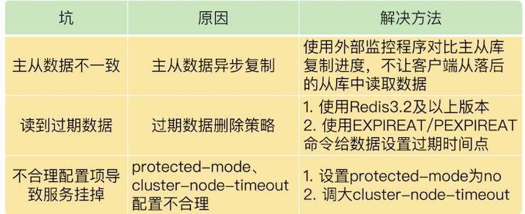
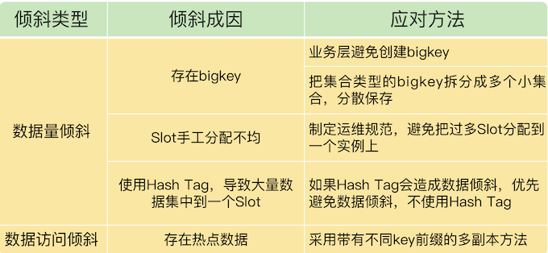
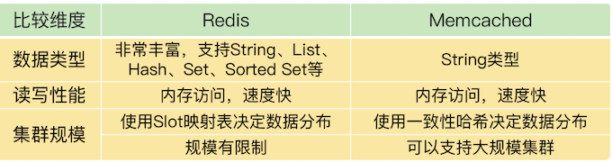
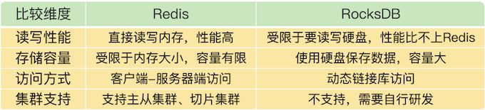

# **第七章 Redis Cluster集群介绍及管理**

## **1、本章小结**

### **1-1 Redis主从同步与故障切换的三个坑**

Redis 主从库同步时可能出现的 3 个坑，分别是主从数据不一致、读取到过期数据和不合理配置项导致服务挂掉。



关于主从库数据不一致的问题： **Redis 中的 `slave-serve-stale-data` 配置项设置了从库能否处理数据读写命令，你可以把它设置为 no**。这样一来，从库只能服务 INFO、SLAVEOF 命令，这就可以避免在从库中读到不一致的数据了。

**这个配置项和 `slave-read-only` 的区别，`slave-read-only` 是设置从库能否处理写命令，`slave-read-only` 设置为 yes 时，从库只能处理读请求，无法处理写请求，你可不要搞混了。**

### **1-2 脑裂导致数据丢失**

脑裂是指在主从集群中，同时有两个主库都能接收写请求。在 Redis 的主从切换过程中，如果发生了脑裂，客户端数据就会写入到原主库，如果原主库被降为从库，这些新写入的数据就丢失了。

脑裂发生的原因主要是原主库发生了假故障，总结下假故障的两个原因。

1. **和主库部署在同一台服务器上的其他程序临时占用了大量资源（例如 CPU 资源），导致主库资源使用受限，短时间内无法响应心跳**。其它程序不再使用资源时，主库又恢复正常。
2. 主库自身遇到了阻塞的情况，例如，处理 bigkey 或是发生内存 swap，短时间内无法响应心跳，等主库阻塞解除后，又恢复正常的请求处理了。


为了应对脑裂，可以在主从集群部署时，通过合理地配置参数 `min-slaves-to-write` 和 `min-slaves-max-lag`，来预防脑裂的发生。

在实际应用中，可能会因为网络暂时拥塞导致从库暂时和主库的 ACK 消息超时。在这种情况下，并不是主库假故障，我们也不用禁止主库接收请求。

**<span style="color:red">建议是，假设从库有 K 个，可以将 `min-slaves-to-write` 设置为` K/2+1`（如果 K 等于 1，就设为 1），将 `min-slaves-max-lag` 设置为十几秒（例如 10～20s），在这个配置下，如果有一半以上的从库和主库进行的 ACK 消息延迟超过十几秒，我们就禁止主库接收客户端写请求</span>**。

避免脑裂带来数据丢失的情况，而且，也不会因为只有少数几个从库因为网络阻塞连不上主库，就禁止主库接收请求，增加了系统的鲁棒性。

### **1-3 Redis Codis 集群方案**

Codis 集群包含 codis server、codis proxy、Zookeeper、codis dashboard 和 codis fe 这四大类组件。

* codis proxy 和 codis server 负责处理数据读写请求，其中，codis proxy 和客户端连接，接收请求，并转发请求给 codis server，而 codis server 负责具体处理请求。
* codis dashboard 和 codis fe 负责集群管理，其中，codis dashboard 执行管理操作，而 codis fe 提供 Web 管理界面。
* Zookeeper 集群负责保存集群的所有元数据信息，包括路由表、proxy 实例信息等。这里，有个地方需要你注意，除了使用 Zookeeper，Codis 还可以使用 etcd 或本地文件系统保存元数据信息。

关于 Codis 和 Redis Cluster 的选型考虑，从稳定性成熟度、客户端兼容性、Redis 新特性使用以及数据迁移性能四个方面给你提供了建议。

我再给你提供一个 Codis 使用上的小建议：**当你有多条业务线要使用 Codis 时，可以启动多个 codis dashboard，每个 dashboard 管理一部分 codis server，同时，再用一个 dashboard 对应负责一个业务线的集群管理，这样，就可以做到用一个 Codis 集群实现多条业务线的隔离管理了**。

### **1-4  Redis支撑秒杀场景的关键技术和实践**

秒杀场景有 2 个负载特征，分别是瞬时**高并发请求和读多写少**。Redis 良好的高并发处理能力，以及高效的键值对读写特性，正好可以满足秒杀场景的需求。

在秒杀场景中，我们可以通过前端 CDN 和浏览器缓存拦截大量秒杀前的请求。在实际秒杀活动进行时，库存查验和库存扣减是承受巨大并发请求压力的两个操作，同时，这两个操作的执行需要保证原子性。Redis 的原子操作、分布式锁这两个功能特性可以有效地来支撑秒杀场景的需求。

当然，对于秒杀场景来说，只用 Redis 是不够的。秒杀系统是一个系统性工程，Redis 实现了对库存查验和扣减这个环节的支撑，除此之外，还有 4 个环节需要我们处理好。

1. **前端静态页面的设计**。秒杀页面上能静态化处理的页面元素，我们都要尽量静态化，这样可以充分利用 CDN 或浏览器缓存服务秒杀开始前的请求。
2. **请求拦截和流控**。在秒杀系统的接入层，对恶意请求进行拦截，避免对系统的恶意攻击，例如使用黑名单禁止恶意 IP 进行访问。如果 Redis 实例的访问压力过大，为了避免实例崩溃，我们也需要在接入层进行限流，控制进入秒杀系统的请求数量。
3. **库存信息过期时间处理**。Redis 中保存的库存信息其实是数据库的缓存，为了避免缓存击穿问题，我们不要给库存信息设置过期时间。
4. **数据库订单异常处理**。如果数据库没能成功处理订单，可以增加订单重试功能，保证订单最终能被成功处理。

建议：**秒杀活动带来的请求流量巨大，我们需要把秒杀商品的库存信息用单独的实例保存，而不要和日常业务系统的数据保存在同一个实例上，这样可以避免干扰业务系统的正常运行。**

### **1-5 数据分布优化应对数据倾斜**

**数据倾斜的两种情况：数据量倾斜和数据访问倾斜。**

造成数据量倾斜的原因主要有三个：

1. 数据中有 bigkey，导致某个实例的数据量增加；
2. Slot 手工分配不均，导致某个或某些实例上有大量数据；
3. 使用了 Hash Tag，导致数据集中到某些实例上。

而数据访问倾斜的主要原因就是**有热点数据存在，导致大量访问请求集中到了热点数据所在的实例上。**

为了应对数据倾斜问题，四个方法，



**如果已经发生了数据倾斜，我们可以通过数据迁移来缓解数据倾斜的影响。Redis Cluster 和 Codis 集群都提供了查看 Slot 分配和手工迁移 Slot 的命令，你可以把它们应用起来。**

关于集群的实例资源配置，一个小建议：**<span style="color:red">在构建切片集群时，尽量使用大小配置相同的实例（例如实例内存配置保持相同），这样可以避免因实例资源不均衡而在不同实例上分配不同数量的 Slot。</span>**

### **1-6 限制Redis Cluster规模的关键因素：通信开销**

Redis Cluster 实例间以 Gossip 协议进行通信的机制。Redis Cluster 运行时，各实例间需要通过 PING、PONG 消息进行信息交换，这些心跳消息包含了当前实例和部分其它实例的状态信息，以及 Slot 分配信息。这种通信机制有助于 Redis Cluster 中的所有实例都拥有完整的集群状态信息。

但是，随着集群规模的增加，实例间的通信量也会增加。**如果我们盲目地对 Redis Cluster 进行扩容，就可能会遇到集群性能变慢的情况。这是因为，集群中大规模的实例间心跳消息会挤占集群处理正常请求的带宽。而且，有些实例可能因为网络拥塞导致无法及时收到 PONG 消息，每个实例在运行时会周期性地（每秒 10 次）检测是否有这种情况发生，一旦发生，就会立即给这些 PONG 消息超时的实例发送心跳消息**。

 **<span style="color:red">集群规模越大，网络拥塞的概率就越高，相应的，PONG 消息超时的发生概率就越高，这就会导致集群中有大量的心跳消息，影响集群服务正常请求。</span>**


建议，虽然我们可以通过调整 `cluster-node-timeout` 配置项减少心跳消息的占用带宽情况，但是，**在实际应用中，如果不是特别需要大容量集群，我建议你把 Redis Cluster 的规模控制在 400~500 个实例。**

假设单个实例每秒能支撑 8 万请求操作（8 万 QPS），每个主实例配置 1 个从实例，那么，`400~ 500` 个实例可支持 `1600 万~2000` 万 QPS（`200/250 个主实例 *8 万 QPS=1600/2000 万 QPS`），这个吞吐量性能可以满足不少业务应用的需求。

## **2、本章操作总结**

### **2-1 Redis主从同步与故障切换的三个坑**

第一个例子是使用 EXPIRE 命令，当执行下面的命令时，**我们就把 testkey 的过期时间设置为 60s 后。**

```
EXPIRE testkey 60
```

第二个例子是使用 `EXPIREAT` 命令，例如，我们执行下面的命令，**就可以让 testkey 在 2020 年 10 月 24 日上午 9 点过期，命令中的 1603501200 就是以秒数时间戳表示的 10 月 24 日上午 9 点**

```
EXPIREAT testkey 1603501200
```

**protected-mode 配置项**

在应用主从集群时，要注意将 protected-mode 配置项设置为 no，并且将 bind 配置项设置为其它哨兵实例的 IP 地址。 只有在 bind 中设置了 IP 地址的哨兵，才可以访问当前实例，既保证了实例间能够通信进行主从切换，也保证了哨兵的安全性。

如果设置了下面的配置项，那么，部署在 192.168.10.3/4/5 这三台服务器上的哨兵实例就可以相互通信，执行主从切换。

```
protected-mode no
bind 192.168.10.3 192.168.10.4 192.168.10.5
```

### **2-2 脑裂导致数据丢失**

**Redis 已经提供了两个配置项来限制主库的请求处理，分别是 `min-slaves-to-write` 和 `min-slaves-max-lag`**。

* `min-slaves-to-write`：这个配置项设置了**主库能进行数据同步的最少从库数量**；
* `min-slaves-max-lag`：这个配置项设置了**主从库间进行数据复制时，从库给主库发送 ACK 消息的最大延迟（以秒为单位）**。

可以把 `min-slaves-to-write` 和 `min-slaves-max-lag` 这两个配置项搭配起来使用，分别给它们设置一定的阈值，假设为 `N` 和` T`。


* 假设我们将 `min-slaves-to-write` 设置为 1
* 把 `min-slaves-max-lag` 设置为 12s
* 把哨兵的 `down-after-milliseconds `设置为 10s

### **2-5 数据分布优化应对数据倾斜**

比如说，我们执行 `CLUSTER SLOTS` 命令查看 Slot 分配情况。**命令返回结果显示，`Slot 0` 到 `Slot 4095` 被分配到了实例 `192.168.10.3` 上，而 `Slot 12288` 到 `Slot 16383` 被分配到了实例 `192.168.10.5` 上。**

```
127.0.0.1:6379> cluster slots
1) 1) (integer) 0
   2) (integer) 4095
   3) 1) "192.168.10.3"
      2) (integer) 6379
2) 1) (integer) 12288
   2) (integer) 16383
   3) 1) "192.168.10.5"
      2) (integer) 6379
```

如果某一个实例上有太多的 Slot，就可以使用迁移命令把这些 Slot 迁移到其它实例上。**在 Redis Cluster 中，我们可以使用 3 个命令完成 Slot 迁移。**

1. `CLUSTER SETSLOT`：使用不同的选项进行三种设置，分别是设置 Slot 要迁入的目标实例，Slot 要迁出的源实例，以及 Slot 所属的实例。
2. `CLUSTER GETKEYSINSLOT`：**获取某个 Slot 中一定数量的 key**。
3. `MIGRATE`：把一个 key 从源实例实际迁移到目标实例。
4
假设我们要把 Slot 300 从源实例（ID 为 3）迁移到目标实例（ID 为 5），那要怎么做呢？

实际上，可以分成 5 步。

* 第 1 步，先**在目标实例 5 上执行下面的命令**，**将 Slot 300 的源实例设置为实例 3，表示要从实例 3 上迁入 Slot 300。**

```
CLUSTER SETSLOT 300 IMPORTING 3
```

* 第 2 步，**在源实例 3 上，我们把 Slot 300 的目标实例设置为 5，这表示，Slot 300 要迁出到实例 5 上**，如下所示：

```
CLUSTER SETSLOT 300 MIGRATING 5
```

* 第 3 步，**从 Slot 300 中获取 100 个 key。因为 Slot 中的 key 数量可能很多，所以我们需要在客户端上多次执行下面的这条命令，分批次获得并迁移 key**。

```
CLUSTER GETKEYSINSLOT 300 100
```

* 第 4 步，我们把刚才获取的 100 个 key 中的 key1 迁移到目标实例 5 上（IP 为 192.168.10.5），**同时把要迁入的数据库设置为 0 号数据库**，**把迁移的超时时间设置为 timeout。我们重复执行 MIGRATE 命令，把 100 个 key 都迁移完**。

```
MIGRATE 192.168.10.5 6379 key1 0 timeout
```

最后，我们重复执行第 3 和第 4 步，直到 Slot 中的所有 key 都迁移完成。

从 Redis 3.0.6 开始，你也可以使用 KEYS 选项，一次迁移多个 key（key1、2、3），这样可以提升迁移效率。

```
MIGRATE 192.168.10.5 6379 "" 0 timeout KEYS key1 key2 key3
```

对于 Codis 来说，我们可以执行下面的命令进行数据迁移。其中，我们把 dashboard 组件的连接地址设置为 ADDR，并且把 Slot 300 迁移到编号为 6 的 codis server group 上。

```
codis-admin --dashboard=ADDR -slot-action --create --sid=300 --gid=6
```

## **3、本章问题**

**3-1 问题：**在主从集群中，我们把 `slave-read-only` 设置为 no，让从库也能直接删除数据，以此来避免读到过期数据。你觉得，这是一个好方法吗？

假设从库也能直接删除过期数据的话（也就是执行写操作），是不是一个好方法？其实，我是想借助这道题目提醒你，**主从复制中的增删改操作都需要在主库执行，即使从库能做删除，也不要在从库删除，否则会导致数据不一致。**

例如，主从库上都有 `a:stock` 的键，客户端 A 给主库发送一个 SET 命令，修改 `a:stock` 的值，客户端 B 给从库发送了一个 SET 命令，也修改 `a:stock` 的值，此时，相同键的值就不一样了。**所以，如果从库具备执行写操作的功能，就会导致主从数据不一致。**

**即使从库可以删除过期数据，也还会有不一致的风险，有两种情况。**

第一种情况是，对于已经设置了过期时间的 key，主库在 key 快要过期时，使用 expire 命令重置了过期时间，例如，一个 key 原本设置为 10s 后过期，在还剩 1s 就要过期时，主库又用 expire 命令将 key 的过期时间设置为 60s 后。但是，expire 命令从主库传输到从库时，由于网络延迟导致从库没有及时收到 expire 命令（比如延后了 3s 从库才收到 expire 命令），所以，从库按照原定的过期时间删除了过期 key，这就导致主从数据不一致了。


第二种情况是，主从库的时钟不同步，导致主从库删除时间不一致。

**另外，当 `slave-read-only` 设置为 no 时，如果在从库上写入的数据设置了过期时间，Redis 4.0 前的版本不会删除过期数据，而 Redis 4.0 及以上版本会在数据过期后删除。**但是，对于主库同步过来的带有过期时间的数据，从库仍然不会主动进行删除。

**3-2 问题：**假设我们将 `min-slaves-to-write` 设置为 1，`min-slaves-max-lag` 设置为 15s，哨兵的 `down-after-milliseconds` 设置为 10s，哨兵主从切换需要 5s，而主库因为某些原因卡住了 12s。此时，还会发生脑裂吗？主从切换完成后，数据会丢失吗？

* 主库卡住了 12s，超过了哨兵的 `down-after-milliseconds 10s` 阈值，所以，**哨兵会把主库判断为客观下线，开始进行主从切换**。
* 因为主从切换需要 5s，在主从切换过程中，原主库恢复正常。
* `min-slaves-max-lag` 设置的是 15s，而原主库在卡住 12s 后就恢复正常了**，所以没有被禁止接收请求，客户端在原主库恢复后，又可以发送请求给原主库**。
* **一旦在主从切换之后有新主库上线，就会出现脑裂**。如果原主库在恢复正常后到降级为从库前的这段时间内，**接收了写操作请求，那么，这些数据就会丢失了**。


**3-3 问题**：假设 Codis 集群中保存的 80% 的键值对都是 Hash 类型，每个 Hash 集合的元素数量在 10 万~20 万个，每个集合元素的大小是 2KB。你觉得，迁移这样的 Hash 集合数据，会对 Codis 的性能造成影响吗？

答案：其实影响不大。虽然一个 Hash 集合数据的总数据量有 `200MB ~ 400MB（2KB * 0.1M ≈ 200MB 到 2KB * 0.2M ≈ 400MB）`，但是 Codis 支持异步、分批迁移数据，所以，Codis 可以把集合中的元素分多个批次进行迁移，每批次迁移的数据量不大，所以，不会给源实例造成太大影响。

**3-4 问题**：假设一个商品的库存量是 800，我们使用一个包含了 4 个实例的切片集群来服务秒杀请求，我们让每个实例各自维护库存量 200，把客户端的秒杀请求分发到不同的实例上进行处理，你觉得这是一个好方法吗？

答案：这个方法是不是能达到一个好的效果，主要取决于，**客户端请求能不能均匀地分发到每个实例上**。如果可以的话，那么，每个实例都可以帮着分担一部分压力，避免压垮单个实例。

在保存商品库存时，key 一般就是商品的 ID，所以，客户端在秒杀场景中查询同一个商品的库存时，会向集群请求相同的 key，集群就需要把客户端对同一个 key 的请求均匀地分发到多个实例上。

**为了解决这个问题，客户端和实例间就需要有代理层来完成请求的转发。**例如，在 Codis 中，codis proxy 负责转发请求，那么，如**果我们让 codis proxy 收到请求后，按轮询的方式把请求分发到不同实例上（可以对 Codis 进行修改，增加转发规则），就可以利用多实例来分担请求压力了**。

为了解决这个问题，客户端和实例间就需要有代理层来完成请求的转发。**例如，在 Codis 中，codis proxy 负责转发请求，那么，如果我们让 codis proxy 收到请求后**，按轮询的方式把请求分发到不同实例上（可以对 Codis 进行修改，增加转发规则），就可以利用多实例来分担请求压力了。


**3-5 问题：**当有数据访问倾斜时，如果热点数据突然过期了，假设 Redis 中的数据是缓存，数据的最终值是保存在后端数据库中的，这样会发生什么问题吗?

答案：在这种情况下，**会发生缓存击穿的问题，也就是热点数据突然失效，导致大量访问请求被发送到数据库，给数据库带来巨大压力**。

我们可以采用[如何解决缓存和数据库的数据不一致的缓存异常](https://chao-xi.github.io/jxredisbook/chap5/5redis_cache_summary/#1-3)介绍的方法，**不给热点数据设置过期时间，这样可以避免过期带来的击穿问题。**

除此之外，**我们最好在数据库的接入层增加流控机制，一旦监测到有大流量请求访问数据库，立刻开启限流，这样做也是为了避免数据库被大流量压力压垮**。因为数据库一旦宕机，就会对整个业务应用带来严重影响。所以，我们宁可在请求接入数据库时，就直接拒接请求访问。

**3-6 问题：** 如果我们采用跟 Codis 保存 Slot 分配信息相类似的方法，把集群实例状态信息和 Slot 分配信息保存在第三方的存储系统上（例如 Zookeeper），这种方法会对集群规模产生什么影响吗？

答案：假设我们将 Zookeeper 作为第三方存储系统，保存集群实例状态信息和 Slot 分配信息，那么，实例只需要和 Zookeeper 通信交互信息，实例之间就不需要发送大量的心跳消息来同步集群状态了。这种做法可以减少实例之间用于心跳的网络通信量，有助于实现大规模集群。而且，网络带宽可以集中用在服务客户端请求上。

不过，在这种情况下，实例获取或更新集群状态信息时，都需要和 Zookeeper 交互，Zookeeper 的网络通信带宽需求会增加。所以，采用这种方法的时候，需要给 Zookeeper 保证一定的网络带宽，避免 Zookeeper 受限于带宽而无法和实例快速通信。

## **4、常见问题答疑**

### **4-1 Redis 和 Memcached、RocksDB 的对比**

**Memcached 和 RocksDB 分别是典型的内存键值数据库和硬盘键值数据库**，应用得也非常广泛。和 Redis 相比，它们有什么优势和不足呢？是否可以替代 Redis 呢？我们来聊一聊这个问题。

**Redis 和 Memcached 的比较**

和 Redis 相似，Memcached 也经常被当做缓存来使用。**不过，Memcached 有一个明显的优势，就是它的集群规模可以很大。**

Memcached 集群并不是像 Redis Cluster 或 Codis 那样，使用 Slot 映射来分配数据和实例的对应保存关系，**而是使用一致性哈希算法把数据分散保存到多个实例上，而一致性哈希的优势就是可以支持大规模的集群**。所以，如果我们需要部署大规模缓存集群，Memcached 会是一个不错的选择。

不过，在使用 Memcached 时，有个地方需要注意，Memcached 支持的数据类型比 Redis 少很多。**Memcached 只支持 String 类型的键值对，而 Redis 可以支持包括 String 在内的多种数据类型，当业务应用有丰富的数据类型要保存的话，使用 Memcached 作为替换方案的优势就没有了。**

如果你既需要保存多种数据类型，又希望有一定的集群规模保存大量数据，那么，Redis 仍然是一个不错的方案。



### **4-2 Redis 和 RocksDB 的比较**

和 Redis 不同，**RocksDB 可以把数据直接保存到硬盘上。这样一来，单个 RocksDB 可以保存的数据量要比 Redis 多很多，而且数据都能持久化保存下来**。

除此之外，**RocksDB 还能支持表结构（即列族结构），而 Redis 的基本数据模型就是键值对**。所以，如果你需要一个大容量的持久化键值数据库，并且能按照一定表结构保存数据，RocksDB 是一个不错的替代方案。

不过，RocksDB 毕竟是要把数据写入底层硬盘进行保存的，而且在进行数据查询时，如果 RocksDB 要读取的数据没有在内存中缓存，那么，RocksDB 就需要到硬盘上的文件中进行查找，这会拖慢 RocksDB 的读写延迟，降低带宽。

**在性能方面，RocksDB 是比不上 Redis 的。**而且，RocksDB 只是一个动态链接库，并没有像 Redis 那样提供了客户端 - 服务器端访问模式，以及主从集群和切片集群的功能。所以，我们在使用 RocksDB 替代 Redis 时，需要结合业务需求重点考虑替换的可行性。



集群部署和运维涉及的工作量非常大，所以，我们一定要重视集群方案的选择。

**集群的可扩展性是我们评估集群方案的一个重要维度**，集群中元数据是用 Slot 映射表，还是一致性哈希维护的。如果是 Slot 映射表，那么，是用中心化的第三方存储系统来保存，还是由各个实例来扩散保存，这也是需要考虑清楚的。Redis Cluster、Codis 和 Memcached 采用的方式各不相同。

* **Redis Cluster：使用 Slot 映射表并由实例扩散保存**。
* **Codis：使用 Slot 映射表并由第三方存储系统保存。**
* Memcached：使用一致性哈希。