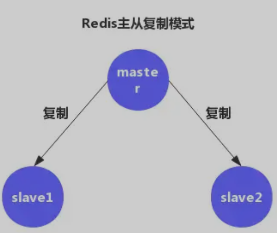
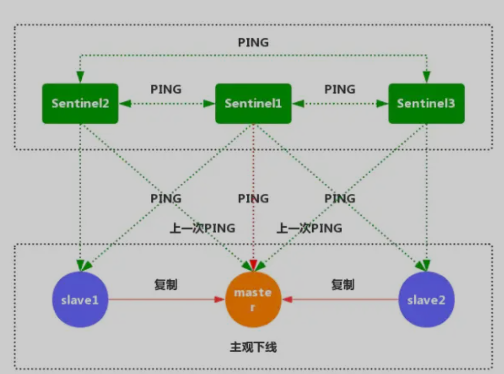

# **第七节 Redis 高可用性解决方案**


## **1、Redis 主从复制的问题**

Redis 主从复制可将主节点数据同步给从节点，从节点此时有两个作用：

* 一旦主节点宕机，从节点作为主节点的备份可以随时顶上来。
* 扩展主节点的读能力，分担主节点读压力。



主从复制同时存在以下几个问题：

1. 一旦主节点宕机，从节点晋升成主节点，同时需要修改应用方的主节点地址，还需要命令所有从节点去复制新的主节点，整个过程需要人工干预。
2. 主节点的写能力受到单机的限制。
3. 主节点的写能力受到单机的限制。
4. 原生复制的弊端在早期的版本中也会比较突出，**比如：Redis 复制中断后，从节点会发起 psync。此时如果同步不成功，则会进行全量同步，主库 执行 全量备份 的同时，可能会造成毫秒或秒级的卡顿。**

## **2、 Redis 的哨兵（Sentinel）深入探究**

Redis Sentinel 的架构：


Redis的哨兵机制就是解决我们以上主从复制存在缺陷（选举问题），保证我们的Redis高可用，实现自动化故障发现与故障转移。

该系统执行以下三个任务：

* 监控：哨兵会不断检查你的主服务器和从服务器是否运作正常。
* 提醒：当被监控的某个Redis服务器出现问题时，哨兵可以通过API给程序员发送通知自动故障
* 转移：主服务器宕机，哨兵会开始一次自动故障转移操作，升级一个从服务器为主服务器，并让其他从服务器改为复制新的主服务器。


## **3、配置 Sentinel**

Redis 源码中包含了一个名为 `sentinel.conf` 的文件， 这个文件是一个带有详细注释的 Sentinel 配置文件示例。

**`sentinel monitor mymaster 192.168.10.202 6379 2`**

Sentine监听的maste地址，

* 第一个参数是给master起的名字，
* 第二个参数为master IP，
* 第三个为master端口，
* 第四个为当该master挂了的时候，

若想将该master判为失效，在Sentine集群中必须至少2个Sentine同意才行，只要该数量不达标，则就不会发生故障迁移。

```
2）sentinel down-after-milliseconds mymaster 30000
```

**表示master被当前sentinel实例认定为失效的间隔时间，在这段时间内一直没有给Sentine返回有效信息，则认定该master主观下线。**

只有在足够数量的 Sentinel 都将一个服务器标记为主观下线之后， 服务器才会被标记为客观下线，``将服务器标记为客观下线所需的 Sentinel 数量由对主服务器的配置决定。

```
3）sentinel parallel-syncs mymaster 2
```

当在执行故障转移时，设置几个slave同时进行切换master，**该值越大，则可能就有越多的slave在切换master时不可用，可以将该值设置为1**，即一个一个来，这样在某个
slave进行切换master同步数据时，其余的slave还能正常工作，以此保证每次只有一个从服务器处于不能处理命令请求的状态。

```
4）sentinel can-failover mymaster ``yes
```

在sentinel检测到`O_DOWN`后，是否对这台redis启动failover机制

```
5）sentinel auth-pass mymaster 20180408
```

设置`sentinel`连接的`master`和`slave`的密码，这个需要和`redis.conf`文件中设置的密码一样

```
6）sentinel failover-timeout mymaster 180000
```

failover过期时间，当failover开始后，在此时间内仍然没有触发任何failover操作，当前sentinel将会认为此次failoer失败。 

执行故障迁移超时时间，即在指定时间内没有大多数的sentinel 反馈master下线，该故障迁移计划则失效

```
7）sentinel config-epoch mymaster 0
```

**选项指定了在执行故障转移时， 最多可以有多少个从服务器同时对新的主服务器进行同步**。这个数字越小， 完成故障转移所需的时间就越长。

```
8）sentinel notification-script mymaster ``/var/redis/notify``.sh
```

当failover时，可以指定一个``"通知"``脚本用来告知当前集群的情况。

脚本被允许执行的最大时间为60秒，如果超时，脚本将会被终止(KILL)

```
9）sentinel leader-epoch mymaster 0
```

同时一时间最多0个slave可同时更新配置,建议数字不要太大,以免影响正常对外提供服务。

**主观下线和客观下线**

* 主观下线：指的是单个 Sentinel 实例对服务器做出的下线判断。
* 客观下线：指的是多个 Sentinel 实例在对同一个服务器做出 SDOWN主观下线 判断。

## **4、Redis Sentinel 的工作原理**     

1.每个 Sentinel 以每秒一次的频率向它所知的主服务器、从服务器以及其他 Sentinel 实例发送一个 PING 命令。


2.如果一个实例距离最后一次有效回复 PING 命令的时间超过指定的值， 那么这个实例会被 Sentinel 标记为主观下线。



3.正在监视这个主服务器的所有 Sentinel 要以每秒一次的频率确认主服务器的确进入了主观下线状态。


4.**有足够数量的 Sentinel 在指定的时间范围内同意这一判断**， 那么这个主服务器被标记为客观下线。


5.**每个 Sentinel 会以每 10 秒一次的频率向它已知的所有主服务器和从服务器发送 INFO 命令**。

当一个主服务器被 Sentinel 标记为客观下线时， Sentinel 向下线主服务器的所有从服务器发送 INFO 命令的频率会从 10 秒一次改为每秒一次。


6.**Sentinel 和其他 Sentinel 协商 主节点 的状态，如果 主节点 处于 SDOWN 状态，则投票自动选出新的 主节点。将剩余的 从节点 指向 新的主节点 进行 数据复制**。


7.当没有足够数量的 Sentinel 同意 主服务器 下线时， 主服务器 的 客观下线状态 就会被移除。**当 主服务器 重新向 Sentinel 的 PING 命令返回 有效回复 时，主服务器 的 主观下线状态 就会被移除。**


## **5、自动发现 Sentinel 和从服务器**

**一个 Sentinel 可以与其他多个 Sentinel 进行连接， 各个 Sentinel 之间可以互相检查对方的可用性， 并进行信息交换。**


你无须为运行的每个 Sentinel 分别设置其他 Sentinel 的地址， **因为 Sentinel 可以通过发布与订阅功能来自动发现正在监视相同主服务器的其他 Sentinel**。

* 每个 Sentinel 会以每两秒一次的频率， 通过发布与订阅功能， 向被它监视的所有主服务器和从服务器的频道发送一条信息， 信息中包含了 Sentinel 的 IP 地址、端口号和运行 ID （runid）。
* 每个 Sentinel 都订阅了被它监视的所有主服务器和从服务器的频道， 查找之前未出现过的 sentinel 。当一个 Sentinel 发现一个新的 Sentinel 时， 它会将新的 Sentinel 添加到一个列表中。
* Sentinel 发送的信息中还包括完整的主服务器当前配置。如果一个 Sentinel 包含的主服务器配置比另一个 Sentinel 发送的配置要旧， 那么这个 Sentinel 会立即升级到新配置上。
* 在将一个新 Sentinel 添加到监视主服务器的列表上面之前， Sentinel 会先检查列表中是否已经包含了和要添加的 Sentinel 拥有相同运行 ID 或者相同地址（包括 IP 地址和端口号）的 Sentinel ， 如果是的话， Sentinel 会先移除列表中已有的那些拥有相同运行 ID 或者相同地址的 Sentinel ， 然后再添加新 Sentinel。

## **6、故障转移**  

一次故障转移操作由以下步骤组成：

* 发现主服务器已经进入客观下线状态。
* 对我们的当前纪元进行自增， 并尝试在这个纪元中当选。
* 如果当选失败， 那么在设定的故障迁移超时时间的两倍之后， 重新尝试当选。如果当选成功， 那么执行以下步骤。
* 选出一个从服务器，并将它升级为主服务器。
* 向被选中的从服务器发送 `SLAVEOF NO ONE` 命令，让它转变为主服务器。
* 通过发布与订阅功能， 将更新后的配置传播给所有其他 Sentinel ， 其他 Sentinel 对它们自己的配置进行更新。
* 向已下线主服务器的从服务器发送 SLAVEOF 命令， 让它们去复制新的主服务器。
* 当所有从服务器都已经开始复制新的主服务器时， 领头 Sentinel 终止这次故障迁移操作。


