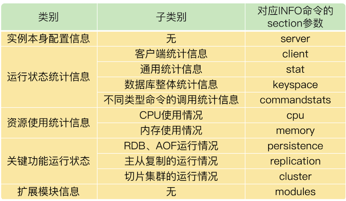
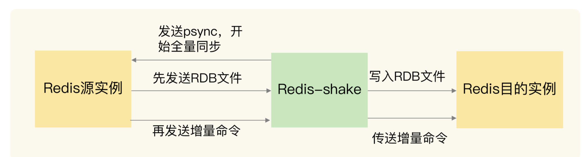

# **第四节 Redis运维工具**

## **1、最基本的监控命令：INFO 命令**

**Redis 本身提供的 INFO 命令会返回丰富的实例运行监控信息，这个命令是 Redis 监控工具的基础。**

> Redis最基本的监控命令：INFO命令 对应INFO命令的section参数有： cpu、memory、stat、commandstat、server、client、repliation、cluster、modules等等

**INFO 命令在使用时，可以带一个参数 section，这个参数的取值有好几种，相应的，INFO 命令也会返回不同类型的监控信息。**

把 INFO 命令的返回信息分成 5 大类，其中，有的类别当中又包含了不同的监控内容，如下表所示：

在监控 Redis 运行状态时，INFO 命令返回的结果非常有用。

如果你想了解 INFO 命令的所有参数返回结果的详细含义，可以查看[**Redis官网的介绍**](https://redis.io/commands/info)。

几个运维时需要重点关注的参数以及它们的重要返回结果。

首先，**无论你是运行单实例或是集群，我建议你重点关注一下 stat、commandstat、cpu 和 memory 这四个参数的返回结果**  

* 这里面包含了命令的执行情况（比如命令的执行次数和执行时间、命令使用的 CPU 资源）
* 内存资源的使用情况（比如内存已使用量、内存碎片率）
* CPU 资源使用情况等

**当你启用 RDB 或 AOF 功能时，你就需要重点关注下 persistence 参数的返回结果，你可以通过它查看到 RDB 或者 AOF 的执行情况。**

如果你在使用主从集群，就要重点关注下 replication 参数的返回结果，这里面包含了主从同步的实时状态。

不过，INFO 命令只是提供了文本形式的监控结果，并没有可视化，所以，在实际应用中，还可以使用一些第三方开源工具，将 INFO 命令的返回结果可视化。

## **2、面向 Prometheus 的 Redis-exporter 监控**

Prometheus是一套开源的系统监控报警框架。它的核心功能是从被监控系统中拉取监控数据，结合Grafana工具，进行可视化展示。而且，监控数据可以保存到时序数据库中，以便运维人员进行历史查询。同时，Prometheus 会检测系统的监控指标是否超过了预设的阈值，一旦超过阈值，Prometheus 就会触发报警。

对于系统的日常运维管理来说，这些功能是非常重要的。而 Prometheus 已经实现了使用这些功能的工具框架。我们只要能从被监控系统中获取到监控数据，就可以用 Prometheus 来实现运维监控。

**Prometheus 正好提供了插件功能来实现对一个系统的监控，我们把插件称为 exporter，每一个 exporter 实际是一个采集监控数据的组件。exporter 采集的数据格式符合 Prometheus 的要求，Prometheus 获取这些数据后，就可以进行展示和保存了。**

**`Redis-exporter`就是用来监控 Redis 的，它将 INFO 命令监控到的运行状态和各种统计信息提供给 Prometheus，**从而进行可视化展示和报警设置。目前，Redis-exporter 可以支持 Redis 2.0 至 6.0 版本，适用范围比较广。

除了获取 Redis 实例的运行状态，`Redis-exporter` 还可以监控键值对的大小和集合类型数据的元素个数，这个可以在运行 `Redis-exporter` 时，使用 `check-keys` 的命令行选项来实现。

我们可以开发一个 Lua 脚本，定制化采集所需监控的数据。然后，我们使用 scripts 命令行选项，让 Redis-exporter 运行这个特定的脚本，从而可以满足业务层的多样化监控需求。

**[Redis alerts](https://github.com/Chao-Xi/JacobTechBlog/blob/master/k8s_dev/prometheus/prom-alerts/8Redis.md)**

* Redis down
* Missing backup
* Out of memory
* Replication broken
* Too many connections
* Not enough connections
* Not enough connections

最后，我还想再给你分享两个小工具：[redis-stat](https://github.com/junegunn/redis-stat)和[Redis Live](https://github.com/snakeliwei/RedisLive)。跟 Redis-exporter 相比，这两个都是轻量级的监控工具。它们分别是用 Ruby 和 Python 开发的，也是将 INFO 命令提供的实例运行状态信息可视化展示。虽然这两个工具目前已经很少更新了.

## **3、数据迁移工具 Redis-shake**

有时候，我们需要在不同的实例间迁移数据。目前，比较常用的一个数据迁移工具是[`Redis-shake`](https://github.com/aliyun/redis-shake)，这是阿里云 Redis 和 MongoDB 团队开发的一个用于 Redis 数据同步的工具。

`Redis-shake` 的基本运行原理，是先启动 Redis-shake 进程，这个进程模拟了一个 Redis 实例。然后，Redis-shake 进程和数据迁出的源实例进行数据的全量同步。

* 源实例相当于主库，Redis-shake 相当于从库，源实例先把 RDB 文件传输给 Redis-shake
* Redis-shake 会把 RDB 文件发送给目的实例。
* 接着，源实例会再把增量命令发送给 Redis-shake，Redis-shake 负责把这些增量命令再同步给目的实例。

Redis-shake 进行数据迁移的过程：

**Redis-shake 的一大优势，就是支持多种类型的迁移。**

* **首先，它既支持单个实例间的数据迁移，也支持集群到集群间的数据迁移。**
* **其次，有的 Redis 切片集群（例如 Codis）会使用 proxy 接收请求操作，Redis-shake 也同样支持和 proxy 进行数据迁移。**
* 另外，因为 `Redis-shake` 是阿里云团队开发的，所以，除了支持开源的 Redis 版本以外，Redis-shake 还支持云下的 Redis 实例和云上的 Redis 实例进行迁移，可以帮助我们实现 Redis 服务上云的目标。

**在数据迁移后，我们通常需要对比源实例和目的实例中的数据是否一致。**如果有不一致的数据，我们需要把它们找出来，从目的实例中剔除，或者是再次迁移这些不一致的数据。

这里，我就要再给你介绍一个数据一致性比对的工具了，就是阿里云团队开发的[Redis-full-check](https://github.com/alibaba/RedisShake)。

`Redis-full-check` 的工作原理很简单，就是对源实例和目的实例中的数据进行全量比对，从而完成数据校验。不过，为了降低数据校验的比对开销，`Redis-full-check` 采用了多轮比较的方法。

* 在第一轮校验时，`Redis-full-check` 会找出在源实例上的所有 `key`，然后从源实例和目的实例中把相应的值也都查找出来，进行比对。
* 第一次比对后，`redis-full-check` 会把目的实例中和源实例不一致的数据，记录到 sqlite 数据库中。
* 从第二轮校验开始，`Redis-full-check` 只比较上一轮结束后记录在数据库中的不一致的数据。

为了避免对实例的正常请求处理造成影响，Redis-full-check 在每一轮比对结束后，会暂停一段时间。随着 Redis-shake 增量同步的进行，源实例和目的实例中的不一致数据也会逐步减少，所以，我们校验比对的轮数不用很多。

我们可以自己设置比对的轮数。具体的方法是，在运行 redis-full-check 命令时，把参数 comparetimes 的值设置为我们想要比对的轮数。

等到所有轮数都比对完成后，数据库中记录的数据就是源实例和目的实例最终的差异结果了。

这里有个地方需要注意下，Redis-full-check 提供了三种比对模式，我们可以通过 comparemode 参数进行设置。comparemode 参数有三种取值，含义如下：

* KeyOutline，只对比 key 值是否相等；
* ValueOutline，只对比 value 值的长度是否相等；
* FullValue，对比 key 值、value 长度、value 值是否相等。

我们在应用 Redis-full-check 时，可以根据业务对数据一致性程度的要求，选择相应的比对模式。如果一致性要求高，就把 comparemode 参数设置为 FullValue。

## **4、集群管理工具 CacheCloud**

[CacheCloud](https://github.com/sohutv/cachecloud)是搜狐开发的一个面向 Redis 运维管理的云平台，**它实现了主从集群、哨兵集群和 Redis Cluster 的自动部署和管理，用户可以直接在平台的管理界面上进行操作。**

针对常见的集群运维需求，CacheCloud 提供了 5 个运维操作。

* 下线实例：关闭实例以及实例相关的监控任务。
* 上线实例：重新启动已下线的实例，并进行监控。
* 添加从节点：在主从集群中给主节点添加一个从节点。
* 故障切换：手动完成 Redis Cluster 主从节点的故障转移。
* 配置管理：用户提交配置修改的工单后，管理员进行审核，并完成配置修改。

当然，作为运维管理平台，CacheCloud 除了提供运维操作以外，还提供了丰富的监控信息。

CacheCloud 不仅会收集 INFO 命令提供的实例实时运行状态信息，进行可视化展示，而且还会把实例运行状态信息保存下来，例如内存使用情况、客户端连接数、键值对数据量。这样一来，当 Redis 运行发生问题时，运维人员可以查询保存的历史记录，并结合当时的运行状态信息进行分析。

## **5、本节小结**

Redis 的 INFO 命令，这个命令是监控工具的基础，监控工具都会基于 INFO 命令提供的信息进行二次加工。我们还学习了 3 种用来监控 Redis 实时运行状态的运维工具，分别是 `Redis-exporter`、`redis-stat `和 `Redis Live`。

关于数据迁移，我们既可以使用 Redis-shake 工具，也可以通过 RDB 文件或是 AOF 文件进行迁移。

Redis INFO 信息看似简单，但是这些信息记录着 Redis 运行时的各种状态数据，如果我们把这些数据采集到并监控到位，80% 的异常情况能在第一时间发现。

机器的 CPU、内存、网络、磁盘，都影响着 Redis 的性能。

监控时我们最好重点关注以下指标：

1. 客户端相关：当前连接数、总连接数、输入缓冲大小、OPS
2. CPU相关：主进程 CPU 使用率、子进程 CPU 使用率
3. 内存相关：当前内存、峰值内存、内存碎片率
4. 网络相关：输入、输出网络流量
5. 持久化相关：最后一次 RDB 时间、RDB fork 耗时、最后一次 AOF rewrite 时间、AOF rewrite 耗时
6. key 相关：过期 key 数量、淘汰 key 数量、key 命中率
7. 复制相关：主从节点复制偏移量、主库复制缓冲区

