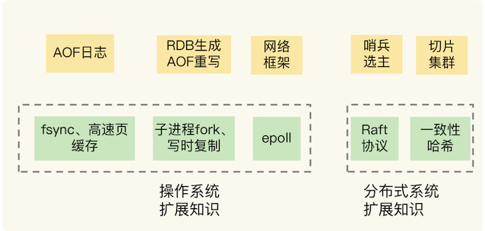
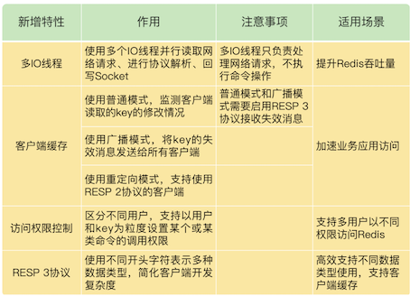
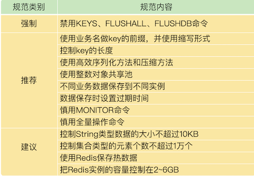
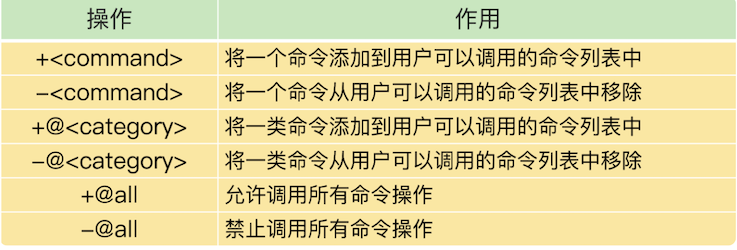

# **第八章 Redis学习与操作总结**

* 原理书：《Redis 设计与实现》
* 实战书：《Redis 开发与运维》
* 工具书：《Redis 使用手册》
* 日常使用操作：比如常见命令和配置，集群搭建等；
* 关键技术原理：比如我们介绍过的 IO 模型、AOF 和 RDB 机制等；
* 在实际使用时的经验教训，比如，Redis 响应变慢了怎么办？Redis 主从库数据不一致怎么办？

Redis 的很多关键功能，其实和操作系统底层的实现机制是相关的，比如说，非阻塞的网络框架、RDB 生成和 AOF 重写时涉及到的 fork 和写时复制机制，等等。另外，Redis 主从集群中的哨兵机制，以及切片集群的数据分布还涉及到一些分布式系统的内容。



AOF 日志的刷盘时机和操作系统的 fsync 机制、高速页缓存的刷回有关，而网络框架跟 epoll 有关，RDB 生成和 AOF 重写与 fork、写时复制有关。

## **1、本章小结**

### **1-1 Redis 6.0的新特性：多线程、客户端缓存与安全**

Redis 6.0 的新特性



为 Redis 6.0 是刚刚推出的，新的功能特性还需要在实际应用中进行部署和验证，所以，如果你想试用 Redis 6.0，可以尝试先在非核心业务上使用 Redis 6.0，一方面可以验证新特性带来的性能或功能优势，另一方面，也可以避免因为新特性不稳定而导致核心业务受到影响。

**Redis 6.0中的多线程只是指，在客户端请求接收和解析，以及请求后的数据通过网络返回给客户端时，使用了多线程。而命令请求本身的数据读写操作还是由单线程来完成的，所以仍然可以保证单命令操作的原子性。**

### **1-2 Redis 基于NVM内存的实践**

NVM 的三大特点：性能高、容量大、数据可以持久化保存。软件系统可以像访问传统 DRAM 内存一样，访问 NVM 内存。目前，Intel 已经推出了 NVM 内存产品 Optane AEP。

这款 NVM 内存产品给软件提供了两种使用模式，**分别是 Memory 模式和 App Direct 模式**。在 Memory 模式时，Redis 可以利用 NVM 容量大的特点，实现大容量实例，保存更多数据。在使用 App Direct 模式时，Redis 可以直接在持久化内存上进行数据读写，**在这种情况下，Redis 不用再使用 RDB 或 AOF 文件了，数据在机器掉电后也不会丢失。而且，实例可以直接使用持久化内存上的数据进行恢复，恢复速度特别快。**

**NVM 内存是近年来存储设备领域中一个非常大的变化，它既能持久化保存数据，还能像内存一样快速访问，这必然会给当前基于 DRAM 和硬盘的系统软件优化带来新的机遇。**

### **1-3 Redis客户端如何与服务器端交换命令和数据 RESP**

RESP 2 协议定义了 Redis 客户端和服务器端进行命令和数据交互时的编码格式。RESP 2 提供了 5 种类型的编码格式，包括简单字符串类型、长字符串类型、整数类型、错误类型和数组类型。为了区分这 5 种类型，RESP 2 协议使用了 5 种不同的字符作为这 5 种类型编码结果的第一个字符，分别是`+、 $、:、- 和 *`。

RESP 2 协议是文本形式的协议，实现简单，可以减少客户端开发出现的 Bug，而且可读性强，便于开发调试。当你需要开发定制化的 Redis 客户端时，就需要了解和掌握 RESP 2 协议。

RESP 2 协议的一个不足就是支持的类型偏少，所以，Redis 6.0 版本使用了 RESP 3 协议。和 RESP 2 协议相比，**RESP 3 协议增加了对浮点数、布尔类型、有序字典集合、无序集合等多种类型数据的支持**。不过，这里，有个地方需要你注意，Redis 6.0 只支持 RESP 3，对 RESP 2 协议不兼容，所以，**如果你使用 Redis 6.0 版本，需要确认客户端已经支持了 RESP 3 协议，否则，将无法使用 Redis 6.0。**

最后，我也给你提供一个小工具。如果你想查看服务器端返回数据的 RESP 2 编码结果，就可以使用 telnet 命令和 redis 实例连接，执行如下命令就行：

```
telnet 实例IP 实例端口
```

可以给实例发送命令，这样就能看到用 RESP 2 协议编码后的返回结果了。当然，你也可以在 telnet 中，向 Redis 实例发送用 RESP 2 协议编写的命令操作。


### **1-4 Redis运维工具**

Redis 的 INFO 命令，这个命令是监控工具的基础，监控工具都会基于 INFO 命令提供的信息进行二次加工。我们还学习了 3 种用来监控 Redis 实时运行状态的运维工具，分别是 `Redis-exporter`、`redis-stat `和 `Redis Live`。

关于数据迁移，我们既可以使用 Redis-shake 工具，也可以通过 RDB 文件或是 AOF 文件进行迁移。

Redis INFO 信息看似简单，但是这些信息记录着 Redis 运行时的各种状态数据，如果我们把这些数据采集到并监控到位，80% 的异常情况能在第一时间发现。

机器的 CPU、内存、网络、磁盘，都影响着 Redis 的性能。

监控时我们最好重点关注以下指标：

1. 客户端相关：当前连接数、总连接数、输入缓冲大小、OPS
2. CPU相关：主进程 CPU 使用率、子进程 CPU 使用率
3. 内存相关：当前内存、峰值内存、内存碎片率
4. 网络相关：输入、输出网络流量
5. 持久化相关：最后一次 RDB 时间、RDB fork 耗时、最后一次 AOF rewrite 时间、AOF rewrite 耗时
6. key 相关：过期 key 数量、淘汰 key 数量、key 命中率
7. 复制相关：主从节点复制偏移量、主库复制缓冲区


### **1-5 Redis的使用规范**

**规范分类**



* 强制类别的规范：这表示，如果不按照规范内容来执行，就会给 Redis 的应用带来极大的负面影响，例如性能受损。
* 推荐类别的规范：这个规范的内容能有效提升性能、节省内存空间，或者是增加开发和运维的便捷性，你可以直接应用到实践中。
* 建议类别的规范：这类规范内容和实际业务应用相关，只是从经历或经验给你一个建议，你需要结合自己的业务场景参考使用。

**业务层面主要面向的业务开发人员**

1. key 的长度尽量短，节省内存空间
2. 避免 bigkey，防止阻塞主线程
3. 4.0+版本建议开启 lazy-free
4. 把 Redis 当作缓存使用，设置过期时间
5. 不使用复杂度过高的命令，例如SORT、SINTER、SINTERSTORE、ZUNIONSTORE、ZINTERSTORE
6. 查询数据尽量不一次性查询全量，写入大量数据建议分多批写入
7. 批量操作建议 MGET/MSET 替代 GET/SET，HMGET/HMSET 替代 HGET/HSET
8. 禁止使用 KEYS/FLUSHALL/FLUSHDB 命令
9. 避免集中过期 key
10. 根据业务场景选择合适的淘汰策略
11. 1使用连接池操作 Redis，并设置合理的参数，避免短连接
12. 只使用 db0，减少 SELECT 命令的消耗
13. 读请求量很大时，建议读写分离，写请求量很大，建议使用切片集群

**运维层面主要面向的是 DBA 运维人员**

1. 按业务线部署实例，避免多个业务线混合部署，出问题影响其他业务
2. 保证机器有足够的 CPU、内存、带宽、磁盘资源
3. 建议部署主从集群，并分布在不同机器上，slave 设置为 readonly
4. 主从节点所部署的机器各自独立，尽量避免交叉部署，对从节点做维护时，不会影响到主节点
5. 推荐部署哨兵集群实现故障自动切换，哨兵节点分布在不同机器上
6. 提前做好容量规划，防止主从全量同步时，实例使用内存突增导致内存不足
7. 做好机器 CPU、内存、带宽、磁盘监控，资源不足时及时报警，任意资源不足都会影响 Redis 性能
8. 实例设置最大连接数，防止过多客户端连接导致实例负载过高，影响性能
9. 单个实例内存建议控制在 10G 以下，大实例在主从全量同步、备份时有阻塞风险
10. 设置合理的 slowlog 阈值，并对其进行监控，slowlog 过多需及时报警
11. 设置合理的 repl-backlog，降低主从全量同步的概率
12. 设置合理的 `slave client-output-buffer-limit`，避免主从复制中断情况发生
13. 推荐在从节点上备份，不影响主节点性能
14. 不开启 AOF 或开启 AOF 配置为每秒刷盘，避免磁盘 IO 拖慢 Redis 性能
15. 调整 maxmemory 时，注意主从节点的调整顺序，顺序错误会导致主从数据不一致
16. 对实例部署监控，采集 INFO 信息时采用长连接，避免频繁的短连接
17. 做好实例运行时监控，重点关注 `expired_keys`、`evicted_keys`、`latest_fork_usec`，这些指标短时突增可能会有阻塞风险
18. 扫描线上实例时，记得设置休眠时间，避免过高 OPS 产生性能抖动

## **2、本章操作总结**

### **2-1 Redis 6.0的新特性：多线程、客户端缓存与安全**

**在 Redis 6.0 中，多线程机制默认是关闭的，如果需要使用多线程功能，需要在 `redis.conf` 中完成两个设置**。

**1. 设置 io-thread-do-reads 配置项为 yes，表示启用多线程。**

```
io-threads-do-reads yes
```

**2. 设置线程个数。一般来说，线程个数要小于 Redis 实例所在机器的 CPU 核个数，例如，对于一个 8 核的机器来说，Redis 官方建议配置 6 个 IO 线程。**

```
io-threads  6
```

**<span style="color:green">如果你在实际应用中，发现 Redis 实例的 CPU 开销不大，吞吐量却没有提升，可以考虑使用 Redis 6.0 的多线程机制，加速网络处理，进而提升实例的吞吐量。</span>**

打开或关闭普通模式下的 Tracking 功能

```
CLIENT TRACKING ON|OFF
```

客户端如何使用广播模式接收 key 失效消息。

当我们在客户端执行下面的命令后，如果服务端更新了 `user:id:1003` 这个 key，那么，客户端就会收到 invalidate 消息。

```
CLIENT TRACKING ON BCAST PREFIX user
```

在 6.0 版本前，所有客户端可以使用同一个密码进行登录使用，但是没有用户的概念，而在 6.0 中，我们可以使用 **`ACL SETUSER`** 命令创建用户。例如，我们可以执行下面的命令，创建并启用一个用户 normaluser，把它的密码设置为“abc”：

```
ACL SETUSER normaluser on > abc
```

另外，6.0 版本还支持以用户为粒度设置命令操作的访问权限。具体操作列在了下表中，你可以看下，其中，加号（+）和减号（-）就分别表示给用户赋予或撤销命令的调用权限。



假设我们要设置用户 normaluser 只能调用 Hash 类型的命令操作，而不能调用 String 类型的命令操作，我们可以执行如下命令：


```
ACL SETUSER normaluser +@hash -@string
```

除了设置某个命令或某类命令的访问控制权限，6.0 版本还支持以 key 为粒度设置访问权限。

具体的做法是使用波浪号`“~”`和 key 的前缀来表示控制访问的 key。例如，我们执行下面命令，就可以设置用户 normaluser 只能对以`“user:”`为前缀的 key 进行命令操作：

```
ACL SETUSER normaluser ~user:* +@all
```
### **1-2 Redis 基于NVM内存的实践**

```
#成功写入String类型数据，返回OK
127.0.0.1:6379> SET testkey testvalue
OK
```

这里的交互内容就包括了**命令（SET 命令）、键（String 类型的键 testkey）和单个值（String 类型的值 testvalue），而服务器端则直接返回一个 OK 回复**。

第二个例子是执行 HSET 命令：

```
#成功写入Hash类型数据，返回实际写入的集合元素个数
127.0.0.1:6379>HSET testhash a 1 b 2 c 3
(integer) 3
```

这里的交互内容包括三个 **`key-value` 的 Hash集合值（a 1 b 2 c 3）**，而服务器端返回**整数回复（3）**，表示操作成功写入的元素个数。

最后一个例子是执行 PUT 命令，如下所示：

```
#发送的命令不对，报错，并返回错误信息
127.0.0.1:6379>PUT testkey2 testvalue
(error) ERR unknown command 'PUT', with args beginning with: 'testkey', 'testvalue'
```

可以看到，这里的交互内容包括错误信息，这是因为，**Redis 实例本身不支持 PUT 命令，所以服务器端报错“error”，并返回具体的错误信息，也就是未知的命令“put”。**

假设有一个 Hash 类型的键是 testhash，集合元素分别为 a:1、b:2、c:3。同时，有一个 Sorted Set 类型的键是 testzset，集合元素分别是 a、b、c，它们的分数分别是 1、2、3。我们在 redis-cli 客户端中读取它们的结果时，返回的形式都是一个数组，如下所示：

```
127.0.0.1:6379>HGETALL testhash
1) "a"
2) "1"
3) "b"
4) "2"
5) "c"
6) "3"

127.0.0.1:6379>ZRANGE testzset 0 3 withscores
1) "a"
2) "1"
3) "b"
4) "2"
5) "c"
6) "3"
```

## **3、本章问题**

**3-1 问题**：你觉得，Redis 6.0 的哪个或哪些新特性会对你有帮助呢？

答案：这个要根据你们的具体需求来定。从提升性能的角度上来说，Redis 6.0 中的多 IO 线程特性可以缓解 Redis 的网络请求处理压力。通过多线程增加处理网络请求的能力，可以进一步提升实例的整体性能。业界已经有人评测过，跟 6.0 之前的单线程 Redis 相比，6.0 的多线程性能的确有提升。所以，这个特性对业务应用会有比较大的帮助。

另外，基于用户的命令粒度 ACL 控制机制也非常有用。当 Redis 以云化的方式对外提供服务时，就会面临多租户（比如多用户或多个微服务）的应用场景。有了 ACL 新特性，我们就可以安全地支持多租户共享访问 Redis 服务了。

**3-2 问题**：你觉得，有了持久化内存后，还需要 Redis 主从集群吗？

答案：持久化内存虽然可以快速恢复数据，但是，**除了提供主从故障切换以外，主从集群还可以实现读写分离**。**所以，我们可以通过增加从实例，让多个从实例共同分担大量的读请求，这样可以提升 Redis 的读性能**。而提升读性能并不是持久化内存能提供的，所以，如果业务层对读性能有高要求时，我们还是需要主从集群的。


