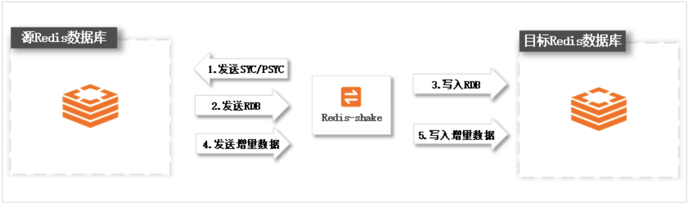

# **工具补充1：redis-shake数据同步和数据迁移**

## **1、前言**

一个 `Redis` 需要从另一个 `Redis` 数据同步 或者 数据迁移，这种一般怎么做？

**数据迁移** 这种一般比较好做，**可以直接从源redis导出rdb，再把rdb文件导入目标redis。**但是如果需要实时增量同步就比较困难，有什么好的方法解决这种需求，这里介绍下阿里云开源 `redis-shake` 工具。

`redis-shake`项目地址：[https://github.com/alibaba/RedisShake](https://github.com/alibaba/RedisShake)

## **2、基本功能**

`redis-shake`：是我们基于redis-port基础上进行改进的一款产品。它支持**解析、恢复、备份、同步**四个功能。以下主要介绍同步sync。

* 恢复`restore`：**将RDB文件恢复到目的redis数据库。**
* 备份`dump`：将源redis的全量数据通过RDB文件备份起来。
* 解析`decode`：**对RDB文件进行读取，并以json格式解析存储。**
* 同步`sync`：支持源redis和目的redis的数据同步，支持全量和增量数据的迁移，支持从云下到阿里云云- 上的同步，也支持云下到云下不同环境的同步，支持单节点、主从版、集群版之间的互相同步。需要注意- 的是，如果源端是集群版，可以启动一个RedisShake，从不同的db结点进行拉取，同时源端不能开启- move slot功能；对于目的端，如果是集群版，写入可以是1个或者多个db结点。
* **同步`rump`：支持源redis和目的redis的数据同步，仅支持全量的迁移**。采用scan和restore命令进行迁移，支持不同云厂商不同redis版本的迁移。

## **3、基本原理**

`redis-shake` 的基本原理就是模拟**一个从节点加入源redis集群，首先进行全量拉取并回放，然后进行增量的拉取（通过psync命令）**。如下图所示：




如果源端是集群模式，只需要启动一个redis-shake进行拉取，同时不能开启源端的move slot操作。如果目的端是集群模式，可以写入到一个结点，然后再进行slot的迁移，当然也可以多对多写入。

目前，`redis-shake`到目的端采用单链路实现，对于正常情况下，这不会成为瓶颈，但对于极端情况，`qps`比较大的时候，此部分性能可能成为瓶颈，后续我们可能会计划对此进行优化。另外，`redis-shake`到目的端的数据同步采用异步的方式，读写分离在2个线程操作，降低因为网络时延带来的同步性能下降。


### **3-1 高效性**

**全量同步**阶段**并发执行**，**增量同步**阶段**异步执行**，能够达到毫秒级别延迟（取决于网络延迟）。同时，我们还对大key同步进行分批拉取，优化同步性能。

### **3-2 监控**


用户可以通过我们提供的`restful`拉取`metric`来对`redis-shake`进行实时监控：`curl 127.0.0.1:9320/metric`。

### **3-3 校验**

如何校验同步的正确性？可以采用我们开源的 `redis-full-check`：[https://github.com/aliyun/redis-full-check?spm=a2c6h.12873639.0.0.4b8974955p9YxV](https://github.com/aliyun/redis-full-check?spm=a2c6h.12873639.0.0.4b8974955p9YxV) 。

### **3-4 支持版本**

* 支持2.8-5.0版本的同步。
* 支持codis。
* 支持云下到云上，云上到云上，云上到云下（阿里云目前支持主从版），其他云到阿里云等链路，帮助用户灵活构建混合云场景。

### **3-5 注意事项**

* 如果目标库的数据逐出策略（maxmemory-policy）配置为noeviction以外的值，可能导致目标库的数据与源库不一致。关于数据逐出策略详情，请参见Redis数据逐出策略介绍。
* 如果源库中的某些Key使用了过期（expire）机制，由于可能存在Key已过期但未被及时删除的情形，所以在目标库中查看（如通过info命令）到的Key数量会比源库的Key数量少。

> 说明：源和目标库中，未设置过期机制或未过期的Key数量是一致的。

## **4、安装 Redis-shake**

```
# 下载 Redis-shake 安装包
$ wget 'http://docs-aliyun.cn-hangzhou.oss.aliyun-inc.com/assets/attach/120287/cn_zh/1608173646665/redis-shake-v2.0.3.tar.gz'

# 解压Redis-shake 安装包
$ tar xzf redis-shake-v2.0.3.tar.gz

# 修改配置文件
$ cd redis-shake-v2.0.3/
$ vim redis-shake.conf

# 启动Redis-shake，开始执行数据迁移
$ ./redis-shake.linux -type=sync -conf=redis-shake.conf
```

