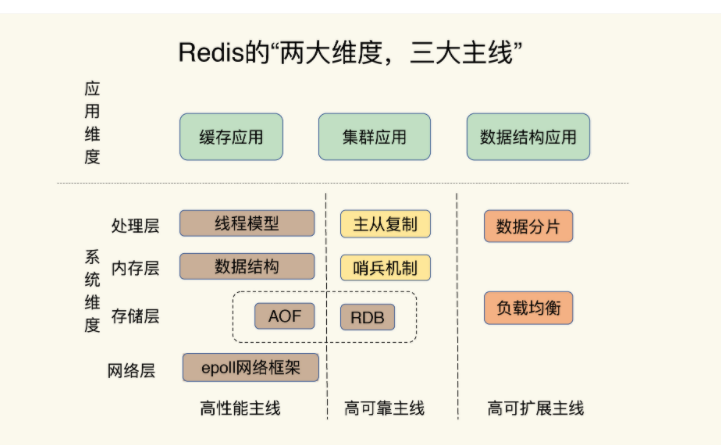

# 手摸手 Redis 技术与实战教程

> Started at Jan. 2021 By Jacob Xi 

## 内容简介

本书是本人的“手摸手战术教程”系列的第三本，历经两个月的时间，终于伴随着2021年春节前拿本🏡和春节假期期间🎆充电完成🍋，感谢家人，朋友，同事们的支持与理解，也感谢所在team同事们的帮助与指导。为了还贷！！！😁 #顺便求一个Cloudhouse的邀请

### Previous on 手摸手

> [手摸手 Jenkins 战术教程 (大师版）](https://chao-xi.github.io/jxjenkinsbook/)
> 
> [手摸手 Elasticsearch7 技术与实战教程](https://chao-xi.github.io/jxes7book/)

### 本书主要内容

本书共10章着重介绍了Redis核心基础数据结构，AOF日志，RDB备份，Redis主从数据同步，哨兵机制，Redis Cluster, 切片集群，Bigkey阻塞查询，Redis缓冲区，旁路缓存，LRU-LFU缓存替换策略，缓存击穿，缓存雪崩，缓存穿透，缓存污染，ACID & Locks & Pika, Codis, Gossip, 脑裂，数据倾斜，Redis6.0,NVM, RESP, Redis on K8s 以及期中期末综合考题

## Comment ca va? C'est Moi

Hello, this is me, Jacob. Currently, I'm working as DevOps and Cloud Engineer in SAP, and I'm the certified AWS Solution Architect and Certified Azure Administrator, Kubernetes Specialist, Jenkins CI/CD and ElasticStack enthusiast. 

I was working as Backend Engineer in New York City and achieved my CS master degree in SIT, America. Believe it or not, I'll keep writing, more and more books will come out at such dramatic and unprecedented 2021. 

If you have anything want to talk to me directly, you can reach out for via email xichao2015@outlook.com。

Salute, c'est moi, Jacob. Actuellement, je travaille en tant qu'ingénieur DevOps et Cloud dans SAP, et je suis architecte de solution AWS certifié et administrateur Azure certifié, spécialiste Kubernetes et passionné de CI/CD.

Je travaillais en tant qu'ingénieur backend à New York et j'ai obtenu mon master CS à SIT, en Amérique. Croyez-le ou non, je continuerai à écrire, de plus en plus de livres sortiront cette année.

## 目录大纲

* **第一章 Elasticsearch 概述**
	* [第一节 Redis 不得不去掌握的关键](https://chao-xi.github.io/jxredisbook/chap1/1redis_intro/)
* **第二章 Redis基础篇**
	* [第一节 基本架构： 键值数据库](https://chao-xi.github.io/jxredisbook/chap2/1redis_kv/) 
	* [第二节 数据结构：Redis为什么那么快？](https://chao-xi.github.io/jxredisbook/chap2/2redis_slowquery/)
	* [第三节 高性能IO模型：Redis为什么那么快？](https://chao-xi.github.io/jxredisbook/chap2/3redis_io/)
	* [第四节 Redis宕机，如何避免数据丢失：AOF(Append Only File)日志](https://chao-xi.github.io/jxredisbook/chap2/4redis_aof_log/)
	* [第五节 Redis宕机，Redis如何实现快速恢复RDB](https://chao-xi.github.io/jxredisbook/chap2/5redis_rdb_snapshot/)
	* [第六节 数据同步：主从库数据一致](https://chao-xi.github.io/jxredisbook/chap2/6redis_master_slave_replicate/)
	* [第七节 哨兵机制：主库不间断服务](https://chao-xi.github.io/jxredisbook/chap2/7redis_master_rescue/)
	* [第八节 哨兵集群：哨兵挂了，主从库切换](https://chao-xi.github.io/jxredisbook/chap2/8redis_sentinel/)
	* [第九节 切片集群：数据增多了，是该加内存还是加实例](https://chao-xi.github.io/jxredisbook/chap2/9redis_slot/)
	* [第二章 Redis核心技术基础总结篇](https://chao-xi.github.io/jxredisbook/chap2/10redis_basic_sum/)
* **第三章 Redis数据结构**
	* [第一节 Redis的String类型数据结构，及其底层实现](https://chao-xi.github.io/jxredisbook/chap3/1redis_string/) 
	* [第二节 Redis有那些数据结构适合做统计](https://chao-xi.github.io/jxredisbook/chap3/2redis_sets/)
	* [第三节 GEO，一种可以实现LBS服务的数据结构](https://chao-xi.github.io/jxredisbook/chap3/3redis_geo/)
	* [第四节 根据时间序列数据的特点，选择合适的存储方案](https://chao-xi.github.io/jxredisbook/chap3/4redis_timeseries/)
	* [第五节 如何使用redis实现消息队列的需求](https://chao-xi.github.io/jxredisbook/chap3/5redis_stream/)
	* [第三章 Redis 的数据结构](https://chao-xi.github.io/jxredisbook/chap3/6redis_ds_sum/)
* **第四章 Redis性能影响因子**
	* [第一节 Redis有哪些可能导致阻塞的操作，以及解决机制](https://chao-xi.github.io/jxredisbook/chap4/1redis_asyn/)
	* [第二节 在多核CPU架构和NUMA架构下对redis进行优化配置](https://chao-xi.github.io/jxredisbook/chap4/2redis_cpu/)
	* [第三节 当redis查询变慢了怎么办？](https://chao-xi.github.io/jxredisbook/chap4/3redis_response/)
	* [第四节 删除数据后，内存占用率还是很高](https://chao-xi.github.io/jxredisbook/chap4/4redis_fragmentation/)
	* [第五节 Redis缓冲区](https://chao-xi.github.io/jxredisbook/chap4/5redis_buffer/)
	* [第四章 Redis 影响性能的潜在因素](https://chao-xi.github.io/jxredisbook/chap4/6redis_slow_respone/)
* **第五章 Redis缓存介绍**
	* [第一节 Redis 旁路缓存](https://chao-xi.github.io/jxredisbook/chap5/1redis_cache/)
	* [第二节 缓存满后的替换策略](https://chao-xi.github.io/jxredisbook/chap5/2redis_cache_full/)
	* [第三节 如何解决缓存和数据库的数据不一致的缓存异常](https://chao-xi.github.io/jxredisbook/chap5/3redis_mysql_uncon/)
	* [第四节 缓存被污染的解决问题](https://chao-xi.github.io/jxredisbook/chap5/4redis_contamination/)
	* [第五章 Redis 缓存总结](https://chao-xi.github.io/jxredisbook/chap5/5redis_cache_summary/)
* **第六章 Redis性能与锁机制以及ACID**
	* [第一节 基于SSD实现大容量Redis:Pika](https://chao-xi.github.io/jxredisbook/chap6/1redis_pika_ssd/)
	* [第二节 Redis应对并发访问：无锁的原子操作](https://chao-xi.github.io/jxredisbook/chap6/2redis_locks/)
	* [第三节 Redis实现分布式锁](https://chao-xi.github.io/jxredisbook/chap6/3redis_distributed_locks/)
	* [第四节 事务机制 Redis实现ACID属性](https://chao-xi.github.io/jxredisbook/chap6/4redis_acid/)
	* [第六章 Redis性能与锁机制以及ACID](https://chao-xi.github.io/jxredisbook/chap6/5redis_perf/)
* **第七章 Redis Cluster集群介绍及管理**
	* [第一节 Redis主从同步与故障切换的三个坑](https://chao-xi.github.io/jxredisbook/chap7/1Redis_master_slave/) 
	* [第二节 脑裂导致数据丢失](https://chao-xi.github.io/jxredisbook/chap7/2redis_brain_split/)
	* [第三节 Redis Codis 集群方案](https://chao-xi.github.io/jxredisbook/chap7/3redis_codis_cluster/)
	* [第四节 Redis支撑秒杀场景的关键技术和实践](https://chao-xi.github.io/jxredisbook/chap7/4redis_spike_sys/)
	* [第五节 数据分布优化应对数据倾斜](https://chao-xi.github.io/jxredisbook/chap7/5redis_data_incline/)
	* [第六节 限制Redis Cluster规模的关键因素：通信开销](https://chao-xi.github.io/jxredisbook/chap7/6redis_cluster_gossip/)
	* [第七章 Redis Cluster集群介绍及管理](https://chao-xi.github.io/jxredisbook/chap7/7Redis_cluster_summary/)
* **第八章 Redis学习与操作**
	* [第一节 Redis 6.0的新特性：多线程、客户端缓存与安全](https://chao-xi.github.io/jxredisbook/chap8/1redis_6.0_fea/)
	* [第二节 Redis 基于NVM内存的实践](https://chao-xi.github.io/jxredisbook/chap8/2redis_nvm_mem/)
	* [第三节 Redis客户端如何与服务器端交换命令和数据 RESP](https://chao-xi.github.io/jxredisbook/chap8/3redis_RESP/)
	* [第四节 Redis运维工具](https://chao-xi.github.io/jxredisbook/chap8/4redis_opt_tools/)
	* [第五节 Redis的使用规范](https://chao-xi.github.io/jxredisbook/chap8/5redis_protocol/)
	* [第八章 Redis学习与操作总结](https://chao-xi.github.io/jxredisbook/chap8/6redis_opt_summary/)
	* [工具补充1：redis-shake数据同步和数据迁移](https://chao-xi.github.io/jxredisbook/chap8/7redis_shake/)
* **第九章 使用k8s安装Redis集群**
	* [第一节 Kubernetes上通过sts测试Redis Cluster集群](https://chao-xi.github.io/jxredisbook/chap9/1redis_k8s_sts/)
	* [第二节 利用ConfigMap设置安装 Redis](https://chao-xi.github.io/jxredisbook/chap9/2redis_k8s_config/)
* **第十章 期末总结章**
	* [Redis 核心技术考题](https://chao-xi.github.io/jxredisbook/chap10/1redis_test/)
	* [Redis 基础你掌握多少了？来个查漏补缺](https://chao-xi.github.io/jxredisbook/chap10/3Redis_basic/)

## To be continue

本人将带来手摸手战术教程更多的内容和文章， 接下来的将在Datatase, Linux性能, Golang, Chef, Azure900, Azure103, AWS Solution Arcitect, AWS Big Data Speciality, Istio, Python带来更多更全面的电子书，敬请期待。

